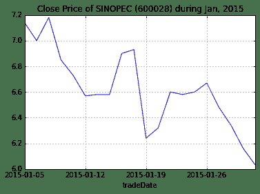

# 量化分析师的Python日记【第6天：数据处理的瑞士军刀pandas下篇

> 来源：https://uqer.io/community/share/5514bb11f9f06c12790415b2

## 第二篇：快速进阶

在上一篇中我们介绍了如何创建并访问`pandas`的`Series`和`DataFrame`型的数据，本篇将介绍如何对`pandas`数据进行操作，掌握这些操作之后，基本可以处理大多数的数据了。首先，导入本篇中使用到的模块：

```py
import numpy as np
import pandas as pd
from pandas import Series, DataFrame
```

为了看数据方便一些，我们设置一下输出屏幕的宽度

```py
pd.set_option('display.width', 200)
```

## 一、数据创建的其他方式

数据结构的创建不止是上篇中介绍的标准形式，本篇再介绍几种。例如，我们可以创建一个以日期为元素的`Series`：

```py
dates = pd.date_range('20150101', periods=5)
print dates

<class 'pandas.tseries.index.DatetimeIndex'>
[2015-01-01, ..., 2015-01-05]
Length: 5, Freq: D, Timezone: None
```

将这个日期`Series`作为索引赋给一个`DataFrame`：

```py
df = pd.DataFrame(np.random.randn(5, 4),index=dates,columns=list('ABCD'))
print df

                   A         B         C         D
2015-01-01 -0.168870  0.191945 -0.906788 -1.295211
2015-01-02 -0.985849  0.312378 -1.513870 -0.876869
2015-01-03 -0.241945  1.437763  0.209494  0.061032
2015-01-04  0.139199  0.124118 -0.204801 -1.745327
2015-01-05  0.243644 -0.373126  0.333583  2.640955
```

只要是能转换成`Series`的对象，都可以用于创建`DataFrame`：

```py
df2 = pd.DataFrame({ 'A' : 1., 'B': pd.Timestamp('20150214'), 'C': pd.Series(1.6,index=list(range(4)),dtype='float64'), 'D' : np.array([4] * 4, dtype='int64'), 'E' : 'hello pandas!' })
print df2

   A          B    C  D              E
0  1 2015-02-14  1.6  4  hello pandas!
1  1 2015-02-14  1.6  4  hello pandas!
2  1 2015-02-14  1.6  4  hello pandas!
3  1 2015-02-14  1.6  4  hello pandas!
```

## 二、数据的查看

在多数情况下，数据并不由分析数据的人员生成，而是通过数据接口、外部文件或者其他方式获取。这里我们通过量化实验室的数据接口获取一份数据作为示例：

```py
stock_list = ['000001.XSHE', '000002.XSHE', '000568.XSHE', '000625.XSHE', '000768.XSHE', '600028.XSHG', '600030.XSHG', '601111.XSHG', '601390.XSHG', '601998.XSHG']
raw_data = DataAPI.MktEqudGet(secID=stock_list, beginDate='20150101', endDate='20150131', pandas='1')
df = raw_data[['secID', 'tradeDate', 'secShortName', 'openPrice', 'highestPrice', 'lowestPrice', 'closePrice', 'turnoverVol']]
```

以上代码获取了2015年一月份全部的交易日内十支股票的日行情信息，首先我们来看一下数据的大小：

```py
print df.shape

(200, 8)
```

我们可以看到有200行，表示我们获取到了200条记录，每条记录有8个字段，现在预览一下数据，`dataframe.head()`和`dataframe.tail()`可以查看数据的头五行和尾五行，若需要改变行数，可在括号内指定：

```py
print "Head of this DataFrame:"
print df.head()
print "Tail of this DataFrame:"
print df.tail(3)

Head of this DataFrame:
         secID   tradeDate secShortName  openPrice  highestPrice  lowestPrice  closePrice  turnoverVol
0  000001.XSHE  2015-01-05         平安银行      15.99         16.28        15.60       16.02    286043643
1  000001.XSHE  2015-01-06         平安银行      15.85         16.39        15.55       15.78    216642140
2  000001.XSHE  2015-01-07         平安银行      15.56         15.83        15.30       15.48    170012067
3  000001.XSHE  2015-01-08         平安银行      15.50         15.57        14.90       14.96    140771421
4  000001.XSHE  2015-01-09         平安银行      14.90         15.87        14.71       15.08    250850023
Tail of this DataFrame:
           secID   tradeDate secShortName  openPrice  highestPrice  lowestPrice  closePrice  turnoverVol
197  601998.XSHG  2015-01-28         中信银行       7.04          7.32         6.95        7.15    163146128
198  601998.XSHG  2015-01-29         中信银行       6.97          7.05         6.90        7.01     93003445
199  601998.XSHG  2015-01-30         中信银行       7.10          7.14         6.92        6.95     68146718
```

`dataframe.describe()`提供了`DataFrame`中纯数值数据的统计信息：

```py
print df.describe()

       openPrice  highestPrice  lowestPrice  closePrice   turnoverVol
count  200.00000    200.000000    200.00000  200.000000  2.000000e+02
mean    15.17095     15.634000     14.86545   15.242750  2.384811e+08
std      7.72807      7.997345      7.56136    7.772184  2.330510e+08
min      6.14000      6.170000      6.02000    6.030000  1.242183e+07
25%      8.09500      8.250000      7.98750    8.127500  7.357002e+07
50%     13.96000     14.335000     13.75500   13.925000  1.554569e+08
75%     19.95000     20.500000     19.46250   20.012500  3.358617e+08
max     36.40000     37.250000     34.68000   36.150000  1.310855e+09
```

对数据的排序将便利我们观察数据，`DataFrame`提供了两种形式的排序。一种是按行列排序，即按照索引（行名）或者列名进行排序，可调用`dataframe.sort_index`，指定`axis=0`表示按索引（行名）排序，`axis=1`表示按列名排序，并可指定升序或者降序：

```py
print "Order by column names, descending:"
print df.sort_index(axis=1, ascending=False).head()

Order by column names, descending:
   turnoverVol   tradeDate secShortName        secID  openPrice  lowestPrice  highestPrice  closePrice
0    286043643  2015-01-05         平安银行  000001.XSHE      15.99        15.60         16.28       16.02
1    216642140  2015-01-06         平安银行  000001.XSHE      15.85        15.55         16.39       15.78
2    170012067  2015-01-07         平安银行  000001.XSHE      15.56        15.30         15.83       15.48
3    140771421  2015-01-08         平安银行  000001.XSHE      15.50        14.90         15.57       14.96
4    250850023  2015-01-09         平安银行  000001.XSHE      14.90        14.71         15.87       15.08
```

第二种排序是按值排序，可指定列名和排序方式，默认的是升序排序：

```py
print "Order by column value, ascending:"
print df.sort(columns='tradeDate').head()
print "Order by multiple columns value:"
df = df.sort(columns=['tradeDate', 'secID'], ascending=[False, True])
print df.head()

Order by column value, ascending:
          secID   tradeDate secShortName  openPrice  highestPrice  lowestPrice  closePrice  turnoverVol
0   000001.XSHE  2015-01-05         平安银行      15.99         16.28        15.60       16.02    286043643
20  000002.XSHE  2015-01-05          万科A      14.39         15.29        14.22       14.91    656083570
40  000568.XSHE  2015-01-05         泸州老窖      20.50         21.99        20.32       21.90     59304755
60  000625.XSHE  2015-01-05         长安汽车      16.40         18.07        16.32       18.07     82087982
80  000768.XSHE  2015-01-05         中航飞机      18.76         19.88        18.41       19.33     84199357
Order by multiple columns value:
          secID   tradeDate secShortName  openPrice  highestPrice  lowestPrice  closePrice  turnoverVol
19  000001.XSHE  2015-01-30         平安银行      13.93         14.12        13.76       13.93     93011669
39  000002.XSHE  2015-01-30          万科A      13.09         13.49        12.80       13.12    209624706
59  000568.XSHE  2015-01-30         泸州老窖      19.15         19.51        19.11       19.12     14177179
79  000625.XSHE  2015-01-30         长安汽车      19.16         19.45        18.92       19.18     21233495
99  000768.XSHE  2015-01-30         中航飞机      25.38         25.65        24.28       24.60     59550293
```

## 三、数据的访问和操作

### 3.1 再谈数据的访问

上篇中已经介绍了使用`loc`、`iloc`、`at`、`iat`、`ix`以及`[]`访问`DataFrame`数据的几种方式，这里再介绍一种方法，使用`:`来获取部行或者全部列：

```py
print df.iloc[1:4][:]

          secID   tradeDate secShortName  openPrice  highestPrice  lowestPrice  closePrice  turnoverVol
39  000002.XSHE  2015-01-30          万科A      13.09         13.49        12.80       13.12    209624706
59  000568.XSHE  2015-01-30         泸州老窖      19.15         19.51        19.11       19.12     14177179
79  000625.XSHE  2015-01-30         长安汽车      19.16         19.45        18.92       19.18     21233495
```

我们可以扩展上篇介绍的使用布尔类型的向量获取数据的方法，可以很方便地过滤数据，例如，我们要选出收盘价在均值以上的数据：

```py
print df[df.closePrice > df.closePrice.mean()].head()

           secID   tradeDate secShortName  openPrice  highestPrice  lowestPrice  closePrice  turnoverVol
59   000568.XSHE  2015-01-30         泸州老窖      19.15         19.51        19.11       19.12     14177179
79   000625.XSHE  2015-01-30         长安汽车      19.16         19.45        18.92       19.18     21233495
99   000768.XSHE  2015-01-30         中航飞机      25.38         25.65        24.28       24.60     59550293
139  600030.XSHG  2015-01-30         中信证券      28.50         28.72        27.78       27.86    304218245
58   000568.XSHE  2015-01-29         泸州老窖      19.04         19.23        19.00       19.15     12421826
```

`isin()`函数可方便地过滤`DataFrame`中的数据：

```py
print df[df['secID'].isin(['601628.XSHG', '000001.XSHE', '600030.XSHG'])].head()
print df.shape

           secID   tradeDate secShortName  openPrice  highestPrice  lowestPrice  closePrice  turnoverVol
19   000001.XSHE  2015-01-30         平安银行      13.93         14.12        13.76       13.93     93011669
139  600030.XSHG  2015-01-30         中信证券      28.50         28.72        27.78       27.86    304218245
18   000001.XSHE  2015-01-29         平安银行      13.82         14.01        13.75       13.90    101675329
138  600030.XSHG  2015-01-29         中信证券      28.10         28.58        27.81       28.18    386310957
17   000001.XSHE  2015-01-28         平安银行      13.87         14.30        13.80       14.06    124087755
(200, 8)
```

### 3.2 处理缺失数据

在访问数据的基础上，我们可以更改数据，例如，修改某些元素为缺失值：

```py
df['openPrice'][df['secID'] == '000001.XSHE'] = np.nan
df['highestPrice'][df['secID'] == '601111.XSHG'] = np.nan
df['lowestPrice'][df['secID'] == '601111.XSHG'] = np.nan
df['closePrice'][df['secID'] == '000002.XSHE'] = np.nan
df['turnoverVol'][df['secID'] == '601111.XSHG'] = np.nan
print df.head(10)

           secID   tradeDate secShortName  openPrice  highestPrice  lowestPrice  closePrice  turnoverVol
19   000001.XSHE  2015-01-30         平安银行        NaN         14.12        13.76       13.93     93011669
39   000002.XSHE  2015-01-30          万科A      13.09         13.49        12.80         NaN    209624706
59   000568.XSHE  2015-01-30         泸州老窖      19.15         19.51        19.11       19.12     14177179
79   000625.XSHE  2015-01-30         长安汽车      19.16         19.45        18.92       19.18     21233495
99   000768.XSHE  2015-01-30         中航飞机      25.38         25.65        24.28       24.60     59550293
119  600028.XSHG  2015-01-30         中国石化       6.14          6.17         6.02        6.03    502445638
139  600030.XSHG  2015-01-30         中信证券      28.50         28.72        27.78       27.86    304218245
159  601111.XSHG  2015-01-30         中国国航       7.92           NaN          NaN        7.69          NaN
179  601390.XSHG  2015-01-30         中国中铁       8.69          8.69         8.12        8.14    352357431
199  601998.XSHG  2015-01-30         中信银行       7.10          7.14         6.92        6.95     68146718
```

原始数据的中很可能存在一些数据的缺失，就如同现在处理的这个样例数据一样，处理缺失数据有多种方式。通常使用`dataframe.dropna()`，`dataframe.dropna()`可以按行丢弃带有`nan`的数据；若指定`how='all'`（默认是`'any'`），则只在整行全部是`nan`时丢弃数据；若指定`thresh`，则表示当某行数据非缺失列数超过指定数值时才保留；要指定根据某列丢弃可以通过`subset`完成。

```py
print "Data size before filtering:"
print df.shape

print "Drop all rows that have any NaN values:"
print "Data size after filtering:"
print df.dropna().shape
print df.dropna().head(10)

print "Drop only if all columns are NaN:"
print "Data size after filtering:"
print df.dropna(how='all').shape
print df.dropna(how='all').head(10)

print "Drop rows who do not have at least six values that are not NaN"
print "Data size after filtering:"
print df.dropna(thresh=6).shape
print df.dropna(thresh=6).head(10)

print "Drop only if NaN in specific column:"
print "Data size after filtering:"
print df.dropna(subset=['closePrice']).shape
print df.dropna(subset=['closePrice']).head(10)

Data size before filtering:
(200, 8)
Drop all rows that have any NaN values:
Data size after filtering:
(140, 8)
           secID   tradeDate secShortName  openPrice  highestPrice  lowestPrice  closePrice  turnoverVol
59   000568.XSHE  2015-01-30         泸州老窖      19.15         19.51        19.11       19.12     14177179
79   000625.XSHE  2015-01-30         长安汽车      19.16         19.45        18.92       19.18     21233495
99   000768.XSHE  2015-01-30         中航飞机      25.38         25.65        24.28       24.60     59550293
119  600028.XSHG  2015-01-30         中国石化       6.14          6.17         6.02        6.03    502445638
139  600030.XSHG  2015-01-30         中信证券      28.50         28.72        27.78       27.86    304218245
179  601390.XSHG  2015-01-30         中国中铁       8.69          8.69         8.12        8.14    352357431
199  601998.XSHG  2015-01-30         中信银行       7.10          7.14         6.92        6.95     68146718
58   000568.XSHE  2015-01-29         泸州老窖      19.04         19.23        19.00       19.15     12421826
78   000625.XSHE  2015-01-29         长安汽车      19.60         19.64        18.90       19.24     25546060
98   000768.XSHE  2015-01-29         中航飞机      24.65         25.63        24.53       24.98     67095945
Drop only if all columns are NaN:
Data size after filtering:
(200, 8)
           secID   tradeDate secShortName  openPrice  highestPrice  lowestPrice  closePrice  turnoverVol
19   000001.XSHE  2015-01-30         平安银行        NaN         14.12        13.76       13.93     93011669
39   000002.XSHE  2015-01-30          万科A      13.09         13.49        12.80         NaN    209624706
59   000568.XSHE  2015-01-30         泸州老窖      19.15         19.51        19.11       19.12     14177179
79   000625.XSHE  2015-01-30         长安汽车      19.16         19.45        18.92       19.18     21233495
99   000768.XSHE  2015-01-30         中航飞机      25.38         25.65        24.28       24.60     59550293
119  600028.XSHG  2015-01-30         中国石化       6.14          6.17         6.02        6.03    502445638
139  600030.XSHG  2015-01-30         中信证券      28.50         28.72        27.78       27.86    304218245
159  601111.XSHG  2015-01-30         中国国航       7.92           NaN          NaN        7.69          NaN
179  601390.XSHG  2015-01-30         中国中铁       8.69          8.69         8.12        8.14    352357431
199  601998.XSHG  2015-01-30         中信银行       7.10          7.14         6.92        6.95     68146718
Drop rows who do not have at least six values that are not NaN
Data size after filtering:
(180, 8)
           secID   tradeDate secShortName  openPrice  highestPrice  lowestPrice  closePrice  turnoverVol
19   000001.XSHE  2015-01-30         平安银行        NaN         14.12        13.76       13.93     93011669
39   000002.XSHE  2015-01-30          万科A      13.09         13.49        12.80         NaN    209624706
59   000568.XSHE  2015-01-30         泸州老窖      19.15         19.51        19.11       19.12     14177179
79   000625.XSHE  2015-01-30         长安汽车      19.16         19.45        18.92       19.18     21233495
99   000768.XSHE  2015-01-30         中航飞机      25.38         25.65        24.28       24.60     59550293
119  600028.XSHG  2015-01-30         中国石化       6.14          6.17         6.02        6.03    502445638
139  600030.XSHG  2015-01-30         中信证券      28.50         28.72        27.78       27.86    304218245
179  601390.XSHG  2015-01-30         中国中铁       8.69          8.69         8.12        8.14    352357431
199  601998.XSHG  2015-01-30         中信银行       7.10          7.14         6.92        6.95     68146718
18   000001.XSHE  2015-01-29         平安银行        NaN         14.01        13.75       13.90    101675329
Drop only if NaN in specific column:
Data size after filtering:
(180, 8)
           secID   tradeDate secShortName  openPrice  highestPrice  lowestPrice  closePrice  turnoverVol
19   000001.XSHE  2015-01-30         平安银行        NaN         14.12        13.76       13.93     93011669
59   000568.XSHE  2015-01-30         泸州老窖      19.15         19.51        19.11       19.12     14177179
79   000625.XSHE  2015-01-30         长安汽车      19.16         19.45        18.92       19.18     21233495
99   000768.XSHE  2015-01-30         中航飞机      25.38         25.65        24.28       24.60     59550293
119  600028.XSHG  2015-01-30         中国石化       6.14          6.17         6.02        6.03    502445638
139  600030.XSHG  2015-01-30         中信证券      28.50         28.72        27.78       27.86    304218245
159  601111.XSHG  2015-01-30         中国国航       7.92           NaN          NaN        7.69          NaN
179  601390.XSHG  2015-01-30         中国中铁       8.69          8.69         8.12        8.14    352357431
199  601998.XSHG  2015-01-30         中信银行       7.10          7.14         6.92        6.95     68146718
18   000001.XSHE  2015-01-29         平安银行        NaN         14.01        13.75       13.90    101675329
```

有数据缺失时也未必是全部丢弃，`dataframe.fillna(value=value)`可以指定填补缺失值的数值

```py
print df.fillna(value=20150101).head()

          secID   tradeDate secShortName    openPrice  highestPrice  lowestPrice   closePrice  turnoverVol
19  000001.XSHE  2015-01-30         平安银行  20150101.00         14.12        13.76        13.93     93011669
39  000002.XSHE  2015-01-30          万科A        13.09         13.49        12.80  20150101.00    209624706
59  000568.XSHE  2015-01-30         泸州老窖        19.15         19.51        19.11        19.12     14177179
79  000625.XSHE  2015-01-30         长安汽车        19.16         19.45        18.92        19.18     21233495
99  000768.XSHE  2015-01-30         中航飞机        25.38         25.65        24.28        24.60     59550293
```

### 3.3 数据操作

`Series`和`DataFrame`的类函数提供了一些函数，如`mean()`、`sum()`等，指定0按列进行，指定1按行进行：

```py
df = raw_data[['secID', 'tradeDate', 'secShortName', 'openPrice', 'highestPrice', 'lowestPrice', 'closePrice', 'turnoverVol']]
print df.mean(0)

openPrice       1.517095e+01
highestPrice    1.563400e+01
lowestPrice     1.486545e+01
closePrice      1.524275e+01
turnoverVol     2.384811e+08
dtype: float64
```

`value_counts`函数可以方便地统计频数：

```py
print df['closePrice'].value_counts().head()

6.58     3
13.12    2
9.13     2
8.58     2
6.93     2
dtype: int64
```

在`panda`中，`Series`可以调用`map`函数来对每个元素应用一个函数，`DataFrame`可以调用`apply`函数对每一列（行）应用一个函数，`applymap`对每个元素应用一个函数。这里面的函数可以是用户自定义的一个lambda函数，也可以是已有的其他函数。下例展示了将收盘价调整到`[0, 1]`区间：

```py
print df[['closePrice']].apply(lambda x: (x - x.min()) / (x.max() - x.min())).head()

   closePrice
0    0.331673
1    0.323705
2    0.313745
3    0.296481
4    0.300465
```

使用`append`可以在`Series`后添加元素，以及在`DataFrame`尾部添加一行：

```py
dat1 = df[['secID', 'tradeDate', 'closePrice']].head()
dat2 = df[['secID', 'tradeDate', 'closePrice']].iloc[2]
print "Before appending:"
print dat1
dat = dat1.append(dat2, ignore_index=True)
print "After appending:"
print dat

Before appending:
         secID   tradeDate  closePrice
0  000001.XSHE  2015-01-05       16.02
1  000001.XSHE  2015-01-06       15.78
2  000001.XSHE  2015-01-07       15.48
3  000001.XSHE  2015-01-08       14.96
4  000001.XSHE  2015-01-09       15.08
After appending:
         secID   tradeDate  closePrice
0  000001.XSHE  2015-01-05       16.02
1  000001.XSHE  2015-01-06       15.78
2  000001.XSHE  2015-01-07       15.48
3  000001.XSHE  2015-01-08       14.96
4  000001.XSHE  2015-01-09       15.08
5  000001.XSHE  2015-01-07       15.48
```

`DataFrame`可以像在SQL中一样进行合并，在上篇中，我们介绍了使用`concat`函数创建`DataFrame`，这就是一种合并的方式。另外一种方式使用`merge`函数，需要指定依照哪些列进行合并，下例展示了如何根据security ID和交易日合并数据：

```py
dat1 = df[['secID', 'tradeDate', 'closePrice']]
dat2 = df[['secID', 'tradeDate', 'turnoverVol']]
dat = dat1.merge(dat2, on=['secID', 'tradeDate'])
print "The first DataFrame:"
print dat1.head()
print "The second DataFrame:"
print dat2.head()
print "Merged DataFrame:"
print dat.head()

The first DataFrame:
         secID   tradeDate  closePrice
0  000001.XSHE  2015-01-05       16.02
1  000001.XSHE  2015-01-06       15.78
2  000001.XSHE  2015-01-07       15.48
3  000001.XSHE  2015-01-08       14.96
4  000001.XSHE  2015-01-09       15.08
The second DataFrame:
         secID   tradeDate  turnoverVol
0  000001.XSHE  2015-01-05    286043643
1  000001.XSHE  2015-01-06    216642140
2  000001.XSHE  2015-01-07    170012067
3  000001.XSHE  2015-01-08    140771421
4  000001.XSHE  2015-01-09    250850023
Merged DataFrame:
         secID   tradeDate  closePrice  turnoverVol
0  000001.XSHE  2015-01-05       16.02    286043643
1  000001.XSHE  2015-01-06       15.78    216642140
2  000001.XSHE  2015-01-07       15.48    170012067
3  000001.XSHE  2015-01-08       14.96    140771421
4  000001.XSHE  2015-01-09       15.08    250850023
```

`DataFrame`另一个强大的函数是`groupby`，可以十分方便地对数据分组处理，我们对2015年一月内十支股票的开盘价，最高价，最低价，收盘价和成交量求平均值：

```py
df_grp = df.groupby('secID')
grp_mean = df_grp.mean()
print grp_mean

             openPrice  highestPrice  lowestPrice  closePrice  turnoverVol
secID                                                                     
000001.XSHE    14.6550       14.9840      14.4330     14.6650    154710615
000002.XSHE    13.3815       13.7530      13.0575     13.4100    277459431
000568.XSHE    19.7220       20.1015      19.4990     19.7935     29199107
000625.XSHE    19.4915       20.2275      19.1040     19.7170     42633332
000768.XSHE    22.4345       23.4625      21.8830     22.6905     92781199
600028.XSHG     6.6060        6.7885       6.4715      6.6240    531966632
600030.XSHG    31.1505       32.0825      30.4950     31.2325    611544509
601111.XSHG     8.4320        8.6520       8.2330      8.4505    104143358
601390.XSHG     8.4060        8.6625       8.2005      8.4100    362831455
601998.XSHG     7.4305        7.6260       7.2780      7.4345    177541066
```

如果希望取每只股票的最新数据，应该怎么操作呢？`drop_duplicates`可以实现这个功能，首先对数据按日期排序，再按security ID去重：

```py
df2 = df.sort(columns=['secID', 'tradeDate'], ascending=[True, False])
print df2.drop_duplicates(subset='secID')

           secID   tradeDate secShortName  openPrice  highestPrice  lowestPrice  closePrice  turnoverVol
19   000001.XSHE  2015-01-30         平安银行      13.93         14.12        13.76       13.93     93011669
39   000002.XSHE  2015-01-30          万科A      13.09         13.49        12.80       13.12    209624706
59   000568.XSHE  2015-01-30         泸州老窖      19.15         19.51        19.11       19.12     14177179
79   000625.XSHE  2015-01-30         长安汽车      19.16         19.45        18.92       19.18     21233495
99   000768.XSHE  2015-01-30         中航飞机      25.38         25.65        24.28       24.60     59550293
119  600028.XSHG  2015-01-30         中国石化       6.14          6.17         6.02        6.03    502445638
139  600030.XSHG  2015-01-30         中信证券      28.50         28.72        27.78       27.86    304218245
159  601111.XSHG  2015-01-30         中国国航       7.92          8.03         7.65        7.69     61877792
179  601390.XSHG  2015-01-30         中国中铁       8.69          8.69         8.12        8.14    352357431
199  601998.XSHG  2015-01-30         中信银行       7.10          7.14         6.92        6.95     68146718
```

若想要保留最老的数据，可以在降序排列后取最后一个记录，通过指定`take_last=True`（默认值为`False`，取第一条记录）可以实现：

```py
print df2.drop_duplicates(subset='secID', take_last=True)

           secID   tradeDate secShortName  openPrice  highestPrice  lowestPrice  closePrice  turnoverVol
0    000001.XSHE  2015-01-05         平安银行      15.99         16.28        15.60       16.02    286043643
20   000002.XSHE  2015-01-05          万科A      14.39         15.29        14.22       14.91    656083570
40   000568.XSHE  2015-01-05         泸州老窖      20.50         21.99        20.32       21.90     59304755
60   000625.XSHE  2015-01-05         长安汽车      16.40         18.07        16.32       18.07     82087982
80   000768.XSHE  2015-01-05         中航飞机      18.76         19.88        18.41       19.33     84199357
100  600028.XSHG  2015-01-05         中国石化       6.59          7.14         6.45        7.14   1186499645
120  600030.XSHG  2015-01-05         中信证券      33.90         35.25        33.01       34.66    698627215
140  601111.XSHG  2015-01-05         中国国航       7.98          8.62         7.98        8.62    231611758
160  601390.XSHG  2015-01-05         中国中铁       9.37          9.37         8.90        9.13    469902172
180  601998.XSHG  2015-01-05         中信银行       8.15          8.33         7.91        8.16    337368242
```

## 四、数据可视化

`pandas`数据直接可以绘图查看，下例中我们采用中国石化一月的收盘价进行绘图，其中`set_index('tradeDate')['closePrice']`表示将`DataFrame`的`'tradeDate'`这一列作为索引，将`'closePrice'`这一列作为`Series`的值，返回一个`Series`对象，随后调用`plot`函数绘图，更多的参数可以在`matplotlib`的文档中查看。

```py
dat = df[df['secID'] == '600028.XSHG'].set_index('tradeDate')['closePrice']
dat.plot(title="Close Price of SINOPEC (600028) during Jan, 2015")

<matplotlib.axes.AxesSubplot at 0x49b6510>
```



