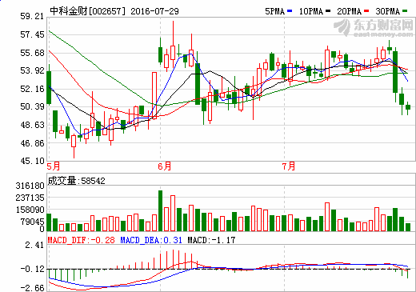
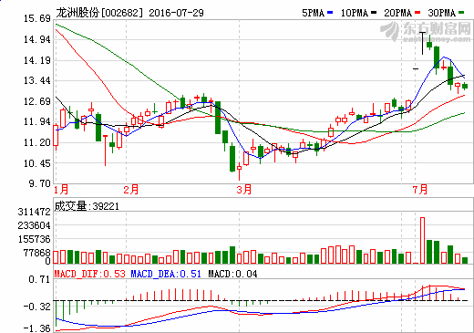
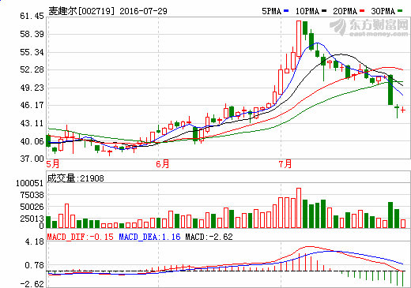
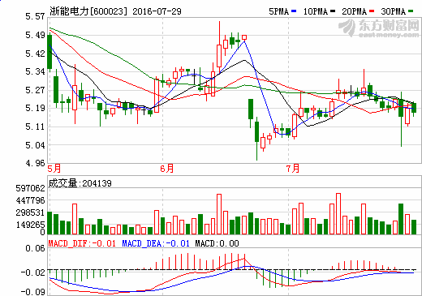
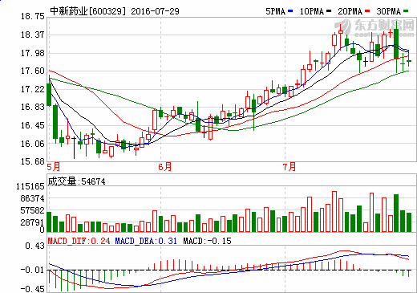
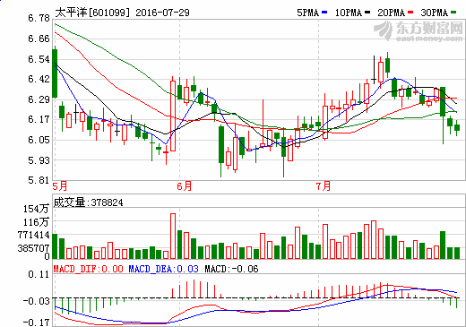
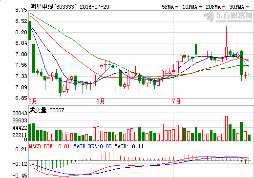

# 4.16 K 线分析 • 寻找夜空中最亮的星

> 来源：https://uqer.io/community/share/557c4527f9f06c6518ad1543

星蜡烛线（简称星线）的实体较小,并且在它的实体与它前面的蜡烛线的实体之间形成了价格跳空。只要星线的实体与前一个实体没有任何重叠,那么这个星蜡烛线就是成立的。星线对形态反转有着重要意义。

+ step 1. 获取股票池。
+ step 2. 股票池筛选：最近趋势为跌-->换手率>2%-->近两天出现过星线。
+ step 3. 输出这些股票的最近k线图。

```py
from lib.kbase import K

def trend(closePrices, before=5):
    '''趋势
    @param closePrices: 收盘价格列表，由先到后顺序
    @return: 上涨趋势返回1，下跌趋势返回-1, 趋势不明返回0
    '''
    if len(closePrices) < before: return 0

    up = 0
    down = 0
    for i, price in enumerate(closePrices[-before:]):
        if i == 0:
            pre_price = price
            continue
        if pre_price < price:
            up += 1
        elif pre_price > price:
            down += 1
        pre_price = price
    if up > down and closePrices[-2] > closePrices[before-1]:
        return 1
    elif down > up and closePrices[-2] < closePrices[before-1]:
        return -1
    else:
        return 0

def is_star_line(infos):
    '''
    @param infos: [(openPrice，lowestPrice，highestPrice，closePrice), ...]
    '''
    ks = [K(e) for e in infos]
    stars = []
    for k in ks[-3:]:
        if k.length > 0 and (k.entityLen/k.length) <= 0.1:
            stars.append(k)
    for star in stars:
        idx = ks.index(star)
        pre = ks[idx-1]
        if pre.isRed:
            if star.openPrice >= pre.closePrice and star.closePrice >= pre.closePrice:
                return True
            elif star.openPrice <= pre.openPrice and star.closePrice <= pre.openPrice:
                return True
        else:
            if star.openPrice >= pre.openPrice and star.closePrice >= pre.openPrice:
                return True
            elif star.openPrice <= pre.closePrice and star.closePrice <= pre.closePrice:
                return True
    return False
```

```py
def get_k_pic(tid, ecd):
    if ecd == 'XSHE':
        pic = '' % \
              (tid, tid, 2)
    else:
        pic = '' % \
              (tid, tid, 1)
    return pic
```

```py
from lib.kbase import K

today = '20150612'
beginDate = '20150601'

def get_active_tickers():
    tickers = DataAPI.EquGet(equTypeCD="A", listStatusCD="L", field=['ticker', 'ListSector'])
    tickers = tickers[tickers['ListSector'] != '创业板']
    tickers = [val[0] for val in tickers.values]
    return tickers

def get_last_with_star_line_tickers(count):
    tickers = []
    all_tickers = get_active_tickers()
    for ticker in all_tickers:
        infos = DataAPI.MktEqudAdjGet(ticker=ticker, beginDate=beginDate,
                                      field=["ticker", "secShortName", "exchangeCD", "tradeDate", "openPrice",
                                             "lowestPrice", "highestPrice", "closePrice"])
        infos = infos[infos['openPrice'] > 0]
        closePrices = [val[-1] for val in infos.values]
        if not closePrices: continue
        if trend(closePrices) != -1: continue
        vol5 = DataAPI.MktStockFactorsOneDayGet(tradeDate=today,ticker=infos.values[0][0],field=["ticker","VOL5"])
        vol5 = vol5.values[0][1]
        if vol5 < 0.02: continue
        _infos = [val[-4:] for val in infos.values]
        if is_star_line(_infos):
            tickers.append(infos)
        if len(tickers) >= count: break
    return tickers

if __name__ == '__main__':
    tickers = get_last_with_star_line_tickers(1000)
    for t in tickers:
        print '###%s(%s)\n' % (t.values[0][1], t.values[0][0])
        print get_k_pic(t.values[0][0], t.values[0][2])
        print '\n'
```

锦龙股份(000712)


中科金财(002657)




克明面业(002661)


龙洲股份(002682)




麦趣尔(002719)




浙能电力(600023)




中新药业(600329)




太平洋(601099)




明星电缆(603333)


