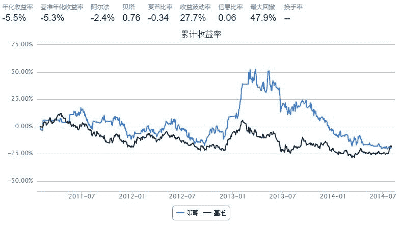

# Momentum策略

> 来源：https://uqer.io/community/share/5526191ef9f06c8f33904571

```py
import pandas as pd
from pandas import Series, DataFrame

start = datetime(2011, 1, 1)
end = datetime(2014, 8, 1)
benchmark = 'SH50'
universe = set_universe('SH50')
capital_base = 100000
refresh_rate = 10

window = 20

def initialize(account):
    account.amount = 300
    add_history('hist', window)


def handle_data(account):
    momentum = {'symbol':[], 'c_ret':[]}
    for stk in account.universe:
        momentum = pd.DataFrame(momentum)
        momentum = momentum.append([{'symbol':stk,'c_ret':account.hist[stk]['closePrice'].iloc[-1]/account.hist[stk]['closePrice'].iloc[0]}])
        momentum = momentum.sort(columns='c_ret').reset_index(drop=True)      
        momentum = momentum[len(momentum)*4/5:len(momentum)]
        buylist = momentum['symbol'].tolist()

        for stk in account.stkpos:
            if (stk not in buylist) and (account.stkpos[stk]>0):
                order_to(stk, 0)
        for stk in buylist:
            if account.stkpos.get(stk,0) == 0:
                order_to(stk, account.amount)
```



