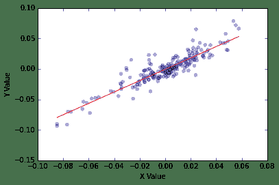
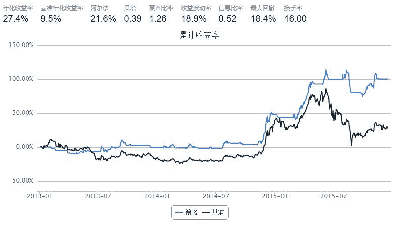

# 【小散学量化】-2-动量模型的简单实践

> 来源：https://uqer.io/community/share/5673a22b228e5b8d5bf017ba

本帖将对之前提到的动量模型进行回测，顺便科普一下动量模型中用到的数学工具，包括以下内容：

+ 1、线性回归
+ 2、动量模型回测
+ 3、小散的思考

## 1.线性回归

线性回归是利用称为线性回归方程的最小平方函数对一个或多个自变量和因变量之间关系进行建模的一种回归分析。

对于自变量X和因变量Y,线性回归方法用Y=α+βX 的形式来解释X,Y之间的关系。例如，小散想知道上证50指数与上证指数之间的变化，该怎么办呢？

首先，定义一个函数来执行线性回归操作，并返回回归结果。

```py
import numpy as np
from statsmodels import regression
import statsmodels.api as sm
import matplotlib.pyplot as plt
import math
def linreg(X,Y):
    # Running the linear regression
    X = sm.add_constant(X)
    model = regression.linear_model.OLS(Y, X).fit()
    a = model.params[0]
    b = model.params[1]
    X = X[:, 1]
    # Return summary of the regression and plot results
    X2 = np.linspace(X.min(), X.max(), 100)
    Y_hat = X2 * b + a
    plt.scatter(X, Y, alpha=0.3) # Plot the raw data
    plt.plot(X2, Y_hat, 'r', alpha=0.9);  # Add the regression line, colored in red
    plt.xlabel('X Value')
    plt.ylabel('Y Value')
    return model.summary()
```

接着，应用上面定义的函数，以2015年的数据为例，验证上证指数（000001）和上证50指数（000016）之间的关系。

```py
data1=DataAPI.MktIdxdGet(ticker='000016',beginDate='20150101',endDate='20151201')
asset=data1['closeIndex']
data2=DataAPI.MktIdxdGet(ticker='000001',beginDate='20150101',endDate='20151201')
benchmark=data2['closeIndex']
r_a = asset.pct_change()[1:]
r_b = benchmark.pct_change()[1:]
linreg(r_b.values, r_a.values)

OLS Regression Results
Dep. Variable:	y	  R-squared:         	   0.823
Model:	OLS	  Adj. R-squared:    	   0.823
Method:	Least Squares	  F-statistic:       	   1021.
Date:	Fri, 18 Dec 2015	  Prob (F-statistic):	2.11e-84
Time:	13:40:10	  Log-Likelihood:    	  685.41
No. Observations:	   221	  AIC:               	  -1367.
Df Residuals:	   219	  BIC:               	  -1360.
Df Model:	     1	                     	 
Covariance Type:	nonrobust	                     	 

coef	std err	t	P>|t|	[95.0% Conf. Int.]
const	   -0.0006	    0.001	   -0.877	 0.381	   -0.002     0.001
x1	    0.9317	    0.029	   31.952	 0.000	    0.874     0.989

Omnibus:	43.308	  Durbin-Watson:     	   1.857
Prob(Omnibus):	 0.000	  Jarque-Bera (JB):  	  85.122
Skew:	 0.968	  Prob(JB):          	3.28e-19
Kurtosis:	 5.344	  Cond. No.          	    39.6
```



小散并不知道OLS结果怎么看，只知道这里的R-sq用来解释线性关系的可靠性，0.823表示自变量可以解释82.3%的因变量变化。小散是一个好奇心很强的人，这个82.3%到底是大还是小呢？

这里使用随机生成X,Y来观察一下。

```py
X = np.random.rand(100)
Y = np.random.rand(100)
linreg(X, Y)

OLS Regression Results
Dep. Variable:	y	  R-squared:         	   0.001
Model:	OLS	  Adj. R-squared:    	  -0.010
Method:	Least Squares	  F-statistic:       	 0.06682
Date:	Fri, 18 Dec 2015	  Prob (F-statistic):	 0.797
Time:	13:40:15	  Log-Likelihood:    	 -15.737
No. Observations:	   100	  AIC:               	   35.47
Df Residuals:	    98	  BIC:               	   40.68
Df Model:	     1	                     	 
Covariance Type:	nonrobust	                     	 

coef	std err	t	P>|t|	[95.0% Conf. Int.]
const	    0.5214	    0.056	    9.245	 0.000	    0.410     0.633
x1	    0.0253	    0.098	    0.258	 0.797	   -0.169     0.219

Omnibus:	22.647	  Durbin-Watson:     	   2.366
Prob(Omnibus):	 0.000	  Jarque-Bera (JB):  	   5.557
Skew:	-0.164	  Prob(JB):          	  0.0621
Kurtosis:	 1.893	  Cond. No.          	    4.32
```


## 2 动量模型回测

针对小伙伴之前提出的回测效果问题，小散选择了上证50指数作为参考，50ETF作为投资标的，上证指数（000001）作为动量模型的择时工具进行了回测。

首先，定义动量信号函数，函数返回值为回归模型的Y值，同期上证指数值及标准差。

```py
from statsmodels import regression
import statsmodels.api as sm
import scipy.stats as stats
import scipy.spatial.distance as distance
import matplotlib.pyplot as plt
import pandas as pd
import numpy as np
from CAL.PyCAL import * 
from datetime import datetime, timedelta
import numpy as np
cal = Calendar('China.SSE')
def signal_gzs_calc(today,before):
    start= cal.advanceDate(today, Period('-30B'))
    start=start.toDateTime()
    end = cal.advanceDate(today, before)
    end=end.toDateTime()
    asset=DataAPI.MktIdxdGet(ticker='000001',beginDate=start,endDate=end,field=['tradeDate','closeIndex'],pandas="1").set_index('tradeDate')['closeIndex']

    # 对收盘价数据进行直线拟合
    X = np.arange(len(asset))
    x = sm.add_constant(X)
    model = regression.linear_model.OLS(asset, x).fit() # 使用OLS计算y=ax+b对应的a和b
    a = model.params[0]
    b = model.params[1]
    Y_fit = X * b + a
    return Y_fit[-1],asset[-1],np.std(asset - Y_fit)
```

```py
start = '2013-01-01'                       # 回测起始时间
today = datetime.today()
delta = timedelta(days = -1)
end = (today+delta).strftime('%Y-%m-%d')
benchmark = 'SH50'							# 策略参考标准
universe = ['510050.XSHG']	# 股票池                      # 策略参考标准
refresh_rate = 1                          # 调仓频率，即每 refresh_rate 个交易日执行一次 handle_data() 函数
def initialize(account):                   # 初始化虚拟账户状态
    pass

def handle_data(account):                  # 每个交易日的买入卖出指令   
    today=account.current_date
    a_1,b_1,c_1=signal_gzs_calc(today,Period('-2B'))
    a_2,b_2,c_2=signal_gzs_calc(today,Period('-1B'))
    for stk in account.universe:
        if (a_1-b_1)< -c_1 and (a_2-b_2)> -c_2 and  not stk in account.valid_secpos:
            order(stk, 200000)
        
        if (a_1-b_1)<c_1 and (a_2-b_2)>c_2 and stk in account.valid_secpos:   
            order(stk, -200000)
```



## 3、小散的思考

从回测效果来看，本模型在捕捉上升趋势和下降趋势时均有延迟，可以通过修改period来调整（初步设定为30）。

单纯依靠反转信号作为卖出信号带来的回撤较大，可以考虑增加止损条件(无止损设定)。

3年回测期内，共发出买卖信号11次，最近一次空仓信号发出在11月19日，产生的信号较少，可以考虑修改两个if条件增加信号量（小散设定为单位标准差）。

策略收益主要是靠空仓避难得到的，小伙伴可以将这个模型推广应用到多个个股，看看有没有挖掘价值。

参考文献：

1、量化分析师日记，新手必看。

2、zilong.li https://uqer.io/community/share/561e3a65f9f06c4ca82fb5ec 用5日均线和10日均线进行判断--改进版。

本次【小散学量化】到此结束， 韭菜的观点仅供参考，切记切记~

