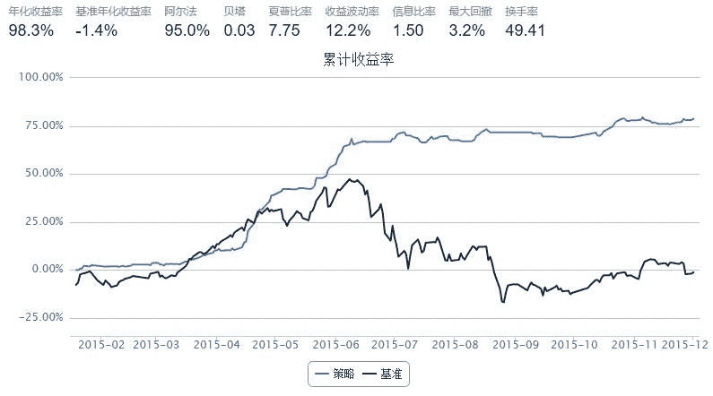

# 一个追涨的策略(修正版)

> 来源：https://uqer.io/community/share/56677b30f9f06c6c8a91b5e8

## 基本思想

每天收盘前一分钟看一下，如果是强势股。则买入。 第二天开盘卖出。 强势股的判断标准：1. 开盘价高于昨日收盘价，也就是有缺口。2. 收盘价接近于当日最高价，也就是收光头阳线 3.收盘价创10日新高

通达信策略公式：

```
ENTERLONG:O>REF(H,1) AND C>H*0.99 AND H=HHV(H,10) AND O/REF(C,1)<1.09;
EXITLONG:REF(ENTERLONG,1);

{多头买入:开盘价>1日前的最高价 AND 收盘价>最高价*0.99 AND 最高价=10日内最高价的最高值 AND 开盘价/1日前的收盘价<1.09}
{多头卖出:1日前的ENTERLONG} 
```

```py
# 第一步：设置基本参数
start = '2015-01-01'
end   = '2015-12-01'
capital_base = 1000000
refresh_rate = 239
benchmark = 'HS300'
freq = 'm'


# 第二步：选择主题，设置股票池
universe = set_universe('HS300')

def initialize(account):                   # 初始化虚拟账户状态
    pass

def handle_data(account):                  # 每个交易日的买入卖出指令
    #print 'start:',account.current_date,account.current_minute
    #print account.current_date
    if(account.current_minute=='09:30'):
        #print '开盘了'
        #print account.referencePrice
        for s in account.valid_secpos:     #清仓
            order_to(s, 0) 
    else:
        #print '收盘了'
        c = account.referencePortfolioValue
        today_minutes=account.get_history(238) #今天
        stocks=[]
        for s in account.universe:
            #print s
            open_price=today_minutes[s]['openPrice'][0]  #09:31分钟开盘价
            pre_close_price=today_minutes[s]['closePrice'][-1] #15:28分钟收盘价
            high_price=today_minutes[s]['highPrice'].max() #当日最高价
            last_10day = account.get_daily_history(10) #最近10日
            close_last_day=last_10day[s]['closePrice'][-1] #昨日收盘价
            max_10day=last_10day[s]['highPrice'].max() #最近10日最高价
            #print s,close_last_day,open_price,pre_close_price,high_price
            if open_price>close_last_day and pre_close_price >= max_10day and  pre_close_price> high_price*0.99 :
                stocks.append(s)
                #print s,close_last_day,open_price,pre_close_price,high_price
        # print stocks
        if len(stocks)==0:
            return
        w=min(0.1,1.0/len(stocks))# 最大仓位1/10
        # print w
        for s in stocks:
            p=today_minutes[s]['closePrice'][-1] #15:28分钟收盘价
            num=int(c * w / p)
            order(s, num)
```



这个模式还没实操过。手动下单在最后1分钟有点匆忙。请教各位，有没有可以程序化下单或者设定条件快速下单的软件？

