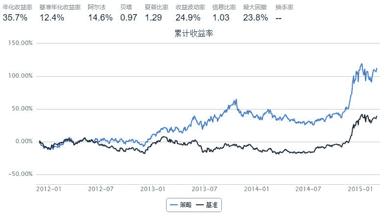

# 动量策略（momentum driven）

> 来源：https://uqer.io/community/share/555ed9eef9f06c6c7304f9a9

```py
import pandas as pd

start = '2011-11-01'
end   = '2015-03-01'
benchmark = 'HS300'
universe = set_universe('HS300')   # 股票池为沪深300
capital_base = 10000000
refresh_rate = 10

def initialize(account):
    pass

def handle_data(account):
    history = account.get_attribute_history('closePrice', 20)
    momentum = {'symbol':[], 'c_ret':[]}
    for stk in account.universe:
        momentum['symbol'].append(stk)
        momentum['c_ret'].append(history[stk][-1]/history[stk][0])
        
    # 按照过去20日收益率排序，并且选择前20%的股票作为买入候选
    momentum = pd.DataFrame(momentum).sort(columns='c_ret').reset_index()
    momentum = momentum[len(momentum)*4/5:len(momentum)]   # 选择
    buylist = momentum['symbol'].tolist()
    for stk in account.valid_secpos:
        if stk not in buylist:
            order_to(stk, 0)
   
    # 等权重买入所选股票
    portfolio_value = account.referencePortfolioValue
    for stk in buylist:
        if stk not in account.valid_secpos:
            order_to(stk, int(portfolio_value / account.referencePrice[stk] / 100.0 / len(buylist))*100)
```



```py
bt
```


| | tradeDate | cash | security_position | portfolio_value | benchmark_return | blotter |
| --- | --- |
| 0   | 2011-11-29 |  1.627636 |  {u'600809.XSHG': 5700, u'600597.XSHG': 21100, ... |  10057034.029636 |  0.013697 |  [Order(order time: datetime.datetime(2011, 11,... |
| 1   | 2011-11-30 |  1.627636 |  {u'600809.XSHG': 5700, u'600597.XSHG': 21100, ... |   9744501.409636 | -0.033370 |                                                 [] |
| 2   | 2011-12-01 |  1.627636 |  {u'600809.XSHG': 5700, u'600597.XSHG': 21100, ... |   9865655.500636 |  0.024625 |                                                 [] |
| 3   | 2011-12-02 |  1.627636 |  {u'600809.XSHG': 5700, u'600597.XSHG': 21100, ... |   9708455.312636 | -0.010180 |                                                 [] |
| 4   | 2011-12-05 |  1.627636 |  {u'600809.XSHG': 5700, u'600597.XSHG': 21100, ... |   9406180.945636 | -0.014048 |                                                 [] |
| 5   | 2011-12-06 |  1.627636 |  {u'600809.XSHG': 5700, u'600597.XSHG': 21100, ... |   9415313.949636 | -0.002000 |                                                 [] |
| 6   | 2011-12-07 |  1.627636 |  {u'600809.XSHG': 5700, u'600597.XSHG': 21100, ... |   9454383.554636 |  0.004724 |                                                 [] |
| 7   | 2011-12-08 |  1.627636 |  {u'600809.XSHG': 5700, u'600597.XSHG': 21100, ... |   9492264.755636 | -0.001276 |                                                 [] |
| 8   | 2011-12-09 |  1.627636 |  {u'600809.XSHG': 5700, u'600597.XSHG': 21100, ... |   9410892.851636 | -0.008531 |                                                 [] |
| 9   | 2011-12-12 |  1.627636 |  {u'600809.XSHG': 5700, u'600597.XSHG': 21100, ... |   9280515.559636 | -0.010293 |                                                 [] |
| 10  | 2011-12-13 |  6.144010 |  {u'000423.XSHE': 4200, u'600036.XSHG': 16300, ... |   9116051.541010 | -0.022506 |  [Order(order time: datetime.datetime(2011, 12,... |
| 11  | 2011-12-14 |  6.144010 |  {u'000423.XSHE': 4200, u'600036.XSHG': 16300, ... |   9042660.489010 | -0.010094 |                                                 [] |
| 12  | 2011-12-15 |  6.144010 |  {u'000423.XSHE': 4200, u'600036.XSHG': 16300, ... |   8973191.009010 | -0.023646 |                                                 [] |
| 13  | 2011-12-16 |  6.144010 |  {u'000423.XSHE': 4200, u'600036.XSHG': 16300, ... |   9203671.207010 |  0.021079 |                                                 [] |
| 14  | 2011-12-19 |  6.144010 |  {u'000423.XSHE': 4200, u'600036.XSHG': 16300, ... |   9272914.609010 | -0.002394 |                                                 [] |
| 15  | 2011-12-20 |  6.144010 |  {u'000423.XSHE': 4200, u'600036.XSHG': 16300, ... |   9245375.546010 | -0.003076 |                                                 [] |
| 16  | 2011-12-21 |  6.144010 |  {u'000423.XSHE': 4200, u'600036.XSHG': 16300, ... |   9134328.126010 | -0.015971 |                                                 [] |
| 17  | 2011-12-22 |  6.144010 |  {u'000423.XSHE': 4200, u'600036.XSHG': 16300, ... |   9174823.752010 |  0.000952 |                                                 [] |
| 18  | 2011-12-23 |  6.144010 |  {u'000423.XSHE': 4200, u'600036.XSHG': 16300, ... |   9185929.702010 |  0.007613 |                                                 [] |
| 19  | 2011-12-26 |  6.144010 |  {u'000423.XSHE': 4200, u'600036.XSHG': 16300, ... |   9054507.546010 | -0.009943 |                                                 [] |
| 20  | 2011-12-27 |  9.172263 |  {u'601328.XSHG': 41600, u'600036.XSHG': 16300,... |   8855733.701263 | -0.013130 |  [Order(order time: datetime.datetime(2011, 12,... |
| 21  | 2011-12-28 |  9.172263 |  {u'601328.XSHG': 41600, u'600036.XSHG': 16300,... |   8820469.780263 |  0.001255 |                                                 [] |
| 22  | 2011-12-29 |  9.172263 |  {u'601328.XSHG': 41600, u'600036.XSHG': 16300,... |   8836530.533263 |  0.001487 |                                                 [] |
| 23  | 2011-12-30 |  9.172263 |  {u'601328.XSHG': 41600, u'600036.XSHG': 16300,... |   8976704.526263 |  0.014875 |                                                 [] |
| 24  | 2012-01-04 |  9.172263 |  {u'601328.XSHG': 41600, u'600036.XSHG': 16300,... |   8858664.267263 | -0.020032 |                                                 [] |
| 25  | 2012-01-05 |  9.172263 |  {u'601328.XSHG': 41600, u'600036.XSHG': 16300,... |   8785873.316263 | -0.009730 |                                                 [] |
| 26  | 2012-01-06 |  9.172263 |  {u'601328.XSHG': 41600, u'600036.XSHG': 16300,... |   8790219.626263 |  0.006245 |                                                 [] |
| 27  | 2012-01-09 |  9.172263 |  {u'601328.XSHG': 41600, u'600036.XSHG': 16300,... |   9032347.125263 |  0.034039 |                                                 [] |
| 28  | 2012-01-10 |  9.172263 |  {u'601328.XSHG': 41600, u'600036.XSHG': 16300,... |   9247829.118263 |  0.033260 |                                                 [] |
| 29  | 2012-01-11 |  9.172263 |  {u'601328.XSHG': 41600, u'600036.XSHG': 16300,... |   9186427.159263 | -0.004797 |                                                 [] |
| ... | ... | ... | ... | ... | ... | ... |
| 755 | 2015-01-12 |  1.942737 |  {u'600036.XSHG': 23600, u'000776.XSHE': 22100,... |  20280828.092737 | -0.009344 |                                                 [] |
| 756 | 2015-01-13 |  1.942737 |  {u'600036.XSHG': 23600, u'000776.XSHE': 22100,... |  20204218.432737 |  0.000131 |                                                 [] |
| 757 | 2015-01-14 |  1.942737 |  {u'600036.XSHG': 23600, u'000776.XSHE': 22100,... |  20223885.602737 | -0.003307 |                                                 [] |
| 758 | 2015-01-15 |  1.942737 |  {u'600036.XSHG': 23600, u'000776.XSHE': 22100,... |  20962393.212737 |  0.029036 |                                                 [] |
| 759 | 2015-01-16 |  1.942737 |  {u'600036.XSHG': 23600, u'000776.XSHE': 22100,... |  21076614.722737 |  0.008608 |                                                 [] |
| 760 | 2015-01-19 |  3.731317 |  {u'601328.XSHG': 49500, u'600066.XSHG': 21600,... |  19298994.131317 | -0.077023 |  [Order(order time: datetime.datetime(2015, 1, ... |
| 761 | 2015-01-20 |  3.731317 |  {u'601328.XSHG': 49500, u'600066.XSHG': 21600,... |  19641436.921317 |  0.012240 |                                                 [] |
| 762 | 2015-01-21 |  3.731317 |  {u'601328.XSHG': 49500, u'600066.XSHG': 21600,... |  20548813.131317 |  0.044951 |                                                 [] |
| 763 | 2015-01-22 |  3.731317 |  {u'601328.XSHG': 49500, u'600066.XSHG': 21600,... |  20654164.321317 |  0.005277 |                                                 [] |
| 764 | 2015-01-23 |  3.731317 |  {u'601328.XSHG': 49500, u'600066.XSHG': 21600,... |  20704527.401317 |  0.001155 |                                                 [] |
| 765 | 2015-01-26 |  3.731317 |  {u'601328.XSHG': 49500, u'600066.XSHG': 21600,... |  20741863.411317 |  0.010150 |                                                 [] |
| 766 | 2015-01-27 |  3.731317 |  {u'601328.XSHG': 49500, u'600066.XSHG': 21600,... |  20501439.751317 | -0.009161 |                                                 [] |
| 767 | 2015-01-28 |  3.731317 |  {u'601328.XSHG': 49500, u'600066.XSHG': 21600,... |  20072450.291317 | -0.013877 |                                                 [] |
| 768 | 2015-01-29 |  3.731317 |  {u'601328.XSHG': 49500, u'600066.XSHG': 21600,... |  19879912.781317 | -0.012346 |                                                 [] |
| 769 | 2015-01-30 |  3.731317 |  {u'601328.XSHG': 49500, u'600066.XSHG': 21600,... |  19612742.771317 | -0.013616 |                                                 [] |
| 770 | 2015-02-02 |  6.734377 |  {u'002153.XSHE': 4400, u'600498.XSHG': 19400, ... |  19457712.474377 | -0.023419 |  [Order(order time: datetime.datetime(2015, 2, ... |
| 771 | 2015-02-03 |  6.734377 |  {u'002153.XSHE': 4400, u'600498.XSHG': 19400, ... |  19862476.714377 |  0.024891 |                                                 [] |
| 772 | 2015-02-04 |  6.734377 |  {u'002153.XSHE': 4400, u'600498.XSHG': 19400, ... |  19714886.724377 | -0.010379 |                                                 [] |
| 773 | 2015-02-05 |  6.734377 |  {u'002153.XSHE': 4400, u'600498.XSHG': 19400, ... |  19679598.144377 | -0.010236 |                                                 [] |
| 774 | 2015-02-06 |  6.734377 |  {u'002153.XSHE': 4400, u'600498.XSHG': 19400, ... |  19297569.294377 | -0.016194 |                                                 [] |
| 775 | 2015-02-09 |  6.734377 |  {u'002153.XSHE': 4400, u'600498.XSHG': 19400, ... |  19131675.244377 |  0.010114 |                                                 [] |
| 776 | 2015-02-10 |  6.734377 |  {u'002153.XSHE': 4400, u'600498.XSHG': 19400, ... |  19621103.094377 |  0.018238 |                                                 [] |
| 777 | 2015-02-11 |  6.734377 |  {u'002153.XSHE': 4400, u'600498.XSHG': 19400, ... |  20007845.234377 |  0.007978 |                                                 [] |
| 778 | 2015-02-12 |  6.734377 |  {u'002153.XSHE': 4400, u'600498.XSHG': 19400, ... |  20139049.804377 |  0.002548 |                                                 [] |
| 779 | 2015-02-13 |  6.734377 |  {u'002153.XSHE': 4400, u'600498.XSHG': 19400, ... |  20416511.184377 |  0.007829 |                                                 [] |
| 780 | 2015-02-16 |  5.417277 |  {u'002153.XSHE': 4400, u'600498.XSHG': 19400, ... |  21015638.057277 |  0.008547 |  [Order(order time: datetime.datetime(2015, 2, ... |
| 781 | 2015-02-17 |  5.417277 |  {u'002153.XSHE': 4400, u'600498.XSHG': 19400, ... |  20991534.387277 |  0.006526 |                                                 [] |
| 782 | 2015-02-25 |  5.417277 |  {u'002153.XSHE': 4400, u'600498.XSHG': 19400, ... |  20681973.077277 | -0.012376 |                                                 [] |
| 783 | 2015-02-26 |  5.417277 |  {u'002153.XSHE': 4400, u'600498.XSHG': 19400, ... |  20936634.347277 |  0.025172 |                                                 [] |
| 784 | 2015-02-27 |  5.417277 |  {u'002153.XSHE': 4400, u'600498.XSHG': 19400, ... |  21204596.757277 |  0.001836 |                                                 [] |

```
785 rows × 6 columns
```

