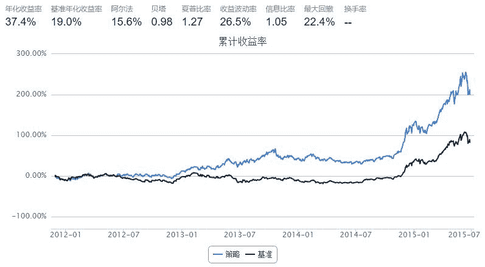

# 动量策略（momentum driven）——修正版

> 来源：https://uqer.io/community/share/5590a4d4f9f06cb5604f187e

```py
import pandas as pd

start = '2011-11-01'
end   = '2015-06-25'
benchmark = 'HS300'
universe = set_universe('HS300')   # 股票池为沪深300
capital_base = 10000000
refresh_rate = 10

def initialize(account):
    pass

def handle_data(account):
    history = account.get_attribute_history('closePrice', 20)
    momentum = {'symbol':[], 'c_ret':[]}
    for stk in account.universe:
        momentum['symbol'].append(stk)
        momentum['c_ret'].append(history[stk][-1]/history[stk][0])
        
    # 按照过去20日收益率排序，并且选择前20%的股票作为买入候选
    momentum = pd.DataFrame(momentum).sort(columns='c_ret').reset_index()
    momentum = momentum[len(momentum)*4/5:len(momentum)]   # 选择
    buylist = momentum['symbol'].tolist()
    for stk in account.valid_secpos:
        if stk not in buylist:
            order_to(stk, 0)
   
    # 等权重买入所选股票
    portfolio_value = account.referencePortfolioValue
    
    filteredBuylist = []
    for stk in buylist:
        if not np.isnan(account.referencePrice[stk]):
            filteredBuylist.append(stk)
            
    print account.current_date, filteredBuylist
    
    for stk in filteredBuylist:
        if stk not in account.valid_secpos:
            order_to(stk, int(portfolio_value / account.referencePrice[stk] / 100.0 / len(buylist))*100)
```



```
2011-11-29 00:00:00 ['000963.XSHE', '000061.XSHE', '601106.XSHG', '600108.XSHG', '300251.XSHE', '000400.XSHE', '600519.XSHG', '600100.XSHG', '600157.XSHG', '000999.XSHE', '002065.XSHE', '000895.XSHE', '600177.XSHG', '002008.XSHE', '002230.XSHE', '000858.XSHE', '600578.XSHG', '000729.XSHE', '002353.XSHE', '002465.XSHE', '000009.XSHE', '600256.XSHG', '600998.XSHG', '002385.XSHE', '300133.XSHE', '002007.XSHE', '002450.XSHE', '000581.XSHE', '600535.XSHG', '300003.XSHE', '600008.XSHG', '000503.XSHE', '600406.XSHG', '600315.XSHG', '000413.XSHE', '600809.XSHG', '002292.XSHE', '600085.XSHG', '000538.XSHE', '600718.XSHG', '000423.XSHE', '300027.XSHE', '600600.XSHG', '300070.XSHE', '600276.XSHG', '600703.XSHG', '600066.XSHG', '600597.XSHG', '300146.XSHE', '000539.XSHE', '300058.XSHE', '600485.XSHG', '600373.XSHG', '600637.XSHG', '002570.XSHE']
2011-12-13 00:00:00 ['000895.XSHE', '601318.XSHG', '002142.XSHE', '600028.XSHG', '601766.XSHG', '000963.XSHE', '601398.XSHG', '601166.XSHG', '600383.XSHG', '601328.XSHG', '000423.XSHE', '002353.XSHE', '000001.XSHE', '000538.XSHE', '002304.XSHE', '600315.XSHG', '002385.XSHE', '601988.XSHG', '000002.XSHE', '600276.XSHG', '600519.XSHG', '000046.XSHE', '601169.XSHG', '601288.XSHG', '000858.XSHE', '600108.XSHG', '002570.XSHE', '002292.XSHE', '601939.XSHG', '600535.XSHG', '002038.XSHE', '601628.XSHG', '600177.XSHG', '600893.XSHG', '600048.XSHG', '000999.XSHE', '600637.XSHG', '000069.XSHE', '600867.XSHG', '600015.XSHG', '300058.XSHE', '601333.XSHG', '600016.XSHG', '000024.XSHE', '600036.XSHG', '002146.XSHE', '601888.XSHG', '000539.XSHE', '002065.XSHE', '601009.XSHG', '600066.XSHG', '002236.XSHE', '000738.XSHE', '601555.XSHG', '601928.XSHG']
2011-12-27 00:00:00 ['600000.XSHG', '600633.XSHG', '002007.XSHE', '600028.XSHG', '600100.XSHG', '600863.XSHG', '600741.XSHG', '600660.XSHG', '600153.XSHG', '002142.XSHE', '000738.XSHE', '600642.XSHG', '000402.XSHE', '600066.XSHG', '601328.XSHG', '601988.XSHG', '000963.XSHE', '601398.XSHG', '600104.XSHG', '601166.XSHG', '002292.XSHE', '300017.XSHE', '601933.XSHG', '600016.XSHG', '600019.XSHG', '601601.XSHG', '601857.XSHG', '600867.XSHG', '600690.XSHG', '601288.XSHG', '002065.XSHE', '600036.XSHG', '601991.XSHG', '601009.XSHG', '002252.XSHE', '000581.XSHE', '601633.XSHG', '600027.XSHG', '601333.XSHG', '600795.XSHG', '000069.XSHE', '600893.XSHG', '000539.XSHE', '000002.XSHE', '600015.XSHG', '600011.XSHG', '002415.XSHE', '600383.XSHG', '600048.XSHG', '000024.XSHE', '002236.XSHE', '000046.XSHE', '002146.XSHE', '601555.XSHG', '601336.XSHG', '601928.XSHG']
2012-01-12 00:00:00 ['002450.XSHE', '600170.XSHG', '000024.XSHE', '600036.XSHG', '601699.XSHG', '600115.XSHG', '600886.XSHG', '600642.XSHG', '600048.XSHG', '600795.XSHG', '600028.XSHG', '000937.XSHE', '000157.XSHE', '600015.XSHG', '601601.XSHG', '601992.XSHG', '600066.XSHG', '600340.XSHG', '600372.XSHG', '601111.XSHG', '601808.XSHG', '600369.XSHG', '000651.XSHE', '600578.XSHG', '601898.XSHG', '000970.XSHE', '600031.XSHG', '300146.XSHE', '000425.XSHE', '002594.XSHE', '000100.XSHE', '600348.XSHG', '000629.XSHE', '601933.XSHG', '600690.XSHG', '601633.XSHG', '000539.XSHE', '002292.XSHE', '600309.XSHG', '002146.XSHE', '601377.XSHG', '600383.XSHG', '600060.XSHG', '000625.XSHE', '000046.XSHE', '601991.XSHG', '600415.XSHG', '600741.XSHG', '000800.XSHE', '600010.XSHG', '600027.XSHG', '600011.XSHG', '600100.XSHG', '600104.XSHG', '601336.XSHG']
2012-02-02 00:00:00 ['600317.XSHG', '600157.XSHG', '600383.XSHG', '000783.XSHE', '600030.XSHG', '002202.XSHE', '600585.XSHG', '601866.XSHG', '601166.XSHG', '000623.XSHE', '600028.XSHG', '000878.XSHE', '601168.XSHG', '600309.XSHG', '601336.XSHG', '601318.XSHG', '000009.XSHE', '600104.XSHG', '000800.XSHE', '600153.XSHG', '000039.XSHE', '601958.XSHG', '600837.XSHG', '000625.XSHE', '601808.XSHG', '600188.XSHG', '600340.XSHG', '000937.XSHE', '600166.XSHG', '000060.XSHE', '002008.XSHE', '601699.XSHG', '000425.XSHE', '600741.XSHG', '000100.XSHE', '600031.XSHG', '002129.XSHE', '601899.XSHG', '600010.XSHG', '600362.XSHG', '000157.XSHE', '600739.XSHG', '000776.XSHE', '600547.XSHG', '600549.XSHG', '600497.XSHG', '000970.XSHE', '600100.XSHG', '600348.XSHG', '600489.XSHG', '000630.XSHE', '601377.XSHG', '600111.XSHG', '600060.XSHG', '000960.XSHE', '002653.XSHE']
2012-02-16 00:00:00 ['601186.XSHG', '601899.XSHG', '000623.XSHE', '002241.XSHE', '002385.XSHE', '002304.XSHE', '600718.XSHG', '601958.XSHG', '000400.XSHE', '002008.XSHE', '601607.XSHG', '002081.XSHE', '600372.XSHG', '600893.XSHG', '600497.XSHG', '600837.XSHG', '600549.XSHG', '600030.XSHG', '000738.XSHE', '601318.XSHG', '600111.XSHG', '000009.XSHE', '600153.XSHG', '000776.XSHE', '600271.XSHG', '601106.XSHG', '600157.XSHG', '600108.XSHG', '000060.XSHE', '600166.XSHG', '300017.XSHE', '600809.XSHG', '000750.XSHE', '601117.XSHG', '600362.XSHG', '600516.XSHG', '601866.XSHG', '000157.XSHE', '002001.XSHE', '600547.XSHG', '600277.XSHG', '002375.XSHE', '601989.XSHG', '002230.XSHE', '601118.XSHG', '000630.XSHE', '600489.XSHG', '002456.XSHE', '600637.XSHG', '601919.XSHG', '600060.XSHG', '000960.XSHE', '002129.XSHE', '600340.XSHG', '601258.XSHG', '002653.XSHE']
2012-03-01 00:00:00 ['000883.XSHE', '002001.XSHE', '000738.XSHE', '600703.XSHG', '000063.XSHE', '300017.XSHE', '002081.XSHE', '601633.XSHG', '002304.XSHE', '000625.XSHE', '300146.XSHE', '600256.XSHG', '600873.XSHG', '002465.XSHE', '000060.XSHE', '002422.XSHE', '600690.XSHG', '300251.XSHE', '000768.XSHE', '600570.XSHG', '002385.XSHE', '600893.XSHG', '002008.XSHE', '002450.XSHE', '600157.XSHG', '600340.XSHG', '600406.XSHG', '600166.XSHG', '000686.XSHE', '000712.XSHE', '600398.XSHG', '600804.XSHG', '600372.XSHG', '000917.XSHE', '600271.XSHG', '002146.XSHE', '600208.XSHG', '000750.XSHE', '600252.XSHG', '600839.XSHG', '002310.XSHE', '601992.XSHG', '600111.XSHG', '002375.XSHE', '600809.XSHG', '601555.XSHG', '300059.XSHE', '000046.XSHE', '002230.XSHE', '600060.XSHG', '600637.XSHG', '300104.XSHE', '002456.XSHE', '601258.XSHG', '601929.XSHG', '601231.XSHG']
2012-03-15 00:00:00 ['002465.XSHE', '002304.XSHE', '601633.XSHG', '600383.XSHG', '600549.XSHG', '600066.XSHG', '002353.XSHE', '600485.XSHG', '000651.XSHE', '600809.XSHG', '600369.XSHG', '000568.XSHE', '002415.XSHE', '000625.XSHE', '600256.XSHG', '601699.XSHG', '601688.XSHG', '000750.XSHE', '600010.XSHG', '601216.XSHG', '002230.XSHE', '000917.XSHE', '000728.XSHE', '600208.XSHG', '002252.XSHE', '002024.XSHE', '000883.XSHE', '000800.XSHE', '601788.XSHG', '600157.XSHG', '002310.XSHE', '000783.XSHE', '600703.XSHG', '300251.XSHE', '000712.XSHE', '601555.XSHG', '300059.XSHE', '002146.XSHE', '000686.XSHE', '000776.XSHE', '000046.XSHE', '000970.XSHE', '300146.XSHE', '002456.XSHE', '600690.XSHG', '600998.XSHG', '002375.XSHE', '600739.XSHG', '600150.XSHG', '600108.XSHG', '300104.XSHE', '600060.XSHG', '600111.XSHG', '601929.XSHG', '601231.XSHG', '601800.XSHG']
2012-03-29 00:00:00 ['000712.XSHE', '300104.XSHE', '000776.XSHE', '600369.XSHG', '002410.XSHE', '601333.XSHG', '601098.XSHG', '601958.XSHG', '000729.XSHE', '600900.XSHG', '600519.XSHG', '002570.XSHE', '600276.XSHG', '600109.XSHG', '600518.XSHG', '002146.XSHE', '000800.XSHE', '002294.XSHE', '002236.XSHE', '600196.XSHG', '300058.XSHE', '000963.XSHE', '002415.XSHE', '002310.XSHE', '600588.XSHG', '002385.XSHE', '002594.XSHE', '000728.XSHE', '002304.XSHE', '002252.XSHE', '600108.XSHG', '000413.XSHE', '000839.XSHE', '000999.XSHE', '000778.XSHE', '600352.XSHG', '002450.XSHE', '002153.XSHE', '300251.XSHE', '600597.XSHG', '600150.XSHG', '002353.XSHE', '300017.XSHE', '002344.XSHE', '000883.XSHE', '000970.XSHE', '600332.XSHG', '002024.XSHE', '600739.XSHG', '600998.XSHG', '600010.XSHG', '600549.XSHG', '600170.XSHG', '000750.XSHE', '600111.XSHG', '601800.XSHG']
2012-04-17 00:00:00 ['300058.XSHE', '600741.XSHG', '000970.XSHE', '600597.XSHG', '601958.XSHG', '000883.XSHE', '600637.XSHG', '601336.XSHG', '600398.XSHG', '601933.XSHG', '000686.XSHE', '601117.XSHG', '600104.XSHG', '000002.XSHE', '000009.XSHE', '002410.XSHE', '600157.XSHG', '601688.XSHG', '601888.XSHG', '000625.XSHE', '600153.XSHG', '002344.XSHE', '300017.XSHE', '000651.XSHE', '000783.XSHE', '000413.XSHE', '601788.XSHG', '000069.XSHE', '000728.XSHE', '600208.XSHG', '600519.XSHG', '600585.XSHG', '600648.XSHG', '600549.XSHG', '600999.XSHG', '000776.XSHE', '002450.XSHE', '601866.XSHG', '002236.XSHE', '600649.XSHG', '600111.XSHG', '600837.XSHG', '600030.XSHG', '600633.XSHG', '600066.XSHG', '600048.XSHG', '002146.XSHE', '600383.XSHG', '600010.XSHG', '000629.XSHE', '300146.XSHE', '002153.XSHE', '600170.XSHG', '002594.XSHE', '000750.XSHE']
2012-05-03 00:00:00 ['600999.XSHG', '000712.XSHE', '000878.XSHE', '600362.XSHG', '600372.XSHG', '601318.XSHG', '600383.XSHG', '000425.XSHE', '000783.XSHE', '000623.XSHE', '600030.XSHG', '002142.XSHE', '600663.XSHG', '600570.XSHG', '600369.XSHG', '600648.XSHG', '000039.XSHE', '601699.XSHG', '601628.XSHG', '600809.XSHG', '600150.XSHG', '601601.XSHG', '600115.XSHG', '600348.XSHG', '601099.XSHG', '601118.XSHG', '601117.XSHG', '600031.XSHG', '000625.XSHE', '000024.XSHE', '600166.XSHG', '000157.XSHE', '000630.XSHE', '300059.XSHE', '600048.XSHG', '601336.XSHG', '000776.XSHE', '000629.XSHE', '000686.XSHE', '000937.XSHE', '601633.XSHG', '601688.XSHG', '000970.XSHE', '600170.XSHG', '600157.XSHG', '600208.XSHG', '600649.XSHG', '000983.XSHE', '601901.XSHG', '601377.XSHG', '600109.XSHG', '002500.XSHE', '601555.XSHG', '000750.XSHE', '603000.XSHG']
2012-05-17 00:00:00 ['600010.XSHG', '002415.XSHE', '002353.XSHE', '002475.XSHE', '600256.XSHG', '600208.XSHG', '002236.XSHE', '600369.XSHG', '600600.XSHG', '601688.XSHG', '600783.XSHG', '000629.XSHE', '601179.XSHG', '601607.XSHG', '601377.XSHG', '600570.XSHG', '601336.XSHG', '600315.XSHG', '300059.XSHE', '601727.XSHG', '000061.XSHE', '600703.XSHG', '000400.XSHE', '300003.XSHE', '600048.XSHG', '000999.XSHE', '600196.XSHG', '002294.XSHE', '600998.XSHG', '000826.XSHE', '002146.XSHE', '000963.XSHE', '600166.XSHG', '601808.XSHG', '000883.XSHE', '300146.XSHE', '600690.XSHG', '600674.XSHG', '000878.XSHE', '601633.XSHG', '002241.XSHE', '002422.XSHE', '601901.XSHG', '600372.XSHG', '300070.XSHE', '300024.XSHE', '600170.XSHG', '600109.XSHG', '600252.XSHG', '601555.XSHG', '600111.XSHG', '000970.XSHE', '000750.XSHE', '600332.XSHG', '002673.XSHE', '603000.XSHG']
2012-05-31 00:00:00 ['000402.XSHE', '000917.XSHE', '000046.XSHE', '000539.XSHE', '000157.XSHE', '002310.XSHE', '002422.XSHE', '600060.XSHG', '601179.XSHG', '600383.XSHG', '002146.XSHE', '601688.XSHG', '600674.XSHG', '000800.XSHE', '600170.XSHG', '600048.XSHG', '002653.XSHE', '600600.XSHG', '600690.XSHG', '600340.XSHG', '600315.XSHG', '300146.XSHE', '000024.XSHE', '300024.XSHE', '601788.XSHG', '600166.XSHG', '601633.XSHG', '600252.XSHG', '300133.XSHE', '002475.XSHE', '600256.XSHG', '000883.XSHE', '600485.XSHG', '300124.XSHE', '600157.XSHG', '600549.XSHG', '000400.XSHE', '000625.XSHE', '300104.XSHE', '002241.XSHE', '600038.XSHG', '002236.XSHE', '600415.XSHG', '002410.XSHE', '000826.XSHE', '002051.XSHE', '600111.XSHG', '002456.XSHE', '600703.XSHG', '600369.XSHG', '002375.XSHE', '002081.XSHE', '002673.XSHE', '300070.XSHE', '000970.XSHE', '600332.XSHG']
2012-06-14 00:00:00 ['601186.XSHG', '000423.XSHE', '002475.XSHE', '002001.XSHE', '300027.XSHE', '600703.XSHG', '600547.XSHG', '600157.XSHG', '002456.XSHE', '300058.XSHE', '601991.XSHG', '002051.XSHE', '600519.XSHG', '601688.XSHG', '000027.XSHE', '600221.XSHG', '600085.XSHG', '600578.XSHG', '600549.XSHG', '000826.XSHE', '600332.XSHG', '000725.XSHE', '600600.XSHG', '600315.XSHG', '000999.XSHE', '002038.XSHE', '600276.XSHG', '000538.XSHE', '002146.XSHE', '000157.XSHE', '300070.XSHE', '002241.XSHE', '601633.XSHG', '300146.XSHE', '002422.XSHE', '600048.XSHG', '000970.XSHE', '000539.XSHE', '600535.XSHG', '000750.XSHE', '600383.XSHG', '600011.XSHG', '002415.XSHE', '300002.XSHE', '002236.XSHE', '000625.XSHE', '000024.XSHE', '000069.XSHE', '600340.XSHG', '600027.XSHG', '002410.XSHE', '300104.XSHE', '002310.XSHE', '600369.XSHG', '002375.XSHE', '002081.XSHE', '002653.XSHE']
2012-06-29 00:00:00 ['601633.XSHG', '600827.XSHG', '000712.XSHE', '600863.XSHG', '600048.XSHG', '601668.XSHG', '002422.XSHE', '000069.XSHE', '601288.XSHG', '601601.XSHG', '002065.XSHE', '000750.XSHE', '002051.XSHE', '300015.XSHE', '300017.XSHE', '601628.XSHG', '002294.XSHE', '000027.XSHE', '601888.XSHG', '002456.XSHE', '300024.XSHE', '300104.XSHE', '000963.XSHE', '000568.XSHE', '002081.XSHE', '000895.XSHE', '002385.XSHE', '600642.XSHG', '600315.XSHG', '601318.XSHG', '600886.XSHG', '300058.XSHE', '600998.XSHG', '002410.XSHE', '000792.XSHE', '300027.XSHE', '600276.XSHG', '002353.XSHE', '600795.XSHG', '600085.XSHG', '600578.XSHG', '601991.XSHG', '000999.XSHE', '002038.XSHE', '300146.XSHE', '600535.XSHG', '000538.XSHE', '002475.XSHE', '002415.XSHE', '002310.XSHE', '002241.XSHE', '000539.XSHE', '600011.XSHG', '600518.XSHG', '600027.XSHG', '002653.XSHE']
2012-07-13 00:00:00 ['002142.XSHE', '300133.XSHE', '000598.XSHE', '000895.XSHE', '600809.XSHG', '600029.XSHG', '300027.XSHE', '000002.XSHE', '002415.XSHE', '601111.XSHG', '300146.XSHE', '600519.XSHG', '600340.XSHG', '600048.XSHG', '600535.XSHG', '002007.XSHE', '601888.XSHG', '601929.XSHG', '000712.XSHE', '000069.XSHE', '000538.XSHE', '000970.XSHE', '002310.XSHE', '300017.XSHE', '600583.XSHG', '002304.XSHE', '002081.XSHE', '002294.XSHE', '600011.XSHG', '002450.XSHE', '002375.XSHE', '002038.XSHE', '600867.XSHG', '601607.XSHG', '000539.XSHE', '000963.XSHE', '600196.XSHG', '600115.XSHG', '002456.XSHE', '000568.XSHE', '002241.XSHE', '002236.XSHE', '600315.XSHG', '300058.XSHE', '002051.XSHE', '002292.XSHE', '002353.XSHE', '000792.XSHE', '000858.XSHE', '600085.XSHG', '002475.XSHE', '600518.XSHG', '600027.XSHG', '600252.XSHG', '002385.XSHE', '002653.XSHE', '600332.XSHG']
2012-07-27 00:00:00 ['002292.XSHE', '601117.XSHG', '300017.XSHE', '000728.XSHE', '000712.XSHE', '601888.XSHG', '600177.XSHG', '600637.XSHG', '601601.XSHG', '600085.XSHG', '002456.XSHE', '601808.XSHG', '300070.XSHE', '002007.XSHE', '000651.XSHE', '600276.XSHG', '300024.XSHE', '600373.XSHG', '002465.XSHE', '600804.XSHG', '601928.XSHG', '600535.XSHG', '000792.XSHE', '600010.XSHG', '002385.XSHE', '002415.XSHE', '600867.XSHG', '000876.XSHE', '000970.XSHE', '002375.XSHE', '601098.XSHG', '300104.XSHE', '600011.XSHG', '600108.XSHG', '600519.XSHG', '601628.XSHG', '601607.XSHG', '002304.XSHE', '000625.XSHE', '002038.XSHE', '601186.XSHG', '002051.XSHE', '000858.XSHE', '000963.XSHE', '600196.XSHG', '002475.XSHE', '600633.XSHG', '002570.XSHE', '000883.XSHE', '002470.XSHE', '300133.XSHE', '600332.XSHG', '300058.XSHE', '600315.XSHG', '002450.XSHE', '600252.XSHG', '002236.XSHE']
2012-08-10 00:00:00 ['601989.XSHG', '601998.XSHG', '000876.XSHE', '601231.XSHG', '601699.XSHG', '000783.XSHE', '601992.XSHG', '600489.XSHG', '002310.XSHE', '000400.XSHE', '000061.XSHE', '601186.XSHG', '000728.XSHE', '600089.XSHG', '600050.XSHG', '600406.XSHG', '600271.XSHG', '002038.XSHE', '002475.XSHE', '601899.XSHG', '002241.XSHE', '600277.XSHG', '600549.XSHG', '000963.XSHE', '002470.XSHE', '002410.XSHE', '601258.XSHG', '600998.XSHG', '600741.XSHG', '002051.XSHE', '000826.XSHE', '600516.XSHG', '300070.XSHE', '000559.XSHE', '600547.XSHG', '000999.XSHE', '600867.XSHG', '600739.XSHG', '300002.XSHE', '600535.XSHG', '002415.XSHE', '000686.XSHE', '300024.XSHE', '300027.XSHE', '300251.XSHE', '600372.XSHG', '300017.XSHE', '300133.XSHE', '002456.XSHE', '000503.XSHE', '002236.XSHE', '601117.XSHG', '600703.XSHG', '600010.XSHG', '002450.XSHE', '600637.XSHG', '000883.XSHE']
2012-08-24 00:00:00 ['000793.XSHE', '600518.XSHG', '600588.XSHG', '600277.XSHG', '601933.XSHG', '002422.XSHE', '600739.XSHG', '002051.XSHE', '000559.XSHE', '600489.XSHG', '600170.XSHG', '600085.XSHG', '000061.XSHE', '600703.XSHG', '300027.XSHE', '600332.XSHG', '600373.XSHG', '601607.XSHG', '002310.XSHE', '000581.XSHE', '600674.XSHG', '600547.XSHG', '000963.XSHE', '300133.XSHE', '000629.XSHE', '002470.XSHE', '000009.XSHE', '600998.XSHG', '002475.XSHE', '600867.XSHG', '600315.XSHG', '002456.XSHE', '600516.XSHG', '000999.XSHE', '000826.XSHE', '600809.XSHG', '600535.XSHG', '002241.XSHE', '300251.XSHE', '002065.XSHE', '300070.XSHE', '300002.XSHE', '000400.XSHE', '002236.XSHE', '002570.XSHE', '002653.XSHE', '002038.XSHE', '600372.XSHG', '600010.XSHG', '002450.XSHE', '600549.XSHG', '600637.XSHG', '000503.XSHE', '000883.XSHE', '300017.XSHE', '002230.XSHE', '601231.XSHG']
2012-09-07 00:00:00 ['600276.XSHG', '000725.XSHE', '600109.XSHG', '600688.XSHG', '300027.XSHE', '000999.XSHE', '000651.XSHE', '600690.XSHG', '600998.XSHG', '600597.XSHG', '600739.XSHG', '600893.XSHG', '002470.XSHE', '300251.XSHE', '601929.XSHG', '000826.XSHE', '600633.XSHG', '600108.XSHG', '002236.XSHE', '601933.XSHG', '601928.XSHG', '600208.XSHG', '600050.XSHG', '002594.XSHE', '002456.XSHE', '002024.XSHE', '002450.XSHE', '600489.XSHG', '000503.XSHE', '300070.XSHE', '300124.XSHE', '600373.XSHG', '600066.XSHG', '002065.XSHE', '002465.XSHE', '600019.XSHG', '300024.XSHE', '601607.XSHG', '600372.XSHG', '600887.XSHG', '600867.XSHG', '300017.XSHE', '000793.XSHE', '002570.XSHE', '000413.XSHE', '600547.XSHG', '600703.XSHG', '600316.XSHG', '600038.XSHG', '000738.XSHE', '603000.XSHG', '600516.XSHG', '601231.XSHG', '002230.XSHE', '000400.XSHE', '002008.XSHE', '600705.XSHG']
2012-09-21 00:00:00 ['601186.XSHG', '002353.XSHE', '000999.XSHE', '000651.XSHE', '000793.XSHE', '000728.XSHE', '601788.XSHG', '601989.XSHG', '300024.XSHE', '000960.XSHE', '000917.XSHE', '600518.XSHG', '002236.XSHE', '000783.XSHE', '601899.XSHG', '601688.XSHG', '600867.XSHG', '601628.XSHG', '600362.XSHG', '000630.XSHE', '600150.XSHG', '600585.XSHG', '300070.XSHE', '000503.XSHE', '601555.XSHG', '300017.XSHE', '600406.XSHG', '002230.XSHE', '002594.XSHE', '600690.XSHG', '600352.XSHG', '600804.XSHG', '600703.XSHG', '600893.XSHG', '002385.XSHE', '000738.XSHE', '000400.XSHE', '601117.XSHG', '600104.XSHG', '600038.XSHG', '600256.XSHG', '600118.XSHG', '603000.XSHG', '601633.XSHG', '002024.XSHE', '002422.XSHE', '002465.XSHE', '000725.XSHE', '600019.XSHG', '600547.XSHG', '002294.XSHE', '600489.XSHG', '600060.XSHG', '600109.XSHG', '600170.XSHG', '002008.XSHE', '600705.XSHG']
2012-10-12 00:00:00 ['600535.XSHG', '600089.XSHG', '600690.XSHG', '000960.XSHE', '600118.XSHG', '000568.XSHE', '601699.XSHG', '601788.XSHG', '601117.XSHG', '002008.XSHE', '000060.XSHE', '002230.XSHE', '000768.XSHE', '600019.XSHG', '002450.XSHE', '000100.XSHE', '600837.XSHG', '600570.XSHG', '000538.XSHE', '600352.XSHG', '601186.XSHG', '000503.XSHE', '000963.XSHE', '601555.XSHG', '000895.XSHE', '600809.XSHG', '002344.XSHE', '600309.XSHG', '000630.XSHE', '000413.XSHE', '600104.XSHG', '601929.XSHG', '600585.XSHG', '000783.XSHE', '002038.XSHE', '600369.XSHG', '000063.XSHE', '002385.XSHE', '000725.XSHE', '002422.XSHE', '002456.XSHE', '600741.XSHG', '600547.XSHG', '600060.XSHG', '002399.XSHE', '601377.XSHG', '300058.XSHE', '000625.XSHE', '000423.XSHE', '600170.XSHG', '600489.XSHG', '600109.XSHG', '601633.XSHG', '000776.XSHE', '600256.XSHG', '002294.XSHE', '603993.XSHG']
2012-10-26 00:00:00 ['601390.XSHG', '600827.XSHG', '002252.XSHE', '600166.XSHG', '601766.XSHG', '002304.XSHE', '601727.XSHG', '002236.XSHE', '601888.XSHG', '603000.XSHG', '300058.XSHE', '600016.XSHG', '601186.XSHG', '002422.XSHE', '601800.XSHG', '600886.XSHG', '000686.XSHE', '000157.XSHE', '600369.XSHG', '600089.XSHG', '600585.XSHG', '000729.XSHE', '300251.XSHE', '600118.XSHG', '000423.XSHE', '600315.XSHG', '601992.XSHG', '600383.XSHG', '600157.XSHG', '600109.XSHG', '002415.XSHE', '000069.XSHE', '601866.XSHG', '600048.XSHG', '300124.XSHE', '601258.XSHG', '601669.XSHG', '601929.XSHG', '000581.XSHE', '002375.XSHE', '000725.XSHE', '600705.XSHG', '000539.XSHE', '000338.XSHE', '300133.XSHE', '002024.XSHE', '002450.XSHE', '600010.XSHG', '601377.XSHG', '600340.XSHG', '600256.XSHG', '002146.XSHE', '000024.XSHE', '600809.XSHG', '002456.XSHE', '002294.XSHE', '603993.XSHG', '000156.XSHE']
2012-11-09 00:00:00 ['601169.XSHG', '000793.XSHE', '601866.XSHG', '300024.XSHE', '002594.XSHE', '601166.XSHG', '601933.XSHG', '601669.XSHG', '600104.XSHG', '000598.XSHE', '600010.XSHG', '601288.XSHG', '601988.XSHG', '000738.XSHE', '000002.XSHE', '000895.XSHE', '600028.XSHG', '600597.XSHG', '601939.XSHG', '601633.XSHG', '600015.XSHG', '002252.XSHE', '600518.XSHG', '300070.XSHE', '600221.XSHG', '002415.XSHE', '600383.XSHG', '600887.XSHG', '601186.XSHG', '601390.XSHG', '601800.XSHG', '000538.XSHE', '000100.XSHE', '601766.XSHG', '000539.XSHE', '000069.XSHE', '600016.XSHG', '600085.XSHG', '600048.XSHG', '600674.XSHG', '600578.XSHG', '600809.XSHG', '000651.XSHE', '000581.XSHE', '300133.XSHE', '600011.XSHG', '002146.XSHE', '002422.XSHE', '600886.XSHG', '000503.XSHE', '300124.XSHE', '000725.XSHE', '000046.XSHE', '600705.XSHG', '600315.XSHG', '600340.XSHG', '002294.XSHE', '000156.XSHE']
2012-11-23 00:00:00 ['601009.XSHG', '600089.XSHG', '600153.XSHG', '600018.XSHG', '600660.XSHG', '601919.XSHG', '601998.XSHG', '300133.XSHE', '300124.XSHE', '600015.XSHG', '000001.XSHE', '600597.XSHG', '601166.XSHG', '300027.XSHE', '600585.XSHG', '601988.XSHG', '002051.XSHE', '000002.XSHE', '600038.XSHG', '600741.XSHG', '601006.XSHG', '600016.XSHG', '002142.XSHE', '600008.XSHG', '000024.XSHE', '000069.XSHE', '600383.XSHG', '601992.XSHG', '600104.XSHG', '601633.XSHG', '601288.XSHG', '601117.XSHG', '002353.XSHE', '000725.XSHE', '000538.XSHE', '000046.XSHE', '601169.XSHG', '000598.XSHE', '600340.XSHG', '600048.XSHG', '000651.XSHE', '600674.XSHG', '000581.XSHE', '600398.XSHG', '000100.XSHE', '000338.XSHE', '000625.XSHE', '600109.XSHG', '601390.XSHG', '600886.XSHG', '601766.XSHG', '601186.XSHG', '002594.XSHE', '600108.XSHG', '002146.XSHE', '000503.XSHE', '600111.XSHG', '600277.XSHG']
2012-12-07 00:00:00 ['600497.XSHG', '600009.XSHG', '601628.XSHG', '601328.XSHG', '000027.XSHE', '000800.XSHE', '601111.XSHG', '600705.XSHG', '002236.XSHE', '600208.XSHG', '600150.XSHG', '600642.XSHG', '000069.XSHE', '600660.XSHG', '601601.XSHG', '601009.XSHG', '000651.XSHE', '000581.XSHE', '600166.XSHG', '601006.XSHG', '600157.XSHG', '600108.XSHG', '601390.XSHG', '601919.XSHG', '600000.XSHG', '600674.XSHG', '000100.XSHE', '601998.XSHG', '601766.XSHG', '002241.XSHE', '600741.XSHG', '601800.XSHG', '600585.XSHG', '601668.XSHG', '600104.XSHG', '002081.XSHE', '600060.XSHG', '600153.XSHG', '600016.XSHG', '601166.XSHG', '601992.XSHG', '600340.XSHG', '601186.XSHG', '600048.XSHG', '600011.XSHG', '600383.XSHG', '000712.XSHE', '600886.XSHG', '601169.XSHG', '000002.XSHE', '600005.XSHG', '000024.XSHE', '600277.XSHG', '002146.XSHE', '600027.XSHG', '000338.XSHE', '601117.XSHG']
2012-12-21 00:00:00 ['600030.XSHG', '601186.XSHG', '601117.XSHG', '600031.XSHG', '000157.XSHE', '600038.XSHG', '002594.XSHE', '000709.XSHE', '000776.XSHE', '000413.XSHE', '600029.XSHG', '600015.XSHG', '603993.XSHG', '601377.XSHG', '000338.XSHE', '600157.XSHG', '600585.XSHG', '600111.XSHG', '601318.XSHG', '000001.XSHE', '600783.XSHG', '600060.XSHG', '000024.XSHE', '600340.XSHG', '600690.XSHG', '600999.XSHG', '600383.XSHG', '601669.XSHG', '600166.XSHG', '600208.XSHG', '000970.XSHE', '002081.XSHE', '601668.XSHG', '601800.XSHG', '000629.XSHE', '601788.XSHG', '600153.XSHG', '601601.XSHG', '601009.XSHG', '601633.XSHG', '600036.XSHG', '600000.XSHG', '000937.XSHE', '600104.XSHG', '300251.XSHE', '000400.XSHE', '600549.XSHG', '601166.XSHG', '601111.XSHG', '600016.XSHG', '000800.XSHE', '601169.XSHG', '601699.XSHG', '000061.XSHE', '601336.XSHG', '601992.XSHG', '000750.XSHE']
2013-01-09 00:00:00 ['601788.XSHG', '600827.XSHG', '002252.XSHE', '600060.XSHG', '600208.XSHG', '000983.XSHE', '600663.XSHG', '000629.XSHE', '300002.XSHE', '600016.XSHG', '600863.XSHG', '300027.XSHE', '600633.XSHG', '000800.XSHE', '601699.XSHG', '603993.XSHG', '600340.XSHG', '600809.XSHG', '600383.XSHG', '601166.XSHG', '000999.XSHE', '601633.XSHG', '002500.XSHE', '002007.XSHE', '002146.XSHE', '000768.XSHE', '600153.XSHG', '600030.XSHG', '000024.XSHE', '600000.XSHG', '002594.XSHE', '002292.XSHE', '000039.XSHE', '000970.XSHE', '002673.XSHE', '600109.XSHG', '600873.XSHG', '600036.XSHG', '002653.XSHE', '601336.XSHG', '000937.XSHE', '002570.XSHE', '000623.XSHE', '600332.XSHG', '600783.XSHG', '600118.XSHG', '600705.XSHG', '000046.XSHE', '600893.XSHG', '600648.XSHG', '600372.XSHG', '002465.XSHE', '600316.XSHG', '000400.XSHE', '000750.XSHE', '000156.XSHE', '300251.XSHE']
2013-01-23 00:00:00 ['600036.XSHG', '600663.XSHG', '000423.XSHE', '600153.XSHG', '000623.XSHE', '002456.XSHE', '000503.XSHE', '600252.XSHG', '601166.XSHG', '600208.XSHG', '000046.XSHE', '000895.XSHE', '000876.XSHE', '300017.XSHE', '000063.XSHE', '002450.XSHE', '600066.XSHG', '000999.XSHE', '600016.XSHG', '002570.XSHE', '002653.XSHE', '300146.XSHE', '601633.XSHG', '600873.XSHG', '300104.XSHE', '600157.XSHG', '300024.XSHE', '000400.XSHE', '600109.XSHG', '601901.XSHG', '603993.XSHG', '600089.XSHG', '002594.XSHE', '000002.XSHE', '600038.XSHG', '600867.XSHG', '600570.XSHG', '000937.XSHE', '300251.XSHE', '002294.XSHE', '002292.XSHE', '000039.XSHE', '002038.XSHE', '600887.XSHG', '002008.XSHE', '002146.XSHE', '600118.XSHG', '000738.XSHE', '600372.XSHG', '000768.XSHE', '300058.XSHE', '002353.XSHE', '000001.XSHE', '600316.XSHG', '600648.XSHG', '000156.XSHE', '600705.XSHG']
2013-02-06 00:00:00 ['600516.XSHG', '000895.XSHE', '600348.XSHG', '601788.XSHG', '600383.XSHG', '600030.XSHG', '000425.XSHE', '002142.XSHE', '600369.XSHG', '600038.XSHG', '002344.XSHE', '600118.XSHG', '600633.XSHG', '600000.XSHG', '002294.XSHE', '600497.XSHG', '300058.XSHE', '600015.XSHG', '000960.XSHE', '002500.XSHE', '603993.XSHG', '002038.XSHE', '300024.XSHE', '000559.XSHE', '601998.XSHG', '601099.XSHG', '601633.XSHG', '601818.XSHG', '000738.XSHE', '600887.XSHG', '601166.XSHG', '600316.XSHG', '000002.XSHE', '002353.XSHE', '000937.XSHE', '000783.XSHE', '600315.XSHG', '300027.XSHE', '000623.XSHE', '600089.XSHG', '600837.XSHG', '002570.XSHE', '002008.XSHE', '600867.XSHG', '601688.XSHG', '000060.XSHE', '600031.XSHG', '600705.XSHG', '600157.XSHG', '000768.XSHE', '000625.XSHE', '000581.XSHE', '600352.XSHG', '600999.XSHG', '000001.XSHE', '601901.XSHG', '600372.XSHG', '600016.XSHG']
2013-02-27 00:00:00 ['601216.XSHG', '600886.XSHG', '000738.XSHE', '600372.XSHG', '601158.XSHG', '600373.XSHG', '601098.XSHG', '002470.XSHE', '000060.XSHE', '600535.XSHG', '002294.XSHE', '000999.XSHE', '300104.XSHE', '600867.XSHG', '002236.XSHE', '600027.XSHG', '002353.XSHE', '002385.XSHE', '600837.XSHG', '002230.XSHE', '601607.XSHG', '002653.XSHE', '601929.XSHG', '300124.XSHE', '000625.XSHE', '601688.XSHG', '000623.XSHE', '300058.XSHE', '601258.XSHG', '002570.XSHE', '300015.XSHE', '002410.XSHE', '601901.XSHG', '002065.XSHE', '002475.XSHE', '300133.XSHE', '002038.XSHE', '300070.XSHE', '002310.XSHE', '600633.XSHG', '600518.XSHG', '002252.XSHE', '000826.XSHE', '600332.XSHG', '600277.XSHG', '300017.XSHE', '000581.XSHE', '600008.XSHG', '600999.XSHG', '600038.XSHG', '300027.XSHE', '600352.XSHG', '300059.XSHE', '000503.XSHE', '600597.XSHG', '002344.XSHE', '000831.XSHE']
2013-03-13 00:00:00 ['600804.XSHG', '002008.XSHE', '300002.XSHE', '002344.XSHE', '601117.XSHG', '600516.XSHG', '600196.XSHG', '600027.XSHG', '600795.XSHG', '601231.XSHG', '600600.XSHG', '601933.XSHG', '601216.XSHG', '600028.XSHG', '300003.XSHE', '600867.XSHG', '002230.XSHE', '300133.XSHE', '601258.XSHG', '000100.XSHE', '601633.XSHG', '300251.XSHE', '000729.XSHE', '002252.XSHE', '601901.XSHG', '002475.XSHE', '002450.XSHE', '600703.XSHG', '002065.XSHE', '000826.XSHE', '600597.XSHG', '000063.XSHE', '600688.XSHG', '002241.XSHE', '600038.XSHG', '300070.XSHE', '600535.XSHG', '601158.XSHG', '300015.XSHE', '600256.XSHG', '000738.XSHE', '002415.XSHE', '600809.XSHG', '000598.XSHE', '300017.XSHE', '000503.XSHE', '002038.XSHE', '002410.XSHE', '002236.XSHE', '000793.XSHE', '300104.XSHE', '002456.XSHE', '600648.XSHG', '300059.XSHE', '600277.XSHG', '600008.XSHG', '000831.XSHE']
2013-03-27 00:00:00 ['002008.XSHE', '600583.XSHG', '600027.XSHG', '600795.XSHG', '002065.XSHE', '600535.XSHG', '000792.XSHE', '002230.XSHE', '000963.XSHE', '600516.XSHG', '300070.XSHE', '601158.XSHG', '601888.XSHG', '000686.XSHE', '600648.XSHG', '600221.XSHG', '600804.XSHG', '600315.XSHG', '600873.XSHG', '600256.XSHG', '000423.XSHE', '000538.XSHE', '600060.XSHG', '601998.XSHG', '600588.XSHG', '601117.XSHG', '000895.XSHE', '601633.XSHG', '601231.XSHG', '600352.XSHG', '000831.XSHE', '600277.XSHG', '300104.XSHE', '002038.XSHE', '600252.XSHG', '002450.XSHE', '000793.XSHE', '600867.XSHG', '002353.XSHE', '300059.XSHE', '000009.XSHE', '600597.XSHG', '600332.XSHG', '002410.XSHE', '601901.XSHG', '002415.XSHE', '000063.XSHE', '600887.XSHG', '300017.XSHE', '002236.XSHE', '002241.XSHE', '300251.XSHE', '002570.XSHE', '000712.XSHE', '002456.XSHE', '000598.XSHE', '600008.XSHG']
2013-04-12 00:00:00 ['600887.XSHG', '000831.XSHE', '600340.XSHG', '000024.XSHE', '600085.XSHG', '600690.XSHG', '601118.XSHG', '000895.XSHE', '600585.XSHG', '600118.XSHG', '000100.XSHE', '000538.XSHE', '000826.XSHE', '600518.XSHG', '600372.XSHG', '601800.XSHG', '600153.XSHG', '300104.XSHE', '002653.XSHE', '600066.XSHG', '600315.XSHG', '601117.XSHG', '600383.XSHG', '600674.XSHG', '600008.XSHG', '002230.XSHE', '300146.XSHE', '300070.XSHE', '600804.XSHG', '002375.XSHE', '300251.XSHE', '002241.XSHE', '600316.XSHG', '002236.XSHE', '600309.XSHG', '002146.XSHE', '300133.XSHE', '600637.XSHG', '600252.XSHG', '600221.XSHG', '600597.XSHG', '601231.XSHG', '300017.XSHE', '000625.XSHE', '002310.XSHE', '600783.XSHG', '600332.XSHG', '600352.XSHG', '300002.XSHE', '600705.XSHG', '002008.XSHE', '002570.XSHE', '600170.XSHG', '600060.XSHG', '002353.XSHE', '000598.XSHE', '000712.XSHE', '002456.XSHE']
2013-04-26 00:00:00 ['600383.XSHG', '300070.XSHE', '000793.XSHE', '300059.XSHE', '601336.XSHG', '000598.XSHE', '600703.XSHG', '002344.XSHE', '002008.XSHE', '600309.XSHG', '600535.XSHG', '002230.XSHE', '600600.XSHG', '300146.XSHE', '002051.XSHE', '000338.XSHE', '600570.XSHG', '000503.XSHE', '002570.XSHE', '600839.XSHG', '600519.XSHG', '000783.XSHE', '300002.XSHE', '600352.XSHG', '600221.XSHG', '002353.XSHE', '000046.XSHE', '000400.XSHE', '002375.XSHE', '000826.XSHE', '603000.XSHG', '002294.XSHE', '002653.XSHE', '002292.XSHE', '601633.XSHG', '000100.XSHE', '002450.XSHE', '600648.XSHG', '002081.XSHE', '601258.XSHG', '000917.XSHE', '002236.XSHE', '000625.XSHE', '600332.XSHG', '300027.XSHE', '002310.XSHE', '300017.XSHE', '300133.XSHE', '600060.XSHG', '600637.XSHG', '300124.XSHE', '300104.XSHE', '600804.XSHG', '600406.XSHG', '300058.XSHE', '000800.XSHE', '300251.XSHE', '002456.XSHE']
2013-05-15 00:00:00 ['601901.XSHG', '600108.XSHG', '600519.XSHG', '300070.XSHE', '600085.XSHG', '002038.XSHE', '600485.XSHG', '000598.XSHE', '000826.XSHE', '300133.XSHE', '002410.XSHE', '002673.XSHE', '002129.XSHE', '000970.XSHE', '000009.XSHE', '300015.XSHE', '600783.XSHG', '000686.XSHE', '002236.XSHE', '600867.XSHG', '601928.XSHG', '600637.XSHG', '002344.XSHE', '300003.XSHE', '000559.XSHE', '000917.XSHE', '300058.XSHE', '600373.XSHG', '000063.XSHE', '600535.XSHG', '600066.XSHG', '002294.XSHE', '002450.XSHE', '000503.XSHE', '002065.XSHE', '300017.XSHE', '600406.XSHG', '600570.XSHG', '002241.XSHE', '600648.XSHG', '600703.XSHG', '300124.XSHE', '603000.XSHG', '300024.XSHE', '600332.XSHG', '002456.XSHE', '601633.XSHG', '002653.XSHE', '601231.XSHG', '002292.XSHE', '000400.XSHE', '300059.XSHE', '300104.XSHE', '300251.XSHE', '300027.XSHE', '000800.XSHE', '600804.XSHG', '002594.XSHE']
2013-05-29 00:00:00 ['603000.XSHG', '002465.XSHE', '600369.XSHG', '000768.XSHE', '600588.XSHG', '000876.XSHE', '000839.XSHE', '600066.XSHG', '002081.XSHE', '000024.XSHE', '000970.XSHE', '000917.XSHE', '000800.XSHE', '300058.XSHE', '600271.XSHG', '600739.XSHG', '002450.XSHE', '002146.XSHE', '300070.XSHE', '600118.XSHG', '300003.XSHE', '600705.XSHG', '000156.XSHE', '002202.XSHE', '600674.XSHG', '601258.XSHG', '600372.XSHG', '002292.XSHE', '600316.XSHG', '600485.XSHG', '002153.XSHE', '002475.XSHE', '300059.XSHE', '601231.XSHG', '600637.XSHG', '600867.XSHG', '600406.XSHG', '000559.XSHE', '000009.XSHE', '300104.XSHE', '601928.XSHG', '601117.XSHG', '600340.XSHG', '600583.XSHG', '000712.XSHE', '002241.XSHE', '300027.XSHE', '600783.XSHG', '002375.XSHE', '000400.XSHE', '600089.XSHG', '002594.XSHE', '000061.XSHE', '600703.XSHG', '002129.XSHE', '002653.XSHE', '600804.XSHG']
2013-06-17 00:00:00 ['000963.XSHE', '600600.XSHG', '600739.XSHG', '600718.XSHG', '002292.XSHE', '000800.XSHE', '600518.XSHG', '000725.XSHE', '000917.XSHE', '600256.XSHG', '600867.XSHG', '600118.XSHG', '000826.XSHE', '300015.XSHE', '002146.XSHE', '600583.XSHG', '600633.XSHG', '600157.XSHG', '600406.XSHG', '002241.XSHE', '002051.XSHE', '601928.XSHG', '002008.XSHE', '600369.XSHG', '000046.XSHE', '600998.XSHG', '000156.XSHE', '601117.XSHG', '002353.XSHE', '300251.XSHE', '600252.XSHG', '300070.XSHE', '600089.XSHG', '601098.XSHG', '000559.XSHE', '300058.XSHE', '002081.XSHE', '600674.XSHG', '000839.XSHE', '000061.XSHE', '601258.XSHG', '600340.XSHG', '000009.XSHE', '600637.XSHG', '000712.XSHE', '002653.XSHE', '000413.XSHE', '002230.XSHE', '600649.XSHG', '600703.XSHG', '000793.XSHE', '600783.XSHG', '300104.XSHE', '002129.XSHE', '002375.XSHE', '300002.XSHE']
2013-07-01 00:00:00 ['000729.XSHE', '601818.XSHG', '600256.XSHG', '002410.XSHE', '600340.XSHG', '600570.XSHG', '000538.XSHE', '002375.XSHE', '002353.XSHE', '600535.XSHG', '000413.XSHE', '600276.XSHG', '300058.XSHE', '300024.XSHE', '600600.XSHG', '601288.XSHG', '600703.XSHG', '002450.XSHE', '300070.XSHE', '300015.XSHE', '002038.XSHE', '000839.XSHE', '601988.XSHG', '601098.XSHG', '601336.XSHG', '000895.XSHE', '002570.XSHE', '600519.XSHG', '600998.XSHG', '600649.XSHG', '002241.XSHE', '600066.XSHG', '002399.XSHE', '600547.XSHG', '600867.XSHG', '000963.XSHE', '300251.XSHE', '600518.XSHG', '601398.XSHG', '000063.XSHE', '002129.XSHE', '600315.XSHG', '600373.XSHG', '601991.XSHG', '300017.XSHE', '300124.XSHE', '000793.XSHE', '002230.XSHE', '600887.XSHG', '300104.XSHE', '601216.XSHG', '600637.XSHG', '300002.XSHE', '600893.XSHG', '002292.XSHE', '600633.XSHG', '300059.XSHE']
2013-07-15 00:00:00 ['002410.XSHE', '600900.XSHG', '600011.XSHG', '002236.XSHE', '601991.XSHG', '000970.XSHE', '601888.XSHG', '002038.XSHE', '002081.XSHE', '601933.XSHG', '601098.XSHG', '600600.XSHG', '600718.XSHG', '600309.XSHG', '002594.XSHE', '601928.XSHG', '000793.XSHE', '600352.XSHG', '000750.XSHE', '600886.XSHG', '000400.XSHE', '002465.XSHE', '000651.XSHE', '002456.XSHE', '600315.XSHG', '002252.XSHE', '601633.XSHG', '600518.XSHG', '002230.XSHE', '600637.XSHG', '600383.XSHG', '600535.XSHG', '000024.XSHE', '300146.XSHE', '002146.XSHE', '300024.XSHE', '002153.XSHE', '000538.XSHE', '300104.XSHE', '600570.XSHG', '600804.XSHG', '603000.XSHG', '600867.XSHG', '600373.XSHG', '300124.XSHE', '600893.XSHG', '600340.XSHG', '002570.XSHE', '600597.XSHG', '300017.XSHE', '000831.XSHE', '600887.XSHG', '600633.XSHG', '002292.XSHE', '601216.XSHG', '300059.XSHE']
2013-07-29 00:00:00 ['002653.XSHE', '000069.XSHE', '000623.XSHE', '600100.XSHG', '600839.XSHG', '601766.XSHG', '000898.XSHE', '601390.XSHG', '600585.XSHG', '000598.XSHE', '600485.XSHG', '600583.XSHG', '600535.XSHG', '600837.XSHG', '300070.XSHE', '600637.XSHG', '600867.XSHG', '603000.XSHG', '000826.XSHE', '600252.XSHG', '002415.XSHE', '000917.XSHE', '601231.XSHG', '600271.XSHG', '002024.XSHE', '000750.XSHE', '600588.XSHG', '300024.XSHE', '600783.XSHG', '601929.XSHG', '300251.XSHE', '601216.XSHG', '000538.XSHE', '601928.XSHG', '000063.XSHE', '300059.XSHE', '601186.XSHG', '300015.XSHE', '000413.XSHE', '002230.XSHE', '000503.XSHE', '002007.XSHE', '600597.XSHG', '600633.XSHG', '600570.XSHG', '600060.XSHG', '002410.XSHE', '300017.XSHE', '600718.XSHG', '600276.XSHG', '000793.XSHE', '600804.XSHG', '300027.XSHE', '002065.XSHE', '002153.XSHE', '000831.XSHE', '000156.XSHE']
2013-08-12 00:00:00 ['601766.XSHG', '000069.XSHE', '002465.XSHE', '601699.XSHG', '601186.XSHG', '600415.XSHG', '600008.XSHG', '000625.XSHE', '600600.XSHG', '600578.XSHG', '002008.XSHE', '000598.XSHE', '600674.XSHG', '002294.XSHE', '002470.XSHE', '600867.XSHG', '000898.XSHE', '601888.XSHG', '002241.XSHE', '000651.XSHE', '600485.XSHG', '600703.XSHG', '600585.XSHG', '000712.XSHE', '300146.XSHE', '002153.XSHE', '600276.XSHG', '002475.XSHE', '600111.XSHG', '002007.XSHE', '002653.XSHE', '600060.XSHG', '000063.XSHE', '601179.XSHG', '002385.XSHE', '002450.XSHE', '000503.XSHE', '601231.XSHG', '000831.XSHE', '600718.XSHG', '600315.XSHG', '002065.XSHE', '600873.XSHG', '601928.XSHG', '600588.XSHG', '601633.XSHG', '600570.XSHG', '600804.XSHG', '002001.XSHE', '300133.XSHE', '600352.XSHG', '000793.XSHE', '000413.XSHE', '002024.XSHE', '000156.XSHE', '300027.XSHE']
2013-08-26 00:00:00 ['601888.XSHG', '600827.XSHG', '600570.XSHG', '000063.XSHE', '000937.XSHE', '600016.XSHG', '600674.XSHG', '600804.XSHG', '600009.XSHG', '000001.XSHE', '600585.XSHG', '600315.XSHG', '002252.XSHE', '600100.XSHG', '601166.XSHG', '600256.XSHG', '002153.XSHE', '000831.XSHE', '000983.XSHE', '601006.XSHG', '000559.XSHE', '600018.XSHG', '600663.XSHG', '600406.XSHG', '002001.XSHE', '600177.XSHG', '600157.XSHG', '300003.XSHE', '601699.XSHG', '000876.XSHE', '600718.XSHG', '300017.XSHE', '601928.XSHG', '000960.XSHE', '600873.XSHG', '000413.XSHE', '601808.XSHG', '601633.XSHG', '000800.XSHE', '603000.XSHG', '300146.XSHE', '300124.XSHE', '002570.XSHE', '002375.XSHE', '002241.XSHE', '600497.XSHG', '600111.XSHG', '000625.XSHE', '600741.XSHG', '000400.XSHE', '601231.XSHG', '600352.XSHG', '300133.XSHE', '600588.XSHG', '002475.XSHE', '002024.XSHE']
2013-09-09 00:00:00 ['300058.XSHE', '601018.XSHG', '000156.XSHE', '600317.XSHG', '002570.XSHE', '600038.XSHG', '002024.XSHE', '601727.XSHG', '002252.XSHE', '002001.XSHE', '000559.XSHE', '002129.XSHE', '000400.XSHE', '002410.XSHE', '000917.XSHE', '600718.XSHG', '600373.XSHG', '300017.XSHE', '600741.XSHG', '600827.XSHG', '600177.XSHG', '601919.XSHG', '600118.XSHG', '600000.XSHG', '601166.XSHG', '300059.XSHE', '002415.XSHE', '600115.XSHG', '600637.XSHG', '600170.XSHG', '600089.XSHG', '000039.XSHE', '600570.XSHG', '601006.XSHG', '300015.XSHE', '300124.XSHE', '601231.XSHG', '600108.XSHG', '601928.XSHG', '300251.XSHE', '600588.XSHG', '600316.XSHG', '300133.XSHE', '300003.XSHE', '601866.XSHG', '601333.XSHG', '600009.XSHG', '600717.XSHG', '603000.XSHG', '601118.XSHG', '600633.XSHG', '300027.XSHE', '300002.XSHE', '600398.XSHG', '600648.XSHG', '600663.XSHG', '600018.XSHG']
2013-09-25 00:00:00 ['000001.XSHE', '600642.XSHG', '601600.XSHG', '600177.XSHG', '600875.XSHG', '000768.XSHE', '002129.XSHE', '300003.XSHE', '000917.XSHE', '601098.XSHG', '600660.XSHG', '002594.XSHE', '600150.XSHG', '300133.XSHE', '601933.XSHG', '300059.XSHE', '600170.XSHG', '600597.XSHG', '601106.XSHG', '601727.XSHG', '000581.XSHE', '600108.XSHG', '000895.XSHE', '600089.XSHG', '002001.XSHE', '600705.XSHG', '002202.XSHE', '601919.XSHG', '300058.XSHE', '600000.XSHG', '601333.XSHG', '600887.XSHG', '600717.XSHG', '600649.XSHG', '601888.XSHG', '601607.XSHG', '600115.XSHG', '300251.XSHE', '000039.XSHE', '002344.XSHE', '600783.XSHG', '600633.XSHG', '300002.XSHE', '603000.XSHG', '600827.XSHG', '600415.XSHG', '300027.XSHE', '600637.XSHG', '601989.XSHG', '601866.XSHG', '601118.XSHG', '002024.XSHE', '600398.XSHG', '600663.XSHG', '600018.XSHG', '600648.XSHG', '000333.XSHE']
2013-10-16 00:00:00 ['000581.XSHE', '601992.XSHG', '600352.XSHG', '600998.XSHG', '600588.XSHG', '600717.XSHG', '600256.XSHG', '300027.XSHE', '600887.XSHG', '600277.XSHG', '002410.XSHE', '601258.XSHG', '600873.XSHG', '600804.XSHG', '300058.XSHE', '000503.XSHE', '000895.XSHE', '300015.XSHE', '300146.XSHE', '601933.XSHG', '600108.XSHG', '000876.XSHE', '000729.XSHE', '600597.XSHG', '600703.XSHG', '600177.XSHG', '600739.XSHG', '300124.XSHE', '300059.XSHE', '002344.XSHE', '002129.XSHE', '300251.XSHE', '600783.XSHG', '002385.XSHE', '600089.XSHG', '000917.XSHE', '600690.XSHG', '300017.XSHE', '600415.XSHG', '601600.XSHG', '600637.XSHG', '600649.XSHG', '600663.XSHG', '000061.XSHE', '600718.XSHG', '601607.XSHG', '600827.XSHG', '300104.XSHE', '601989.XSHG', '600196.XSHG', '002202.XSHE', '601118.XSHG', '002153.XSHE', '601216.XSHG', '002024.XSHE', '600648.XSHG', '600485.XSHG', '000333.XSHE']
2013-10-30 00:00:00 ['000826.XSHE', '002129.XSHE', '600674.XSHG', '600027.XSHG', '002008.XSHE', '600108.XSHG', '600578.XSHG', '000539.XSHE', '600277.XSHG', '000423.XSHE', '000100.XSHE', '002353.XSHE', '600583.XSHG', '000625.XSHE', '600795.XSHG', '002470.XSHE', '601166.XSHG', '002142.XSHE', '300015.XSHE', '600886.XSHG', '600177.XSHG', '000333.XSHE', '600741.XSHG', '601258.XSHG', '600863.XSHG', '600703.XSHG', '000778.XSHE', '002153.XSHE', '000729.XSHE', '600717.XSHG', '300124.XSHE', '002410.XSHE', '600600.XSHG', '000783.XSHE', '002294.XSHE', '601766.XSHG', '600873.XSHG', '000061.XSHE', '600739.XSHG', '600089.XSHG', '600718.XSHG', '300017.XSHE', '000413.XSHE', '002202.XSHE', '601992.XSHG', '601118.XSHG', '000598.XSHE', '000001.XSHE', '600690.XSHG', '002385.XSHE', '002292.XSHE', '600256.XSHG', '601808.XSHG', '300104.XSHE', '600196.XSHG', '601216.XSHG', '600839.XSHG', '600485.XSHG']
2013-11-13 00:00:00 ['002456.XSHE', '600118.XSHG', '601988.XSHG', '600690.XSHG', '600519.XSHG', '002304.XSHE', '000712.XSHE', '002465.XSHE', '002038.XSHE', '601668.XSHG', '600674.XSHG', '600221.XSHG', '601800.XSHG', '601009.XSHG', '601166.XSHG', '601818.XSHG', '600863.XSHG', '601939.XSHG', '000581.XSHE', '600000.XSHG', '000100.XSHE', '601390.XSHG', '601628.XSHG', '601288.XSHG', '600739.XSHG', '002142.XSHE', '601006.XSHG', '002450.XSHE', '601158.XSHG', '000783.XSHE', '000333.XSHE', '600717.XSHG', '600795.XSHG', '601318.XSHG', '002310.XSHE', '600196.XSHG', '600104.XSHG', '000568.XSHE', '600309.XSHG', '600518.XSHG', '600015.XSHG', '002008.XSHE', '002252.XSHE', '600809.XSHG', '601998.XSHG', '600398.XSHG', '000970.XSHE', '002353.XSHE', '600028.XSHG', '000651.XSHE', '601929.XSHG', '600886.XSHG', '600583.XSHG', '000001.XSHE', '000598.XSHE', '601808.XSHG', '601766.XSHG', '600839.XSHG']
2013-11-27 00:00:00 ['600783.XSHG', '600028.XSHG', '600009.XSHG', '600519.XSHG', '002304.XSHE', '300024.XSHE', '601928.XSHG', '002456.XSHE', '000063.XSHE', '601633.XSHG', '002065.XSHE', '601929.XSHG', '600690.XSHG', '002475.XSHE', '002450.XSHE', '000876.XSHE', '600369.XSHG', '000883.XSHE', '600717.XSHG', '002153.XSHE', '600588.XSHG', '600276.XSHG', '601231.XSHG', '000970.XSHE', '601318.XSHG', '601992.XSHG', '603000.XSHG', '600309.XSHG', '600585.XSHG', '600485.XSHG', '601628.XSHG', '600827.XSHG', '002465.XSHE', '002008.XSHE', '600649.XSHG', '000039.XSHE', '601607.XSHG', '000768.XSHE', '600271.XSHG', '601601.XSHG', '600038.XSHG', '600809.XSHG', '300003.XSHE', '002252.XSHE', '601117.XSHG', '600100.XSHG', '600839.XSHG', '000503.XSHE', '300027.XSHE', '600893.XSHG', '600150.XSHG', '002470.XSHE', '601018.XSHG', '000738.XSHE', '600118.XSHG', '600109.XSHG', '600316.XSHG', '600372.XSHG']
2013-12-11 00:00:00 ['000651.XSHE', '600875.XSHG', '600497.XSHG', '601018.XSHG', '601118.XSHG', '600485.XSHG', '000623.XSHE', '000917.XSHE', '002500.XSHE', '600588.XSHG', '000783.XSHE', '002673.XSHE', '000581.XSHE', '600873.XSHG', '002375.XSHE', '601099.XSHG', '600398.XSHG', '600741.XSHG', '600150.XSHG', '600703.XSHG', '002008.XSHE', '000728.XSHE', '601628.XSHG', '600585.XSHG', '601318.XSHG', '000776.XSHE', '600649.XSHG', '000039.XSHE', '601117.XSHG', '002385.XSHE', '600309.XSHG', '000738.XSHE', '600837.XSHG', '002081.XSHE', '600038.XSHG', '000793.XSHE', '600030.XSHG', '601633.XSHG', '600018.XSHG', '601555.XSHG', '600100.XSHG', '600118.XSHG', '600783.XSHG', '601607.XSHG', '000876.XSHE', '600839.XSHG', '600369.XSHG', '600372.XSHG', '600893.XSHG', '002470.XSHE', '000750.XSHE', '600690.XSHG', '600999.XSHG', '600827.XSHG', '300027.XSHE', '600316.XSHG', '600109.XSHG', '002252.XSHE']
2013-12-25 00:00:00 ['601919.XSHG', '601888.XSHG', '600660.XSHG', '002653.XSHE', '600875.XSHG', '000917.XSHE', '600166.XSHG', '600497.XSHG', '002294.XSHE', '600100.XSHG', '600867.XSHG', '600998.XSHG', '600309.XSHG', '000400.XSHE', '000625.XSHE', '002470.XSHE', '600352.XSHG', '600600.XSHG', '600597.XSHG', '000709.XSHE', '600315.XSHG', '600066.XSHG', '000729.XSHE', '002236.XSHE', '600150.XSHG', '002344.XSHE', '002422.XSHE', '600383.XSHG', '002375.XSHE', '600741.XSHG', '300003.XSHE', '000895.XSHE', '600535.XSHG', '000712.XSHE', '002081.XSHE', '002385.XSHE', '000651.XSHE', '000876.XSHE', '300024.XSHE', '600588.XSHG', '600999.XSHG', '600018.XSHG', '600406.XSHG', '600276.XSHG', '600196.XSHG', '600703.XSHG', '000581.XSHE', '600085.XSHG', '000333.XSHE', '002007.XSHE', '002038.XSHE', '000963.XSHE', '600690.XSHG', '600688.XSHG', '300017.XSHE', '000883.XSHE', '002252.XSHE', '600023.XSHG']
2014-01-09 00:00:00 ['600588.XSHG', '002236.XSHE', '600600.XSHG', '002500.XSHE', '000413.XSHE', '601098.XSHG', '600804.XSHG', '601099.XSHG', '600372.XSHG', '600089.XSHG', '601933.XSHG', '002594.XSHE', '002294.XSHE', '000729.XSHE', '002456.XSHE', '600637.XSHG', '600633.XSHG', '600315.XSHG', '300251.XSHE', '000039.XSHE', '300003.XSHE', '600406.XSHG', '600196.XSHG', '600150.XSHG', '000400.XSHE', '002353.XSHE', '002153.XSHE', '002008.XSHE', '603000.XSHG', '600867.XSHG', '002065.XSHE', '002422.XSHE', '300133.XSHE', '600109.XSHG', '600276.XSHG', '002465.XSHE', '300070.XSHE', '600535.XSHG', '300124.XSHE', '002007.XSHE', '002038.XSHE', '300015.XSHE', '002653.XSHE', '300024.XSHE', '300146.XSHE', '600010.XSHG', '601231.XSHG', '600998.XSHG', '002410.XSHE', '000963.XSHE', '300058.XSHE', '600703.XSHG', '300017.XSHE', '300002.XSHE', '300104.XSHE', '002475.XSHE', '002292.XSHE', '600023.XSHG']
2014-01-23 00:00:00 ['600648.XSHG', '601318.XSHG', '000999.XSHE', '600893.XSHG', '000895.XSHE', '601929.XSHG', '600535.XSHG', '600703.XSHG', '300027.XSHE', '600100.XSHG', '600015.XSHG', '600519.XSHG', '002230.XSHE', '000963.XSHE', '002024.XSHE', '002465.XSHE', '300059.XSHE', '002353.XSHE', '002653.XSHE', '600804.XSHG', '002038.XSHE', '002304.XSHE', '300017.XSHE', '600690.XSHG', '601933.XSHG', '600373.XSHG', '600637.XSHG', '600583.XSHG', '600588.XSHG', '600718.XSHG', '600398.XSHG', '000793.XSHE', '600010.XSHG', '002202.XSHE', '000039.XSHE', '000400.XSHE', '600633.XSHG', '300251.XSHE', '600839.XSHG', '002008.XSHE', '300124.XSHE', '300024.XSHE', '000413.XSHE', '300015.XSHE', '002292.XSHE', '601231.XSHG', '601099.XSHG', '002475.XSHE', '603000.XSHG', '300002.XSHE', '600998.XSHG', '601216.XSHG', '300058.XSHE', '300133.XSHE', '600109.XSHG', '300104.XSHE', '002410.XSHE', '002153.XSHE']
2014-02-13 00:00:00 ['000738.XSHE', '601928.XSHG', '002024.XSHE', '002252.XSHE', '600008.XSHG', '000839.XSHE', '600648.XSHG', '600108.XSHG', '600518.XSHG', '000100.XSHE', '601098.XSHG', '002470.XSHE', '600118.XSHG', '002129.XSHE', '600340.XSHG', '000156.XSHE', '002375.XSHE', '600570.XSHG', '600649.XSHG', '000413.XSHE', '300124.XSHE', '000400.XSHE', '600717.XSHG', '002594.XSHE', '601888.XSHG', '600705.XSHG', '002465.XSHE', '002153.XSHE', '600100.XSHG', '600690.XSHG', '600633.XSHG', '300015.XSHE', '000970.XSHE', '300059.XSHE', '600718.XSHG', '601998.XSHG', '002230.XSHE', '601118.XSHG', '300024.XSHE', '000009.XSHE', '600998.XSHG', '002008.XSHE', '300251.XSHE', '600398.XSHG', '002202.XSHE', '600839.XSHG', '002410.XSHE', '601099.XSHG', '601216.XSHG', '600893.XSHG', '600109.XSHG', '000712.XSHE', '600373.XSHG', '300017.XSHE', '600588.XSHG', '601929.XSHG', '000559.XSHE', '601225.XSHG', '603288.XSHG']
2014-02-27 00:00:00 ['000598.XSHE', '600016.XSHG', '601179.XSHG', '601333.XSHG', '000738.XSHE', '000027.XSHE', '000503.XSHE', '601888.XSHG', '600518.XSHG', '601118.XSHG', '002008.XSHE', '600352.XSHG', '600519.XSHG', '002450.XSHE', '600109.XSHG', '600008.XSHG', '002252.XSHE', '601169.XSHG', '002051.XSHE', '000839.XSHE', '601899.XSHG', '600570.XSHG', '600256.XSHG', '600893.XSHG', '000970.XSHE', '600028.XSHG', '300124.XSHE', '600153.XSHG', '300003.XSHE', '000400.XSHE', '600489.XSHG', '600718.XSHG', '300017.XSHE', '600547.XSHG', '300015.XSHE', '000725.XSHE', '002399.XSHE', '600717.XSHG', '600688.XSHG', '600373.XSHG', '600166.XSHG', '000100.XSHE', '000009.XSHE', '601098.XSHG', '600271.XSHG', '002304.XSHE', '000960.XSHE', '600406.XSHG', '600398.XSHG', '000712.XSHE', '002065.XSHE', '600196.XSHG', '601929.XSHG', '600588.XSHG', '601998.XSHG', '002594.XSHE', '000559.XSHE', '601225.XSHG', '603288.XSHG']
2014-03-13 00:00:00 ['601169.XSHG', '600863.XSHG', '601929.XSHG', '000423.XSHE', '601225.XSHG', '300104.XSHE', '600489.XSHG', '600208.XSHG', '600660.XSHG', '000709.XSHE', '600010.XSHG', '600886.XSHG', '600535.XSHG', '300002.XSHE', '000778.XSHE', '000839.XSHE', '600166.XSHG', '000539.XSHE', '601857.XSHG', '000009.XSHE', '600600.XSHG', '600050.XSHG', '000725.XSHE', '600153.XSHG', '002475.XSHE', '600177.XSHG', '600516.XSHG', '000027.XSHE', '300015.XSHE', '002399.XSHE', '600068.XSHG', '000002.XSHE', '002594.XSHE', '601919.XSHG', '600352.XSHG', '600875.XSHG', '600383.XSHG', '600271.XSHG', '002146.XSHE', '601727.XSHG', '000568.XSHE', '600547.XSHG', '600398.XSHG', '601098.XSHG', '600340.XSHG', '600406.XSHG', '000960.XSHE', '002304.XSHE', '600028.XSHG', '601998.XSHG', '300003.XSHE', '000858.XSHE', '600578.XSHG', '601179.XSHG', '600196.XSHG', '600519.XSHG', '600688.XSHG', '000559.XSHE']
2014-03-27 00:00:00 ['600863.XSHG', '000839.XSHE', '002500.XSHE', '601668.XSHG', '000876.XSHE', '002001.XSHE', '601727.XSHG', '300027.XSHE', '600703.XSHG', '601766.XSHG', '600000.XSHG', '600783.XSHG', '600585.XSHG', '600109.XSHG', '002375.XSHE', '600886.XSHG', '600315.XSHG', '600018.XSHG', '600060.XSHG', '600398.XSHG', '601901.XSHG', '600887.XSHG', '601377.XSHG', '000568.XSHE', '600177.XSHG', '600741.XSHG', '600519.XSHG', '600317.XSHG', '601919.XSHG', '000937.XSHE', '601117.XSHG', '600875.XSHG', '600516.XSHG', '000333.XSHE', '002202.XSHE', '600048.XSHG', '300017.XSHE', '600663.XSHG', '000686.XSHE', '601633.XSHG', '300059.XSHE', '002129.XSHE', '000061.XSHE', '000402.XSHE', '000858.XSHE', '601258.XSHG', '000709.XSHE', '600383.XSHG', '600578.XSHG', '601929.XSHG', '600549.XSHG', '600352.XSHG', '000002.XSHE', '000024.XSHE', '600827.XSHG', '601992.XSHG', '002146.XSHE', '600340.XSHG']
2014-04-11 00:00:00 ['600674.XSHG', '600018.XSHG', '600549.XSHG', '000063.XSHE', '000728.XSHE', '601800.XSHG', '600015.XSHG', '601668.XSHG', '600999.XSHG', '601333.XSHG', '600060.XSHG', '600703.XSHG', '600863.XSHG', '002344.XSHE', '000333.XSHE', '600027.XSHG', '600837.XSHG', '000709.XSHE', '601628.XSHG', '600019.XSHG', '000402.XSHE', '600839.XSHG', '600383.XSHG', '600886.XSHG', '600741.XSHG', '000024.XSHE', '601601.XSHG', '600048.XSHG', '601088.XSHG', '601318.XSHG', '000898.XSHE', '601166.XSHG', '601766.XSHG', '000937.XSHE', '600000.XSHG', '601688.XSHG', '600011.XSHG', '000338.XSHE', '601390.XSHG', '000686.XSHE', '600104.XSHG', '300059.XSHE', '600030.XSHG', '002129.XSHE', '002146.XSHE', '000156.XSHE', '000046.XSHE', '601377.XSHG', '600827.XSHG', '002001.XSHE', '601186.XSHG', '600352.XSHG', '600340.XSHG', '601992.XSHG', '600585.XSHG', '000061.XSHE', '600570.XSHG']
2014-04-25 00:00:00 ['601601.XSHG', '000831.XSHE', '000001.XSHE', '603000.XSHG', '002570.XSHE', '600600.XSHG', '601933.XSHG', '000876.XSHE', '000858.XSHE', '002353.XSHE', '300024.XSHE', '000538.XSHE', '600597.XSHG', '002129.XSHE', '000063.XSHE', '002465.XSHE', '000402.XSHE', '601901.XSHG', '601318.XSHG', '600048.XSHG', '600893.XSHG', '000960.XSHE', '000917.XSHE', '600011.XSHG', '300059.XSHE', '601186.XSHG', '600150.XSHG', '600585.XSHG', '601166.XSHG', '600315.XSHG', '000728.XSHE', '600352.XSHG', '002415.XSHE', '600739.XSHG', '600030.XSHG', '000046.XSHE', '600372.XSHG', '000581.XSHE', '600317.XSHG', '600256.XSHG', '002475.XSHE', '600519.XSHG', '300070.XSHE', '002008.XSHE', '000651.XSHE', '000333.XSHE', '600104.XSHG', '002304.XSHE', '002241.XSHE', '000783.XSHE', '600827.XSHG', '000156.XSHE', '002252.XSHE', '601231.XSHG', '000625.XSHE', '600570.XSHG', '600383.XSHG']
2014-05-13 00:00:00 ['600863.XSHG', '002450.XSHE', '000425.XSHE', '601555.XSHG', '002153.XSHE', '600009.XSHG', '600549.XSHG', '002465.XSHE', '600783.XSHG', '600277.XSHG', '601699.XSHG', '601901.XSHG', '000060.XSHE', '002310.XSHE', '000538.XSHE', '300058.XSHE', '000027.XSHE', '600050.XSHG', '601788.XSHG', '601618.XSHG', '002038.XSHE', '002500.XSHE', '600348.XSHG', '600383.XSHG', '000876.XSHE', '300070.XSHE', '002241.XSHE', '601898.XSHG', '002008.XSHE', '000581.XSHE', '002415.XSHE', '002353.XSHE', '002304.XSHE', '300059.XSHE', '600369.XSHG', '000983.XSHE', '000625.XSHE', '601225.XSHG', '000831.XSHE', '000629.XSHE', '601168.XSHG', '000963.XSHE', '000630.XSHE', '000402.XSHE', '300017.XSHE', '600188.XSHG', '000728.XSHE', '000825.XSHE', '601958.XSHG', '000783.XSHE', '600827.XSHG', '002475.XSHE', '000413.XSHE', '002252.XSHE', '603993.XSHG', '601231.XSHG', '600317.XSHG']
2014-05-27 00:00:00 ['000027.XSHE', '000826.XSHE', '600535.XSHG', '000778.XSHE', '601168.XSHG', '601186.XSHG', '603000.XSHG', '600369.XSHG', '600050.XSHG', '000792.XSHE', '002294.XSHE', '600588.XSHG', '600011.XSHG', '600660.XSHG', '000768.XSHE', '600340.XSHG', '002292.XSHE', '000825.XSHE', '603288.XSHG', '601788.XSHG', '000728.XSHE', '000983.XSHE', '002001.XSHE', '000729.XSHE', '600177.XSHG', '002065.XSHE', '300017.XSHE', '300024.XSHE', '600271.XSHG', '600886.XSHG', '600276.XSHG', '600516.XSHG', '000629.XSHE', '000630.XSHE', '300058.XSHE', '601699.XSHG', '600741.XSHG', '000002.XSHE', '600867.XSHG', '002153.XSHE', '002410.XSHE', '601958.XSHG', '600600.XSHG', '000963.XSHE', '002051.XSHE', '000402.XSHE', '000831.XSHE', '300002.XSHE', '600633.XSHG', '300059.XSHE', '601231.XSHG', '000413.XSHE', '002008.XSHE', '603993.XSHG', '600188.XSHG', '300104.XSHE', '300133.XSHE', '600317.XSHG']
2014-06-11 00:00:00 ['601933.XSHG', '000651.XSHE', '601288.XSHG', '000503.XSHE', '601169.XSHG', '600196.XSHG', '000402.XSHE', '601628.XSHG', '601601.XSHG', '601336.XSHG', '600157.XSHG', '601928.XSHG', '601098.XSHG', '600317.XSHG', '600332.XSHG', '600485.XSHG', '000333.XSHE', '000729.XSHE', '600900.XSHG', '000156.XSHE', '600718.XSHG', '002008.XSHE', '002051.XSHE', '000581.XSHE', '000826.XSHE', '600271.XSHG', '603000.XSHG', '000625.XSHE', '000024.XSHE', '300024.XSHE', '601398.XSHG', '600633.XSHG', '002146.XSHE', '000069.XSHE', '002410.XSHE', '002594.XSHE', '600867.XSHG', '600276.XSHG', '600886.XSHG', '600383.XSHG', '002202.XSHE', '600398.XSHG', '600048.XSHG', '300015.XSHE', '000413.XSHE', '000002.XSHE', '000712.XSHE', '002465.XSHE', '300027.XSHE', '002292.XSHE', '002129.XSHE', '002065.XSHE', '002024.XSHE', '600588.XSHG', '300133.XSHE', '300002.XSHE', '300104.XSHE']
2014-06-25 00:00:00 ['600271.XSHG', '000423.XSHE', '600100.XSHG', '601118.XSHG', '600570.XSHG', '600739.XSHG', '600535.XSHG', '600549.XSHG', '600867.XSHG', '000883.XSHE', '600276.XSHG', '600873.XSHG', '600104.XSHG', '000858.XSHE', '600383.XSHG', '600038.XSHG', '600109.XSHG', '600804.XSHG', '000831.XSHE', '600519.XSHG', '002465.XSHE', '002065.XSHE', '600372.XSHG', '000333.XSHE', '300059.XSHE', '601808.XSHG', '600718.XSHG', '601098.XSHG', '601231.XSHG', '300070.XSHE', '601928.XSHG', '002038.XSHE', '002450.XSHE', '000963.XSHE', '300104.XSHE', '600373.XSHG', '600315.XSHG', '601601.XSHG', '600497.XSHG', '603993.XSHG', '600893.XSHG', '601958.XSHG', '300251.XSHE', '002081.XSHE', '002129.XSHE', '002153.XSHE', '300133.XSHE', '300027.XSHE', '000581.XSHE', '000768.XSHE', '002292.XSHE', '002230.XSHE', '000712.XSHE', '000559.XSHE', '300024.XSHE', '600516.XSHG', '000060.XSHE', '600317.XSHG']
2014-07-09 00:00:00 ['600718.XSHG', '600406.XSHG', '600570.XSHG', '600783.XSHG', '002344.XSHE', '600998.XSHG', '601118.XSHG', '601098.XSHG', '002310.XSHE', '000825.XSHE', '600027.XSHG', '300002.XSHE', '002594.XSHE', '000503.XSHE', '002465.XSHE', '600705.XSHG', '601377.XSHG', '600150.XSHG', '000039.XSHE', '600317.XSHG', '000898.XSHE', '600873.XSHG', '000625.XSHE', '601989.XSHG', '601991.XSHG', '601766.XSHG', '600315.XSHG', '600804.XSHG', '600118.XSHG', '601958.XSHG', '300124.XSHE', '601933.XSHG', '000423.XSHE', '600372.XSHG', '600893.XSHG', '600038.XSHG', '603993.XSHG', '600316.XSHG', '000400.XSHE', '600383.XSHG', '000963.XSHE', '002410.XSHE', '000738.XSHE', '600497.XSHG', '600066.XSHG', '300024.XSHE', '000768.XSHE', '000917.XSHE', '600485.XSHG', '601231.XSHG', '002081.XSHE', '002230.XSHE', '600373.XSHG', '000839.XSHE', '300017.XSHE', '600516.XSHG', '000060.XSHE', '000559.XSHE']
2014-07-23 00:00:00 ['600019.XSHG', '000423.XSHE', '300002.XSHE', '000825.XSHE', '601006.XSHG', '600674.XSHG', '600585.XSHG', '601336.XSHG', '601958.XSHG', '002129.XSHE', '000917.XSHE', '600150.XSHG', '600705.XSHG', '600900.XSHG', '600166.XSHG', '000999.XSHE', '600887.XSHG', '000046.XSHE', '000898.XSHE', '000027.XSHE', '601377.XSHG', '000800.XSHE', '002146.XSHE', '601766.XSHG', '000060.XSHE', '600886.XSHG', '002001.XSHE', '000778.XSHE', '000002.XSHE', '600153.XSHG', '600588.XSHG', '601555.XSHG', '600340.XSHG', '000039.XSHE', '600406.XSHG', '002304.XSHE', '600549.XSHG', '600519.XSHG', '600741.XSHG', '000876.XSHE', '000400.XSHE', '000402.XSHE', '000858.XSHE', '000970.XSHE', '600066.XSHG', '601600.XSHG', '000024.XSHE', '601633.XSHG', '601933.XSHG', '600048.XSHG', '600011.XSHG', '000425.XSHE', '600809.XSHG', '601866.XSHG', '000839.XSHE', '600485.XSHG', '000559.XSHE']
2014-08-06 00:00:00 ['000778.XSHE', '601901.XSHG', '000768.XSHE', '600109.XSHG', '601818.XSHG', '601117.XSHG', '000024.XSHE', '600519.XSHG', '600030.XSHG', '002001.XSHE', '000983.XSHE', '000061.XSHE', '600048.XSHG', '600309.XSHG', '000898.XSHE', '601688.XSHG', '600188.XSHG', '600863.XSHG', '600348.XSHG', '000338.XSHE', '000559.XSHE', '601099.XSHG', '000046.XSHE', '000800.XSHE', '000883.XSHE', '002304.XSHE', '601225.XSHG', '601555.XSHG', '000876.XSHE', '601377.XSHG', '601788.XSHG', '600111.XSHG', '600010.XSHG', '600660.XSHG', '600690.XSHG', '601328.XSHG', '000568.XSHE', '601600.XSHG', '000728.XSHE', '601958.XSHG', '000686.XSHE', '000069.XSHE', '000878.XSHE', '601992.XSHG', '000937.XSHE', '000831.XSHE', '600549.XSHG', '601699.XSHG', '600887.XSHG', '600809.XSHG', '600741.XSHG', '002385.XSHE', '601633.XSHG', '000970.XSHE', '601216.XSHG', '000783.XSHE', '600157.XSHG']
2014-08-20 00:00:00 ['002500.XSHE', '002241.XSHE', '000568.XSHE', '600688.XSHG', '002456.XSHE', '300059.XSHE', '601328.XSHG', '300015.XSHE', '002385.XSHE', '002230.XSHE', '002353.XSHE', '300058.XSHE', '600256.XSHG', '300070.XSHE', '000061.XSHE', '000768.XSHE', '000878.XSHE', '601929.XSHG', '000156.XSHE', '002081.XSHE', '600516.XSHG', '002024.XSHE', '002450.XSHE', '000629.XSHE', '600718.XSHG', '600588.XSHG', '000937.XSHE', '600369.XSHG', '601377.XSHG', '600485.XSHG', '600839.XSHG', '601699.XSHG', '600827.XSHG', '300146.XSHE', '000792.XSHE', '300251.XSHE', '601118.XSHG', '000970.XSHE', '000686.XSHE', '600348.XSHG', '000413.XSHE', '600108.XSHG', '601888.XSHG', '000883.XSHE', '601216.XSHG', '600277.XSHG', '601099.XSHG', '603000.XSHG', '600373.XSHG', '600208.XSHG', '000783.XSHE', '000728.XSHE', '000009.XSHE', '600633.XSHG', '600010.XSHG', '000960.XSHE', '600157.XSHG']
2014-09-03 00:00:00 ['601929.XSHG', '601231.XSHG', '600108.XSHG', '300015.XSHE', '000970.XSHE', '601888.XSHG', '601258.XSHG', '600588.XSHG', '601808.XSHG', '600900.XSHG', '002465.XSHE', '600100.XSHG', '600717.XSHG', '002230.XSHE', '000883.XSHE', '600718.XSHG', '600118.XSHG', '300003.XSHE', '000156.XSHE', '000413.XSHE', '000826.XSHE', '600886.XSHG', '002456.XSHE', '000960.XSHE', '002475.XSHE', '002304.XSHE', '300070.XSHE', '603288.XSHG', '600316.XSHG', '600023.XSHG', '600038.XSHG', '000728.XSHE', '601099.XSHG', '600157.XSHG', '600839.XSHG', '300024.XSHE', '600256.XSHG', '000768.XSHE', '600998.XSHG', '600674.XSHG', '601928.XSHG', '600372.XSHG', '002202.XSHE', '002081.XSHE', '600570.XSHG', '600373.XSHG', '002008.XSHE', '600893.XSHG', '000503.XSHE', '300059.XSHE', '000738.XSHE', '600485.XSHG', '600633.XSHG', '603000.XSHG', '000009.XSHE', '600317.XSHG']
2014-09-18 00:00:00 ['600038.XSHG', '600717.XSHG', '600578.XSHG', '601390.XSHG', '600900.XSHG', '600795.XSHG', '000629.XSHE', '002422.XSHE', '600023.XSHG', '600583.XSHG', '002236.XSHE', '600108.XSHG', '600406.XSHG', '600372.XSHG', '601377.XSHG', '601158.XSHG', '002024.XSHE', '600221.XSHG', '601169.XSHG', '600398.XSHG', '601800.XSHG', '000598.XSHE', '300059.XSHE', '600893.XSHG', '300003.XSHE', '600029.XSHG', '600633.XSHG', '601866.XSHG', '601989.XSHG', '601919.XSHG', '000046.XSHE', '000738.XSHE', '600115.XSHG', '600886.XSHG', '601118.XSHG', '000503.XSHE', '600118.XSHG', '600570.XSHG', '600060.XSHG', '000883.XSHE', '002570.XSHE', '600415.XSHG', '002202.XSHE', '600008.XSHG', '603000.XSHG', '600674.XSHG', '002375.XSHE', '300024.XSHE', '601618.XSHG', '000768.XSHE', '601018.XSHG', '601106.XSHG', '600150.XSHG', '600485.XSHG', '600316.XSHG', '600317.XSHG']
2014-10-09 00:00:00 ['600535.XSHG', '002230.XSHE', '601117.XSHG', '000425.XSHE', '600867.XSHG', '000999.XSHE', '600718.XSHG', '002007.XSHE', '600886.XSHG', '002422.XSHE', '000783.XSHE', '600406.XSHG', '600008.XSHG', '600276.XSHG', '002450.XSHE', '600317.XSHG', '000623.XSHE', '600068.XSHG', '000598.XSHE', '600010.XSHG', '600115.XSHG', '002399.XSHE', '300059.XSHE', '601800.XSHG', '601158.XSHG', '601258.XSHG', '600029.XSHG', '601099.XSHG', '601555.XSHG', '601377.XSHG', '601919.XSHG', '600060.XSHG', '002470.XSHE', '600108.XSHG', '600415.XSHG', '601179.XSHG', '600570.XSHG', '002570.XSHE', '601669.XSHG', '601118.XSHG', '600316.XSHG', '002673.XSHE', '601225.XSHG', '601989.XSHG', '600485.XSHG', '600674.XSHG', '002153.XSHE', '601727.XSHG', '002375.XSHE', '000061.XSHE', '600717.XSHG', '000883.XSHE', '601618.XSHG', '002252.XSHE', '601018.XSHG', '600150.XSHG', '601106.XSHG']
2014-10-23 00:00:00 ['601688.XSHG', '000100.XSHE', '000898.XSHE', '601618.XSHG', '600999.XSHG', '601179.XSHG', '000999.XSHE', '600271.XSHG', '600674.XSHG', '300059.XSHE', '600109.XSHG', '600023.XSHG', '601766.XSHG', '600588.XSHG', '300058.XSHE', '000917.XSHE', '601336.XSHG', '601111.XSHG', '600315.XSHG', '002007.XSHE', '601788.XSHG', '600153.XSHG', '300133.XSHE', '601258.XSHG', '600867.XSHG', '002294.XSHE', '000839.XSHE', '000783.XSHE', '000800.XSHE', '000738.XSHE', '000625.XSHE', '000629.XSHE', '601989.XSHG', '000686.XSHE', '600570.XSHG', '600038.XSHG', '002230.XSHE', '600372.XSHG', '601225.XSHG', '000623.XSHE', '000728.XSHE', '002153.XSHE', '601555.XSHG', '002673.XSHE', '601099.XSHG', '601727.XSHG', '600717.XSHG', '002399.XSHE', '002470.XSHE', '000883.XSHE', '600150.XSHG', '000825.XSHE', '002252.XSHE', '601669.XSHG', '601106.XSHG']
2014-11-06 00:00:00 ['601998.XSHG', '600170.XSHG', '601377.XSHG', '000539.XSHE', '600031.XSHG', '600900.XSHG', '002252.XSHE', '600068.XSHG', '000750.XSHE', '601333.XSHG', '600588.XSHG', '000776.XSHE', '000629.XSHE', '002294.XSHE', '600999.XSHG', '002142.XSHE', '000800.XSHE', '600109.XSHG', '600005.XSHG', '000425.XSHE', '300059.XSHE', '000686.XSHE', '000709.XSHE', '000898.XSHE', '002007.XSHE', '300002.XSHE', '601018.XSHG', '000039.XSHE', '002673.XSHE', '600867.XSHG', '600795.XSHG', '000623.XSHE', '600153.XSHG', '601669.XSHG', '601919.XSHG', '000027.XSHE', '600663.XSHG', '601111.XSHG', '601009.XSHG', '000100.XSHE', '600029.XSHG', '600717.XSHG', '601336.XSHG', '601688.XSHG', '600221.XSHG', '600839.XSHG', '601788.XSHG', '000825.XSHE', '601800.XSHG', '600115.XSHG', '601186.XSHG', '601555.XSHG', '002051.XSHE', '000728.XSHE', '000883.XSHE', '601390.XSHG']
2014-11-20 00:00:00 ['600741.XSHG', '601618.XSHG', '600068.XSHG', '600809.XSHG', '601668.XSHG', '000425.XSHE', '600648.XSHG', '601216.XSHG', '601118.XSHG', '600009.XSHG', '600795.XSHG', '601009.XSHG', '600999.XSHG', '002007.XSHE', '002500.XSHE', '600027.XSHG', '600415.XSHG', '600578.XSHG', '000623.XSHE', '000783.XSHE', '000712.XSHE', '600109.XSHG', '600875.XSHG', '000686.XSHE', '601179.XSHG', '000503.XSHE', '600010.XSHG', '600170.XSHG', '601111.XSHG', '000039.XSHE', '000709.XSHE', '000728.XSHE', '601992.XSHG', '601727.XSHG', '600208.XSHG', '601006.XSHG', '000027.XSHE', '600873.XSHG', '600340.XSHG', '600029.XSHG', '601186.XSHG', '600100.XSHG', '601018.XSHG', '601919.XSHG', '600221.XSHG', '600827.XSHG', '601555.XSHG', '600717.XSHG', '600867.XSHG', '002051.XSHE', '601390.XSHG', '601377.XSHG', '300059.XSHE', '601800.XSHG', '600115.XSHG', '600663.XSHG']
2014-12-04 00:00:00 ['600739.XSHG', '000651.XSHE', '601158.XSHG', '600000.XSHG', '300027.XSHE', '601225.XSHG', '600547.XSHG', '601958.XSHG', '000709.XSHE', '600015.XSHG', '600809.XSHG', '600010.XSHG', '600588.XSHG', '000402.XSHE', '600016.XSHG', '600048.XSHG', '600827.XSHG', '601318.XSHG', '600783.XSHG', '600340.XSHG', '601992.XSHG', '000728.XSHE', '601555.XSHG', '601998.XSHG', '000878.XSHE', '603993.XSHG', '600570.XSHG', '000712.XSHE', '601111.XSHG', '601328.XSHG', '600188.XSHG', '000024.XSHE', '601818.XSHG', '000623.XSHE', '600109.XSHG', '600029.XSHG', '601336.XSHG', '600115.XSHG', '000750.XSHE', '600030.XSHG', '601628.XSHG', '600663.XSHG', '601099.XSHG', '000046.XSHE', '002673.XSHE', '000686.XSHE', '600415.XSHG', '000783.XSHE', '300059.XSHE', '002500.XSHE', '600208.XSHG', '000776.XSHE', '600999.XSHG', '601901.XSHG', '601377.XSHG', '601688.XSHG', '601788.XSHG']
2014-12-18 00:00:00 ['600019.XSHG', '000425.XSHE', '600153.XSHG', '601158.XSHG', '600010.XSHG', '601939.XSHG', '600036.XSHG', '600221.XSHG', '600188.XSHG', '601998.XSHG', '601336.XSHG', '000001.XSHE', '000878.XSHE', '000898.XSHE', '000709.XSHE', '000027.XSHE', '600016.XSHG', '600048.XSHG', '601318.XSHG', '601989.XSHG', '600109.XSHG', '601818.XSHG', '601628.XSHG', '601618.XSHG', '000623.XSHE', '600008.XSHG', '601186.XSHG', '600570.XSHG', '000728.XSHE', '601669.XSHG', '601668.XSHG', '601555.XSHG', '000046.XSHE', '600415.XSHG', '601111.XSHG', '600029.XSHG', '000024.XSHE', '600068.XSHG', '000402.XSHE', '300059.XSHE', '000686.XSHE', '601390.XSHG', '000750.XSHE', '002500.XSHE', '601800.XSHG', '601377.XSHG', '601688.XSHG', '601099.XSHG', '002673.XSHE', '600837.XSHG', '000776.XSHE', '600369.XSHG', '601788.XSHG', '601901.XSHG', '600030.XSHG', '000783.XSHE', '600999.XSHG', '601969.XSHG']
2015-01-05 00:00:00 ['000002.XSHE', '000728.XSHE', '600583.XSHG', '600999.XSHG', '600019.XSHG', '600153.XSHG', '601998.XSHG', '600016.XSHG', '601601.XSHG', '600036.XSHG', '601288.XSHG', '000069.XSHE', '601727.XSHG', '600118.XSHG', '601333.XSHG', '601099.XSHG', '600008.XSHG', '601111.XSHG', '000539.XSHE', '601166.XSHG', '600011.XSHG', '600352.XSHG', '601318.XSHG', '601117.XSHG', '000157.XSHE', '601600.XSHG', '600170.XSHG', '600578.XSHG', '600863.XSHG', '601939.XSHG', '601919.XSHG', '601866.XSHG', '000024.XSHE', '601179.XSHG', '601628.XSHG', '000783.XSHE', '000402.XSHE', '600048.XSHG', '600027.XSHG', '600031.XSHG', '000425.XSHE', '002673.XSHE', '601991.XSHG', '601989.XSHG', '600795.XSHG', '600886.XSHG', '600837.XSHG', '601668.XSHG', '600068.XSHG', '600030.XSHG', '601618.XSHG', '601186.XSHG', '601390.XSHG', '601800.XSHG', '601669.XSHG', '600705.XSHG', '600369.XSHG', '002736.XSHE', '601969.XSHG']
2015-01-19 00:00:00 ['300002.XSHE', '600188.XSHG', '600875.XSHG', '601998.XSHG', '600348.XSHG', '601818.XSHG', '000651.XSHE', '600015.XSHG', '600332.XSHG', '000069.XSHE', '601898.XSHG', '600795.XSHG', '601169.XSHG', '600741.XSHG', '601939.XSHG', '601216.XSHG', '600028.XSHG', '000002.XSHE', '601899.XSHG', '000858.XSHE', '600703.XSHG', '601166.XSHG', '600383.XSHG', '600066.XSHG', '002304.XSHE', '601398.XSHG', '600000.XSHG', '601328.XSHG', '601318.XSHG', '600489.XSHG', '600547.XSHG', '002415.XSHE', '600309.XSHG', '000625.XSHE', '000712.XSHE', '601088.XSHG', '600873.XSHG', '000024.XSHE', '601727.XSHG', '000728.XSHE', '601288.XSHG', '600886.XSHG', '601186.XSHG', '601601.XSHG', '600340.XSHG', '601857.XSHG', '600048.XSHG', '002081.XSHE', '600588.XSHG', '600271.XSHG', '600352.XSHG', '300104.XSHE', '300017.XSHE', '601988.XSHG', '601628.XSHG', '600705.XSHG', '601766.XSHG', '002736.XSHE']
2015-02-02 00:00:00 ['002415.XSHE', '600332.XSHG', '600352.XSHG', '600100.XSHG', '002353.XSHE', '600038.XSHG', '000800.XSHE', '000831.XSHE', '603288.XSHG', '002456.XSHE', '300251.XSHE', '002422.XSHE', '000156.XSHE', '300124.XSHE', '002241.XSHE', '600705.XSHG', '000400.XSHE', '601231.XSHG', '002450.XSHE', '600718.XSHG', '002024.XSHE', '000792.XSHE', '603993.XSHG', '600398.XSHG', '600570.XSHG', '600010.XSHG', '000503.XSHE', '002292.XSHE', '600703.XSHG', '600271.XSHG', '300015.XSHE', '002230.XSHE', '600060.XSHG', '600839.XSHG', '002475.XSHE', '300058.XSHE', '000793.XSHE', '000712.XSHE', '600547.XSHG', '002153.XSHE', '300002.XSHE', '002081.XSHE', '002653.XSHE', '002470.XSHE', '600804.XSHG', '601216.XSHG', '000768.XSHE', '601727.XSHG', '002410.XSHE', '002065.XSHE', '300017.XSHE', '300059.XSHE', '600588.XSHG', '300104.XSHE', '601766.XSHG', '002736.XSHE', '000166.XSHE', '601021.XSHG']
2015-02-16 00:00:00 ['600068.XSHG', '002465.XSHE', '600019.XSHG', '002252.XSHE', '002310.XSHE', '601555.XSHG', '000568.XSHE', '300017.XSHE', '600999.XSHG', '002653.XSHE', '000559.XSHE', '600316.XSHG', '600398.XSHG', '300251.XSHE', '600373.XSHG', '601628.XSHG', '000800.XSHE', '000503.XSHE', '600005.XSHG', '600642.XSHG', '603000.XSHG', '300146.XSHE', '000712.XSHE', '000768.XSHE', '300003.XSHE', '002065.XSHE', '600718.XSHG', '002470.XSHE', '600570.XSHG', '600177.XSHG', '000792.XSHE', '600100.XSHG', '600705.XSHG', '000100.XSHE', '600739.XSHG', '002344.XSHE', '002410.XSHE', '600170.XSHG', '600518.XSHG', '601231.XSHG', '000970.XSHE', '600010.XSHG', '002230.XSHE', '000793.XSHE', '603993.XSHG', '601633.XSHG', '600415.XSHG', '002024.XSHE', '600038.XSHG', '000831.XSHE', '000839.XSHE', '600998.XSHG', '000156.XSHE', '002153.XSHE', '000046.XSHE', '300104.XSHE', '600060.XSHG', '000166.XSHE', '601021.XSHG']
2015-03-09 00:00:00 ['600398.XSHG', '002065.XSHE', '002653.XSHE', '000960.XSHE', '000970.XSHE', '601618.XSHG', '600170.XSHG', '000046.XSHE', '000559.XSHE', '002024.XSHE', '601958.XSHG', '002252.XSHE', '600038.XSHG', '601377.XSHG', '603000.XSHG', '000839.XSHE', '002470.XSHE', '002081.XSHE', '601929.XSHG', '000686.XSHE', '601098.XSHG', '300017.XSHE', '300146.XSHE', '600373.XSHG', '300133.XSHE', '300002.XSHE', '300003.XSHE', '603993.XSHG', '600050.XSHG', '601600.XSHG', '601800.XSHG', '600177.XSHG', '000009.XSHE', '601669.XSHG', '002153.XSHE', '601555.XSHG', '000917.XSHE', '000425.XSHE', '601021.XSHG', '002673.XSHE', '600005.XSHG', '600688.XSHG', '600415.XSHG', '000876.XSHE', '002230.XSHE', '601258.XSHG', '600109.XSHG', '300251.XSHE', '600998.XSHG', '000100.XSHE', '600570.XSHG', '600060.XSHG', '002594.XSHE', '000156.XSHE', '000413.XSHE', '601216.XSHG', '300104.XSHE', '600518.XSHG']
2015-03-23 00:00:00 ['000060.XSHE', '000027.XSHE', '601225.XSHG', '601919.XSHG', '002007.XSHE', '600642.XSHG', '002292.XSHE', '601928.XSHG', '000425.XSHE', '600549.XSHG', '300017.XSHE', '600863.XSHG', '601688.XSHG', '000100.XSHE', '002375.XSHE', '002399.XSHE', '600804.XSHG', '601166.XSHG', '002051.XSHE', '000963.XSHE', '000876.XSHE', '601866.XSHG', '000960.XSHE', '601600.XSHG', '601766.XSHG', '601018.XSHG', '000629.XSHE', '601390.XSHG', '601800.XSHG', '600277.XSHG', '300146.XSHE', '601607.XSHG', '002142.XSHE', '002038.XSHE', '600010.XSHG', '601186.XSHG', '000725.XSHE', '601618.XSHG', '600177.XSHG', '601669.XSHG', '601111.XSHG', '600570.XSHG', '600153.XSHG', '002129.XSHE', '000156.XSHE', '600518.XSHG', '601258.XSHG', '002385.XSHE', '600688.XSHG', '600221.XSHG', '600415.XSHG', '600115.XSHG', '000413.XSHE', '601216.XSHG', '600109.XSHG', '600029.XSHG']
2015-04-07 00:00:00 ['002375.XSHE', '601933.XSHG', '002008.XSHE', '600633.XSHG', '601899.XSHG', '600008.XSHG', '601607.XSHG', '002081.XSHE', '601555.XSHG', '601669.XSHG', '600999.XSHG', '000776.XSHE', '000839.XSHE', '600340.XSHG', '600583.XSHG', '000686.XSHE', '600369.XSHG', '600089.XSHG', '000725.XSHE', '000917.XSHE', '600837.XSHG', '300003.XSHE', '600739.XSHG', '000400.XSHE', '601111.XSHG', '002673.XSHE', '002230.XSHE', '600115.XSHG', '002153.XSHE', '600718.XSHG', '601788.XSHG', '600153.XSHG', '300146.XSHE', '601800.XSHG', '002202.XSHE', '601992.XSHG', '002344.XSHE', '000559.XSHE', '601186.XSHG', '000629.XSHE', '600690.XSHG', '000709.XSHE', '300058.XSHE', '000027.XSHE', '002410.XSHE', '600406.XSHG', '002236.XSHE', '601688.XSHG', '601225.XSHG', '601390.XSHG', '002146.XSHE', '600415.XSHG', '002129.XSHE', '600570.XSHG', '600029.XSHG', '600958.XSHG']
2015-04-21 00:00:00 ['600276.XSHG', '600005.XSHG', '600863.XSHG', '600406.XSHG', '300002.XSHE', '600875.XSHG', '000778.XSHE', '002375.XSHE', '000063.XSHE', '002202.XSHE', '601006.XSHG', '600031.XSHG', '601225.XSHG', '600015.XSHG', '000709.XSHE', '600795.XSHG', '000039.XSHE', '600048.XSHG', '601117.XSHG', '601600.XSHG', '002673.XSHE', '000001.XSHE', '601899.XSHG', '000738.XSHE', '600085.XSHG', '600029.XSHG', '000060.XSHE', '600153.XSHG', '601808.XSHG', '300059.XSHE', '600068.XSHG', '601333.XSHG', '600873.XSHG', '601179.XSHG', '000826.XSHE', '600089.XSHG', '600050.XSHG', '601018.XSHG', '600018.XSHG', '601618.XSHG', '601668.XSHG', '600221.XSHG', '600150.XSHG', '600583.XSHG', '600893.XSHG', '601919.XSHG', '601727.XSHG', '601186.XSHG', '601989.XSHG', '601800.XSHG', '601106.XSHG', '601866.XSHG', '600157.XSHG', '601390.XSHG', '600958.XSHG', '601766.XSHG']
2015-05-06 00:00:00 ['600048.XSHG', '000825.XSHE', '002450.XSHE', '600028.XSHG', '600271.XSHG', '000009.XSHE', '601991.XSHG', '000651.XSHE', '600519.XSHG', '600839.XSHG', '600642.XSHG', '002007.XSHE', '601021.XSHG', '600252.XSHG', '002292.XSHE', '600150.XSHG', '002500.XSHE', '000063.XSHE', '002129.XSHE', '601117.XSHG', '600018.XSHG', '601600.XSHG', '601333.XSHG', '000539.XSHE', '600637.XSHG', '601808.XSHG', '601179.XSHG', '600019.XSHG', '600221.XSHG', '600068.XSHG', '000826.XSHE', '600863.XSHG', '000738.XSHE', '600027.XSHG', '600893.XSHG', '600005.XSHG', '600011.XSHG', '601186.XSHG', '002673.XSHE', '300002.XSHE', '601018.XSHG', '601727.XSHG', '601668.XSHG', '300104.XSHE', '600050.XSHG', '600118.XSHG', '600795.XSHG', '601989.XSHG', '601669.XSHG', '600688.XSHG', '600157.XSHG', '601390.XSHG', '601766.XSHG', '601618.XSHG', '601866.XSHG', '601919.XSHG', '601106.XSHG', '300059.XSHE']
2015-05-20 00:00:00 ['601600.XSHG', '000738.XSHE', '600637.XSHG', '600485.XSHG', '600316.XSHG', '601098.XSHG', '600827.XSHG', '600795.XSHG', '600111.XSHG', '600998.XSHG', '600893.XSHG', '002230.XSHE', '000559.XSHE', '601618.XSHG', '300027.XSHE', '600252.XSHG', '600663.XSHG', '002310.XSHE', '002038.XSHE', '002236.XSHE', '002465.XSHE', '300133.XSHE', '002415.XSHE', '600688.XSHG', '000156.XSHE', '002410.XSHE', '600100.XSHG', '300070.XSHE', '601258.XSHG', '000793.XSHE', '600588.XSHG', '002500.XSHE', '601727.XSHG', '600038.XSHG', '002007.XSHE', '601669.XSHG', '000061.XSHE', '601021.XSHG', '000503.XSHE', '601216.XSHG', '600060.XSHG', '600373.XSHG', '002450.XSHE', '000917.XSHE', '300024.XSHE', '002153.XSHE', '300124.XSHE', '600867.XSHG', '600804.XSHG', '002456.XSHE', '002024.XSHE', '002129.XSHE', '600271.XSHG', '601106.XSHG', '600118.XSHG', '000883.XSHE', '300059.XSHE', '300104.XSHE']
2015-06-03 00:00:00 ['300027.XSHE', '000061.XSHE', '002570.XSHE', '600166.XSHG', '002399.XSHE', '000878.XSHE', '000826.XSHE', '002450.XSHE', '600085.XSHG', '002065.XSHE', '600157.XSHG', '002008.XSHE', '601727.XSHG', '600153.XSHG', '300003.XSHE', '600060.XSHG', '601258.XSHG', '002001.XSHE', '600642.XSHG', '600893.XSHG', '300015.XSHE', '300124.XSHE', '601216.XSHG', '601933.XSHG', '002470.XSHE', '600783.XSHG', '000060.XSHE', '000738.XSHE', '300058.XSHE', '600118.XSHG', '002415.XSHE', '000768.XSHE', '000839.XSHE', '002410.XSHE', '600170.XSHG', '601106.XSHG', '002653.XSHE', '300251.XSHE', '600485.XSHG', '002375.XSHE', '000559.XSHE', '600038.XSHG', '600100.XSHG', '002465.XSHE', '601018.XSHG', '000027.XSHE', '002456.XSHE', '600271.XSHG', '002153.XSHE', '000503.XSHE', '300133.XSHE', '600373.XSHG', '600023.XSHG', '600663.XSHG', '300024.XSHE', '600588.XSHG', '000883.XSHE']
2015-06-17 00:00:00 ['601106.XSHG', '300017.XSHE', '000538.XSHE', '600008.XSHG', '000792.XSHE', '002422.XSHE', '600256.XSHG', '000858.XSHE', '000970.XSHE', '600221.XSHG', '000999.XSHE', '000157.XSHE', '000839.XSHE', '600188.XSHG', '300251.XSHE', '300003.XSHE', '601929.XSHG', '002653.XSHE', '000983.XSHE', '600100.XSHG', '600415.XSHG', '600518.XSHG', '300015.XSHE', '000768.XSHE', '600873.XSHG', '000629.XSHE', '600085.XSHG', '000060.XSHE', '601969.XSHG', '600642.XSHG', '002001.XSHE', '000937.XSHE', '300027.XSHE', '002008.XSHE', '600863.XSHG', '002570.XSHE', '601333.XSHG', '601018.XSHG', '600663.XSHG', '002146.XSHE', '600597.XSHG', '600153.XSHG', '000069.XSHE', '601933.XSHG', '600703.XSHG', '601328.XSHG', '601888.XSHG', '000027.XSHE', '600029.XSHG', '600166.XSHG', '601898.XSHG', '600157.XSHG', '601258.XSHG', '600023.XSHG', '600115.XSHG', '000559.XSHE', '600839.XSHG']
```

