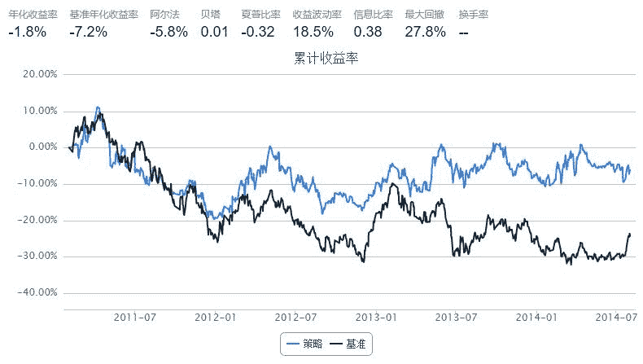
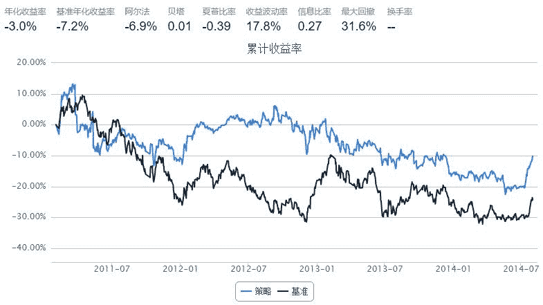

# 最经典的Momentum和Contrarian在中国市场的测试

> 来源：https://uqer.io/community/share/549b5bc8f9f06c4bb8863237


## Momentum

策略思路

+ Momentum：业绩好的股票会继续保持其上涨的势头，业绩差的股票会保持其下跌的势头

策略实现

+ Momentum：每次调仓将股票按照前一段时间的累计收益率排序并分组，买入历史累计收益 最高 的那一组

```py
start = datetime(2011, 1, 1)				# 回测起始时间
end   = datetime(2014, 8, 1)				# 回测结束时间
benchmark = 'HS300'							# 使用沪深 300 作为参考标准
universe = set_universe('SH50')         	# 股票池，上证50
capital_base = 100000                       # 起始资金
refresh_rate = 10
window = 20

def initialize(account):					# 初始化虚拟账户状态
    account.amount = 300
    account.universe = universe
    add_history('hist', window)

def handle_data(account, data):				# 每个交易日的买入卖出指令
    momentum = {'symbol':[], 'c_ret':[]}
    for stk in account.hist:
        if 'closePrice' in account.hist[stk].columns:
            momentum['symbol'].append(stk)
            momentum['c_ret'].append(account.hist[stk].iloc[window-1,:]['closePrice']/account.hist[stk].iloc[0,:]['closePrice'])
    momentum = pd.DataFrame(momentum).sort(columns='c_ret').reset_index()
    momentum = momentum[len(momentum)*4/5:len(momentum)]
    buylist = momentum['symbol'].tolist()
    for stk in account.position.stkpos:
        if (stk not in buylist) and (account.position.stkpos[stk]>0):
            order_to(stk, 0)
    for stk in buylist:
        if account.position.stkpos.get(stk, 0)==0:
            order_to(stk, account.amount)
```



## Contrarian

策略思路

+ Contrarian：股票在经过一段时间的上涨之后会出现回落，一段时间的下跌之后会出现反弹

策略实现

+ Contrarian：每次调仓将股票按照前一段时间的累计收益率排序并分组，买入历史累计收益 最低 的那一组

```py
start = datetime(2011, 1, 1)				# 回测起始时间
end   = datetime(2014, 8, 1)				# 回测结束时间
benchmark = 'HS300'							# 使用沪深 300 作为参考标准
universe = set_universe('SH50')         	# 股票池，上证50
capital_base = 100000                       # 起始资金
refresh_rate = 10
window = 20

def initialize(account):					# 初始化虚拟账户状态
    account.amount = 300
    account.universe = universe
    add_history('hist', window)

def handle_data(account, data):				# 每个交易日的买入卖出指令
    contrarian = {'symbol':[], 'c_ret':[]}
    for stk in account.hist:
        if 'closePrice' in account.hist[stk].columns:
            contrarian['symbol'].append(stk)
            contrarian['c_ret'].append(account.hist[stk].iloc[window-1,:]['closePrice']/account.hist[stk].iloc[0,:]['closePrice'])
    contrarian = pd.DataFrame(contrarian).sort(columns='c_ret').reset_index()
    contrarian = contrarian[:len(contrarian)/5]
    buylist = contrarian['symbol'].tolist()
    for stk in account.position.stkpos:
        if (stk not in buylist) and (account.position.stkpos[stk]>0):
            order_to(stk, 0)
    for stk in buylist:
        if account.position.stkpos.get(stk, 0)==0:
            order_to(stk, account.amount)
```



