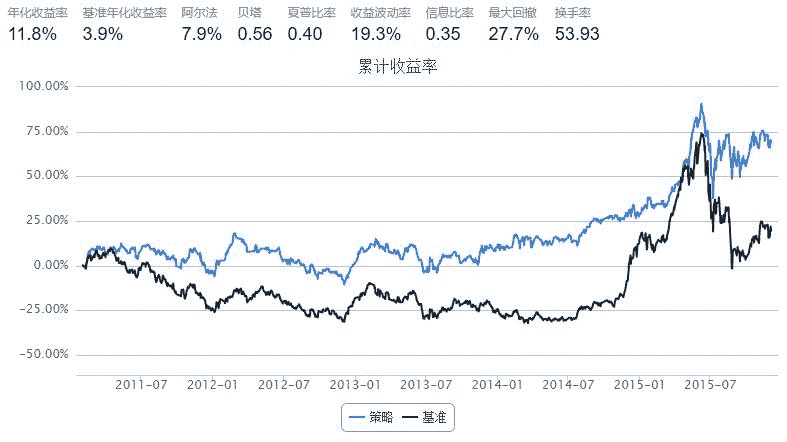
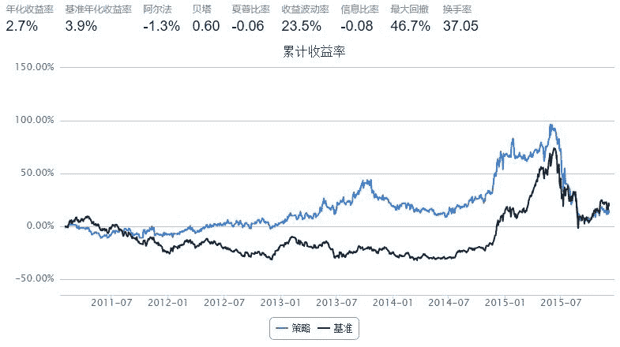

# 最经典的Momentum和Contrarian在中国市场的测试-yanheven改进

> 来源：https://uqer.io/community/share/5663f369f9f06c6c8a91b3af

## Momentum

策略思路

+ Momentum：业绩好的股票会继续保持其上涨的势头，业绩差的股票会保持其下跌的势头

策略实现

+ Momentum：每次调仓将股票按照前一段时间的累计收益率排序并分组，买入历史累计收益 最高 的那一组

```py
start = datetime(2011, 1, 1)				# 回测起始时间
end   = datetime(2015, 12, 5)				# 回测结束时间
benchmark = 'HS300'							# 使用沪深 300 作为参考标准
universe = set_universe('HS300')         	# 股票池，沪深 300
capital_base = 100000                       # 起始资金
refresh_rate = 10


def initialize(account):					# 初始化虚拟账户状态
    pass


def handle_data(account):				# 每个交易日的买入卖出指令
    history = account.get_attribute_history('closePrice', 20)
    momentum = []
    holding = account.valid_secpos
    for stk in history:
        if stk in account.universe:
            his = history[stk]
            change = his[-1] / his[0]
            momentum.append((stk, change))
    momentum = sorted(momentum, key=lambda x: x[1])
    momentum = momentum[:10]
    momentum_list = [i[0] for i in momentum]
    buy_list = set(momentum_list) - set(holding)
    sell_list = set(holding) - set(momentum_list)
    for i in buy_list:
        try:
            order_pct_to(i, 0.1)
        except Exception as e:
            log.warn(i + str(e))
    for i in sell_list:
        order_to(i, 0)
```



## Contrarian

策略思路

+ Contrarian：股票在经过一段时间的上涨之后会出现回落，一段时间的下跌之后会出现反弹

策略实现

+ Contrarian：每次调仓将股票按照前一段时间的累计收益率排序并分组，买入历史累计收益 最低 的那一组

```py
start = datetime(2011, 1, 1)				# 回测起始时间
end   = datetime(2015, 12, 5)				# 回测结束时间
benchmark = 'HS300'							# 使用沪深 300 作为参考标准
universe = set_universe('HS300')         	# 股票池，沪深 300
capital_base = 100000                       # 起始资金
refresh_rate = 10


def initialize(account):					# 初始化虚拟账户状态
    pass


def handle_data(account):				# 每个交易日的买入卖出指令
    history = account.get_attribute_history('closePrice', 20)
    momentum = []
    holding = account.valid_secpos
    for stk in history:
        if stk in account.universe:
            his = history[stk]
            change = his[-1] / his[0]
            momentum.append((stk, change))
    momentum = sorted(momentum, key=lambda x: x[1], reverse=True)
    # if momentum[-1][1] < 1:
    #     log.info(holding)
    #     for i in holding:
    #         order_to(i, 0)
    #     # return
    momentum = momentum[:10]
    momentum_list = [i[0] for i in momentum]
    buy_list = set(momentum_list) - set(holding)
    sell_list = set(holding) - set(momentum_list)
    for i in buy_list:
        try:
            order_pct_to(i, 0.1)
        except Exception as e:
            log.warn(i + str(e))
    for i in sell_list:
        order_to(i, 0)
```



