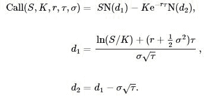
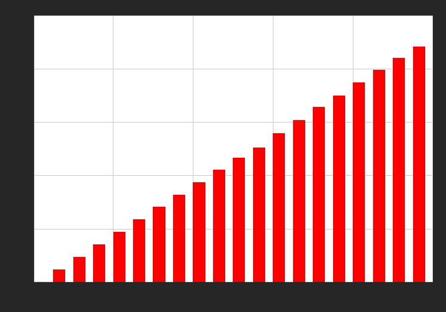
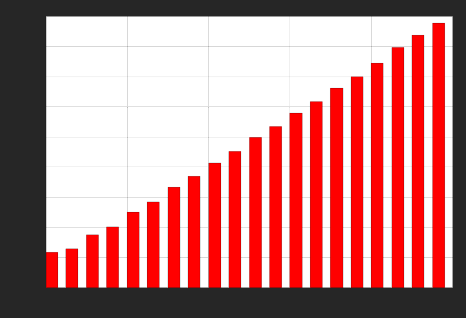
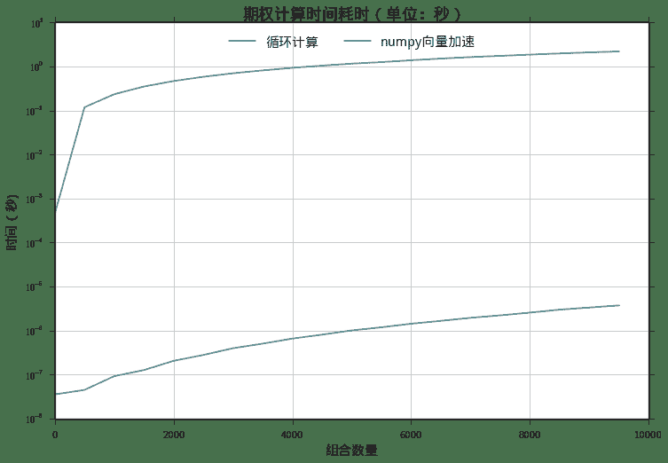
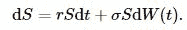
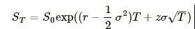
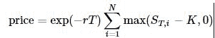
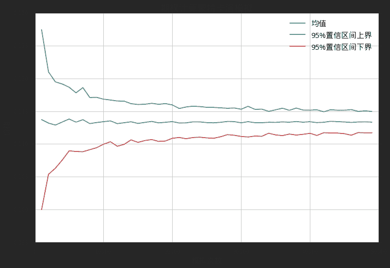
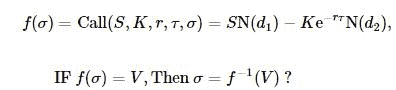



# 量化分析师的Python日记【第7天：Q Quant 之初出江湖】

> 来源：https://uqer.io/community/share/5514fc98f9f06c8f33904449

> 通过前几日的学习，我们已经熟悉了Python中一些常用数值计算库的用法。本篇中，作为Quant中的Q宗（[P Quant 和 Q Quant 到底哪个是未来？](http://www.zhihu.com/question/24820388))，我们将尝试把之前的介绍的工具串联起来，小试牛刀。

> 您将可以体验到：

> 1.  如何使用python内置的数学函数计算期权的价格；
> 2.  利用 `numpy` 加速数值计算；
> 3.  利用 `scipy` 进行仿真模拟；
> 4.  使用 `scipy` 求解器计算隐含波动率；

> 穿插着，我们也会使用`matplotlib`绘制精美的图标。

## 1. 关心的问题

我们想知道下面的一只期权的价格：

+ 当前价 `spot` : 2.45
+ 行权价 `strike `: 2.50
+ 到期期限 `maturity` : 0.25
+ 无风险利率 `r` : 0.05
+ 波动率 `vol` : 0.25

关于这样的简单欧式期权的定价，有经典的Black - Scholes [1] 公式：



其中`S`为标的价格，`K`为执行价格，`r`为无风险利率，`τ=T−t`为剩余到期时间。 `N(x)`为标准正态分布的累积概率密度函数。`Call(S,K,r,τ,σ)`为看涨期权的价格。

```py
# 参数
spot = 2.45
strike = 2.50
maturity = 0.25
r = 0.05
vol = 0.25
```

观察上面的公式，需要使用一些数学函数，我们把它分为两部分：

+ `log`,`sqrt`,`exp`，这三个函数我们可以从标准库`math`中找到
+ 标准正态分布的累计概率密度函数，我们使用`scipy`库中的`stats.norm.cdf`函数

```py
# 基于Black - Scholes 公式的期权定价公式
from math import log, sqrt, exp
from scipy.stats import norm

def call_option_pricer(spot, strike, maturity, r, vol):
    
    d1 = (log(spot/strike) + (r + 0.5 * vol *vol) * maturity) / vol / sqrt(maturity)
    d2 = d1 - vol * sqrt(maturity)
    
    price = spot * norm.cdf(d1) - strike * exp(-r*maturity) * norm.cdf(d2)
    return price
```

我们可以使用这个函数计算我们关注期权的结果：

```py
print '期权价格 : %.4f' % call_option_pricer(spot, strike, maturity, r, vol)

期权价格 : 0.1133
```

## 2. 使用numpy加速批量计算

大部分的时候，我们不止关心一个期权的价格，而是关心一个组合（成千上万）的期权。我们想知道， 随着期权组合数量的增长，我们计算时间的增长会有多块？

### 2.1 使用循环的方式

```py
import time
import numpy as np

portfolioSize = range(1, 10000, 500)
timeSpent = []

for size in portfolioSize:
    now = time.time()
    strikes = np.linspace(2.0,3.0,size)
    for i in range(size):
        res = call_option_pricer(spot, strikes[i], maturity, r, vol)
    timeSpent.append(time.time() - now)
```

从下图中可以看出，计算时间的增长可以说是随着组合规模的增长线性上升。

```py
from matplotlib import pylab
import seaborn as sns
font.set_size(15)
sns.set(style="ticks")
pylab.figure(figsize = (12,8))
pylab.bar(portfolioSize, timeSpent, color = 'r', width =300)
pylab.grid(True)
pylab.title(u'期权计算时间耗时（单位：秒）', fontproperties = font, fontsize = 18)
pylab.ylabel(u'时间（s)', fontproperties = font, fontsize = 15)
pylab.xlabel(u'组合数量', fontproperties = font, fontsize = 15)

<matplotlib.text.Text at 0xdbad950>
```



### 2.2 使用`numpy`向量计算

`numpy`的内置数学函数可以天然的运用于向量：

```py
sample = np.linspace(1.0,100.0,5)
np.exp(sample)

array([  2.71828183e+00,   1.52434373e+11,   8.54813429e+21,
         4.79357761e+32,   2.68811714e+43])
```

利用 `numpy` 的数学函数，我们可以重写原先的计算公式 `call_option_pricer`，使得它接受向量参数。

```py
# 使用numpy的向量函数重写Black - Scholes公式
def call_option_pricer_nunmpy(spot, strike, maturity, r, vol):
    
    d1 = (np.log(spot/strike) + (r + 0.5 * vol *vol) * maturity) / vol / np.sqrt(maturity)
    d2 = d1 - vol * np.sqrt(maturity)
    
    price = spot * norm.cdf(d1) - strike * np.exp(-r*maturity) * norm.cdf(d2)
    return price
```

```py
timeSpentNumpy = []
for size in portfolioSize:
    now = time.time()
    strikes = np.linspace(2.0,3.0, size)
    res = call_option_pricer_nunmpy(spot, strikes, maturity, r, vol)
    timeSpentNumpy.append(time.time() - now)
```

再观察一下计算耗时，虽然时间仍然是随着规模的增长线性上升，但是增长的速度要慢许多：

```py
pylab.figure(figsize = (12,8))
pylab.bar(portfolioSize, timeSpentNumpy, color = 'r', width = 300)
pylab.grid(True)
pylab.title(u'期权计算时间耗时（单位：秒）- numpy加速版', fontproperties = font, fontsize = 18)
pylab.ylabel(u'时间（s)', fontproperties = font, fontsize = 15)
pylab.xlabel(u'组合数量', fontproperties = font, fontsize = 15)

<matplotlib.text.Text at 0xe0ba090>
```



让我们把两次计算时间进行比对，更清楚的了解 `numpy` 计算效率的提升！

```py
fig = pylab.figure(figsize = (12,8))
ax = fig.gca()
pylab.plot(portfolioSize, np.log10(timeSpent), portfolioSize, np.log(timeSpentNumpy))
pylab.grid(True)
from matplotlib.ticker import FuncFormatter
def millions(x, pos):
    'The two args are the value and tick position'
    return '$10^{%.0f}$' % (x)
formatter = FuncFormatter(millions)
ax.yaxis.set_major_formatter(formatter)
pylab.title(u'期权计算时间耗时（单位：秒）', fontproperties = font, fontsize = 18)
pylab.legend([u'循环计算', u'numpy向量加速'], prop = font, loc = 'upper center', ncol = 2)
pylab.ylabel(u'时间（秒)', fontproperties = font, fontsize = 15)
pylab.xlabel(u'组合数量', fontproperties = font, fontsize = 15)

<matplotlib.text.Text at 0xe0b6390>
```



## 3. 使用`scipy`做仿真计算

期权价格的计算方法中有一类称为 蒙特卡洛 方法。这是利用随机抽样的方法，模拟标的股票价格随机游走，计算期权价格（未来的期望）。假设股票价格满足以下的随机游走：



仿真的方法可以模拟到期日的股票价格



这里的`z`是一个符合标准正态分布的随机数。这样我们可以计算最后的期权价格：



标准正态分布的随机数获取，可以方便的求助于 `scipy` 库：

```py
import scipy
scipy.random.randn(10)

array([ 0.36802702,  1.09560268, -1.0235275 ,  0.15722882,  0.83718188,
       -0.27193135, -0.03485659,  1.02705248,  0.69479874, -0.35967107])
```

```py
pylab.figure(figsize = (12,8))
randomSeries = scipy.random.randn(1000)
pylab.plot(randomSeries)
print u'均  值：%.4f' % randomSeries.mean()
print u'标准差：%.4f' % randomSeries.std()

均  值：0.0336
标准差：0.9689
```


结合 `scipy` `numpy` 我们可以定义基于蒙特卡洛的期权定价算法。

```py
# 期权计算的蒙特卡洛方法
def call_option_pricer_monte_carlo(spot, strike, maturity, r, vol, numOfPath = 5000):
    randomSeries = scipy.random.randn(numOfPath)
    s_t = spot * np.exp((r - 0.5 * vol * vol) * maturity + randomSeries * vol * sqrt(maturity))
    sumValue = np.maximum(s_t - strike, 0.0).sum()
    price = exp(-r*maturity) * sumValue / numOfPath
    return price
```

```py
print '期权价格（蒙特卡洛） : %.4f' % call_option_pricer_monte_carlo(spot, strike, maturity, r, vol)

期权价格（蒙特卡洛） : 0.1102
```

我们这里实验从1000次模拟到50000次模拟的结果，每次同样次数的模拟运行100遍。

```py
pathScenario = range(1000, 50000, 1000)
numberOfTrials = 100

confidenceIntervalUpper = []
confidenceIntervalLower = []
means = []

for scenario in pathScenario:
    res = np.zeros(numberOfTrials)
    for i in range(numberOfTrials):
        res[i] = call_option_pricer_monte_carlo(spot, strike, maturity, r, vol, numOfPath = scenario)
    means.append(res.mean())
    confidenceIntervalUpper.append(res.mean() + 1.96*res.std())
    confidenceIntervalLower.append(res.mean() - 1.96*res.std())
```

蒙特卡洛方法会有收敛速度的考量。这里我们可以看到随着模拟次数的上升，仿真结果的置信区间也在逐渐收敛。

```py
pylab.figure(figsize = (12,8))
tabel = np.array([means,confidenceIntervalUpper,confidenceIntervalLower]).T
pylab.plot(pathScenario, tabel)
pylab.title(u'期权计算蒙特卡洛模拟', fontproperties = font, fontsize = 18)
pylab.legend([u'均值', u'95%置信区间上界', u'95%置信区间下界'], prop = font)
pylab.ylabel(u'价格', fontproperties = font, fontsize = 15)
pylab.xlabel(u'模拟次数', fontproperties = font, fontsize = 15)
pylab.grid(True)
```



## 4. 计算隐含波动率

作为BSM期权定价最重要的参数，波动率`σ`是标的资产本身的波动率。是我们更关心的是当时的报价所反映的市场对波动率的估计，这个估计的波动率称为隐含波动率（Implied Volatility）。这里的过程实际上是在BSM公式中，假设另外4个参数确定，期权价格已知，反解`σ`:



由于对于欧式看涨期权而言，其价格为对应波动率的单调递增函数，所以这个求解过程是稳定可行的。一般来说我们可以类似于试错法来实现。在`scipy`中已经有很多高效的算法可以为我们所用，例如Brent算法:

```py
# 目标函数，目标价格由target确定
class cost_function:
    def __init__(self, target):
        self.targetValue = target
    
    def __call__(self, x):
        return call_option_pricer(spot, strike, maturity, r, x) - self.targetValue

# 假设我们使用vol初值作为目标
target = call_option_pricer(spot, strike, maturity, r, vol)
cost_sampel = cost_function(target)

# 使用Brent算法求解
impliedVol = brentq(cost_sampel, 0.01, 0.5)

print u'真实波动率： %.2f' % (vol*100,) + '%'
print u'隐含波动率： %.2f' % (impliedVol*100,) + '%'

真实波动率： 25.00%
隐含波动率： 25.00%
```

