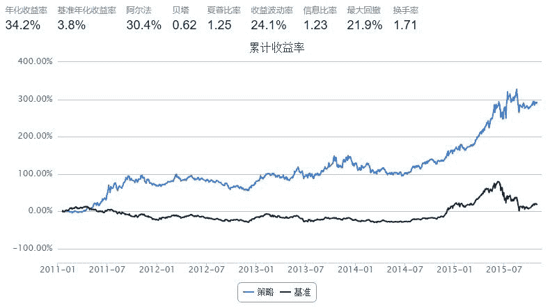

# ［策略］基于胜率的趋势交易策略

> 来源：https://uqer.io/community/share/565bbfa4f9f06c6c8a91ae7a

## 策略说明

简单构建了一个基于胜率的趋势交易策略。认为过去一段时间（N天）内胜率较高、信息比率较高的股票会在紧随其后的几天有较好的表现

1）先根据胜率要求筛选出过去N天胜率高的股票作为预选股票（benchmark可以是定义的确定阈值，或者是某个指数相应的收益率），用aprior算法进行快速筛选。第i只股票胜率的计算方式如下:

```
winRate(i) = sum([sign(ret(i,t)-ret(bm,t))==1]/N)|t~(t-N,t)
    ＊ret(i,t): i股票在第t天的收益率；
    ＊ret（bm,t）: benchmark在第t天的收益率；
```

2）从筛选出的股票中选择过去N天信息比率（收益率／波动率）高的部分股票构建备选投资组合；
3）依据被选投资组合做买入操作，使用可用资金的50%～70%；
4）设定股票止损位在收益下跌至0.95，止损时将仓位调整至原仓位的40%～60%；
5）调仓频率为5天，股票池为沪深300。 

```py
import numpy as np
from CAL.PyCAL import *
################################################################################
#    Back Test Functions
################################################################################
def initialize(account):                   # 初始化虚拟账户状态
    pass
    
####init the univese of the choosen stock
def universeInit():
    stockComponent = DataAPI.MktTickRTSnapshotIndexGet(securityID=u"000300.XSHG",field=u"lastPrice,shortNM")
    stockCount = len(stockComponent)
    stockTicker = stockComponent['ticker']
    stockExchgID = stockComponent['exchangeCD']
    stockID = []
    for index in range(stockCount):
        stockID.append(stockTicker[index] + '.' + stockExchgID[index])
    return stockID

####deal with the trading signals
def handle_data(account):                  # 每个交易日的买入卖出指令
    ####Presettings
    histLength = 10
    stockDataThres = 0
    
    
    ####Dictionary of the return Rate 
    closePrice = account.get_attribute_history('closePrice',histLength)
    retRate = {}
    for index in account.universe:
        retRate[index] = ((closePrice[index][1:] - closePrice[index][:-1])/closePrice[index][:-1]).tolist()

    
    ###ret list of the benchmark
    calendar = Calendar('China.SSE')
    startDate = calendar.advanceDate(account.current_date,'-'+str(histLength)+'B').toDateTime()
    benchmark = DataAPI.MktIdxdGet(ticker = "000300",
                field = "closeIndex",
                beginDate = startDate,
                endDate = account.current_date,pandas = '1')
    bmClose = benchmark['closeIndex'].tolist()
    bmRet = []
    for index in range(len(bmClose)-1):
        bmRet.append((bmClose[1:][index]-bmClose[:-1][index])/bmClose[:-1][index])
    
    ####List of transactions
    transactions = []
    for index in range(histLength-1):
        tmpt = []
        for stock in account.universe:
            if retRate[stock][index] > stockDataThres:
            # if retRate[stock][index] > bmRet[index]:
                tmpt.append(stock)
        transactions.append(tmpt)
        
    ####List of hot stocks
    hotStock = []
    hotStockDict,hotStockList = apriori(transactions,0.95)
    for index in hotStockList:
        for stock in index:
            if stock not in hotStock:
                hotStock.append(stock)
    
    ####List of the portfolio
    retRate = {}
    fluctRate = {}
    sharpRate = {}
    for index in hotStock:
        retRate[index] = ((closePrice[index][-1] - closePrice[index][0])/closePrice[index][0])
        fluctRate[index] = np.std(closePrice[index])  
        sharpRate[index] = retRate[index]/fluctRate[index]    
    portfolio = [index[0] for index in sorted(sharpRate.items(),key = lambda sharpRate:sharpRate[1])[-len(sharpRate)/2:]]
    
    
    ####Stop loss at -0.05
    validSecHist = account.get_attribute_history('closePrice',2)
    for index in account.valid_secpos:
        if (validSecHist[index][-1] - validSecHist[index][0])/validSecHist[index][0] < -0.05:
            order_to(index,0.45*account.valid_secpos[index])
    
    ####Buy portfolio
    for index in portfolio:
        amount = 0.65*account.cash/len(hotStock)/account.referencePrice[index]
        order(index,amount)
    return


########################################################################################
#    Aprior algorithm
########################################################################################
def elementsDet(datasets):
    if type(datasets) == list:
        elements = {}
        for index in datasets:
            for index1 in index:
                if elements.has_key(index1) == False:
                    elements[index1] = 1
                else:
                    elements[index1] += 1
        return elements
    if type(datasets) == dict:
        elements = {}
        for index in datasets:
            if type(index) == tuple:
                index = list(index)
                for index1 in index:
                    if elements.has_key(index1) == False:
                        elements[index1] = 0
            else:
                elements[index] = 0
        return elements
    pass

def checkAssociation(subset,objset):
    for index in subset:
        if index not in objset:
            return False
    return True
    pass

def support(subset,datasets):
    count = 0
    for transaction in datasets:
        if checkAssociation(subset,transaction) == True:
            count += 1
    return 1.0*count/len(datasets)
    pass

def apriori(datasets,minsup):
    candidateIterator = []
    electIterator = []
    length = len(datasets)
    ##init part 
    #the candidate
    elements = elementsDet(datasets)
    candidate = {}
    for index in elements:
            candidate[index] = 1.0*elements[index]/length
    candidateIterator.append(candidate)
    #the elect
    elect = {}
    for index in candidate:
        if candidate[index] > minsup:
            elect[index] = candidate[index]
    electIterator.append(elect)

    ##the update part
    itera = 1
    while(len(electIterator[-1]) != 0):

        candidateOld = candidateIterator[-1]
        electOld = electIterator[-1]
        elementsOld = elementsDet(electOld)
        # print elementsOld
        candidate = {}
        
        ##the candidate
        for index in electOld:
            for index1 in elementsOld:
                if type(index) != list and type(index) != tuple:
                    if index1 != index:
                        tmp = []
                        tmp.append(index)
                        tmp.append(index1)
                        tmp.sort()
                        if candidate.has_key(tuple(tmp)) == False:
                            candidate[tuple(tmp)] = 0

                if type(index) == tuple:
                    tmp = list(index)
                    if tmp.count(index1) == False:
                        tmp1 = tmp
                        tmp1.append(index1)
                        tmp1.sort()
                        if candidate.has_key(tuple(tmp1)) == False:
                            candidate[tuple(tmp1)] = 0
        candidateIterator.append(candidate)

        ##the elect 
        elect = {}
        for index in candidate:
            candidate[index] = support(index,datasets)

        for index in candidate:
            if candidate[index] > minsup:
                elect[index] = candidate[index]
        electIterator.append(elect)

        # print 'iteartion ' + str(itera) + ' is finished!'
        itera += 1

    ##the elected frequency sets dictionary: the value is the key's support
    electedDict = {}
    for index in electIterator:
        for index1 in index:
            electedDict[index1] = index[index1]

    ##the elected frequency sets lists
    electedList = []
    for index in electIterator:
        tmp = []
        for index1 in index:
            if type(index1) == tuple:
                tmp1 = []
                for ele in index1:
                    tmp1.append(ele)
                tmp.append(tmp1)
            else:
                tmp.append([str(index1)])
        tmp.sort()
        for index1 in tmp:
            electedList.append(index1)

    return electedDict,electedList


################################################################################
#    Back Test Presetting
################################################################################
start = '2011-01-01'                       # 回测起始时间
end = '2015-11-01'                         # 回测结束时间
benchmark = 'HS300'                        # 策略参考标准
universe = set_universe('HS300')
# universe = universeInit()                # 证券池，支持股票和基金
capital_base = 100000                      # 起始资金
freq = 'd'                                 # 策略类型，'d'表示日间策略使用日线回测，'m'表示日内策略使用分钟线回测
refresh_rate = 5                           # 调仓频率，表示执行handle_data的时间间隔，若freq = 'd'时间间隔的单位为交易日，若freq = 'm'时间间隔为分钟
```



## 策略表现

+ 策略能产生一定的alpha；
+ 策略表现与起点强相关，sharpRatio不稳定；
+ 策略表现会受到自身参数设定的影响，例如胜率选择周期、筛选阈值、调仓频率、建仓头寸、止损仓位等，需要依据表现对其进行优化；
+ 策略在2011年4月至12月、2015年6月到11月有相对好的表现，可见其相对较适用于趋势下跌的市场环境。 

## 问题探讨

因子选股模型的流程应该是怎样的？

小编认为构建因子选股的模型需要有如下过程：

1.  大类配置：根据宏观判断市场，进行市场判断（根据不同市场选择不同因子）、资产配置（不同风险性证券的配比选择➡️不同热度的行业配比选择）和策略选择（市场中性、单边做多等）；
2.  选股－alpha端：对选股因子进行有效性分析，包括单因子的预测性、因子间相关性，构建多因子模型使得选股有尽可能高的alpha；
3.  选股－风险端：对alpha端的多因子模型进行风险评估，根据风险因子优化模型，使模型尽可能达到有效边界；
4.  择时－买卖时点：对根据因子模型选出的股票进行择时分析，进一步筛选投资组合中的股票及判断作何操作；

因子选股中比较basic的问题，欢迎社区的小伙伴们发表看法、评论和拍醒~ 

