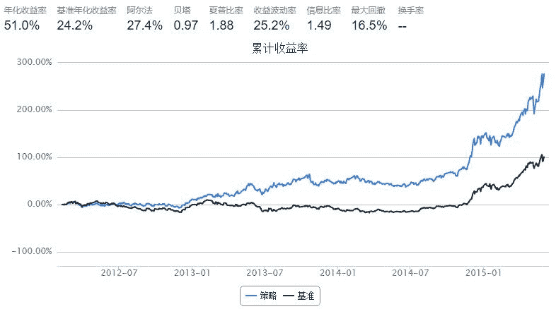
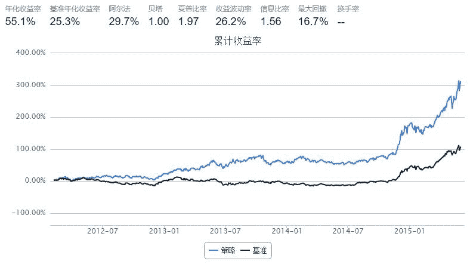

# [量化策略］`Sharpe_Momentum` (夏普率动量策略)

> 来源：https://uqer.io/community/share/5656bd13f9f06c4446b48875

## 1. Introduction

众所周知，动量策略是量化选股中非常经典的模型。

思路是：从股票池中选取过去一段时间表现最好（收益率最高）的部分股票，等权重买入，到下一个调仓日清仓。然后周而复始。

与之相应的还有一个叫做“反转策略”，即认为投资者有抄底心态，过去表现最不好的股票将否极泰来。 

## 2. Parameters

这类模型有以下几个参数可以调整：

1）换仓频率  

2）过去表现的周期设定（即设定之前的多少天作为衡量基准） 

3）股票池的选取：全部A股？或是弹性更高的中证500？或是流动性最好的上证50？

4）按照过去表现排序后，选择其中哪些股票？（Top 20%？Top 10%？或是中间的一部分？）

可以说，这类模型思路简单，逻辑明晰，参数变量少，是很棒的入门级策略 

## 3. Development

无论动量策略或是反转策略，都只考虑收益的变化，而对该收益率所承担的风险不闻不问。

笔者从夏普率的维度去看待动量策略，直觉上认为前一段时间夏普率高的股票将延续这一势头。（此处不考虑无风险利率）

PS：关于夏普率如何计算，可参考笔者的”［量化基础］如何计算夏普率“一文 

```py
import numpy as np
import pandas as pd

start = '2012-01-01'
end   = '2015-06-01'
benchmark = 'HS300'
universe = set_universe('HS300')   
capital_base = 10000000
refresh_rate = 10

def initialize(account):
    pass

def handle_data(account):
    window = 20  #回望表现周期
    history = account.get_attribute_history('closePrice', window+1) #多取一天收盘价，为了计算window个收益率
    history = pd.DataFrame(history)
    sharpe = {'symbol':[], 'ratio':[]} #设置一个字典
    for stk in account.universe:
        sharpe['symbol'].append(stk)  #字典中的symbol段 储存股票代码
        ret = history[stk].pct_change() #之前讲history转化成DataFrame结构，方便计算
        ratio = ret.mean() / ret.std() #夏普率简化为平均收益／收益波动率，也不年化了，反正排序后效果是一致的
        sharpe['ratio'].append(ratio)
        
        
    # 按照过去window日收益率排序，并且选择前20%的股票作为买入候选
    sharpe = pd.DataFrame(sharpe).sort(columns = 'ratio').reset_index()
    sharpe = sharpe[len(sharpe)*4/5:len(sharpe)]
    buylist = sharpe['symbol'].tolist()
    for stk in account.valid_secpos:
        if stk not in buylist:
            order_to(stk, 0)
   
    # 等权重买入所选股票
    portfolio_value = account.referencePortfolioValue
    
    filteredBuylist = []
    for stk in buylist:
        if not np.isnan(account.referencePrice[stk]):
            filteredBuylist.append(stk)
            
    #print account.current_date, filteredBuylist
    
    for stk in filteredBuylist:
        if stk not in account.valid_secpos:
            order_to(stk, int(portfolio_value / account.referencePrice[stk] / 100.0 / len(buylist))*100)
```



## 4. Comparison

同样的设定我们与下面的动量策略做比较 

```py
import numpy as np
import pandas as pd

start = '2012-01-01'
end   = '2015-06-01'
benchmark = 'HS300'
universe = set_universe('HS300')   # 股票池为沪深300
capital_base = 10000000
refresh_rate = 10

def initialize(account):
    pass

def handle_data(account):
    history = account.get_attribute_history('closePrice', 20)
    momentum = {'symbol':[], 'c_ret':[]}
    for stk in account.universe:
        momentum['symbol'].append(stk)
        momentum['c_ret'].append(history[stk][-1]/history[stk][0])
        
    # 按照过去20日收益率排序，并且选择前20%的股票作为买入候选
    momentum = pd.DataFrame(momentum).sort(columns='c_ret').reset_index()
    momentum = momentum[len(momentum)*4/5:len(momentum)]   # 选择
    buylist = momentum['symbol'].tolist()
    for stk in account.valid_secpos:
        if stk not in buylist:
            order_to(stk, 0)
   
    # 等权重买入所选股票
    portfolio_value = account.referencePortfolioValue
    
    filteredBuylist = []
    for stk in buylist:
        if not np.isnan(account.referencePrice[stk]):
            filteredBuylist.append(stk)
            
    #print account.current_date, filteredBuylist
    
    for stk in filteredBuylist:
        if stk not in account.valid_secpos:
            order_to(stk, int(portfolio_value / account.referencePrice[stk] / 100.0 / len(buylist))*100)
```



## 5. Futhur Discussion

无论是夏普率动量策略，或是收益率动量策略，表现看上去都是那么完美

但是！

但是！

但是！

一旦把2015年6月开始股灾放进回测区间，那么效果瞬间大打折扣

该策略还有许多值得改进之处，各位朋友发挥脑力吧。

疑问：比较两个策略，回测周期一致，基准一致，那么为什么基准年化收益率会不同？ 

