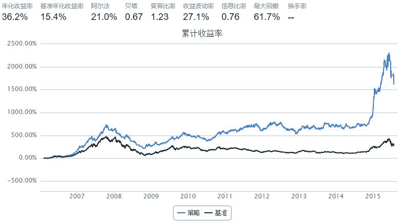

# 策略探讨（更新）：价量结合+动量反转

> 来源：https://uqer.io/community/share/55b6f4d2f9f06c91fb18c5cd

前篇简介:

+ 在前一篇文章中，对策略理念和流程大致走了一遍
+ 对quartz中的参数优化过程以及简单策略分析也做了简单示例

仍存在的问题:

+ 前一篇中代码细节问题修正
+ 停牌数据问题以及其他小细节
+ 收益波动性太大、熊市不抗跌

下面就结合实际情况，对上述问题进行逐个分析

+ 没有看前篇的，点此链接https://uqer.io/community/share/55b1f886f9f06c91f918c5d1

```py
# step1：前篇代码细节修正
# 如前篇描述，（-inf，negative2,negative1,postive1,positive2,inf）将整个数轴分成了5个区间段，从左到右，每个区间段分别代表（long,short,nothing,long,short）操作
# 而在前篇的代码中忽略掉了小细节，将修正后的部分代码简单展示如下：
    signal = closeprice[stk][-1]/wp - 1
    if stk in account.valid_secpos and (signal > positive2 or negative2 < signal < negative1):
        selllist.append(stk)
    elif stk not in account.valid_secpos and (positive2 > signal > positive1 or signal < negative2):
        buylist.append(stk)
```

step2：数据质量问题再分析

+ 首先分析一下数据细节问题，策略中唯一要计算的指标是加权平均价，要用到过去一段时间的收盘价和成交量，倘若过去时间里有停牌呢？
+ 之前的简单处理是，若全部停牌会导致wp计算出来为nan，然后把它舍弃掉，但是倘若过去所用的时间段内刚巧只有一天是没停牌的呢？
+ 查看DataAPI原始数据发现，停牌时，收盘价是filldown处理的，当日成交量是为0的
+ 所以要保证所计算出来的加权平均价wp的相对合理性，必须要保证所计算的过去数据的有效性，这里的处理是：若停牌天数超过window/2时，则不进行任何操作
​
```py
# step2对应的代码修改部分（非运行代码，只做展示说明，下同）
....
for stk in account.universe:
    if sum(volumn[stk] > 0) <= window/2: continue
        ....
```

step3：收益波动性太大

+ 如前篇描述，（-inf，negative2,negative1,postive1,positive2,inf）将整个数轴分成了5个区间段，从左到右，每个区间段分别代表（long,short,nothing,long,short）操作
+ 结合实际考虑，股市里目前没有实际的short操作，回测的策略只是LongOnly，对应的short信号只是卖掉持有的股票，所以要结合实际对信号做一些更改
+ 整体思路是：买入的信号不变，short的信号是卖掉手中股票的信号，而并不是开空仓的信号，因为即使预测对了下跌也是赚不到钱的
+ 改进点是： negative1变为0

```py
# step3：对应要修改的代码
negative1 = 0
```

step4：熊市不抗跌

+ 遇到熊市时，可以考虑设置止损线，虽然不能做空，但是降低仓位可以逃过一部分损失
+ 止损条件有两点考虑：一是现有组合市值短期亏损比较大就止损；二是大盘过去一段时间里下跌很多，要止损（近似于宏观择时操作）
+ 止损条件1：当沪深300在过去3周累计下跌超过10%时，下一期不持仓
+ 止损条件2：当组合净值在过去3周累计缩水超过10%或者在过去一周累计缩水5%，下一期不持仓

```py
from datetime import datetime, timedelta
import numpy as np

start = '2006-01-01'                       # 回测起始时间
# end = '2015-01-01'
today = datetime.today()
delta = timedelta(days = -1)
end = (today+delta).strftime('%Y-%m-%d')
benchmark = 'HS300'                        # 策略参考标准
universe = set_universe('SH50')  # 证券池，回测支持股票和基金
capital_base = 10000000                     # 起始资金
refresh_rate = 5                          # 调仓频率，即每 refresh_rate 个交易日执行一次 handle_data() 函数

window = 20   # 取过去行情数据
positive2 = 0.1   # 信号突破比例阈值
negative2 = -0.1
positive1 = 0.01
negative1 = 0
stoploss_percent = 0


def initialize(account):                   # 初始化虚拟账户状态
    account.portfoliovalue = []  #记录组合市值

def handle_data(account):                  # 每个交易日的买入卖出指令
    
    # 止损判断
    hs300 = account.get_symbol_history('benchmark',window)['closeIndex']    
    account.portfoliovalue.append(account.referencePortfolioValue)  
    if hs300[-1]/hs300[-16] - 1 < -0.1:  # 止损条件1
        for stk in account.valid_secpos:
            order_to(stk,0)
        return
    if len(account.portfoliovalue) < 4:  # 止损条件2
        pass
    elif account.portfoliovalue[-1]/account.portfoliovalue[-4] - 1 <= -0.1 or account.portfoliovalue[-1]/account.portfoliovalue[-2] - 1 <= -0.05:
        for stk in account.valid_secpos:   
            order_to(stk,0)
        return
    
    # 取行情
    closeprice = account.get_attribute_history('closePrice',window)
    volumn = account.get_attribute_history('turnoverVol',window)
    reference_p = account.referencePrice    # 参考价
    cash = account.cash   # 剩余现金
    
    # 计算买入卖出
    buylist = []
    selllist = []
    for stk in account.universe:
        if sum(volumn[stk] > 0) <= window/2: continue
        wp = np.dot(closeprice[stk], volumn[stk]/sum(volumn[stk]))   #  成交量加权价
        signal = closeprice[stk][-1]/wp - 1
        if stk in account.valid_secpos and (signal > positive2 or negative2 < signal < negative1):
            selllist.append(stk)
        elif positive2 > signal > positive1 or signal < negative2:
            buylist.append(stk)
            
    # 卖出下单
    for stk in selllist:
        order_to(stk,0)
        cash = cash + account.valid_secpos[stk] * reference_p[stk]
    
    # 买单分解为需要新买的+已有持仓的
    holds = [stk for stk in account.valid_secpos if stk not in selllist]
    new_buy = [stk for stk in buylist if stk not in holds]
    
    # 买入操作
    for stk in new_buy:
        order(stk,int(cash/len(new_buy)/reference_p[stk]))
```



+ 可以看到，加入简单的止损后，策略效果有明显改善，尤其是在07年~08年熊市阶段，躲过了很多下跌
+ 同时也看到，在最近的大跌行情中表现一般，主要原因是周度策略，一周换一次仓，周中的大跌是难以避免的，一个好的做法是考虑周中止损，这一点可以自行尝试
+ 除了直接的止损外，还可以考虑加入择时，比如预测涨就全仓，预测跌就1/3仓位等，上面展示的只是最简单的想法，更细致的东西还有待去研究

