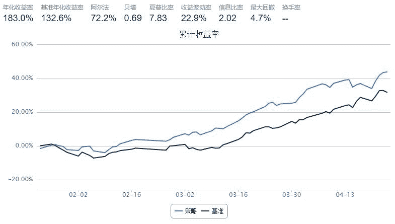

# 轻松跑赢大盘 - 主题Momentum策略

> 来源：https://uqer.io/community/share/551d02c2f9f06c8f33904502

## 策略原理

在我们的观点中，Momentum这样的思路在主题中也有体现, 业绩好的主题会继续保持其上涨的势头, 本策略测试了这个思路, 具体实现方式为: 按20个交易日为一个调仓周期, 在调仓日卖出以前所有持仓, 买入选出的最好的20个主题中最好的5只股票总共100只股票
本策略的回测参数如下：

+ 起始日期： 2014年12月24日

+ 结束日期： 2015年4月24日

+ 股票池： 3月25日所有活跃主题关联的所有股票

+ 业绩基准： 沪深300

+ 起始资金： 1000万元

+ 调仓周期： 20个交易日

本策略使用的主要数据API有：

+ `DataAPI.ActiveThemesGet` 获取某天活跃的主题数据，输入一个日期，获取在该日期活跃的主题。

+ `DataAPI.TickersByThemesGet` 获取主题关联的证券

还有很多可以根据基本面调优的办法, 读者可以自己尝试

```py
from datetime import datetime,timedelta
from heapq import nlargest

#ticker转换为id
tk2id=lambda x: x+'.XSHG' if x[0]=='6'else x+'.XSHE' 

#获取3月25日活跃主题对应的所有股票
themeList = DataAPI.ActiveThemesGet('20150325').themeID.tolist()
sa = []
for t in themeList:
    sa += DataAPI.TickersByThemesGet(themeID=str(t)).ticker.tolist()
sa = list(set(sa))

#以下为回测参数
start = '2014-12-24'
end = '2015-04-24'
benchmark = 'HS300'
universe = map(tk2id, sa)
capital_base = 10000000
refresh_rate = 20
longest_history = 20

def initialize(account):
    pass

def handle_data(account):
    # 获取调仓日活跃主题相关股票tickers
    themeList = DataAPI.ActiveThemesGet(account.current_date.strftime('%Y%m%d')).themeID.tolist()        
    ta = {}
    for t in themeList:
        ta[t] = DataAPI.TickersByThemesGet(themeID=str(t)).ticker.tolist() 
    
    # 获取过去20个交易日的收盘价
    p = account.get_attribute_history('closePrice', 20)
    
    #找调仓日内按照等权return加和最大的20个主题
    sa = {}
    for stock in account.universe:
        sa[stock] = p[stock][-1] / p[stock][0] -1 #从调仓日之前20天的return

    tb = {}
    for t in ta:
        tb[t] = sum(sa.get(s,0) for s in ta[t])
    tb = nlargest(20,tb,tb.get)
    
    # 找这最好的20个主题中最好的5只股票
    sc = []
    for t in tb:
        sc += nlargest(5,[s for s in map(tk2id,ta[t]) if s in sa],sa.get)
    sc = list(set(sc))
    
    for stock in account.valid_secpos: # 卖出目前所有持有的股票
        order_to(stock, 0)

    for stock in sc: # 买进新选出的100只股票
        order(stock, account.referencePortfolioValue / len(sc) / p[stock][-1])
```



