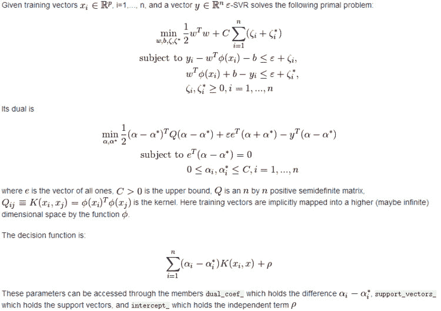
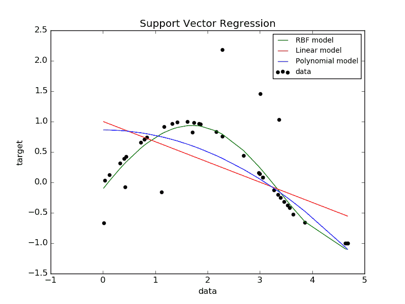
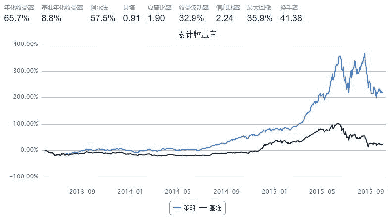

# 5.3 SVR · 使用SVR预测股票开盘价 v1.0

> 来源：https://uqer.io/community/share/5646f635f9f06c4446b48126

## 一、策略概述

本策略主旨思想是利用SVR建立的模型对股票每日开盘价进行回归拟合,即把前一日的 `['openPrice','highestPrice','lowestPrice','closePrice','turnoverVol','turnoverValue'] `作为当日 `'openPrice'` 的自变量，当日 `'openPrice'` 作为因变量。SVR的实现使用第三方库scikit-learn。

## 二、SVR

[SVR详情](http://scikit-learn.org/stable/modules/svm.html#svr)

SVR参考文献见下方



### SVM-Regression

The method of Support Vector Classification can be extended to solve regression problems. This method is called Support Vector Regression.

The model produced by support vector classification (as described above) depends only on a subset of the training data, because the cost function for building the model does not care about training points that lie beyond the margin. Analogously, the model produced by Support Vector Regression depends only on a subset of the training data, because the cost function for building the model ignores any training data close to the model prediction.

There are three different implementations of Support Vector Regression: SVR, NuSVR and LinearSVR. LinearSVR provides a faster implementation than SVR but only considers linear kernels, while NuSVR implements a slightly different formulation than SVR and LinearSVR.

As with classification classes, the fit method will take as argument vectors X, y, only that in this case y is expected to have floating point values instead of integer values:

```py
>>> from sklearn import svm
>>> X = [[0, 0], [2, 2]]
>>> y = [0.5, 2.5]
>>> clf = svm.SVR()
>>> clf.fit(X, y)
SVR(C=1.0, cache_size=200, coef0=0.0, degree=3, epsilon=0.1, gamma='auto',
    kernel='rbf', max_iter=-1, shrinking=True, tol=0.001, verbose=False)
>>> clf.predict([[1, 1]])
array([ 1.5])
```

Support Vector Regression (SVR) using linear and non-linear kernels:

```py
import numpy as np
from sklearn.svm import SVR
import matplotlib.pyplot as plt

###############################################################################
# Generate sample data
X = np.sort(5 * np.random.rand(40, 1), axis=0)
y = np.sin(X).ravel()

###############################################################################
# Add noise to targets
y[::5] += 3 * (0.5 - np.random.rand(8))

###############################################################################
# Fit regression model
svr_rbf = SVR(kernel='rbf', C=1e3, gamma=0.1)
svr_lin = SVR(kernel='linear', C=1e3)
svr_poly = SVR(kernel='poly', C=1e3, degree=2)
y_rbf = svr_rbf.fit(X, y).predict(X)
y_lin = svr_lin.fit(X, y).predict(X)
y_poly = svr_poly.fit(X, y).predict(X)

###############################################################################
# look at the results
plt.scatter(X, y, c='k', label='data')
plt.plot(X, y_rbf, c='g', label='RBF model')
plt.plot(X, y_lin, c='r', label='Linear model')
plt.plot(X, y_poly, c='b', label='Polynomial model')
plt.xlabel('data')
plt.ylabel('target')
plt.title('Support Vector Regression')
plt.legend()
plt.show()
```



## 三、PS

原本使用前一天数据预测当天的，但在 Quartz 中，交易策略被具体化为根据一定的规则，判断每个交易日以开盘价买入多少数量的何种股票。回测不影响，但在使模拟盘时无法获取当天的closePrice等，所以将程序改为用地n-2个交易日的数据作为自变量，第n个交易日的openPrice作为因变量。

股票筛选的方法还很欠缺，本程序只用了'去除流动性差的股票'和'净利润增长率大于1的前N支股票'分别进行股票筛选测试，个人感觉都不很理想，还希望大牛们能提供一些有效的筛选方法。

对于股票指数来说，大多数时候都无法对其进行精确的预测，本策略只做参考。

期间发现通过 get_attribute_history 与 DataAPI.MktEqudGet 获取的数据中，有些股票的数据存在一些差异。

关于止损，同样的止损策略，在其他平台可以明显看到，但在Uqer感觉并不起作用，不知是不是代码编写存在错误？还望大牛指正。

程序写的有点乱七八糟的，还望大家见谅，多有不足还望指导！

References:

“[A Tutorial on Support Vector Regression](http://citeseerx.ist.psu.edu/viewdoc/download;jsessionid=C8B1B0729901DAD2D3C93AEBB4DBED61?doi=10.1.1.114.4288&rep=rep1&type=pdf)” Alex J. Smola, Bernhard Schölkopf -Statistics and Computing archive Volume 14 Issue 3, August 2004, p. 199-222

```py
# 定义SVR预测函数
def svr_predict(tickerlist,strattime_trainX,endtime_trainX,strattime_trainY,endtime_trainY,time_testX):
    from sklearn import svm

    # Get train data
    Per_Train_X = DataAPI.MktEqudGet(secID=tickerlist,beginDate=strattime_trainX,endDate=endtime_trainX,field=['openPrice','highestPrice','lowestPrice','closePrice','turnoverVol','turnoverValue'],pandas="1")
    Train_X = []
    for i in xrange(len(Per_Train_X)):
        Train_X.append(list(Per_Train_X.iloc[i]))

    # Get train label
    Train_label = DataAPI.MktEqudGet(secID=tickerlist,beginDate=strattime_trainY,endDate=endtime_trainY,field='openPrice',pandas="1")
    Train_label = list(Train_label['openPrice'])

    # Get test data
    if len(Train_X) == len(Train_label):        

        Per_Test_X = DataAPI.MktEqudGet(secID=tickerlist,tradeDate=time_testX,field=['openPrice','highestPrice','lowestPrice','closePrice','turnoverVol','turnoverValue'],pandas="1")
        Test_X= []
        for i in xrange(len(Per_Test_X)):
            Test_X.append(list(Per_Test_X.iloc[i]))

        # Fit regression model
        clf = svm.SVR()
        clf.fit(Train_X, Train_label)
        # print clf.fit(Train_X, Train_label)
        PRY = clf.predict(Test_X)
        return '%.2f' %PRY[0]
        # retunr rount(PRY[0],2)
    else:
        pass
```

```py
from CAL.PyCAL import *
from heapq import nsmallest
import pandas as pd

start = '2013-05-01'                       # 回测起始时间
end = '2015-10-01'                         # 回测结束时间
benchmark = 'HS300'                        # 策略参考标准
universe =  set_universe('ZZ500') #+ set_universe('SH180')  + set_universe('HS300') # 证券池，支持股票和基金
# universe = StockScreener(Factor('LCAP').nsmall(300))  #先用筛选器选择出市值最小的N只股票
capital_base = 1000000                     # 起始资金
freq = 'd'                                 # 策略类型，'d'表示日间策略使用日线回测，'m'表示日内策略使用分钟线回测
refresh_rate = 1                           # 调仓频率，表示执行handle_data的时间间隔，若freq = 'd'时间间隔的单位为交易日，若freq = 'm'时间间隔为分钟
commission = Commission(buycost=0.0008, sellcost=0.0018) # 佣金万八
cal = Calendar('China.SSE')
stocknum = 50

def initialize(account):                   # 初始化虚拟账户状态
    pass

def handle_data(account):                  # 每个交易日的买入卖出指令
    global stocknum

    # 获得日期
    today = Date.fromDateTime(account.current_date).strftime('%Y%m%d')     # 当天日期
    strattime_trainY = cal.advanceDate(today,'-100B',BizDayConvention.Preceding).strftime('%Y%m%d')
    endtime_trainY = time_testX = cal.advanceDate(today,'-1B',BizDayConvention.Preceding).strftime('%Y%m%d')
    strattime_trainX = cal.advanceDate(strattime_trainY,'-2B',BizDayConvention.Preceding).strftime('%Y%m%d')
    endtime_trainX = cal.advanceDate(endtime_trainY,'-2B',BizDayConvention.Preceding).strftime('%Y%m%d')
    history_start_time = cal.advanceDate(today,'-2B',BizDayConvention.Preceding).strftime('%Y%m%d')
    history_end_time = cal.advanceDate(today,'-1B',BizDayConvention.Preceding).strftime('%Y%m%d')

    #######################################################################
    # # 获取当日净利润增长率大于1的前N支股票,由于API的读取数量限制，分批运行API。
    # getData_today = pd.DataFrame()
    # for i in xrange(300,len(account.universe),300):
    #     tmp = DataAPI.MktStockFactorsOneDayGet(secID=account.universe[i-300:i],tradeDate=today,field=['secID','MA5','MA10','NetProfitGrowRate'],pandas="1")
    #     getData_today = pd.concat([getData_today,tmp],axis = 0)
    # i = (len(account.universe) / 300)*300
    # tmp = DataAPI.MktStockFactorsOneDayGet(secID=account.universe[i:],tradeDate=today,field=['secID','NetProfitGrowRate'],pandas="1")
    # getData_today = pd.concat([getData_today,tmp],axis = 0)   
    # getData_today=getData_today[getData_today.NetProfitGrowRate>=1.0].dropna()
    # getData_today=getData_today.sort(columns='NetProfitGrowRate',ascending=False)
    # getData_today=getData_today.head(100)
    # buylist = list(getData_today['secID'])
    #######################################################################
    # 去除流动性差的股票
    tv = account.get_attribute_history('turnoverValue', 20)
    mtv = {sec: sum(tvs)/20. for sec,tvs in tv.items()}
    per_butylist = [s for s in account.universe if mtv.get(s, 0) >= 10**7]
    bucket = {}
    for stock in per_butylist:
        bucket[stock] = account.referencePrice[stock]
    buylist = nsmallest(stocknum, bucket, key=bucket.get)
    #########################################################################

    history = pd.DataFrame()
    for i in xrange(300,len(account.universe),300):
        tmp = DataAPI.MktEqudGet(secID=account.universe[i-300:i],beginDate=history_start_time,endDate=history_end_time,field=u"secID,closePrice",pandas="1")
        history = pd.concat([history,tmp],axis = 0)
    i = (len(account.universe) / 300)*300
    tmp = DataAPI.MktEqudGet(secID=account.universe[i:],beginDate=history_start_time,endDate=history_end_time,field=u"secID,closePrice",pandas="1")
    history = pd.concat([history,tmp],axis = 0)
    # history = account.get_attribute_history('closePrice', 2)
    # history = DataAPI.MktEqudGet(secID=account.universe,beginDate=history_start_time,endDate=history_end_time,field=u"secID,closePrice",pandas="1")
    history.columns = ['secID','closePrice']
    keys = list(history['secID'])
    history.set_index('secID',inplace=True)
    ########################################################################   

    # Sell&止损
    for stock in account.valid_secpos:
        if stock in keys:            
            PRY = svr_predict(stock,strattime_trainX,endtime_trainX,strattime_trainY,endtime_trainY,time_testX)
            if (PRY < (list(history['closePrice'][stock])[-1])) or (((list(history['closePrice'][stock])[-1]/list(history['closePrice'][stock])[0])-1) <= -0.05):
                order_to(stock, 0)           

    # Buy
    for stock in buylist:
        N = stocknum - len(account.valid_secpos)
        if (stock in keys) and (N > 0):
                if stock not in account.valid_secpos:
                    PRY = svr_predict(stock,strattime_trainX,endtime_trainX,strattime_trainY,endtime_trainY,time_testX)
                    if (PRY > list(history['closePrice'][stock])[-1]):
                        amount = (account.cash/N)/account.referencePrice[stock]
                        order(stock, amount)
```


