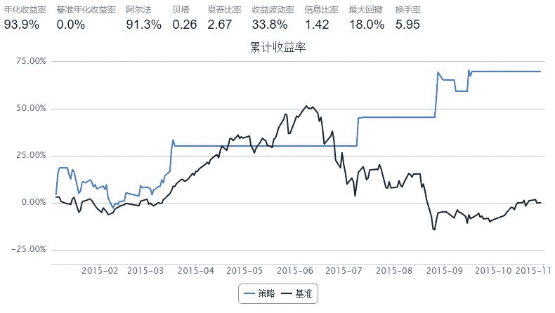

# 决策树模型（固定模型）

> 来源：https://uqer.io/community/share/568dce2d228e5b18e2ba296e

楼主上学时学的是机器学习，现在在BAT做数据挖掘，一直对将机器学习的知识应用到金融领域比较感兴趣。

最近发现了优矿这个平台之后，有点着迷了，通过看大家的策略，也学到些知识。

因为楼主对金融投资认识不多，所以写的策略比较简单粗暴，希望向大家多多学习~

策略： 1、不预测具体股价，只预测次日收盘价相比今日是涨是跌； 2、如果预测为涨，则全部买入或持有；如果预测为跌，则全部卖出。

方法： 基于某只股票的历史数据，采用机器学习的方法，挖掘其中规律，预测该只股票次日收盘价是涨还是跌

```py
import numpy as np
from CAL.PyCAL import *
from sklearn.cross_validation import train_test_split
from sklearn.externals import joblib
import pandas as pd

cal = Calendar('China.SSE')

# 第一步：设置基本参数
start = '2015-01-01'
end   = '2015-11-01'
capital_base = 1000000
refresh_rate = 1
benchmark = 'HS300'

##HS300
freq = 'd'
#601872.XSHG   HS300
# 第二步：选择主题，设置股票池
universe = ['601872.XSHG', ]


##训练模型
def model_train(begin_date,end_date):
    
    data1=DataAPI.MktEqudGet(secID=u"601872.XSHG",beginDate=begin_date,endDate=end_date,field=['tradeDate','highestPrice','lowestPrice','openPrice','closePrice','turnoverVol','turnoverRate'],pandas="1")

    data2=DataAPI.MktStockFactorsDateRangeGet(secID=u"601872.XSHG",beginDate=begin_date,endDate=end_date,field=['tradeDate','DAVOL5','EMA5','EMA10','MA5','MA20','RSI','VOL5','VOL10','MACD'],pandas="1")

    df_data=pd.merge(data1,data2,on='tradeDate')

    tmp=[]
    for i in range(len(df_data.values)):
        mark_1=0
        for j in range(len(df_data.values[i])):
            if str(df_data.values[i][j])=='nan':
                mark_1=1
        if mark_1==0:
            a=list(df_data.values[i])
            a.append(df_data.values[i][4]-df_data.values[i][10])
            a.append(df_data.values[i][4]-df_data.values[i][11])
            tmp.append(a)
    data=tmp
    print len(data)
    x=[]
    y=[]
    for i in range(len(data)-1):
        if data[i][4]<data[i+1][4]:
            y.append(1)
        else:
            y.append(0)
        x.append(data[i][1:])

    x_train, x_test, y_train, y_test = train_test_split(x, y, test_size=0.0, random_state=42)

    ##训练模型   
    from sklearn import tree
    clf = tree.DecisionTreeClassifier( max_depth =3 )
    clf.fit(x_train,y_train)
    y_predict=clf.predict(x_train)
    n_1=0
    for i in range(len(y_predict)):
        if y_train[i]==y_predict[i]:
            n_1=n_1+1
    n_2=0
    for i in range(len(y_predict)):
        if y_train[i]==y_predict[i] and y_predict[i]==1:
            n_2=n_2+1
    joblib.dump(clf, 'clf.model')
    return clf,float(n_1)/float( len(y_predict) ),float(n_2)/float( int(sum(y_train)) ) ,float(sum(y_train))/float(len(y_train))
    
def initialize(account):
    ##使用2015年2月1日之前800个交易日的数据进行训练
    today='20150201'
    train_begin_date = cal.advanceDate(today,'-800B',BizDayConvention.Preceding).strftime('%Y%m%d')
    train_end_date = cal.advanceDate(today,'-1B',BizDayConvention.Preceding).strftime('%Y%m%d')
    
    model,acc_rate,recall_rate,balance=model_train(train_begin_date,train_end_date)
    print acc_rate,recall_rate,balance  ##正确率、召回率、正负样本均衡度

def handle_data(account):
    # 本策略将使用account的以下属性：
    # account.referencePortfolioValue表示根据前收计算的当前持有证券市场价值与现金之和。
    # account.universe表示当天，股票池中可以进行交易的证券池，剔除停牌退市等股票。
    # account.referencePrice表示股票的参考价，一般使用的是上一日收盘价。
    # account.valid_secpos字典，键为证券代码，值为虚拟账户中当前所持有该股票的数量。
    
    c = account.referencePortfolioValue
    
    today = account.current_date.strftime('%Y-%m-%d')

    begin_date = cal.advanceDate(today,'-1B',BizDayConvention.Preceding).strftime('%Y%m%d')
    end_date = cal.advanceDate(today,'-1B',BizDayConvention.Preceding).strftime('%Y%m%d')

    data1=DataAPI.MktEqudGet(secID=u"601872.XSHG",beginDate=begin_date,endDate=end_date,field=['tradeDate','highestPrice','lowestPrice','openPrice','closePrice','turnoverVol','turnoverRate'],pandas="1")

    data2=DataAPI.MktStockFactorsDateRangeGet(secID=u"601872.XSHG",beginDate=begin_date,endDate=end_date,field=['tradeDate','DAVOL5','EMA5','EMA10','MA5','MA20','RSI','VOL5','VOL10','MACD'],pandas="1")

    df_data=pd.merge(data1,data2,on='tradeDate')
    
    a=list(df_data.values[0])
    a.append(df_data.values[0][4]-df_data.values[0][10])
    a.append(df_data.values[0][4]-df_data.values[0][11])
    
    x_predict=a[1:]
    
    for i in range(len(x_predict)):
        if str(x_predict[i])=='nan':
            x_predict[i]=10000000
    
    clf = joblib.load('clf.model')
    y_predict=clf.predict(x_predict)
    

    
    # 计算调仓数量
    change = {}
    for stock in account.universe:
        if y_predict>0 and stock not in account.valid_secpos:
            p = account.referencePrice[stock]
            order(stock,int(c / p))
        if y_predict==0 and stock in account.valid_secpos:
            order_to(stock,0)
    #print today,x_predict[3],y_predict
```




```
713
0.580056179775 0.334384858044 0.445224719101
```

This is an empty markdown cell

