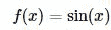
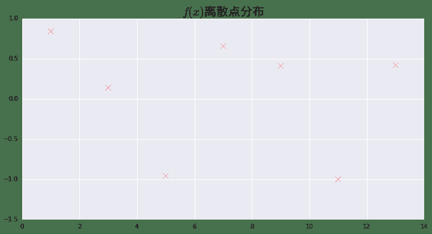
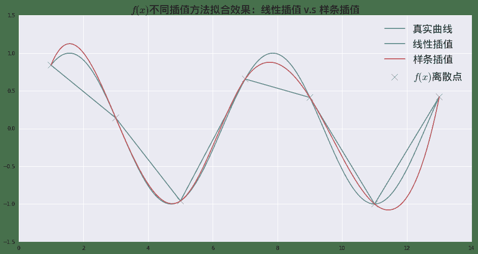
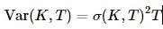
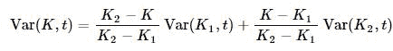
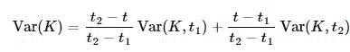
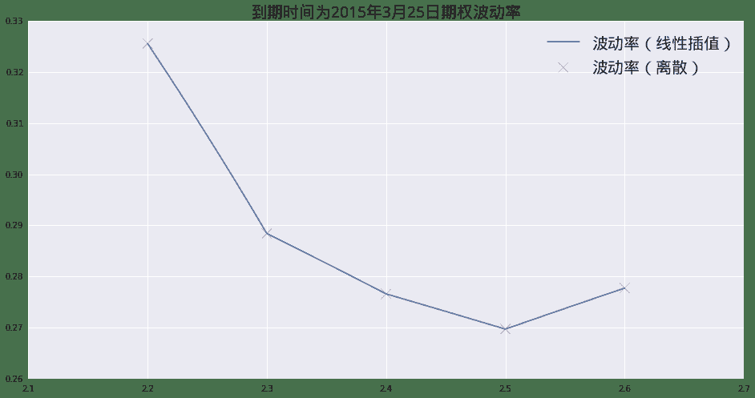
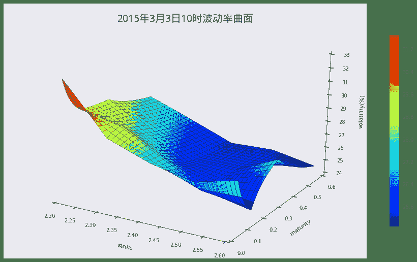

# 量化分析师的Python日记【第8天 Q Quant兵器谱之函数插值】

> 来源：https://uqer.io/community/share/551cfa1ff9f06c8f339044ff

> 在本篇中，我们将介绍Q宽客常用工具之一：函数插值。接着将函数插值应用于一个实际的金融建模场景中：波动率曲面构造。

> 通过本篇的学习您将学习到：

> 1.  如何在`scipy`中使用函数插值模块：`interpolate`；
> 2.  波动率曲面构造的原理；
> 3.  将`interpolate`运用于波动率曲面构造。

## 1. 如何使用`scipy`做函数插值

函数插值，即在离散数据的基础上补插连续函数，估算出函数在其他点处的近似值的方法。在`scipy`中，所有的与函数插值相关的功能都在`scipy.interpolate`模块中

```py
from scipy import interpolate
dir(interpolate)[:5]

['Akima1DInterpolator',
 'BPoly',
 'BarycentricInterpolator',
 'BivariateSpline',
 'CloughTocher2DInterpolator']
```

作为介绍性质的本篇，我们将只关注`interpolate.spline`的使用，即样条插值方法：

+ `xk`离散的自变量值，为序列
+ `yk`对应`xk`的函数值，为与`xk`长度相同的序列
+ `xnew`需要进行插值的自变量值序列
+ `order`样条插值使用的函数基德阶数，为1时使用线性函数

```py
print interpolate.spline.__doc__

Interpolate a curve at new points using a spline fit

Parameters
----------
xk, yk : array_like
    The x and y values that define the curve.
xnew : array_like
    The x values where spline should estimate the y values.
order : int
    Default is 3.
kind : string
    One of {'smoothest'}
conds : Don't know
    Don't know

Returns
-------
spline : ndarray
    An array of y values; the spline evaluated at the positions `xnew`.
```

### 1.1 三角函数（`np.sin`）插值

一例胜千言！让我们这里用实际的一个示例，来说明如何在`scipy`中使用函数插值。这里的目标函数是三角函数：



假设我们已经观测到的`f(x)`在离散点`x=(1,3,5,7,9,11,13)`的值：

```py
import numpy as np
from matplotlib import pylab
import seaborn as sns
font.set_size(20)
x = np.linspace(1.0, 13.0, 7)
y = np.sin(x)
pylab.figure(figsize = (12,6))
pylab.scatter(x,y, s = 85, marker='x', color = 'r')
pylab.title(u'$f(x)$离散点分布', fontproperties = font)

<matplotlib.text.Text at 0x142cafd0>
```



首先我们使用最简单的线性插值算法，这里面只要将`spline`的参数`order`设置为1即可：

```py
xnew = np.linspace(1.0,13.0,500)
ynewLinear = interpolate.spline(x,y,xnew,order = 1)
ynewLinear[:5]

array([ 0.84147098,  0.83304993,  0.82462888,  0.81620782,  0.80778677])
```

复杂一些的，也是`spline`函数默认的方法，即为样条插值，将`order`设置为3即可：

最后我们获得真实的`sin(x)`的值：

```py
ynewReal = np.sin(xnew)
ynewReal[:5]

array([ 0.84147098,  0.85421967,  0.86647437,  0.87822801,  0.88947378])
```

让我们把所有的函数画到一起，看一下插值的效果。对于我们这个例子中的目标函数而言，由于本身目标函数是光滑函数，则越高阶的样条插值的方法，插值效果越好。

```py
pylab.figure(figsize = (16,8))
pylab.plot(xnew,ynewReal)
pylab.plot(xnew,ynewLinear)
pylab.plot(xnew,ynewCubicSpline)
pylab.scatter(x,y, s = 160, marker='x', color = 'k')
pylab.legend([u'真实曲线', u'线性插值', u'样条插值', u'$f(x)$离散点'], prop = font)
pylab.title(u'$f(x)$不同插值方法拟合效果：线性插值 v.s 样条插值', fontproperties = font)

<matplotlib.text.Text at 0x1424cd50>
```



## 2. 函数插值应用 —— 期权波动率曲面构造

市场上期权价格一般以隐含波动率的形式报出，一般来讲在市场交易时间，交易员可以看到类似的波动率矩阵（Volatilitie Matrix):

```py
import pandas as pd
pd.options.display.float_format = '{:,>.2f}'.format
dates = [Date(2015,3,25), Date(2015,4,25), Date(2015,6,25), Date(2015,9,25)]
strikes = [2.2, 2.3, 2.4, 2.5, 2.6]
blackVolMatrix = np.array([[ 0.32562851,  0.29746885,  0.29260648,  0.27679993],
                  [ 0.28841840,  0.29196629,  0.27385023,  0.26511898],
                  [ 0.27659511,  0.27350773,  0.25887604,  0.25283775],
                  [ 0.26969754,  0.25565971,  0.25803327,  0.25407669],
                  [ 0.27773032,  0.24823248,  0.27340796,  0.24814975]])
table = pd.DataFrame(blackVolMatrix * 100, index = strikes, columns = dates, )
table.index.name = u'行权价'
table.columns.name = u'到期时间'
print u'2015年3月3日10时波动率矩阵'
table

2015年3月3日10时波动率矩阵
```

| 到期时间 | March 25th, 2015 | April 25th, 2015 | June 25th, 2015 | September 25th, 2015 |
| --- | --- |
| 行权价 |  |  |  |  |
| 2.20 | 32.56 | 29.75 | 29.26 | 27.68 |
| 2.30 | 28.84 | 29.20 | 27.39 | 26.51 |
| 2.40 | 27.66 | 27.35 | 25.89 | 25.28 |
| 2.50 | 26.97 | 25.57 | 25.80 | 25.41 |
| 2.60 | 27.77 | 24.82 | 27.34 | 24.81 |

交易员可以看到市场上离散值的信息，但是如果可以获得一些隐含的信息更好：例如，在2015年6月25日以及2015年9月25日之间，波动率的形状会是怎么样的？

### 2.1 方差曲面插值

我们并不是直接在波动率上进行插值，而是在方差矩阵上面进行插值。方差和波动率的关系如下：



所以下面我们将通过处理，获取方差矩阵（Variance Matrix):

```py
evaluationDate = Date(2015,3,3)
ttm = np.array([(d - evaluationDate) / 365.0 for d in dates])
varianceMatrix = (blackVolMatrix**2) * ttm
varianceMatrix

array([[ 0.00639109,  0.0128489 ,  0.02674114,  0.04324205],
       [ 0.0050139 ,  0.01237794,  0.02342277,  0.03966943],
       [ 0.00461125,  0.01086231,  0.02093128,  0.03607931],
       [ 0.00438413,  0.0094909 ,  0.02079521,  0.03643376],
       [ 0.00464918,  0.00894747,  0.02334717,  0.03475378]])
```

这里的值`varianceMatrix`就是变换而得的方差矩阵。

下面我们将在行权价方向以及时间方向同时进行线性插值，具体地，行权价方向：



时间方向：



这个过程在`scipy`中可以直接通过`interpolate`模块下`interp2d`来实现：

+ `ttm` 时间方向离散点
+ `strikes` 行权价方向离散点
+ `varianceMatrix` 方差矩阵，列对应时间维度；行对应行权价维度
+ `kind = 'linear'` 指示插值以线性方式进行

```py
interp = interpolate.interp2d(ttm, strikes, varianceMatrix, kind = 'linear')
```

返回的`interp`对象可以用于获取任意点上插值获取的方差值：

```py
interp(ttm[0], strikes[0])

array([ 0.00639109])
```

最后我们获取整个平面上所有点的方差值，再转换为波动率曲面。

```py
sMeshes = np.linspace(strikes[0], strikes[-1], 400)
tMeshes = np.linspace(ttm[0], ttm[-1], 200)
interpolatedVarianceSurface = np.zeros((len(sMeshes), len(tMeshes)))
for i, s in enumerate(sMeshes):
    for j, t in enumerate(tMeshes):
        interpolatedVarianceSurface[i][j] = interp(t,s)
        
interpolatedVolatilitySurface = np.sqrt((interpolatedVarianceSurface / tMeshes))
print u'行权价方向网格数：', np.size(interpolatedVolatilitySurface, 0)
print u'到期时间方向网格数：', np.size(interpolatedVolatilitySurface, 1)

行权价方向网格数： 400
到期时间方向网格数： 200
```

选取某一个到期时间上的波动率点，看一下插值的效果。这里我们选择到期时间最近的点：2015年3月25日：

```py
pylab.figure(figsize = (16,8))
pylab.plot(sMeshes, interpolatedVolatilitySurface[:, 0])
pylab.scatter(x = strikes, y = blackVolMatrix[:,0], s = 160,marker = 'x', color = 'r')
pylab.legend([u'波动率（线性插值）', u'波动率（离散）'], prop = font)
pylab.title(u'到期时间为2015年3月25日期权波动率', fontproperties = font)

<matplotlib.text.Text at 0xea27f90>
```



最终，我们把整个曲面的图像画出来看看：

```py
from mpl_toolkits.mplot3d import Axes3D
from matplotlib import cm

maturityMesher, strikeMesher = np.meshgrid(tMeshes, sMeshes)
pylab.figure(figsize = (16,9))
ax = pylab.gca(projection = '3d')
surface = ax.plot_surface(strikeMesher, maturityMesher, interpolatedVolatilitySurface*100, cmap = cm.jet)
pylab.colorbar(surface,shrink=0.75)
pylab.title(u'2015年3月3日10时波动率曲面', fontproperties = font)
pylab.xlabel("strike")
pylab.ylabel("maturity")
ax.set_zlabel(r"volatility(%)")

<matplotlib.text.Text at 0x14e03050>
```



