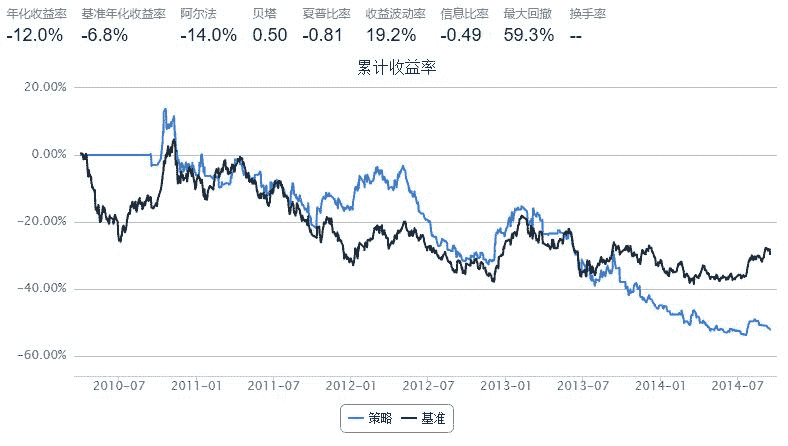

# 基于Random Forest的决策策略

> 来源：https://uqer.io/community/share/54a10ef8f9f06c4bb886324b

版本：1.0

作者：李丞

联系：cheng.li@datayes.com

利用随机树分类算法，通过历史价格的上升状态变化规律，预测下一日股价变动的方向。预测上涨则买入，下跌则卖出（如果可以的话）；

```py
from sklearn.ensemble import RandomForestClassifier
from collections import deque
import pandas as pd
import numpy as np

start = pd.datetime(2010, 4, 1)
end   = pd.datetime(2014, 9, 16)
longest_history = 1

bm = 'HS300'

universe = ['600000.XSHG']
csvs = []

capital_base = 1e5
refresh_rate = 1
window_length = 10

def initialize(account):
    account.security = universe[0]
    account.window_length = window_length
    
    account.classifier = RandomForestClassifier()
    
    # 先进先出的deque序列，设定了最长的长度，在序列超过最长长度的时候，会将头部序列移出
    account.recent_prices = deque(maxlen=account.window_length+2) # 保存最近的股价
    account.X = deque(maxlen=100) # 自变量
    account.Y = deque(maxlen=100) # 应变量
    
    account.prediction = 0 # 保存最近的预测值
    
def handle_data(account):
    hist = account.get_history(1)
    if account.security in hist:
        account.recent_prices.append(hist[account.security]['closePrice'][0]) # 更新最近的股价
        if len(account.recent_prices) >= account.window_length+2: # 如果我们已经获取了足够的股价
            RecentPrice=list(account.recent_prices)   # 将deque转换为对应的list      
            # 制作一组1和0，标记股价是否相对于上一日价格上升。
            changes = np.diff(RecentPrice) > 0
        
            account.X.append(RecentPrice[1:-1])
            account.Y.append(changes[-1]) 
        
            if len(account.Y) >= 100: # 已经拥有足够的数据im
            
                account.classifier.fit(account.X, account.Y) # 设定模型
            
                account.prediction = account.classifier.predict(changes[1:]) # 预测
            
                # 如果过大0.5，买入；小于0.5，卖出
            
                if  account.prediction > 0.5:
                    buyAmount = int(account.position.cash / hist[account.security]['closePrice'][0])
                    order(account.security, buyAmount)
                else:
                    order_to(account.security, 0)
```



