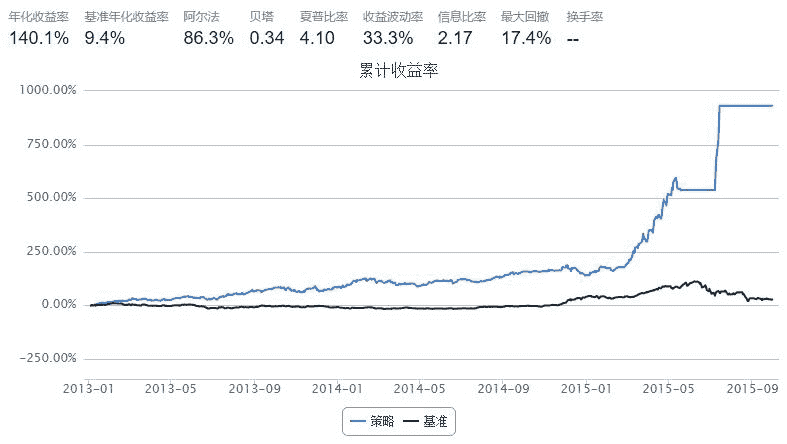

# 5.5 钟摆理论 · 钟摆理论的简单实现——完美躲过股灾和精准抄底

今天给大家简单介绍一种稳健的投资体系——钟摆理论的量化模型实现。这里要感谢@进化论一平 的雪球分享：http://xueqiu.com/8510627167/29759691

其中的核心思想是： （1）从买入操作来看：通过找到有效价格区间，要求在价格低估时买入，但这同时又要满足另一个条件，那就是趋势必须向上。二者缺一不可。 （2）从卖出操作来看：必须顺势而为，在价格超过有效价格区间以后，如果趋势不变，不要急于卖出，直到趋势改变，价格高估再卖出。二者同样缺一不可。

那么核心问题就是两个： （1）如何找到有效的价格区间？也就是，如何给出个股的估值？（2）怎样判断趋势？

为了尽量追求简单，避免太复杂的优化。我这里直接给出两个问题的简单判定方法。

（1）根据格雷厄姆的成长价值公式进行估值，并且根据A股的实际情况或者市场情绪给予一定溢价或者折价。价值=当期(正常)利润×(8.5 + 两倍的预期年增长率)，其中的当期利润使用每股收益EPS进行衡量，预期年增长率使用EGRO/5表示，其中EGRO的计算方法为5年收益关于时间（年）进行线性回归的回归系数/5年收益均值的绝对值

（2）判断趋势有两种途径结合，一种是趋势已经向上，比较简单判断方法是五日线在十日线之上（这种判断方法犯错的几率较大，读者可以自行改进），另外一种是趋势由下向上逆转，即出现明显的底部形态。关于后者，我给出的判断标准为：股价相对于近期高点大幅下跌超过downPercent（例如30%），并且收盘价在五日线十日线之下，并且收红或者收星，跌幅小于7%

接下来就是具体实现了。

```py
def preceding_date(date):
    cal = DataAPI.TradeCalGet(exchangeCD=u"XSHG",beginDate='20110101',endDate=date,field=['calendarDate','isOpen'],pandas="1")
    cal = cal[cal['isOpen']==1]
    date = cal['calendarDate'].values[-2].replace('-','')
    return date

def duotou_5_10(date, stockList, precedingDate=True):
    if precedingDate:
        date = preceding_date(date)
    duotou = {}
    if stockList is None or len(stockList) == 0:
        return duotou
    kLine = DataAPI.MktStockFactorsOneDayGet(tradeDate=date,secID=stockList,field=['secID','MA5','MA10'],pandas="1")
    kLine = kLine.dropna()
    for stock, ma5, ma10 in zip(kLine['secID'].values, kLine['MA5'].values, kLine['MA10'].values):
        if ma5 > ma10:
            duotou[stock] = True
        else:
            duotou[stock] = False
    return duotou

def spreadRateByIntrinsicValue(account, overflow=0.0, precedingDate=True):
    stock_list = account.universe
    current_date = account.current_date
    date = current_date.strftime('%Y%m%d')
    if precedingDate:
        date = preceding_date(date)
    eq_EPS_EGRO = DataAPI.MktStockFactorsOneDayGet(tradeDate=date,secID=stock_list,field=['secID','EPS','EGRO'],pandas="1")
    eq_EPS_EGRO['Value'] = eq_EPS_EGRO['EPS']*(8.5+2*eq_EPS_EGRO['EGRO']/5)
    eq_EPS_EGRO = eq_EPS_EGRO.dropna()
    spread_rate = []
    for stock, intrinsic_value in zip(eq_EPS_EGRO['secID'].values, eq_EPS_EGRO['Value'].values):
        intrinsic_value = intrinsic_value*(1+overflow)
        reference_price = account.referencePrice[stock]
        if reference_price > 0 and reference_price < intrinsic_value:
            spread_rate.append((stock, (intrinsic_value-reference_price)/reference_price))
    return sorted(spread_rate, key=lambda k: k[-1], reverse=True)

'''
判断是否为底部形态，判断标准为股价相对于近期高点大幅下跌超过downPercent，并且收盘价在五日线十日线之下，并且收红或者收星，跌幅小于7%
'''
def isButtom(date, stockList, precedingDate=True, downPercent=0.3):
    cal = DataAPI.TradeCalGet(exchangeCD=u"XSHG",beginDate='20110101',endDate=date,field=u"prevTradeDate",pandas="1")
    daysAhead = cal['prevTradeDate'].values[-20].replace('-','')
    if precedingDate:        
        date = cal['prevTradeDate'].values[-1].replace('-','')
    rs = {}
    if stockList is None or len(stockList) == 0:
        return rs
    dayInfo = DataAPI.MktEqudAdjGet(secID=stockList, beginDate=daysAhead, endDate=date ,field=['secID', 'openPrice', 'closePrice', 'preClosePrice'],pandas="1")
    dayInfo.dropna()
    for stock in stockList:
        stockDayInfo = dayInfo[dayInfo['secID']==stock]
        closePrices = stockDayInfo['closePrice'].values
        ma5 = np.mean(closePrices[-5:])
        ma10 = np.mean(closePrices[-10:])
        closePrice = closePrices[-1]
        maxClosePrice = np.max(closePrices)
        openPrice = stockDayInfo['openPrice'].values[-1]
        preClosePrice = stockDayInfo['preClosePrice'].values[-1]
        if (maxClosePrice-closePrice)/maxClosePrice > downPercent and closePrice < ma5 and ma5 < ma10 and (closePrice > openPrice or abs(closePrice-openPrice)/openPrice < 0.02) and abs(closePrice-preClosePrice)/preClosePrice<0.07:
            rs[stock] = True
        else:
            rs[stock] = False
    return rs
```

```py
import numpy as np

start = '2013-01-01'                       # 回测起始时间
end = '2015-10-01'                         # 回测结束时间
benchmark = 'HS300'                       # 策略参考标准
commission = Commission(buycost=0.0008, sellcost=0.0018)  # 佣金万八
universe = set_universe('CYB',date=end)           # Very Important Here!! 选股很重要！不要玩大烂臭！估值再低也别玩！
capital_base = 1000000                      # 起始资金
freq = 'd'                                 # 策略类型，'d'表示日间策略使用日线回测，'m'表示日内策略使用分钟线回测
refresh_rate = 1                           # 调仓频率，表示执行handle_data的时间间隔，若freq = 'd'时间间隔的单位为交易日，若freq = 'm'时间间隔为分钟

max_percent_of_a_stock = 1.0 # 单支股的最大仓位

def initialize(account):                   # 初始化虚拟账户状态
    pass

def handle_data(account):                  # 每个交易日的买入卖出指令
    global max_percent_of_a_stock
    buylist = []
    selist = []
    current_date = account.current_date
    current_date = current_date.strftime('%Y%m%d')

    overflow = 0.15 # 根据情况给予一定的溢价（例如0.1)或者折价(例如-0.1)，也可以根据市场风险程度进行动态调节（此处读者可以自行发挥）

    spread_rate = dict(spreadRateByIntrinsicValue(account, overflow=overflow, precedingDate=True))
            
    referencePortfolioValue = account.referencePortfolioValue

    # 获取用来计算多头形态的股票列表
    stock_set_for_duotou = []
    stock_set_for_duotou.extend(account.avail_secpos.keys())
    stock_set_for_duotou.extend(spread_rate.keys())
    stock_set_for_duotou = list(set(stock_set_for_duotou))
    
    duotou_5_10_Map = duotou_5_10(current_date, stock_set_for_duotou, precedingDate=True)
    isButtom_Map = isButtom(current_date, stock_set_for_duotou, precedingDate=True, downPercent=0.3)
    
    for stock in account.avail_secpos.keys():
        if stock not in spread_rate and not duotou_5_10_Map.get(stock, False):
            selist.append(stock)
            
    for stock in selist:
        sell_value = account.referencePrice[stock]*account.valid_secpos[stock]
        order_to(stock, 0)
            
    for stock in spread_rate.keys():
        if stock not in account.valid_secpos:
            buylist.append(stock)
    
    for stock in buylist:
        # 满足以下条件之一买入：（1）5日线在10日线之上；（2）出现底部特征
        if duotou_5_10_Map.get(stock, False) or isButtom_Map.get(stock, False):
            buy_value = min(referencePortfolioValue*max_percent_of_a_stock, account.cash/len(buylist))
            if buy_value/referencePortfolioValue >= 0.0001:
                order_pct(stock, buy_value/referencePortfolioValue)
```



回测可以发现，这种投资体系能够完美躲过股灾，并且能在股灾中精准抄底获利 ：-)

