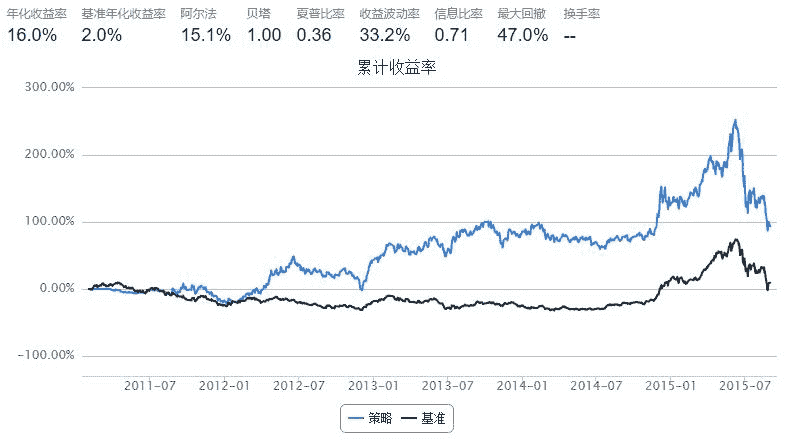

# simple turtle

> 来源：https://uqer.io/community/share/55fe8f58f9f06c597165ef13

```py
start = '2011-01-01'                       # 回测起始时间
end = '2015-09-01'                         # 回测结束时间
benchmark = 'HS300'                        # 策略参考标准
universe = set_universe('HS300')  # 证券池，支持股票和基金
capital_base = 100000                      # 起始资金
freq = 'd'                                 # 策略类型，'d'表示日间策略使用日线回测，'m'表示日内策略使用分钟线回测
refresh_rate = 1                           # 调仓频率，表示执行handle_data的时间间隔，若freq = 'd'时间间隔的单位为交易日，若freq = 'm'时间间隔为分钟
longest_history=60
pos_pieces=10
window=20

def initialize(account):                   # 初始化虚拟账户状态
    pass

def handle_data(account):                  # 每个交易日的买入卖出指令
    highest_price=account.get_attribute_history('highPrice',window)
    lowest_price=account.get_attribute_history('lowPrice',window)
    for stock in account.universe:
        current_price=account.referencePrice[stock]
        if current_price > highest_price[stock].max() and account.position.secpos.get(stock,0)==0:
            order_to(stock,capital_base/pos_pieces/current_price)
        elif current_price < lowest_price[stock].min():
            order_to(stock,0)
    return
```



