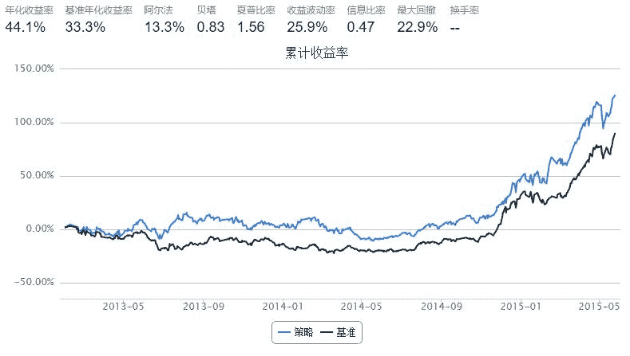
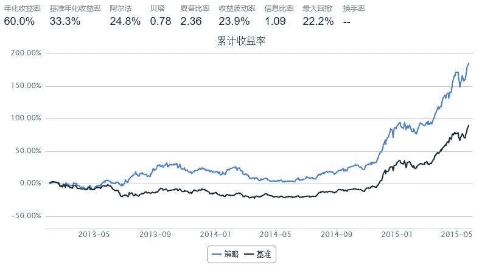
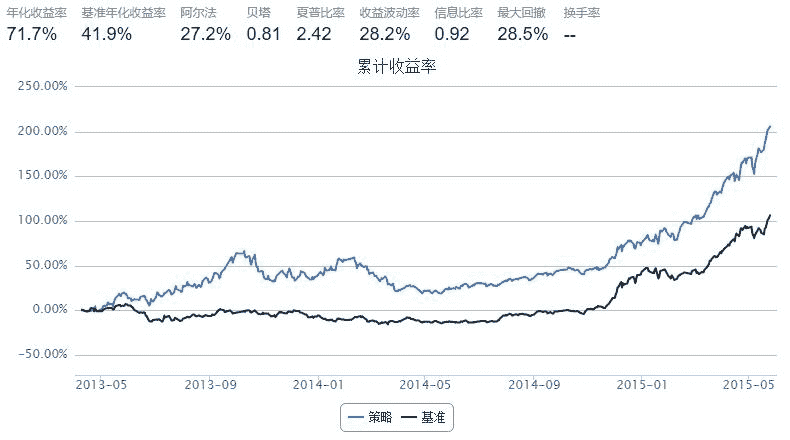

# 侠之大者 一起赚钱

> 来源：https://uqer.io/community/share/554048dff9f06c1c3d687fa5

在阔别七年的又一轮牛市里,炒股已经成为人们每天讨论的话题.

小老弟一直以为:"侠之大者,一起赚钱,一起嗨". 故借宝地献出珍藏多年的交易秘籍.

首先讲述一下策略思路:

+ 标的: 流通性较好,深受大妈喜爱的沪深300成分股, 乃策略标的最佳选择.

+ 买卖点: 追涨杀跌是本策略的核心思路. 在股价,成交量向上突破最近20日最高价格(量)时买入. 在股价向下突破最近10日最低价格卖出.

+ 头寸规模：每只股票最多占1/10仓位.

话不多说, 上代码:

```py
start = datetime(2013, 1, 1)
end   = datetime(2015, 5, 25)
benchmark = 'HS300'
universe  = set_universe('HS300')
capital_base = 100000

pos_pieces = 10
enter_window = 20
exit_window = 10

def initialize(account):
    pass

def handle_data(account):
    highest_price = account.get_attribute_history('highPrice', enter_window)
    lowest_price  = account.get_attribute_history('lowPrice', exit_window)
    close_price  = account.get_attribute_history('closePrice', exit_window)
    turnover_vol = account.get_attribute_history('turnoverVol', enter_window)
    for stock in account.universe:
        cnt_price = close_price[stock][-1] #account.referencePrice[stock]
        cnt_turnover = turnover_vol[stock][-1]
        if cnt_price > highest_price[stock][:-1].max() and cnt_turnover > turnover_vol[stock][:-1].max() and account.position.secpos.get(stock, 0)==0:
            order(stock, capital_base/pos_pieces/cnt_price)
        elif cnt_price < lowest_price[stock][:-1].min():            
            order_to(stock, 0)
```



也许已经有人发现, 其实这就是海龟交易系统.

海龟交易系统是一个完整的交易系统,它有一个完整的交易系统所应该有的所有成分，涵盖了成功交易中的每一个必要决策：

+ 市场：买卖什么？

+ 头寸规模：买卖多少？

+ 入市：什么时候买卖？

+ 止损：什么时候放弃一个亏损的头寸？

+ 退出：什么时候退出一个盈利的头寸？

+ 战术：怎么买卖？

在上面的策略中, 每只股票的头寸规模为1/10的初始资金.

《海龟交易法则》介绍了一种头寸规模控制方法, 将头寸分为一个个单位, 下面的策略将展示将头寸分为N个单位, 每次产生买入信号时, 仅买入一个单位.

```py
start = datetime(2013, 1, 1)
end   = datetime(2015, 5, 25)
benchmark = 'HS300'
universe  = set_universe('HS300')
capital_base = 100000

pos_pieces = 10
enter_window = 20
exit_window = 10
N = 4

def initialize(account):
    account.postion_size_hold = {}
    for stk in universe:
        account.postion_size_hold[stk] = 0

def handle_data(account):
    highest_price = account.get_attribute_history('highPrice', enter_window)
    lowest_price  = account.get_attribute_history('lowPrice', exit_window)
    close_price  = account.get_attribute_history('closePrice', exit_window)
    turnover_vol = account.get_attribute_history('turnoverVol', enter_window)
    for stock in account.universe:
        cnt_price = close_price[stock][-1] #account.referencePrice[stock]
        cnt_turnover = turnover_vol[stock][-1]
        if cnt_price > highest_price[stock][:-1].max() and cnt_turnover > turnover_vol[stock][:-1].max() and account.postion_size_hold[stock]<N:
            order(stock, capital_base/pos_pieces/cnt_price/N)
            account.postion_size_hold[stock] += 1
        elif cnt_price < lowest_price[stock][:-1].min():
            order_to(stock, 0)
            account.postion_size_hold[stock] = 0
```



我们发现回撤和波动率有所下降,而收益率竟然上升了. 其实原因很简单, 分N次买入时, 如果信号正确, 可能会提高一定的持仓成本,降低收益率; 反之如果信号有误, 也能够快速止损, 减少回撤.

也就是说, 头寸规模有效的控制了风险.

以上两个策略属于唐安奇趋势系统, 结束之前, 再介绍一下布林格突破系统.

布林线定义：

布林线是通过350日平均收盘加减2.5倍标准差得到的。

布林线方法：

+ 如果前一日的收盘价穿越了通道的顶部，则开盘做多

+ 如果前一日的收盘价跌破了通道的底部，则开盘做空

在我们的这个股票策略里,我们以60日平均收盘加减2.5倍标准差作为波幅通道.

```py
import numpy as np
start = datetime(2013, 1, 1)
end   = datetime(2015, 5, 25)
benchmark = 'HS300'
universe  = set_universe('HS300')
capital_base = 100000
longest_history = 60

pos_pieces = 10
enter_window = 20
exit_window = 10
N = 4

def initialize(account):
    account.postion_size_hold = {}
    for stk in universe:
        account.postion_size_hold[stk] = 0

def handle_data(account):
    close_prices = account.get_attribute_history('closePrice', longest_history)
    for stock in account.universe:
        cnt_price = close_prices[stock][-1] #account.referencePrice[stock]
        mean_cp = close_prices[stock].mean()
        bias = 2.5*np.std(close_prices[stock])
        high_channel = mean_cp + bias
        low_channel = mean_cp - bias
        if cnt_price >= high_channel and account.postion_size_hold[stock]<N:
            order(stock, capital_base/pos_pieces/cnt_price/N)
            account.postion_size_hold[stock] += 1
        elif cnt_price <= low_channel:
            order_to(stock, 0)
            account.postion_size_hold[stock] = 0
```



参考自:《海龟交易法则》 作者: 柯蒂斯·费思

