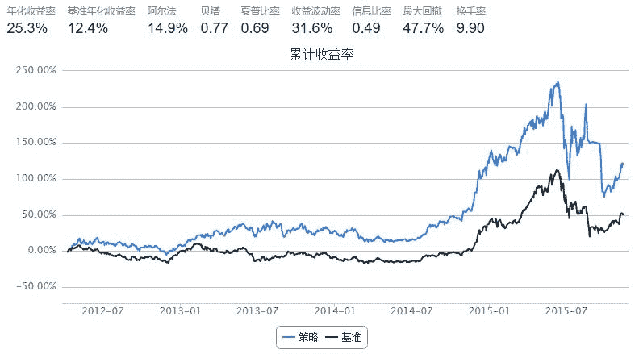

# 5.7 5217 策略 · 白龙马的新手策略

> 来源：https://uqer.io/community/share/56458dbcf9f06c4446b480ec

+ 买入信号 ：价格创出60个交易日新高，第二天买入

+ 卖出信号 ：价格从最高点下跌17%，则第二天卖出

+ 卖出金额平均分配到新高的股价上

```py
import numpy as np 
from datetime import datetime, timedelta

start = '20120101'                       # 回测起始时间
end = (datetime.today() - timedelta(days=1)).strftime('%Y%m%d')  # 截止日期
benchmark = 'HS300'                        # 策略参考标准
universe = set_universe('HS300')
capital_base = 1000000                     # 起始资金
freq = 'd'                                 # 策略类型，'d'表示日间策略使用日线回测，'m'表示日内策略使用分钟线回测
refresh_rate = 1                           # 调仓频率，表示执行handle_data的时间间隔，若freq = 'd'时间间隔的单位为交易日，若freq = 'm'时间间隔为分钟

MAX_PRICE = {}

def initialize(account):                   # 初始化虚拟账户状态
    pass

def handle_data(account):                  # 每个交易日的买入卖出指令
    
    today = account.current_date.strftime('%Y%m%d')   
    hist = account.get_attribute_history('closePrice' , 60)
    cash = account.cash
    buylist = []
    
    #记录持仓股票的最高价（卖出判断指标）
    for s in account.valid_secpos : 
        MAX_PRICE[s] = max(MAX_PRICE[s],np.max(hist[s]))
    
    # 备选买入股票,已经在股票池的股票不再重复购买,创60日新高则入选购买
    option = [x for x in account.universe if x not in account.valid_secpos]   
    
    for s in option :    
        if np.max(hist[s]) == hist[s][-1] : 
            buylist.append(s)
            MAX_PRICE[s] = hist[s][-1]
            
    # 从最高点下跌17%，卖出
    for s in account.valid_secpos :   
            
        if hist[s][-1] <= MAX_PRICE[s] * (1 - 0.17) : 
            cash += hist[s][-1] * account.valid_secpos.get(s)
            order_to(s , 0)         
            # 最高价清零
            MAX_PRICE[s] = 0
           
    # 买入
    for s in buylist :        
        order( s, cash / len(buylist) / hist[s][-1] )
```



