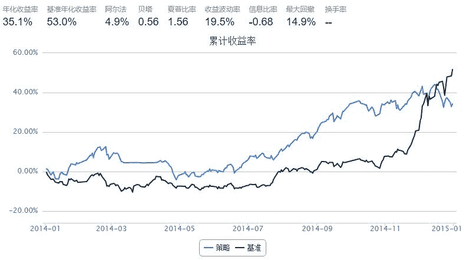

# 5.8 SMIA · 基于历史状态空间相似性匹配的行业配置 SMIA 模型—取交集

> 来源：https://uqer.io/community/share/55e00e38f9f06c521f156a86

## 行业轮动分析

本文主要参考广发金工的研报《基于历史状态空间相似性匹配的行业配置SMIA 模型》中所用的方法，通过量化实验室平台完成实证的过程。

## 1.策略思想

随机过程可以划分为有记忆性特征和无记忆性特征两种。行业轮动具有记忆性，即当期行业的相对表现会影响下一期行业的相对表现，这是由行业之间错综复杂的经济关系所决定的。我们通过寻找历史状态空间中与当期行业收益率排名相似的一些时间点，观察这些时间点之后一期行业轮动的变化特征，从中选取统计上表现较好的行业，作为当前时间点下一期的推荐超配行业，从而实现相似性匹配行业配置（Similarity Matching Industry Allocation,缩写为SMIA）量化模型的构建。

## 2.实证过程

```py
def distanceGet(history, test):
    #计算欧式距离
    distance = sum((history - test).values**2)
    return distance
```

下面的策略作了一些改变，变成行业之间取交集。需要测试别的距离的效果，也可以在上面的函数直接改哦。

```py
start = '2014-01-01'                       # 回测起始时间
end = '2015-01-01'                         # 回测结束时间
benchmark = 'HS300'                        # 策略参考标准
universe = universeGet(getIndustryInfo())  # 证券池，支持股票和基金
capital_base = 1000000                     # 起始资金
freq = 'd'                                 # 策略类型，'d'表示日间策略使用日线回测，'m'表示日内策略使用分钟线回测
refresh_rate = 22                          # 调仓频率，表示执行handle_data的时间间隔，若freq = 'd'时间间隔的单位为交易日，若freq = 'm'时间间隔为分钟

Select_Match = 3                           # 选取三个最相似的行业市场排名状态
Select_Order = 14                          # 选取收益率最高的十四个行业

fixYield = DataFrame(fixInd_meanYield).rank(axis=1)   #将收益率矩阵变为序号矩阵

def initialize(account):                   # 初始化虚拟账户状态
    pass

#总体思路是根据调仓时期，将最近22个交易日的的收益率按行业排序，拿之前所有数据源进行匹配，用欧式距离找出最接近的排序的3期，选取它们的下一期，再挑选出这些期行业收益率前两个名的行业。
def handle_data(account): # 每个交易日的买入卖出指令
    
    today = account.current_date

    if today.strftime("%Y-%m-%d") == '2014-01-02' : #当回测开始调仓时（2014-01-01元旦不交易，顺延到1月2号），不需要调用addYield(current_date)函数
        
        fixYield_history = fixYield.ix[:len(fixYield)-2] #将最后一期之前的数据，作为匹配数据源
        fixYield_test = fixYield.ix[len(fixYield)-1] #选取最后一期数据来和其他数据源做匹配
        
        distance = pd.Series(np.zeros(len(fixYield_history ))) #初始化
        for i in xrange(len(fixYield_history)):
            distance[i] = distanceGet(fixYield_history.ix[i],fixYield_test )
            
        sort_distance = distance.order() #按distance中的值排序，然而其索引值仍保留
        indexSort = sort_distance.index #distance的索引并没有改变，我们得到了它的索引，就可以反过来在fixYield中找到最匹配的源数据
        
        #industryList = []
        industryList = set()
        intersectionList = set()
        for i in xrange(Select_Match):
            Match_Period = dict(fixYield.ix[indexSort[i]+1]) #取distance值在前3的索引，将这个索引加1，得到最匹配的数据源的下一期
            #industryList = industryList + nlargest(Select_Order, Match_Period, key=Match_Period.get) #取收益率最高的四个索引（行业）
            industryList = set(nlargest(Select_Order, Match_Period, key=Match_Period.get))
            
            if i == 0:
                intersectionList = industryList
            else:
                intersectionList = intersectionList & industryList
        #industryList = list(set(industryList)) #得到我们选出的行业
        intersectionList = list(intersectionList)
    else: 
        addInd_meanYield = addYield(account.current_date) #除去最开始调仓，我们都需要调用addYield(current_date)得到更多的数据源
        addInd_meanYield = DataFrame(addInd_meanYield).rank(axis=1) #将收益率矩阵变序号矩阵
        addInd_meanYield_history = addInd_meanYield.ix[:len(addInd_meanYield)-2] #将这些数据也作为匹配数据源
        addInd_meanYield_test = addInd_meanYield.ix[len(addInd_meanYield)-1] #选取最后一期数据来和其他数据源做匹配
        
        distance = pd.Series(np.zeros(len(addInd_meanYield_history)+len(fixYield )))
        for i in xrange(len(fixYield)):
            distance[i] = distanceGet(fixYield.ix[i],addInd_meanYield_test)
        for i in xrange(len(fixYield),len(fixYield) + len(addInd_meanYield_history)):
            distance[i] = distanceGet(addInd_meanYield_history.ix[i-len(fixYield)],addInd_meanYield_test)
            
        sort_distance = distance.order()
        indexSort = sort_distance.index
        
        #industryList = []
        industryList = set()
        intersectionList = set()
        for i in xrange(Select_Match): #选取3个匹配
            
            if indexSort[i]+1 < len(fixYield): #若找的日期不超过fixYield的范围，直接计算。
                Match_Period = dict(fixYield.ix[indexSort[i]+1])
                #industryList = industryList + nlargest(Select_Order, Match_Period, key=Match_Period.get)
                industryList = set(nlargest(Select_Order, Match_Period, key=Match_Period.get))
                
            elif indexSort[i]+1 < len(distance) : #若找到的日期不超过所有数据期数减一，但超过了fixYield的范围，则匹配在addInd_meanYield_history中
                Match_Period = dict(addInd_meanYield_history.ix[indexSort[i]+1-len(fixYield)])
                #industryList = industryList + nlargest(Select_Order, Match_Period, key=Match_Period.get)
                industryList = set(nlargest(Select_Order, Match_Period, key=Match_Period.get))
                
            else:                             #这里其实就是找到了本身，其匹配源数据找到了上一期
                Match_Period = dict(addInd_meanYield_test)
                #industryList = industryList + nlargest(Select_Order, Match_Period, key=Match_Period.get)
                industryList = set(nlargest(Select_Order, Match_Period, key=Match_Period.get))
            
            if i == 0:
                intersectionList = industryList
            else:
                intersectionList = intersectionList & industryList
        #industryList = list(set(industryList))
        intersectionList = list(intersectionList)
        
    
    buyList = []
    for key in indContent:
        if key in intersectionList:
            buyList = buyList + indContent[key]
 
    #除去不在account.universe以及停牌和新股
    for stk in buyList[:]:
        if stk not in account.universe or account.referencePrice[stk] == 0 or np.isnan(account.referencePrice[stk]):
            buyList.remove(stk)
              
    for stk in account.valid_secpos:
        order_to(stk, 0)
    
    for stk in buyList:
        order(stk, account.referencePortfolioValue/account.referencePrice[stk]/len(buyList))        
```



