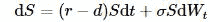
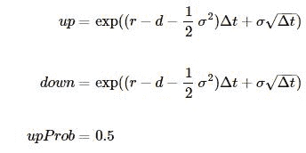
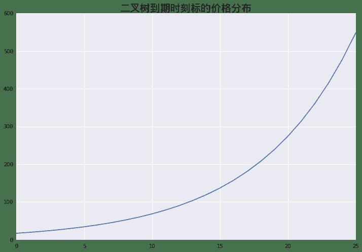
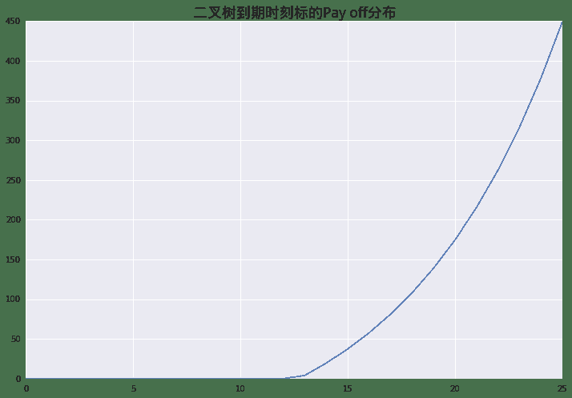
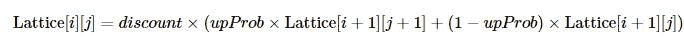
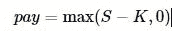
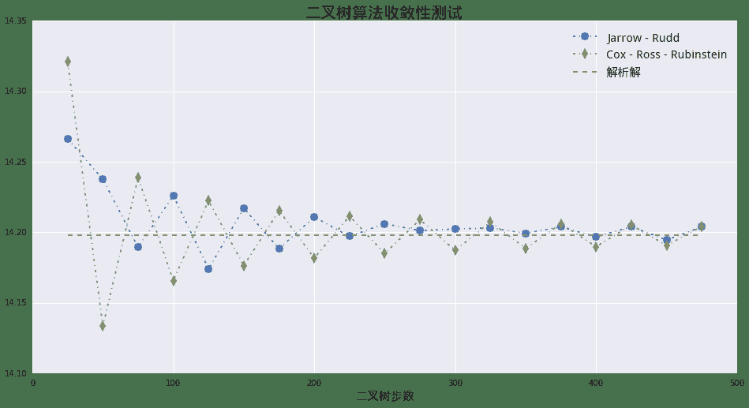
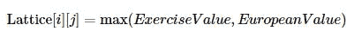
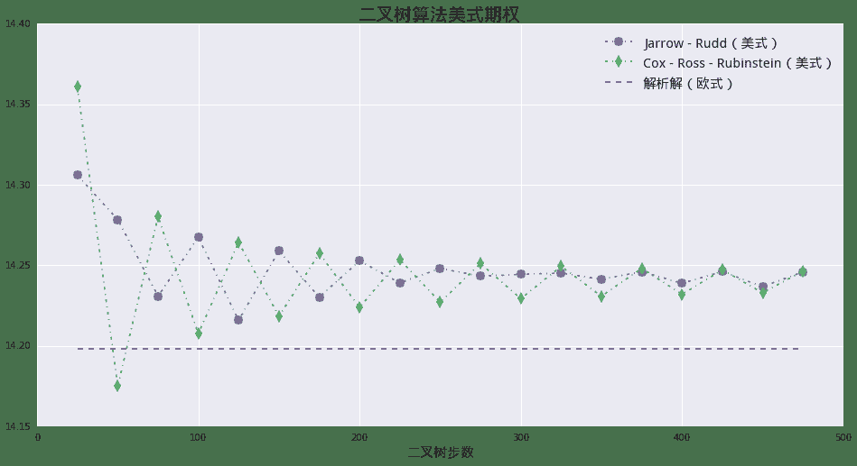

# 量化分析师的Python日记【第9天 Q Quant兵器谱之二叉树】

> 来源：https://uqer.io/community/share/5523a4a1f9f06c8f3390453b

通过之前几天的学习，Q Quant们应该已经熟悉了Python的基本语法，也了解了Python中常用数值库的算法。到这里为止，小Q们也许早就对之前简单的例子不满意，希望能在Python里面玩票大的！Ok，我们这里引入一个不怎么像玩具的模型——二叉树算法。我们仍然以期权为例子，教会大家：

1.  如何利用Python的控制语句与基本内置计算方法，构造一个二叉树模型；
1.  如何使用类封装的方式，抽象二叉树算法，并进行扩展；
1.  利用继承的方法为已有二叉树算法增加美式期权算法。

```py
import numpy as np
import math
import seaborn as sns
from matplotlib import pylab
font.set_size(15)
```

## 1. 小Q的第一棵“树”——二叉树算法Python描述

我们这边只会简单的描述二叉树的算法，不会深究其原理，感兴趣的读者可以很方便的从公开的文献中获取细节。

我们这里仍然考虑基础的 Black - Scholes 模型：



这里各个字母的含义如之前介绍，多出来的 r 代表股息率。

之所以该算法被称为 二叉树，因为这个算法的基础结构是一个逐层递增的树杈式结构：

一个基本的二叉树机构由以下三个参数决定：

1.  `up` 标的资产价格向上跳升的比例， `up`必然大于1 （对应上图中的 `u`)
1.  `down` 标的资产价格向下跳升的比例， `dow`n必然小于1 (对应上图中的 `d`)
1.  `upProbability` 标的资产价格向上跳升的概率

这里我们用一个具体的例子，使用Python实现二叉树算法。以下为具体参数：

+ `ttm` 到期时间，单位年
+ `tSteps` 时间方向步数
+ `r` 无风险利率
+ `d` 标的股息率
+ `sigma` 波动率
+ `strike` 期权行权价
+ `spot` 标的现价

这里我们只考虑看涨期权。

```py
# 设置基本参数
ttm = 3.0
tSteps = 25
r = 0.03
d = 0.02
sigma = 0.2
strike = 100.0
spot = 100.0
```

我们这里用作例子的树结构被称为 Jarrow - Rudd 树，其中：



```py
dt = ttm / tSteps
up = math.exp((r - d - 0.5*sigma*sigma)*dt + sigma*math.sqrt(dt))
down = math.exp((r - d - 0.5*sigma*sigma)*dt - sigma*math.sqrt(dt))
discount = math.exp(-r*dt)
```

```py
pylab.figure(figsize = (12,8))
pylab.plot(lattice[tSteps])
pylab.title(u'二叉树到期时刻标的价格分布', fontproperties = font, fontsize = 20)

<matplotlib.text.Text at 0x16bb2290>
```



```py
# 在节点上计算payoff
def call_payoff(spot):
    global strike
    return max(spot - strike, 0.0)

pylab.figure(figsize = (12,8))
pylab.plot(map(call_payoff, lattice[tSteps]))
pylab.title(u'二叉树到期时刻标的Pay off分布', fontproperties = font, fontsize = 18)

<matplotlib.text.Text at 0x16bc4210>
```



在我们从树最茂盛的枝叶向根部回溯的时候，第`i`层节点与第`i+1`层节点的关系满足：



```py
# 反方向回溯整棵树
for i in range(tSteps,0,-1):
    for j in range(i,0,-1):
        if i == tSteps:
            lattice[i-1][j-1] = 0.5 * discount * (call_payoff(lattice[i][j]) + call_payoff(lattice[i][j-1]))
        else:
            lattice[i-1][j-1] = 0.5 * discount * (lattice[i][j] + lattice[i][j-1])
```


```py
print u'二叉树价格： %.4f' % lattice[0][0]
print u'解析法价格： %.4f' % BSMPrice(1, strike, spot, r, d, sigma, ttm, rawOutput= True)[0]

二叉树价格： 14.2663
解析法价格： 14.1978
```

## 2. 从“树”到“森林”—— 面向对象方式实现二叉树算法

之前的部分展示了一个树算法的基本结构。但是现在的实现由很多缺点：

+ 没有明确接口，作为用户优雅简洁的使用既有算法；
+ 没有完整封装，十分不利于算法的扩展；

下面我们将给出一个基于Python类的二叉树算法实现，实际上我们通过上面的实验性探索，发现整个程序可以拆成三个互相独立的功能模块：

+   二叉树框架

    树的框架结构，包括节点数以及基本参数的保存；

+   二叉树类型描述

    具体数算法的参数，例如上例中的 Jarrow Rudd树；

+   偿付函数

    到期的偿付形式，即为Payoff Function。

### 2.1 二叉树框架（`BinomialTree`）

这个类负责二叉树框架的构造，也是基本的二叉树算法的调用入口。它有三个成员：

+   构造函数（`__init__`）

    负责接受用户定义的具体参数，例如：`spot`等；真正二叉树的构造方法，由私有方法`_build_lattice`以及传入参数`treeTraits`共同完成；

+   树构造细节（`_build_lattice`）

    接手具体的树构造过程，这里需要依赖根据`treeTraits`获取的参数例如：`up`, `down`。

+   树回溯（`roll_back`）

    从树的最茂盛枝叶节点向根节点回溯的过程。最终根节点的值即为期权的价值。这里它要求的参数是一个`pay_off`函数。
    
```py
# 二叉树框架（可以通过传入不同的treeTraits类型，设计不同的二叉树结构）
class BinomialTree:
    def __init__(self, spot, riskFree, dividend, tSteps, maturity, sigma, treeTraits):
        self.dt = maturity / tSteps
        self.spot = spot
        self.r = riskFree
        self.d = dividend
        self.tSteps = tSteps
        self.discount = math.exp(-self.r*self.dt)
        self.v = sigma
        self.up = treeTraits.up(self)
        self.down = treeTraits.down(self)
        self.upProbability = treeTraits.upProbability(self)
        self.downProbability = 1.0 - self.upProbability
        self._build_lattice()
        
    def _build_lattice(self):
        '''
        完成构造二叉树的工作
        '''
        self.lattice = np.zeros((self.tSteps+1, self.tSteps+1))
        self.lattice[0][0] = self.spot
        for i in range(self.tSteps):
            for j in range(i+1):
                self.lattice[i+1][j+1] = self.up * self.lattice[i][j]
            self.lattice[i+1][0] = self.down * self.lattice[i][0]
            
    def roll_back(self, payOff):
        '''
        节点计算，并反向倒推
        '''
        for i in range(self.tSteps,0,-1):
            for j in range(i,0,-1):
                if i == self.tSteps:
                    self.lattice[i-1][j-1] = self.discount * (self.upProbability * payOff(self.lattice[i][j]) + self.downProbability * payOff(self.lattice[i][j-1]))
                else:
                    self.lattice[i-1][j-1] = self.discount * (self.upProbability *  self.lattice[i][j] + self.downProbability * self.lattice[i][j-1])
```

### 2.2 二叉树类型描述（`Tree Traits`）

正像我们之前描述的那样，任意的树只要描述三个方面的特征就可以。所以我们设计的`Tree Traits`类只要通过它的静态成员返回这些特征就可以：

+ `up` 返回向上跳升的比例；
+ `down` 返回向下调降的比例；
+ `upProbability` 返回向上跳升的概率

下面的类定义了 Jarrow - Rudd 树的描述：

```py
class JarrowRuddTraits:
    @staticmethod
    def up(tree):
        return math.exp((tree.r - tree.d - 0.5*tree.v*tree.v)*tree.dt + tree.v*math.sqrt(tree.dt))
    
    @staticmethod
    def down(tree):
        return math.exp((tree.r - tree.d - 0.5*tree.v*tree.v)*tree.dt - tree.v*math.sqrt(tree.dt))
    
    @staticmethod
    def upProbability(tree):
        return 0.5
```

我们这里再给出另一个 Cox - Ross - Rubinstein 树的描述：

```py
class CRRTraits:  
    @staticmethod
    def up(tree):
        return math.exp(tree.v * math.sqrt(tree.dt))
    
    @staticmethod
    def down(tree):
        return math.exp(-tree.v * math.sqrt(tree.dt))
    
    @staticmethod
    def upProbability(tree):
        return 0.5 + 0.5 * (tree.r - tree.d - 0.5 * tree.v*tree.v) * tree.dt / tree.v / math.sqrt(tree.dt)
```

### 2.3 偿付函数（`pay_off`）

这部分很简单，就是一元函数，输入为标的价格，输出的偿付收益，对于看涨期权来说就是：



```py
def pay_off(spot):
    global strike
    return max(spot - strike, 0.0)
```

### 2.4 组装

让我们三部分组装起来，现在整个调用过程变得什么清晰明了，同时最后的结果和第一部分是完全一致的。

```py
testTree = BinomialTree(spot, r, d, tSteps, ttm, sigma, JarrowRuddTraits)
testTree.roll_back(pay_off)
print u'二叉树价格： %.4f' % testTree.lattice[0][0]

二叉树价格： 14.2663
```

这里我们想更进一步，用我们现在的算法框架来测试二叉树的收敛性。这里我们用来作比较的算法即为之前描述的 Jarrow - Rudd 以及 Cox - Ross - Rubinstein 树：

```py
stepSizes = range(25, 500,25)
jrRes = []
crrRes = []
for tSteps in stepSizes:
    # Jarrow - Rudd 结果
    testTree = BinomialTree(spot, r, d, tSteps, ttm, sigma, JarrowRuddTraits)
    testTree.roll_back(pay_off)
    jrRes.append(testTree.lattice[0][0])
    
    # Cox - Ross - Rubinstein 结果
    testTree = BinomialTree(spot, r, d, tSteps, ttm, sigma, CRRTraits)
    testTree.roll_back(pay_off)
    crrRes.append(testTree.lattice[0][0])
```

我们可以绘制随着步数的增加，两种二叉树算法逐渐向真实值收敛的过程。

```py
anyRes = [BSMPrice(1, strike, spot, r, d, sigma, ttm, rawOutput= True)[0]] * len(stepSizes)

pylab.figure(figsize = (16,8))
pylab.plot(stepSizes, jrRes, '-.', marker = 'o', markersize = 10)
pylab.plot(stepSizes, crrRes, '-.', marker = 'd', markersize = 10)
pylab.plot(stepSizes, anyRes, '--')
pylab.legend(['Jarrow - Rudd', 'Cox - Ross - Rubinstein', u'解析解'], prop = font)
pylab.xlabel(u'二叉树步数', fontproperties = font)
pylab.title(u'二叉树算法收敛性测试', fontproperties = font, fontsize = 20)

<matplotlib.text.Text at 0x15e46490>
```



我们也可以绘制两种算法的误差随着步长下降的过程。

```py
jrErr = np.array(jrRes) - np.array(anyRes)
crrErr = np.array(crrRes) - np.array(anyRes)
jrErr = np.log10(np.abs(jrErr))
crrErr = np.log10(np.abs(crrErr))
```

```py
pylab.figure(figsize = (16,8))
pylab.plot(stepSizes, jrErr, '-.', marker = 'o', markersize = 10)
pylab.plot(stepSizes, crrErr, '-.', marker = 'd', markersize = 10)
pylab.xlabel(u'二叉树步数', fontproperties = font)
pylab.ylabel(u'误差（log）', fontproperties = font)
pylab.title(u'二叉树算法误差分布测试', fontproperties = font, fontsize = 20)

<matplotlib.text.Text at 0x172b06d0>
```


## 3. 新想法 —— 美式期权？

有小Q要问了，既然我们已经有解析算法了，为什么还要多此一举的去种“树”呢？是的，如果只是普通欧式期权的话，二叉树就是多此一举的做法。但是由于二叉树天然的反向回溯的特性，使得它特别适合处理有提前行权结构的期权产品。这里我们将以美式期权为例。

美式期权的行权结构在二叉树结构下处理起来特别简单，要做的只是在每个节点上做这样的比较：



这里的 `ExerciseValue` 就是立即行权的价值， `EuropeanValue`为对应节点的欧式价值。

为了实现上面的比较，我们需要扩展原先的算法，这个我们可以通过Python的类继承在原先的类之上添加新功能：

```py
class ExtendBinomialTree(BinomialTree):
    
    def roll_back_american(self, payOff):
        '''
        节点计算，并反向倒推
        '''
        for i in range(self.tSteps,0,-1):
            for j in range(i,0,-1):
                if i == self.tSteps:
                    europeanValue = self.discount * (self.upProbability * payOff(self.lattice[i][j]) + self.downProbability * payOff(self.lattice[i][j-1]))
                else:
                    europeanValue = self.discount * (self.upProbability *  self.lattice[i][j] + self.downProbability * self.lattice[i][j-1])
                # 处理美式行权
                exerciseValue = payOff(self.lattice[i-1][j-1])
                self.lattice[i-1][j-1] = max(europeanValue, exerciseValue)
```

我们将使用同样的参数测试美式期权算法的实现：

```py
stepSizes = range(25, 500,25)
jrRes = []
crrRes = []
for tSteps in stepSizes:
    # Jarrow - Rudd 结果
    testTree = ExtendBinomialTree(spot, r, d, tSteps, ttm, sigma, JarrowRuddTraits)
    testTree.roll_back_american(pay_off)
    jrRes.append(testTree.lattice[0][0])
    
    # Cox - Ross - Rubinstein 结果
    testTree = ExtendBinomialTree(spot, r, d, tSteps, ttm, sigma, CRRTraits)
    testTree.roll_back_american(pay_off)
    crrRes.append(testTree.lattice[0][0])
```

我们画出美式期权价格的收敛图，价格始终高于欧式期权的价格，符合预期。

```py
anyRes = [BSMPrice(1, strike, spot, r, d, sigma, ttm, rawOutput= True)[0]] * len(stepSizes)

pylab.figure(figsize = (16,8))
pylab.plot(stepSizes, jrRes, '-.', marker = 'o', markersize = 10)
pylab.plot(stepSizes, crrRes, '-.', marker = 'd', markersize = 10)
pylab.plot(stepSizes, anyRes, '--')
pylab.legend([u'Jarrow - Rudd（美式）', u'Cox - Ross - Rubinstein（美式）', u'解析解（欧式）'], prop = font)
pylab.xlabel(u'二叉树步数', fontproperties = font)
pylab.title(u'二叉树算法美式期权', fontproperties = font, fontsize = 20)

<matplotlib.text.Text at 0x17aae2d0>
```



