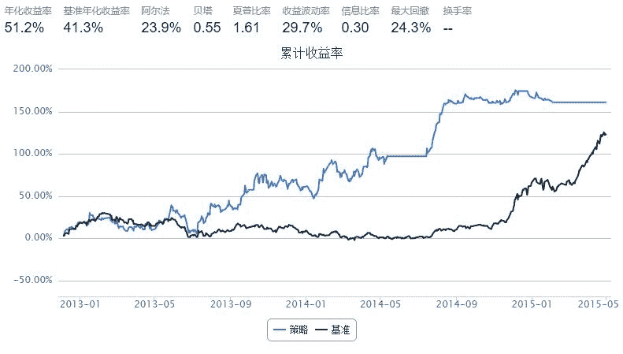

# 5.10 PAMR · PAMR ： 基于均值反转的投资组合选择策略 - 修改版

> 来源：https://uqer.io/community/share/55a4c52bf9f06c6dd3e17f0f

策略思路：

该策略的主要思想是用一个损失函数反映均值反转性质，即如果基于前一期相对价格的预期收益值大于一定阈值，损失值将线性增长；否则，损失为0

策略实现

m个资产每日调仓：对每个资产，收益高于总资产平均收益者，减持；收益低于总资产平均收益者，增持

具体参见文献： http://citeseerx.ist.psu.edu/viewdoc/download?doi=10.1.1.421.579&rep=rep1&type=pdf

```py
from CAL.PyCAL import *
from numpy import *
import pandas as pd
import numpy as np
from pandas import DataFrame

import cvxopt
from cvxopt import matrix
from cvxopt.blas import dot
import cvxopt.solvers as cs

# parameters used in updatePAMR
sensitivity = 0.8
C = 600

start = datetime(2012, 12, 1)
end   = datetime(2015, 5, 1)
benchmark = 'HS300'
universe = set_universe('SH180')
capital_base = 1e8
refresh_rate = 1
window = 1

tickers = [stk[0:6] for stk in universe]
portfolio = DataFrame(1.0, index = universe, columns = ['prePosition', 'position', 'relative_price'])

def initialize(account):
    account.amount = capital_base
    account.universe = universe
    account.days = 0

def handle_data(account):
    today = account.current_date
    today_str = today.strftime("%Y%m%d")  
    for stk in universe:
        hist_close = account.get_attribute_history('closePrice', 2)
        hist_pre_close = account.get_attribute_history('preClosePrice', 2)
        try:
            portfolio['relative_price'][stk] = hist_close[stk][-1]/hist_pre_close[stk][-1]
            #print stk, today_str, portfolio['relative_price'][stk]
        except:
            continue
    portfolio['relative_price'] = portfolio['relative_price'].fillna(1.0)
    
    portfolio['prePosition'] = portfolio['position']
    a = portfolio['prePosition']
    b = portfolio['relative_price']
    portfolio['position'] = normalizePortfolio(updatePAMR(a, b, sensitivity, C))
    
    for stk in portfolio.index:
        try:
            stk_amount = capital_base*portfolio['position'][stk]/hist_close[stk][-1]
            order_to(stk, stk_amount)
        except:
            continue
            
def lossFunction(portfolio, relative_price, sensitivity):
    # define a e-insensitive loss function
    # portfolio vector: b 
    # price relative vector: x
    # sensitivity parameter: e
    # then: loss = max(0, dot(x,b) - e)
    portfolio_return = portfolio.transpose().dot(relative_price)
    if portfolio_return < sensitivity:
        return 0
    else:
        return portfolio_return - sensitivity
    
def normalizePortfolio(portfolio):
    # original portfolio vector: b_origin
    # find b = argmin(|b - b_origin|^2) under condition:
    # sum(b_i) = 1 and b_i > 0 for all i
    
    # solve the problems using Quadratic Programming Method:
    # http://abel.ee.ucla.edu/cvxopt/userguide/coneprog.html#quadratic-programming
    n = portfolio.shape[0]
    S = cvxopt.matrix(0.0, (n,n))
    S[::n+1] = 1.0
    S = S.T*S
    
    pbar = cvxopt.matrix(portfolio.values).T*(S + S.T)
    pbar = pbar.T
    G = cvxopt.matrix(0.0, (n,n))
    G[::n+1] = -1.0
    h = cvxopt.matrix(0.0, (n,1))
    A = cvxopt.matrix(1.0, (1,n))
    b = cvxopt.matrix(1.0)
    
    cvxopt.solvers.options['show_progress'] = False
    x = cs.qp(S, -pbar, G, h, A, b)['x']
    b = portfolio.copy()
    for i in range(0, n):
        b.ix[b.index[i]] = x[i]
    return b

def updatePAMR(portfolio, relative_price, sensitivity, C):
    # update portfolio by PAMR2 methods:
    # PAMR: Passive Aggressive Mean Reversion Strategy for Portfolio Selection.
    # Bin Li, Peilin Zhao, Steven C.H. Hoi, and V. Gopalkrishnan.
    # Machine Learning, 2012, 87(2), 221 - 258.
    
    loss = lossFunction(portfolio, relative_price, sensitivity)
    avg_ret = relative_price.sum()/relative_price.shape[0]
    tmp = ((relative_price - avg_ret)**2).sum() + 1.0/2/C
    tau = loss/tmp
    
    return portfolio - tau*(relative_price - avg_ret)
```



