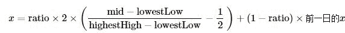
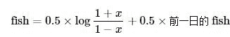
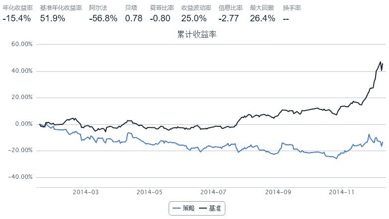
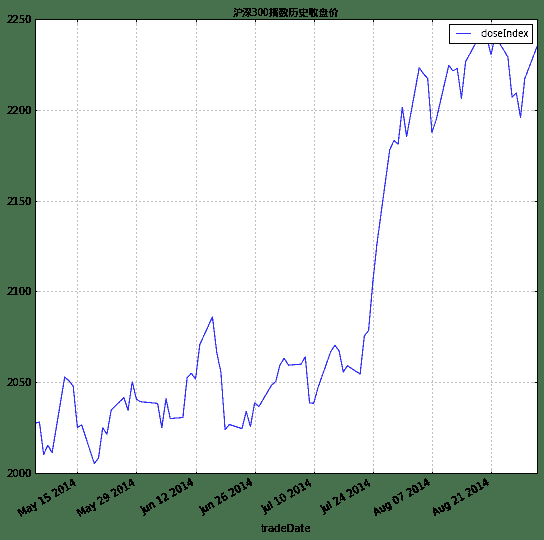
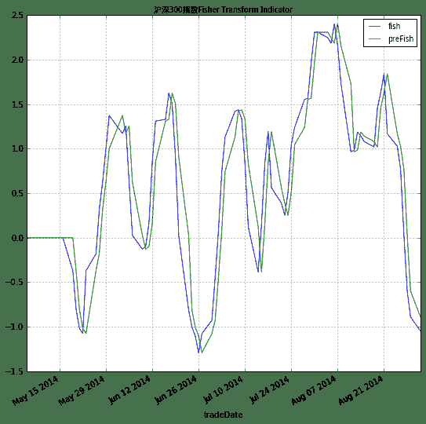

# 5.11 Fisher Transform · Using Fisher Transform Indicator

> 来源：https://uqer.io/community/share/54b5c288f9f06c276f651a16

## 策略思路：

在技术分析中，很多时候，人们都把股价数据当作正态分布的数据来分析。但是，其实股价数据分布并不符合正态分布。Fisher Transformation是一个可以把股价数据变为类似于正态分布的方法。

Fisher Transformation将市场数据的走势平滑化，去掉了一些尖锐的短期振荡；利用今日和前一日该指标的交错可以给出交易信号；

例如，对于沪深300指数使用Fisher变换的结果见本文后面的具体讨论。

## Fisher Transformation

+   定义今日中间价：

    ```
    mid=(low+high)/2
    ```

+   确定计算周期，例如可使用10日为周期。计算周期内最高价和最低价：

    ```
    lowestLow=周期内最低价，    highestHigh=周期内最高价
    ```

+   定义价变参数（其中的`ratio`为0-1之间常数，例如可取0.5或0.33）：

    

+   对价变参数`x`使用Fisher变换，得到Fisher指标：

    

```py
import quartz
import quartz.backtest    as qb
import quartz.performance as qp
from   quartz.api         import *

import pandas as pd
import numpy  as np
from datetime   import datetime
from matplotlib import pylab
```

```py
start = datetime(2014, 1, 1)				# 回测起始时间
end   = datetime(2014, 12, 10)				# 回测结束时间
benchmark = 'HS300'							# 使用沪深 300 作为参考标准
universe = set_universe('SH50')	# 股票池
capital_base = 100000                       # 起始资金


refresh_rate = 1
window = 10

# 本策略对于window非常非常敏感！！！

histFish = pd.DataFrame(0.0, index = universe, columns = ['preDiff', 'preFish', 'preState'])

def initialize(account):                    # 初始化虚拟账户状态
    account.amount = 10000
    account.universe = universe
    add_history('hist', window)
    

def handle_data(account):				# 每个交易日的买入卖出指令
    
    for stk in account.universe:
        prices = account.hist[stk]
        if prices is None:
            return
        
        preDiff = histFish.at[stk, 'preDiff']
        preFish = histFish.at[stk, 'preFish']
        preState = histFish.at[stk, 'preState']
        
        diff, fish = FisherTransIndicator(prices, preDiff, preFish)
        if fish > preFish:
            state = 1
        elif fish < preFish:
            state = -1
        else:
            state = 0
        
        if state == 1 and preState == -1:
            #stkAmount = int(account.amount / prices.iloc[-1]['openPrice'])
            order(stk, account.amount)
        elif state == -1 and preState == 1:
            order_to(stk, 0)
        
        histFish.at[stk, 'preDiff'] = diff
        histFish.at[stk, 'preFish'] = fish
        histFish.at[stk, 'preState'] = state
            
        
def FisherTransIndicator(windowData, preDiff, preFish):
    # This function calculate the Fisher Transform indicator based on the data
    # in the windowData. 
    minLowPrice = min(windowData['lowPrice'])
    maxHghPrice = max(windowData['highPrice'])
    tdyMidPrice = (windowData.iloc[-1]['lowPrice'] + windowData.iloc[-1]['highPrice'])/2.0
    
    diffRatio = 0.33
    # 本策略对于diffRatio同样非常敏感！！！
    
    diff = (tdyMidPrice - minLowPrice)/(maxHghPrice - minLowPrice) - 0.5
    diff = 2 * diff
    diff = diffRatio * diff + (1.0 - diffRatio) * preDiff
    
    if diff > 0.99:
        diff = 0.999
    elif diff < -0.99:
        diff = -0.999
    
    fish = np.log((1.0 + diff)/(1.0 - diff))
    fish = 0.5 * fish + 0.5 * fish
        
    return diff, fish
```



## 沪深300指数上使用Fisher Transformation

+ 对最近半年的沪深300进行Fisher变换，得到的指标能够比较温和准确反映出指数的变化

```py
from CAL.PyCAL import *

# DataAPI.MktIdxdGet返回pandas.DataFrame格式
index =  DataAPI.MktIdxdGet(indexID = "000001.ZICN", beginDate = "20140501", endDate = "20140901")
```

```py
index.head()
```

|  | indexID | tradeDate | ticker | secShortName | exchangeCD | preCloseIndex | openIndex | lowestIndex | highestIndex | closeIndex | turnoverVol | turnoverValue | CHG | CHGPct |
| --- | --- |
| 0 |  000001.ZICN | 2014-05-05 |  1 |  上证综指 |  XSHG |  2026.358 |  2022.178 |  2007.351 |  2028.957 |  2027.353 |  7993339500 |  60093487736 |   0.995 |  0.00049 |
| 1 |  000001.ZICN | 2014-05-06 |  1 |  上证综指 |  XSHG |  2027.353 |  2024.256 |  2021.485 |  2038.705 |  2028.038 |  7460941100 |  57548110850 |   0.685 |  0.00034 |
| 2 |  000001.ZICN | 2014-05-07 |  1 |  上证综指 |  XSHG |  2028.038 |  2023.152 |  2008.451 |  2024.631 |  2010.083 |  7436019200 |  57558051925 | -17.955 | -0.00885 |
| 3 |  000001.ZICN | 2014-05-08 |  1 |  上证综指 |  XSHG |  2010.083 |  2006.853 |  2005.685 |  2036.941 |  2015.274 |  7786539300 |  59529365546 |   5.191 |  0.00258 |
| 4 |  000001.ZICN | 2014-05-09 |  1 |  上证综指 |  XSHG |  2015.274 |  2016.501 |  2001.300 |  2020.454 |  2011.135 |  7622424400 |  57505383717 |  -4.139 | -0.00205 |

```py
def FisherTransIndicator(windowData, preDiff, preFish, state):
    # This function calculate the Fisher Transform indicator based on the data
    # in the windowData. 
    minLowPrice = min(windowData['lowestIndex'])
    maxHghPrice = max(windowData['highestIndex'])
    tdyMidPrice = (windowData.iloc[-1]['lowestIndex'] + windowData.iloc[-1]['highestIndex'])/2.0
    
    diffRatio = 0.5
    
    diff = (tdyMidPrice - minLowPrice)/(maxHghPrice - minLowPrice) - 0.5
    diff = 2 * diff

    if state == 1:
        diff = diffRatio * diff + (1 - diffRatio) * preDiff
    
    if diff > 0.995:
        diff = 0.999
    elif diff < -0.995:
        diff = -0.999
    
    fish = np.log((1 + diff)/(1 - diff))
    if state == 1:
        fish = 0.5 * fish + 0.5 * fish
        
    return diff, fish
```

```py
window = 10

index['diff'] = 0.0
index['fish'] = 0.0
index['preFish'] = 0.0

for i in range(window, index.shape[0]):
    windowData = index.iloc[i-window : i]
    if i == window:
        diff, fish = FisherTransIndicator(windowData, 0, 0, 1)
        index.at[i,'preFish'] = 0
        index.at[i,'diff'] = diff
        index.at[i,'fish'] = fish
    else:
        preDiff = index.iloc[i-1]['diff']
        preFish = index.iloc[i-1]['fish']
        diff, fish = FisherTransIndicator(windowData, preDiff, preFish, 1)
        index.at[i,'preFish'] = preFish
        index.at[i,'diff'] = diff
        index.at[i,'fish'] = fish
        
        
Plot(index, settings = {'x':'tradeDate','y':'closeIndex', 'title':u'沪深300指数历史收盘价'})
Plot(index, settings = {'x':'tradeDate','y':['fish', 'preFish'], 'title':u'沪深300指数Fisher Transform Indicator'})
```





+ 上图中的蓝色曲线表示Fisher指标，绿色曲线表示前一日的Fisher指标，两个指标的交错可以给出沪深300指数涨跌情况的信号

