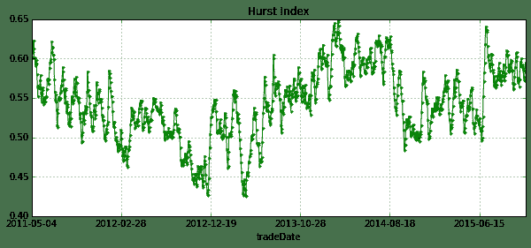

# 5.12 分型假说， Hurst 指数 · 分形市场假说，一个听起来很美的假说

> 来源：https://uqer.io/community/share/564c3bc2f9f06c4446b48393

## 写在前面

+ 9月的时候说想把arch包加进去，昨儿发现优矿已经加好了，由于优矿暂时没有开放历史高频接口，我索性就分享一个冷冷的小知识：分形市场假说（FMH），分析中玩的是低频数据（日线，或者分钟线）。

+ 所谓分形市场假说，就是人们发现有效市场假说的种种不合理后，提出的一种假说，我曾经有仔细关注过这一块，因为这个假说真是太「中国特色」了：

它有几个主要论点：

1.  当市场是由各种投资期限的投资者组成时，市场是稳定的（长期投资者和短期投资者），当投资者单一时，则市场会出流动性问题； 　　
1.  信息集对基本分析和技术分析来讲短期影响比长期影响要大； 　　
1.  当某一事件的出现使得基础分析的有效性值得怀疑时，长期投资者或者停止入市操作或者基于短期信息进行买卖； 　　
1.  价格是短期技术分析和长期基础分析的综合反应； 　　
1.  如果某种证券与经济周期无关，那么它本身就不存在长期趋势。此时，交易行为、市场流动性和短期信息将占主导地位。

总之就是一个具有「正反馈、非线性、分形、混沌、耗散」等等很牛逼的概念，深深吸引着曾经学过物理学的我。。。

## 关于Hurst指数以及MF-DFA

+ 现在对于分形市场假说的主要方法论就是 Hurst指数，通过MF-DFA（Multifractal detrended fluctuation analysis）来计算， 具体的可以维基百科一下，大体就是当hurst>0.5时时间序列是一个persistent的过程，当hurst>0.5时时间序列是一个anti-persistent的过程，当hurst=0.5时间序列是一个不存在记忆的随机游走过程。
+ 
+ 而在实际计算中，不会以理论值0.5作为标准（一般会略大于0.5）

## 写在最后

+ 这份工作来自于LADISLAV KRISTOUFEK这位教授在12年的工作，论文名叫做RACTAL MARKETS HYPOTHESIS AND THE GLOBAL FINANCIAL CRISIS: SCALING, INVESTMENT HORIZONS AND LIQUIDITY
+ 这位教授后来在13年把这项工作强化了一下（加了点小波的方法），把论文的图画得美美哒，竟然发表在了Nature的子刊Scientific Report上。当年我的导师发了一篇SR可是全校通报表扬啊，虽然现在我以前在物理系的导师说今年有4篇SR发表。。
+ 总之，如果谁对这个感兴趣，或者想在Nature上水一篇文章，可以研究研究。
+ 这个方法对设计策略有没有什么用？ 好像没有用哎，所以我发表在「研究」板块里了哈。不过10年海通有研究员测试过根据这个方法写的策略，据说alpha还不错。
+ 算法部分我用的是自己的library库。

```py
import numpy as np
import pandas as pd
from arch import arch_model # GARCH(1,1)
from matplotlib import pyplot as plt
from datetime import timedelta
from CAL.PyCAL import *
from lib.Hurst import * 
```

```py
inter = 320 #滑动时间窗口
#设置时间
today = Date.todaysDate()
beginDate = '20100101' 
endDate = today.toDateTime().strftime('%Y%m%d') 

#设置指数类型
indexLabel = '000001' # SSE index
#indexLabel = '399006' # CYB index

#读取指数
indexPrice = DataAPI.MktIdxdGet(ticker=indexLabel,beginDate=beginDate,endDate=endDate,field=["tradeDate","closeIndex"],pandas="1")
price = np.array(indexPrice.loc[:,'closeIndex'])

#计算对数收益
back_price = np.append(price[0],price.copy())
back_price = back_price[:-1] 
return_price = np.log(price) - np.log(back_price)

#计算波动率 from GARCH(1,1)
am = arch_model(return_price) 
res = am.fit()
sqt_h = res.conditional_volatility

#去除波动性
f = return_price/sqt_h

#计算hurst指数,函数来自自定义library
hurst = Hurst(f,T=inter,step=1,q=2,Smin=10,Smax=50,Sintr=1)

indexPrice['Hurst'] = pd.DataFrame(np.array([0] * len(indexPrice)))
indexPrice.loc[inter-1:,'Hurst'] = hurst
indexPrice.index = indexPrice['tradeDate']

Iteration:      1,   Func. Count:      6,   Neg. LLF: -4149.56463466
Optimization terminated successfully.    (Exit mode 0)
            Current function value: -4151.74496903
            Iterations: 1
            Function evaluations: 17
            Gradient evaluations: 1
```

```py
plt.figure(figsize=(10,6))
plt.subplot(3,1,1)
plt.plot(f)
plt.subplot(3,1,2)
plt.plot(return_price)
plt.subplot(3,1,3)
plt.plot(sqt_h)

[<matplotlib.lines.Line2D at 0x95065d0>]
```


上面的图能够看到`garch(1,1)`到底做了什么，它主要是对波动率进行了建模，在做分析时消去了这部分的影响。

```py
plt.figure(1)
indexPrice['closeIndex'].tail(len(indexPrice)-inter).plot(figsize=(10,4),color='red',title='SSE Index',linewidth=1)
plt.figure(2)
indexPrice['Hurst'].tail(len(indexPrice)-inter).plot(figsize=(10,4),color='green',title='Hurst Index',linewidth=1,marker='.')

<matplotlib.axes.AxesSubplot at 0x95ae390>
```




+   看出了啥没？简单点说，就是hurst越大，越有可能延续之前的趋势（即动量），若hurst越小，则越有可能违反之前的趋势（即反转）。LADISLAV KRISTOUFEK这位教授的想法是通过极大极小值来判断，当然它分析的是美股啦。
+    再看看上面的图，是对上证指数的分析，取的是日线的数据（其实我喜欢用分钟线，因为A股波动辣么牛逼，日线颗粒度哪里够啊。。），可以得（meng）出这些结论：
    +   13年中旬hurst出现最小值，说明熊市的跌势要反转了，马上要进入牛市了？！
    +   15年中旬hurst出现最小值，说明牛市的涨势要反转了，马上要进入熊市了？！
+   算卦完毕。

