# 5.13 变点理论 · 变点策略初步

> 来源：https://uqer.io/community/share/5667d533f9f06c6c8a91b61c

寻找变点

## 1.变点理论

变点理论是统计学中的一个经典分支，其基本定义是在一个序列或过程中，当某个统计特性（分布类型、分布参数）在某时间点受系统性因素而非偶然性因素影响发生变化，我们就称该时间点为变点。变点识别即利用统计量或统计方法将该变点位置估计出来。

CUSUM图作为工业应用检验变点的三大控制图之一，其利用假设检验和极大似然估计的相关统计原理，构建累积和统计量，不断累积观察值与基线水平的差值，将微小偏差累积，放大观察数据出现的波动，从而更加迅速敏感地探测到微小的异常情况，检验出变点位置。其最大的特点是对系统性变化的敏感性，不需要积累太多的样本，因而能较好的控制风险。

基于变点CUSUM图的基本原理，以股价对数收益率符合局部正态分布为基本原理，构建CUSUM的上下统计量，一旦统计量突破阈值即判断出现变点。以股价上升时对数收益率出现上升变点作为买入时机，以股价下降时对数收益率出现下降变点作为卖出时机。统计量中的两个参数，允偏量k设置为动态变化自适应的形式，阈值h则需要根据直观进行设定。

## 2.CUSUM原理

CUSUM控制图的设计思想是对信息加以累积，将过程的小偏移累加起来，达到放大的结果，从而提高检验小偏移的灵敏度。CUSUM作为一个统计量，其由来具有严格的数学推理，总的来说，是一个变点假设检验通过极大似然法推导得到的统计量。

令`xi`（it）为独立的`N(δ,1)`同分布，其中`t`为未知变点，对于给定的观察序列`xn`，假设`t=v`，如此构成一个假设检验问题:

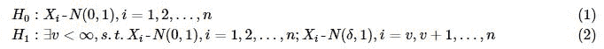

则似然比统计量为(以`Φ(`表示标准正态分布`N(0,1)`的分布密度函数）:

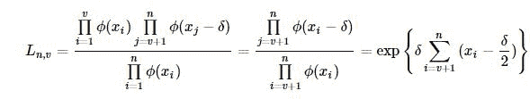

对数化为：

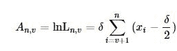

假设变量有偏移，则其对数似然统计量为:


若我们检验的为向上偏移，即`δ>0`，上述的对数似然统计量等价于下面统计量

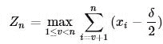

设`n-1` 个观测值没有均值偏移，即

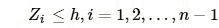

`h`为门限。如果在时刻`n`，满足:

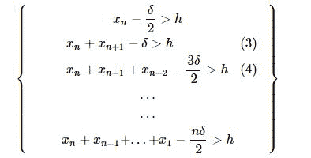

则这个过程发生了均值偏移。以下记号推导有:

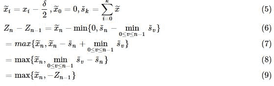

用不定参数`k`代替`δ/2`，就得到了`Zn`的递推公式：

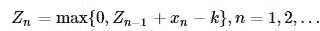

若设定报警门限为`h>0`，如果在第`n`个观察点满足：

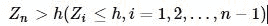

则报警，确定在`n`以前的统计量发生了均值向上偏移，判断有系统性因素而非偶然性因素存在。 向下偏移也可通过类似的推导得到。

## 3.具体应用

由CUSUM的推导分析，我们得到CUSUM统计量，即：

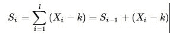

其中`X`为金融序列，令`yi=Xi−k`，其中k为允偏量。上下预警指标分别为

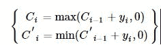

若预警指标分别达到上下阈值`h`，则对应地产生上变点和下变点。

```
Ci≥h,C′i≤−h
```

## 4.参数设定

（1）允偏量k值

经过正态分布标准化后的假设检验，即变点前的数据服从`N(0,1)`分布，变点后的数据服从`N(δ,1)`分布。累积和控制图的算法设计是基于既定的观测值偏移量，即控制图参数`k`，理论上`k=δ/2`时控制图的效果最好，其中，`δ`即为观测值`X`的偏移量。但是实际情形下，`δ`是未知量，也是我们需要检测的值，同时`δ`会随采样时间`t`变化，其大小决定了累积和控制图参数`k`的取值，并通过`k`的变化影响控制图的统计性能，所以有必要对`δ`进行动态预测和更新。

这里基于已检测的历史数据和待检测的点作一个动态设定。运用已知历史序列拟合参数`mu`和`sigma`，再将历史数据和待检测点进行标准正态化，则历史数据的均值为0，而待测点的值为`x`。在某种程度上，可将标准化后的历史数据看作`N(0,1)`分布，而将待检测点看作`N(x,1)`分布，按照CUSUM的推导，设置`k=x/2`

2）阈值`h` 在参数检验中，为使得观测数据尽量复合假设，需要将观测到的数据正态标准化，所以阈值h的设置在一定程度上相当于标准正态分布参数的选定，参考布林带的做法，我们将`h`定为2（布林带标准差的倍数一般为2）。

## 5.算法步骤

a) 选取数据段`x0`，计算对数收益率`r`；

b) 从数据段`x0`的第一个数据开始，以第一第二个数据为初始数据段`startdata`，进行正态分布拟合，得到均值`mu`和标准差`sigma`，选择数据段外的第一个数据（整体样本的第三个数据），合成实验数据段data，并利用`mu`和`sigma`值进行归一化，得到标准正态分布序列（近似）`x`；

c) 允偏量`k`采取动态变化，为归一化后序列`x`的最后一个数值的一半，计算上下CUSUM统计量，判断`x`序列最后一个数是否超出CUSUM阈值，若超出，对`x`序列最后一个点进行变点标记；若不超出，往后迭代，直至出现变点标记为止；

d) 从`x0`第二个点开始，重现选择数据段，依照a)、b)步骤标记变点，直至标记完所有的起点为止；

e) 若该点存在标记数，则判断该点为变点；

f) 在变点中选择处于股价上升路径的上升变点以及股价处于下降路径中的下降变点，以此确定拐点和拐点方向。 流程图如下：

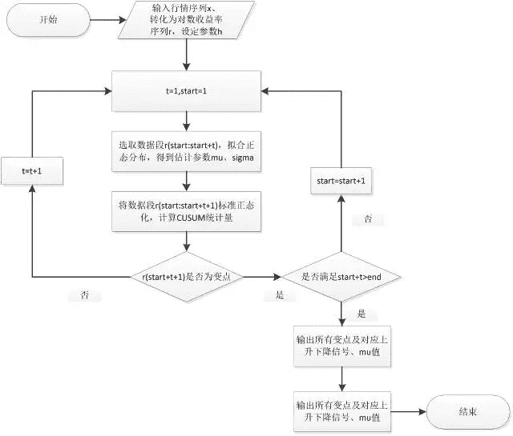

## 6.初步程序

原理部分来源于长江金工（作者：刘胜利），更加全面的可见（ http://mp.weixin.qq.com/s?__biz=MzA3ODIyNjMzNA==&mid=210838858&idx=1&sn=e850063b81844cac4ff96177354a9535&scene=1&srcid=1110LMZHGjtVUAIzMhUYGvKG#rd ）

根据上述原理初步编了一个寻找变点的程序（好几周之前了=_=,之前把所有的变点都成功得到过，只不过忘了加对于价格的判断），但是不会把它变成策略。不知道为什么，原来可以成功print出变点的程序现在运行不完，一直处于运行中。原来不加价格的判断运行一会儿interrupt后有部分结果，，加了价格判断一直只有一个结果。。。看到社区有关于变点策略的讨论，就把自己之前写的Po出来(关于元素的引用我自己绕了好久+1.-1...)，希望社区的老师们批评指正~

```py
import numpy as np
import pandas as pd
import scipy.stats as stats
from pandas import Series, DataFrame
data1=DataAPI.MktEqudGet(ticker="600837",beginDate='20140101',endDate='20151120',field='ticker,secShortName,tradeDate,openPrice',pandas="1")
price = data1['openPrice'].values                    #取出价格
lnp = np.log(price)                              #取对数
h = 2                                       #设定参数h
R = []                                       #建立一个空列表用于存放对数收益率
i = 1
while i < len(lnp):
    r = lnp[i]-lnp[i-1]
    i = i+1
    R.append(r)                                 #得到对数收益率序列
start = 1
t = 1
while start+t <= len(R)-1:
    d = R[(start-1):(start-1+t+1)]
    mu,sigma = stats.norm.fit(d)                     #用前面的数据进行正态分布拟合
    OR = (R[start-1:start-1+t+1+1]-mu)/sigma             #对该数据段进行标准化
    k = OR[-1]/2                                #允偏量设定为归一化后序列的最后一个数值的一半
    j = 1
    s = 0
    while j < t+2:                              #(start-1+t+1+1)-(start-1)=t+2
        s = s + OR[j-1]-k                        #计算CUSUM
        j = j+1  
    if s>0:                                     #判断正负
        c1 = max(s,0)
        if price[start+t] > price[start+t-1] and c1 > h:      #判断是否价格上升并冲破阈值，大于h则买入
            print 'c1 = ',c1,start+t                  #start+t即为第(start+t)个变点
            start = start+1
        elif c1 < h:
            t = t+1                             #继续向后迭代直至出现变点为止
    elif s<0:
        c2 = min(s,0)
        if price[start+t] < price[start+t-1] and c2 < -h:     #判断是否价格下降并冲破阈值，小于-h则卖出
            print 'c2 = ',c2,start+t
            start = start+1
        elif c2 > -h:
            t = t+1

c2 =  -2.66368724271 3
```
