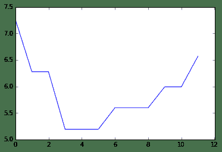

# Zscore Model Tutorial

> 来源：https://uqer.io/community/share/54ab4407f9f06c276f6519ec


## 1. 什么是 Zscore Model

信用风险评分方法通常包括定性法、单变量法、多变量法，目前广泛采用多变量方法包括如判别分析(discriminant analysis)、逻辑回归(logit regression)和非线性模型如神经网络等。奥特曼博士于1968年发表的Z-score模型基于多变量判别分析方法。

Z-score模型基于各变量加权得分对企业是否破产进行判断，在Z-score原始模型中，得分高于2.99的属于“安全”区域、低于1.80的属于“困境”区域，两个得分之间的属于“灰色”区域。

Z-score模型在美国企业如柯达、通用汽车的破产预测得到了很好的结果。

## 2. 本模块提供的 Zscore Model

下面我们从原理，模型公式，划分区间三个方面来简单介绍一下本模块中的两个Z-score模型：

### 2.1 All Corporate Bonds

模型原理

+ No equity prices are needed
+ Uses discriminant analysis methodology
+ Coefficients are obtained from China distressed firm dataset from historical periods

模型公式

```
ZScore = 0.517 - 0.460*TotalLiabilities/TotalAssets  
          + 9.320*NetProfit/0.5*(TotalAssets+TotalAssets[last])
          + 0.388*WorkingCapital/TotalAssets
          + 1.158*RetainedEarnings/TotalAssets
        = 0.517 - 0.460*x1
          + 9.320*2/x2
          + 0.388*x3
          + 1.158*x4 
```

划分区间

+ `Z-score < 0.5`: 已经违约
+ `0.5 < Z-score < 0.9`: 有违约的可能性
+ `Z-score > 0.9`: 财务健康，短期内不会出现违约情况

### 2.2 Corporate Bonds with Equity Listings

模型原理

+ Uses Equity Prices: Information from equity set
+ Uses discriminant analysis methodology
+ Coefficients are obtained from China distressed firm dataset from historical periods

模型公式

```
ZScore = 0.2086*x1 + 4.3465*x2 + 4.9601*x3
             x1: market value/book value of TotalLiabilities
             x2: total sales/TotalAssets
             x3: (TotalAssets-TotalAssets[last])/TotalAssets[last]
coef = [0.2086, 4.3465, 4.9601] 
```

划分区间

+ `Z-score < 1.5408`: 已经违约
+ `Z-score > 1.5408`: 财务健康，短期内不会出现违约情况

## 3. 如何实用本模块提供的 Zscore Model 接口

本模块目前提供了四个Z-score模型接口，分别如下：

### 3.1 `zscore_ACB`

```
---
Interface for calculating zscore using ACB.
parameter:
    ticker[string]: ticker code
parameter[opt]:
    begin[int]: year begin, default 2010
    end[int]: year end, default 2014
    coef[list of int]: coefficients for Zscore Model, default [0.517, -0.460, 18.640, 0.388, 1.158]
---
when success, will return factors and status code, as a dict;
when failed for some reason, will return error message and error code, as a dict;
---
Model ACB:
    All Corporate Bonds
    ZScore = 0.517 - 0.460*TotalLiabilities/TotalAssets
             + 9.320*NetProfit/0.5*(TotalAssets+TotalAssets[last])
             + 0.388*WorkingCapital/TotalAssets
             + 1.158*RetainedEarnings/TotalAssets
           = 0.517 - 0.460*x1
                + 9.320*2/x2
                + 0.388*x3
                + 1.158*x4
    coef = [0.517, -0.460, 18.640, 0.388, 1.158] 
```

### 3.2 `zscore_ACB_List`

```
---
Interface for calculating zscore using ACB.
parameter:
    ticker[list]: ticker code
parameter[opt]:
    begin[int or list]: year begin, default 2010
    end[int or list]: year end, default 2014
    coef[list of int]: coefficients for Zscore Model, default [0.517, -0.460, 18.640, 0.388, 1.158]
--- 
```

### 3.3 `zscore_ACBEL`

```
---
Interface for calculating zscore using ACBEL.
parameter:
    ticker[string]: ticker code
parameter[opt]:
    begin[int]: year begin, default 2010
    end[int]: year end, default 2014
    coef[list of int]: coefficients for model, default [0.2086, 4.3465, 4.9601]
---
when success, will return factors and status code, as a dict;
when failed for some reason, will return error message and error code, as a dict;
---
Model ACB:
    All Corporate Bonds with Equity Listings
    ZScore = 0.2086*x1 + 4.3465*x2 + 4.9601*x3
            x1: market value/book value of TotalLiabilities
            x2: total sales/TotalAssets
            x3: (TotalAssets-TotalAssets[last])/TotalAssets[last]
    coef = [0.2086, 4.3465, 4.9601]
--- 
```

### 3.4 `zscore_ACBEL_List`

```
---
Interface for calculating zscore using ACBEL.
parameter:
    ticker[list]: ticker code
parameter[opt]:
    begin[int or list]: year begin, default 2010
    end[int or list]: year end, default 2014
    coef[list of int]: coefficients for Zscore Model, default [0.2086, 4.3465, 4.9601]
--- 
```

## 4. 一个 Zscore Model 实例

相关步骤说明如下：

+ 4.1 导出该模块
+ 4.2 输入股票代码，可选择性输入计算时间区间，以年为单位
+ 4.3 得到计算结果
+ 4.4 作图分析

```py
# 4.1 & 4.2
GZMT = zscore_ACB('600519')

# 4.3
factors = GZMT['factors']

# 4.4
from matplotlib.pylab import   plot
plot(factors['zscore'])

[<matplotlib.lines.Line2D at 0x4eda750>]
```



## 5. 本模块未来版本规划

为适应光大金融人士更加方便地使用 Z-Score Model，本模块将在以下几个方面对本模块的未来版本进行规划：

+ 更加简单：提供上传模板，用户只需按照一定格式上传自己持仓的 excel 表格，即可在零编码的情况下得到相应持仓债券、股票发行人的 Z-Score 情况；
+ 更加灵活：将会允许用户在我们定义的两个 Z-Score 模型的相关系数；
+ 更加智能：预计提供给用户将近50个公司财务相关的因子，由用户自定义因子和相关的系数来计算 Z-Score 值；

