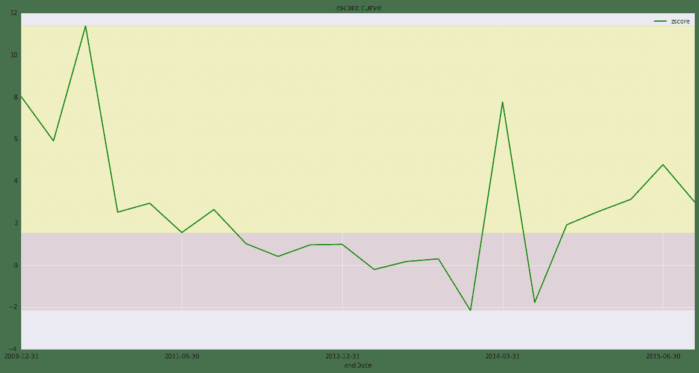
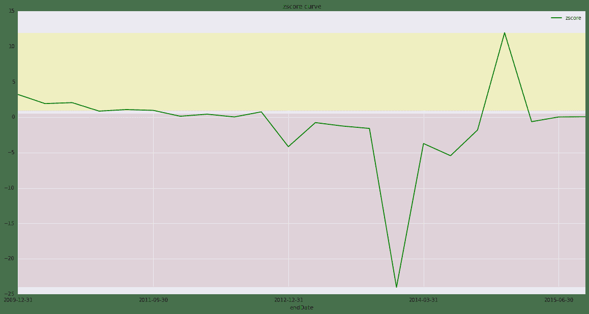

# user-defined package

# Const Variable
```

获取数据，清洗数据

```py
def data_for_acb(ticker="000001", tstart=2010, tend=2015):
    """获取，清洗 ACB 模型所需要的数据。
    
    ACB 模型需要数据：
        负债合计［TLiab］
        资产总计［TAssets］
        未分配利润［retainedEarnings］
        净利润［NIncome］
        营运资本 = 资产总计 - 负债合计
    """
    bs_data = DataAPI.FdmtBSGet(ticker=ticker, beginYear=tstart-1, endYear=tend, 
                                field=['secID', 'endDate', 'publishDate', 'TLiab', 'TAssets', 'retainedEarnings'])
    is_data = DataAPI.FdmtISGet(ticker=ticker, beginYear=tstart-1, endYear=tend, 
                                field=['secID', 'endDate', 'publishDate', 'NIncome'])
    bs_data = bs_data.drop_duplicates('endDate')
    is_data = is_data.drop_duplicates('endDate')
    
    data = is_data.merge(bs_data, on=['secID', 'endDate'])
    
    # calculate TAssets diff of current and last report
    pre_TAssets = []
    length = len(data)
    
    for index, number in enumerate(data.TAssets):
        if index + 1 == length:
            last_number = index
        else:
            last_number = index + 1
        pre_TAssets.append(data.TAssets[last_number])

    data['TAssetsPre'] = pre_TAssets
    
    return data

def data_for_acbel(ticker="000001", tstart=2010, tend=2015):
    """获取，清洗 ACB 模型所需要的数据。
    
    ACB 模型需要数据：
        负债合计［TLiab］
        资产总计［TAssets］
        未分配利润［retainedEarnings］
        净利润［NIncome］
        营业总收入［tRevenue］
        总市值［marketValue］
    """
    bs_data = DataAPI.FdmtBSGet(ticker=ticker, beginYear=tstart-1, endYear=tend, 
                                field=['secID', 'endDate', 'publishDate', 'TLiab', 'TAssets', 'retainedEarnings'])
    is_data = DataAPI.FdmtISGet(ticker=ticker, beginYear=tstart-1, endYear=tend, 
                                field=['secID', 'endDate', 'publishDate', 'NIncome', 'tRevenue'])
    market_data = DataAPI.MktEqudGet(ticker=ticker,  field=['secID', 'tradeDate', 'marketValue'])
    market_data.rename(columns={'tradeDate': 'endDate'}, inplace=True)
    bs_data = bs_data.drop_duplicates('endDate')
    is_data = is_data.drop_duplicates('endDate')
    
    data = is_data.merge(bs_data, on=['secID', 'endDate'])
    endDate = list(data.endDate)
    data = data.merge(market_data, on=['secID', 'endDate'], how='outer')
    data.marketValue = data.marketValue.fillna(method='ffill')
    data = data[data.endDate.isin(endDate)]
    # calculate TAssets diff of current and last report
    pre_TAssets = []
    length = len(data)
    
    for index, number in enumerate(data.TAssets):
        if index + 1 == length:
            last_number = index
        else:
            last_number = index + 1
        pre_TAssets.append(data.TAssets[last_number])

    data['TAssetsPre'] = pre_TAssets
    
    return data
```

测试：获取数据，清洗数据

```py
data_for_acb("002056").head(5)
```


| | secID | endDate | publishDate_x | NIncome | publishDate_y | TLiab | TAssets | retainedEarnings | TAssetsPre |
| --- | --- |
| 0 | 002056.XSHE | 2015-09-30 | 2015-10-28 | 2.657156e+08 | 2015-10-28 | 1.672345e+09 | 5.129504e+09 | 1.401169e+09 | 4.820643e+09 |
| 1 | 002056.XSHE | 2015-06-30 | 2015-08-27 | 1.482967e+08 | 2015-08-27 | 1.486623e+09 | 4.820643e+09 | 1.283617e+09 | 4.721675e+09 |
| 2 | 002056.XSHE | 2015-03-31 | 2015-04-27 | 6.872527e+07 | 2015-04-27 | 1.466576e+09 | 4.721675e+09 | 1.204153e+09 | 4.782852e+09 |
| 3 | 002056.XSHE | 2014-12-31 | 2015-03-28 | 3.814308e+08 | 2015-10-28 | 1.484829e+09 | 4.782852e+09 | 1.250498e+09 | 4.809435e+09 |
| 4 | 002056.XSHE | 2014-09-30 | 2015-10-28 | 9.175491e+07 | 2014-10-24 | 1.630937e+09 | 4.809435e+09 | 1.170975e+09 | 4.658186e+09 |

```py
data_for_acbel("002056").head(5)
```

| | secID | endDate | publishDate_x | NIncome | tRevenue | publishDate_y | TLiab | TAssets | retainedEarnings | marketValue | TAssetsPre |
| --- | --- |
| 0 | 002056.XSHE | 2015-09-30 | 2015-10-28 | 2.657156e+08 | 2.882585e+09 | 2015-10-28 | 1.672345e+09 | 5.129504e+09 | 1.401169e+09 | 7790664000 | 4.820643e+09 |
| 1 | 002056.XSHE | 2015-06-30 | 2015-08-27 | 1.482967e+08 | 1.800482e+09 | 2015-08-27 | 1.486623e+09 | 4.820643e+09 | 1.283617e+09 | 12852952000 | 4.721675e+09 |
| 2 | 002056.XSHE | 2015-03-31 | 2015-04-27 | 6.872527e+07 | 8.511258e+08 | 2015-04-27 | 1.466576e+09 | 4.721675e+09 | 1.204153e+09 | 12064024000 | 4.782852e+09 |
| 3 | 002056.XSHE | 2014-12-31 | 2015-03-28 | 3.814308e+08 | 3.668800e+09 | 2015-10-28 | 1.484829e+09 | 4.782852e+09 | 1.250498e+09 | 9019255000 | 4.809435e+09 |
| 4 | 002056.XSHE | 2014-09-30 | 2015-10-28 | 9.175491e+07 | 9.342650e+08 | 2014-10-24 | 1.630937e+09 | 4.809435e+09 | 1.170975e+09 | 9187724000 | 4.658186e+09 |

计算 Z-score

```py
def zscore_ACB(ticker=None, tstart=2010, tend=2015, coef=[0.517, -0.460, 18.640, 0.388, 1.158]):
    # step 1. get data and pre-calculate the factor
    ticker = data_for_acb(ticker, tstart, tend)
    ticker['x0'] = 1
    ticker['x1'] = ticker['TLiab'] / ticker['TAssets']
    ticker['x2'] = ticker['NIncome'] * 2 / (ticker['TAssets'] + ticker['TAssetsPre'])
    ticker['x3'] = (ticker['TAssets'] - ticker['TLiab']) / ticker['TAssets']
    ticker['x4'] = ticker['retainedEarnings'] / ticker['TAssets']

    # step 2. calculate zscore 
    tmp = ticker[['x0', 'x1', 'x2', 'x3', 'x4']] * coef
    ticker['zscore'] = tmp.sum(axis=1)

    # step 3. build result
    ticker.sort('endDate', ascending=True, inplace=True)
    return ticker[['secID', 'endDate', 'NIncome', 'TLiab', 'TAssets', 
                   'retainedEarnings', 'x0', 'x1', 'x2', 'x3', 'x4', 'zscore']]


def zscore_ACBEL(ticker=None, tstart=2010, tend=2015, coef=[0.2086, 4.3465, 4.9601]):
    # step 1. get data and pre-calculate the factor
    ticker = data_for_acbel(ticker, tstart, tend)
    ticker['x0'] = ticker['marketValue'] / ticker['TLiab']
    ticker['x1'] = ticker['tRevenue'] / ticker['TAssets']
    ticker['x2'] = (ticker['TAssets'] - ticker['TAssetsPre']) / ticker['TAssetsPre']

    # step 2. calculate zscore 
    tmp = ticker[['x0', 'x1', 'x2']] * coef
    ticker['zscore'] = tmp.sum(axis=1)
    
    # step 3. build result
    ticker.sort('endDate', ascending=True, inplace=True)
    return ticker[['secID', 'endDate', 'NIncome', 'TLiab', 'tRevenue', 'TAssets', 
                   'retainedEarnings', 'marketValue', 'TAssetsPre', 'x0', 'x1', 'x2', 'zscore']]

def get_ticker(bond=None):
    """Get the ticker number of a bond.
    """
    # bondID -> partyID -> ticker
    partyID = None
    try:
        data = DataAPI.BondGet(ticker=bond)
        partyID = data['partyID'][0]
    except:
        return 'Cannot find this bond in DataAPI'

    ticker = None
    try:
        data = DataAPI.SecIDGet(partyID=str(partyID))
        ticker = data['ticker'][0]
    except:
        return 'Cannot find the ticker for this bond in DataAPI, maybe the issuer is not listed'

    return ticker
```

测试：计算 Z-score

```py
zscore_ACB("002506").head(5)
```


| | secID | endDate | NIncome | TLiab | TAssets | retainedEarnings | x0 | x1 | x2 | x3 | x4 | zscore |
| --- | --- |
| 21 | 002506.XSHE | 2009-12-31 | 1.699573e+08 | 7.039600e+08 | 1.262617e+09 | 2.845660e+08 | 1 | 0.557540 | 0.134607 | 0.442460 | 0.225378 | 3.202272 |
| 20 | 002506.XSHE | 2010-09-30 | 1.051847e+08 | 1.131338e+09 | 1.848964e+09 | 4.404125e+08 | 1 | 0.611877 | 0.067609 | 0.388123 | 0.238194 | 1.922180 |
| 19 | 002506.XSHE | 2010-12-31 | 2.194191e+08 | 1.398571e+09 | 4.466591e+09 | 4.881275e+08 | 1 | 0.313118 | 0.069485 | 0.686882 | 0.109284 | 2.061233 |
| 18 | 002506.XSHE | 2011-03-31 | 3.719796e+07 | 1.841932e+09 | 4.946957e+09 | 5.261166e+08 | 1 | 0.372336 | 0.007903 | 0.627664 | 0.106352 | 0.859727 |
| 17 | 002506.XSHE | 2011-06-30 | 1.313367e+08 | 2.631518e+09 | 5.728841e+09 | 5.177251e+08 | 1 | 0.459346 | 0.024605 | 0.540654 | 0.090372 | 1.078754 |

```py
zscore_ACBEL("002506").head(5)
```


| | secID | endDate | NIncome | TLiab | tRevenue | TAssets | retainedEarnings | marketValue | TAssetsPre | x0 | x1 | x2 | zscore |
| --- | --- |
| 21 | 002506.XSHE | 2009-12-31 | 1.699573e+08 | 7.039600e+08 | 1.318242e+09 | 1.262617e+09 | 2.845660e+08 | 11732836000 | 1.262617e+09 | 16.666906 | 1.044055 | 0.000000 | 8.014703 |
| 20 | 002506.XSHE | 2010-09-30 | 1.545466e+08 | 1.131338e+09 | 1.646226e+09 | 1.848964e+09 | 4.404125e+08 | 11732836000 | 1.262617e+09 | 10.370759 | 0.890350 | 0.464390 | 8.336670 |
| 19 | 002506.XSHE | 2010-12-31 | 2.194191e+08 | 1.398571e+09 | 2.686649e+09 | 4.466591e+09 | 4.881275e+08 | 11732836000 | 1.848964e+09 | 8.389163 | 0.601499 | 1.415726 | 11.386537 |
| 18 | 002506.XSHE | 2011-03-31 | 3.719796e+07 | 1.841932e+09 | 6.502649e+08 | 4.946957e+09 | 5.261166e+08 | 12586900000 | 4.466591e+09 | 6.833531 | 0.131447 | 0.107547 | 2.530253 |
| 17 | 002506.XSHE | 2011-06-30 | 1.313367e+08 | 2.631518e+09 | 1.797884e+09 | 5.728841e+09 | 5.177251e+08 | 10174960000 | 4.946957e+09 | 3.866575 | 0.313830 | 0.158053 | 2.954592 |

```py
a = zscore_ACBEL("002506")
a.head(3)
```


| | secID | endDate | NIncome | TLiab | tRevenue | TAssets | retainedEarnings | marketValue | TAssetsPre | x0 | x1 | x2 | zscore |
| --- | --- |
| 21 | 002506.XSHE | 2009-12-31 | 1.699573e+08 | 7.039600e+08 | 1.318242e+09 | 1.262617e+09 | 2.845660e+08 | 11732836000 | 1.262617e+09 | 16.666906 | 1.044055 | 0.000000 | 8.014703 |
| 20 | 002506.XSHE | 2010-09-30 | 1.051847e+08 | 1.131338e+09 | 6.184189e+08 | 1.848964e+09 | 4.404125e+08 | 11732836000 | 1.262617e+09 | 10.370759 | 0.334468 | 0.464390 | 5.920527 |
| 19 | 002506.XSHE | 2010-12-31 | 2.194191e+08 | 1.398571e+09 | 2.686649e+09 | 4.466591e+09 | 4.881275e+08 | 11732836000 | 1.848964e+09 | 8.389163 | 0.601499 | 1.415726 | 11.386537 |

作图分析

```py
def zscore_plot(dataframe, upper_limit, low_limit):    
    ax = dataframe.plot('endDate', ['zscore'], figsize=(20, 10), style='g-', title='zscore curve',)
    axhspan(low_limit, dataframe.zscore.min(), facecolor='maroon', alpha=0.1)
    axhspan(upper_limit, dataframe.zscore.max(), facecolor='yellow', alpha=0.2)
    ax.legend()
    return ax
```

测试：作图分析

这里，我们以 11超日债［112061］ 来做测试，看看当前这个模型表现怎么样。

+ step 1: 调用 `get_ticker` 函数通过债券代码获取发行人上市代码，在发行人已上市的前提下；
+ step 2: 调用 `zscore_ACBEL` 或 `zscore_ACB` 计算发行人的 Z-score 值；
+ step 3: 调用 `zscore_plot` 绘制 Z-score 曲线；

```py
ticker = get_ticker("112061")
df = zscore_ACBEL(ticker)
zscore_plot(df, 1.5408, 1.5408)

<matplotlib.axes.AxesSubplot at 0x5220a10>
```



```py
ticker = get_ticker("112061")
df = zscore_ACB(ticker)
zscore_plot(df, 0.9, 0.5)

<matplotlib.axes.AxesSubplot at 0x525c610>
```



