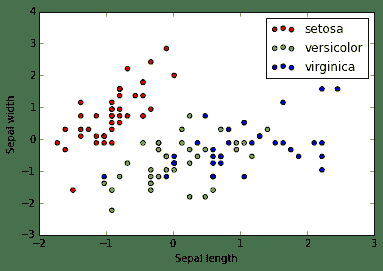
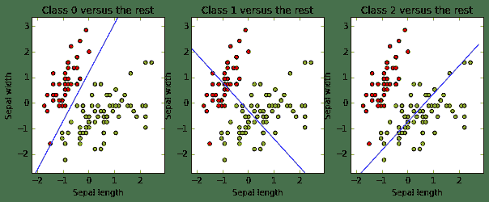

# 5.15 机器学习 · Machine Learning 学习笔记（一） by OTreeWEN

> 来源：https://uqer.io/community/share/55bc40caf9f06c91f918c604

```py
# 测试sklearn安装包是否已装好
import sklearn as sk
import numpy as np
import matplotlib.pylab as plt
# 加载数据
from sklearn import datasets
iris = datasets.load_iris()
X_iris, y_iris = iris.data, iris.target
# 将X 和 y 的shape 打印出来
print X_iris.shape, y_iris.shape
print 'X_iris =', X_iris[0]
print 'y_iris =',y_iris[0]

(150, 4) (150,)
X_iris = [ 5.1  3.5  1.4  0.2]
y_iris = 0
```


Any machine learning problem can be represented with the following three concepts:

• We will have to learn to solve a task T. For example, build a spam filter that learns to classify e-mails as spam or ham.

• We will need some experience E to learn to perform the task. Usually, experience is represented through a dataset. For the spam filter, experience comes as a set of e-mails, manually classified by a human as spam or ham.

• We will need a measure of performance P to know how well we are solving the task and also to know whether after doing some modifications, our results are improving or getting worse. The percentage of e-mails that our spam filtering is correctly classifying as spam or ham could be P for our spam-filtering task.

Our first machine learning method – linear classification

```py
# ex1 linear classification
from sklearn.cross_validation import train_test_split
from sklearn import preprocessing
# Get dataset with only the first two attributes
X, y = X_iris[:, :2], y_iris
# Split the dataset into a training and a testing set
# Test set will be the 25% taken randomly
X_train, X_test, y_train, y_test = train_test_split(X, y,test_size=0.25, random_state=33)
# The train_test_split function automatically builds the training
# and evaluation datasets, randomly selecting the samples. 
scaler = preprocessing.StandardScaler().fit(X_train) # Standardize the features
X_train = scaler.transform(X_train)
X_test = scaler.transform(X_test)

print 'X_train',X_train.shape # 75% of sample
print 'X_test',X_test.shape   # 25% of sample

import matplotlib.pyplot as plt
colors = ['red', 'greenyellow', 'blue']
for i in xrange(len(colors)):
    xs = X_train[:, 0][y_train == i] 
    ys = X_train[:, 1][y_train == i]  
    plt.scatter(xs, ys, c=colors[i])
    
plt.legend(iris.target_names)
plt.xlabel('Sepal length')
plt.ylabel('Sepal width')

# from sklearn.linear_modelsklearn._model import SGDClassifier
from sklearn.linear_model import SGDClassifier 
# SGD stands for Stochastic Gradient Descent
clf = SGDClassifier()
clf.fit(X_train, y_train) # three-class problem
print 'shape of coef =',clf.coef_.shape
print 'shape of intercept =',clf.intercept_.shape

X_train (112, 2)
X_test (38, 2)
shape of coef = (3, 2)
shape of intercept = (3,)
```



The following code draws the three decision boundaries and lets us know if they worked as expected:

```py
# 设定画图的刻度边界
x_min, x_max = X_train[:, 0].min() - .5, X_train[:, 0].max() + .5
y_min, y_max = X_train[:, 1].min() - .5, X_train[:, 1].max() + .5

xs = np.arange(x_min, x_max, 0.5)
fig, axes = plt.subplots(1, 3)
fig.set_size_inches(10, 6)

for i in [0, 1, 2]:
    
    # 设定图表i的标识、刻度等
    axes[i].set_aspect('equal')
    axes[i].set_title('Class '+ str(i) + ' versus the rest')
    axes[i].set_xlabel('Sepal length')
    axes[i].set_ylabel('Sepal width')
    axes[i].set_xlim(x_min, x_max)
    axes[i].set_ylim(y_min, y_max)
    
    plt.sca(axes[i]) # 选择图表 i
    # 画散点图
    plt.scatter(X_train[:, 0], X_train[:, 1], c=y_train, cmap=plt.cm.prism)
    # 计算分割线
    ys = (- clf.intercept_[i] - xs * clf.coef_[i, 0]) / clf.coef_[i, 1] 
     # 画分割线
    plt.plot(xs, ys, hold=True)
```



suppose that we have a new flower with a sepal width of 4.7 and a sepal length of 3.1, and we want to predict its class. We just have to apply our brand new classifier to it (after normalizing!).

```py
print clf.predict(scaler.transform([[4.7, 3.1]]))[0]
print clf.decision_function(scaler.transform([[4.7, 3.1]]))

0
[[ 19.77232705   8.13983962 -28.65250296]]
```

We want to be a little more formal when we talk about a good classifier. What does that mean? The performance of a classifier is a measure of its effectiveness. The simplest performance measure is accuracy: given a classifier and an evaluation dataset, it measures the proportion of instances correctly classified by the classifier.

```py
# Evaluating the results
from sklearn import metrics
y_train_pred = clf.predict(X_train)
print metrics.accuracy_score(y_train, y_train_pred)

0.821428571429
```

Probably, the most important thing you should learn from this chapter is that measuring accuracy on the training set is really a bad idea. You have built your model using this data, and it is possible that your model adjusts well to them but performs poorly in future (previously unseen data), which is its purpose. This phenomenon is called overfitting, and you will see it now and again while you read this book. If you measure based on your training data, you will never detect overfitting. So, never measure based on your training data. This is why we have reserved part of the original dataset (the testing partition)—we want to evaluate performance on previously unseen data. Let's check the accuracy again, now on the evaluation set (recall that it was already scaled):

```py
y_pred = clf.predict(X_test)
print metrics.accuracy_score(y_test, y_pred)

0.684210526316
```

Precision: This computes the proportion of instances predicted as positives that were correctly evaluated (it measures how right our classifier is when it says that an instance is positive).

Recall: This counts the proportion of positive instances that were correctly evaluated (measuring how right our classifier is when faced with a positive instance).

F1-score: This is the harmonic mean of precision and recall, and tries to combine both in a single number.

```py
print metrics.classification_report(y_test, y_pred, target_names=iris.target_names)

             precision    recall  f1-score   support

     setosa       1.00      1.00      1.00         8
 versicolor       0.43      0.27      0.33        11
  virginica       0.65      0.79      0.71        19

avg / total       0.66      0.68      0.66        38
```


Another useful metric (especially for multi-class problems) is the confusion matrix: in its (i, j) cell, it shows the number of class instances i that were predicted to be in class j. A good classifier will accumulate the values on the confusion matrix diagonal, where correctly classified instances belong.

```py
print metrics.confusion_matrix(y_test, y_pred)
```

To finish our evaluation process, we will introduce a very useful method known as cross-validation. As we explained before, we have to partition our dataset into a training set and a testing set. However, partitioning the data, results such that there are fewer instances to train on, and also, depending on the particular partition we make (usually made randomly), we can get either better or worse results. Cross-validation allows us to avoid this particular case, reducing result variance and producing a more realistic score for our models. The usual steps for k-fold cross-validation are the following:

1.  Partition the dataset into k different subsets.
1.  Create k different models by training on k-1 subsets and testing on the remaining subset.
1.  Measure the performance on each of the k models and take the average measure.

```py
from sklearn.cross_validation import cross_val_score, KFold
from sklearn.preprocessing import StandardScaler
from sklearn.pipeline import Pipeline
# create a composite estimator made by a pipeline of the
# standarization and the linear model
clf = Pipeline([('scaler', StandardScaler()),('linear_model', SGDClassifier())])
# create a k-fold cross validation iterator of k=5 folds
cv = KFold(X.shape[0], 5, shuffle=True, random_state=33)
# by default the score used is the one returned by score
# method of the estimator (accuracy)
scores = cross_val_score(clf, X, y, cv=cv)
print scores

[ 0.73333333  0.63333333  0.73333333  0.66666667  0.6       ]
```

We obtained an array with the k scores. We can calculate the mean and the standard error to obtain a final figure:

```py
from scipy.stats import sem
def mean_score(scores):
    return ("Mean score: {0:.3f} (+/-{1:.3f})").format(np.mean(scores), sem(scores))
print mean_score(scores)

Mean score: 0.673 (+/-0.027)
```

Machine learning categories

Classification is only one of the possible machine learning problems that can be addressed with scikit-learn. We can organize them in the following categories:

• In the previous example, we had a set of instances (that is, a set of data collected from a population) represented by certain features and with a particular target attribute. Supervised learning algorithms try to build a model from this data, which lets us predict the target attribute for new instances, knowing only these instance features. When the target class belongs to a discrete set (such as a list of flower species), we are facing a classification problem.

• Sometimes the class we want to predict, instead of belonging to a discrete set, ranges on a continuous set, such as the real number line. In this case, we are trying to solve a regression problem (the term was coined by Francis Galton, who observed that the heights of tall ancestors tend to regress down towards a normal value, the average human height). For example, we could try to predict the petal width based on the other three features. We will see that the methods used for regression are quite different from those used for classification.

• Another different type of machine learning problem is that of unsupervised learning. In this case, we do not have a target class to predict but instead want to group instances according to some similarity measure based on the available set of features. For example, suppose you have a dataset composed of e-mails and want to group them by their main topic (the task of grouping instances is called clustering). We can use it as features, for example, the different words used in each of them.

