# 量化分析师的Python日记【第10天 Q Quant兵器谱 -之偏微分方程1】

> 来源：https://uqer.io/community/share/5530d9f1f9f06c8f3390465a

> 从今天开始我们将进入一个系列 —— 偏微分方程。作为这一系列的开篇，我们以热传导方差为引子，引出：
> 
> 1.  如何提一个偏微分方程的初边值问题；
> 1.  利用差分格式将偏微分方程离散化；
> 1.  显示差分格式；
> 1.  显示差分格式的条件稳定性。
> 
> 最后一点将作为伏笔，引出我们下一天的学习：无条件稳定格式。

## 1. 热传导方程

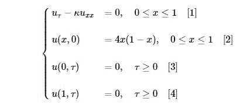

其中：

+ `κ` 称为热传导系数
+ `[2]` 称为方程的初值条件（Initial Condition)
+ `[3][4]` 称为方程的边值条件 （Boundaries Condition）。这里我们使用Dirichlet条件

我们可以看一下初值条件的形状:

```py
from matplotlib import pylab
import seaborn as sns
import numpy as np
font.set_size(20)

def initialCondition(x):
    return 4.0*(1.0 - x) * x

xArray = np.linspace(0,1.0,50)
yArray = map(initialCondition, xArray)
pylab.figure(figsize = (12,6))
pylab.plot(xArray, yArray)
pylab.xlabel('$x$', fontsize = 15)
pylab.ylabel('$f(x)$', fontsize = 15)
pylab.title(u'一维热传导方程初值条件', fontproperties = font)

<matplotlib.text.Text at 0x12523810>
```

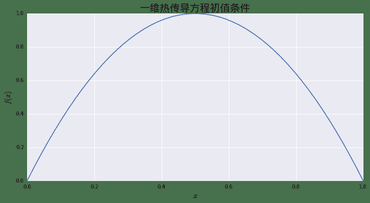

## 2. 显式差分格式

这里的基本思想是用差分格式替换对应的微分形式，并且期盼两种格式的"误差"在网格足够密的情况下会趋于0。我们分别在时间方向以及空间方向做差分格式：

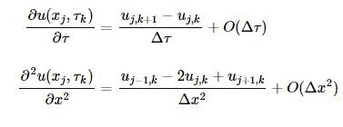

合并在一起，我们就得到了原始微分方程的差分格式：

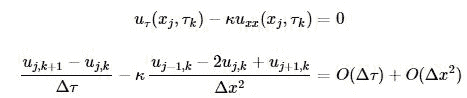

这里我们使用差分网格上的近似值`Uj,k`代替`uj,k`，得到新的方程：

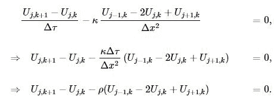

到这里我们得到一个迭代方程组：

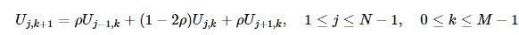

其中。下面我们使用Python代码实现上面的过程。

首先定义基本变量：

+ `N` 空间方向的网格数
+ `M` 时间方向的网格数
+ `T` 最大时间期限
+ `X` 最大空间范围
+ `U` 用来存储差分网格点上值得矩阵

```py
N = 25   # x方向网格数
M = 2500  # t方向网格数

T = 1.0
X = 1.0

xArray = np.linspace(0,X,N+1)
yArray = map(initialCondition, xArray)

starValues = yArray
U = np.zeros((N+1,M+1))
U[:,0] = starValues
```

```py
dx = X / N
dt = T / M
kappa = 1.0
rho = kappa * dt / dx / dx
```

这里我们做正向迭代：迭代时 `k=0,1...M−1`, 代表我们从0时刻运行至`T`


```py
for k in range(0, M):
    for j in range(1, N):
        U[j][k+1] = rho * U[j-1][k] + (1. - 2*rho) * U[j][k] + rho * U[j+1][k]
    U[0][k+1] = 0.
    U[N][k+1] = 0.
```

我们可以画出不同时间点 `U(,˙τk)` 的结果：

```py
pylab.figure(figsize = (12,6))
pylab.plot(xArray, U[:,0])
pylab.plot(xArray, U[:, int(0.10/ dt)])
pylab.plot(xArray, U[:, int(0.20/ dt)])
pylab.plot(xArray, U[:, int(0.50/ dt)])
pylab.xlabel('$x$', fontsize = 15)
pylab.ylabel(r'$U(\dot, \tau)$', fontsize = 15)
pylab.title(u'一维热传导方程', fontproperties = font)
pylab.legend([r'$\tau = 0.$', r'$\tau = 0.10$', r'$\tau = 0.20$', r'$\tau = 0.50$'], fontsize = 15)

<matplotlib.legend.Legend at 0x12577cd0>
```

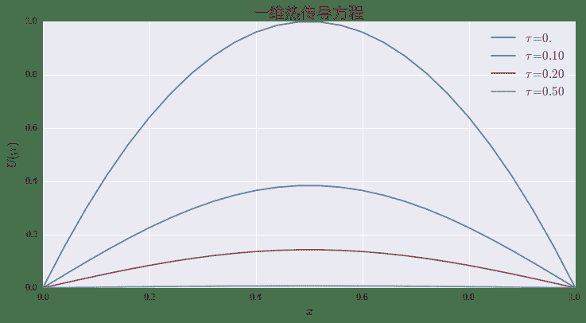

也可以通过三维立体图看一下整体的热传导过程：

```py
tArray = np.linspace(0, 0.2, int(0.2 / dt) + 1)
xGrids, tGrids = np.meshgrid(xArray, tArray)
```

```py
from mpl_toolkits.mplot3d import Axes3D
from matplotlib import cm

fig= pylab.figure(figsize = (16,10))
ax = fig.add_subplot(1, 1, 1, projection = '3d')
surface = ax.plot_surface(xGrids, tGrids, U[:,:int(0.2 / dt) + 1].T, cmap=cm.coolwarm)
ax.set_xlabel("$x$", fontdict={"size":18})
ax.set_ylabel(r"$\tau$", fontdict={"size":18})
ax.set_zlabel(r"$U$", fontdict={"size":18})
ax.set_title(u"热传导方程 $u_\\tau = u_{xx}$" , fontproperties = font)
fig.colorbar(surface,shrink=0.75)

<matplotlib.colorbar.Colorbar instance at 0xf6eb878>
```

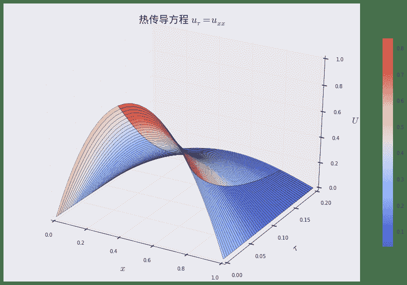

## 3. 组装起来

就像在前一天二叉树建模中介绍的一样，我们这里会以面向对象的方式重新封装分散的代码，方便复用。首先是方程的描述：

```py
class HeatEquation:    
    def __init__(self, kappa, X, T,
             initialConstion = lambda x:4.0*x*(1.0-x), boundaryConditionL = lambda x: 0, boundaryCondtionR = lambda x:0):
        self.kappa = kappa
        self.ic = initialConstion
        self.bcl = boundaryConditionL
        self.bcr = boundaryCondtionR
        self.X = X
        self.T = T
```

下面的是显式差分格式的描述：

```py
class ExplicitEulerScheme:    
    def __init__(self, M, N, equation):
        self.eq = equation
        self.dt = self.eq.T / M
        self.dx = self.eq.X / N
        self.U = np.zeros((N+1, M+1))
        self.xArray = np.linspace(0,self.eq.X,N+1)
        self.U[:,0] = map(self.eq.ic, self.xArray)
        self.rho = self.eq.kappa * self.dt / self.dx / self.dx
        self.M = M
        self.N = N
        
    def roll_back(self):
        for k in range(0, self.M):
            for j in range(1, self.N):
                self.U[j][k+1] = self.rho * self.U[j-1][k] + (1. - 2*self.rho) * self.U[j][k] + self.rho * self.U[j+1][k]
        self.U[0][k+1] = self.eq.bcl(self.xArray[0])
        self.U[N][k+1] = self.eq.bcr(self.xArray[-1])
    
    def mesh_grids(self):
        tArray = np.linspace(0, self.eq.T, M+1)
        tGrids, xGrids = np.meshgrid(tArray, self.xArray)
        return tGrids, xGrids
```

有了以上的部分，现在整个过程可以简单的通过初始化和一行关于`roll_back`的调用完成：

```py
ht = HeatEquation(1.,1.,1.)
scheme = ExplicitEulerScheme(2500,25, ht)
scheme.roll_back()
```

我们可以获取与之前相同的图像：

```py
tGrids, xGrids = scheme.mesh_grids()
fig= pylab.figure(figsize = (16,10))
ax = fig.add_subplot(1, 1, 1, projection = '3d')
cutoff = int(0.2 / scheme.dt) + 1
surface = ax.plot_surface(xGrids[:,:cutoff], tGrids[:,:cutoff], scheme.U[:,:cutoff], cmap=cm.coolwarm)
ax.set_xlabel("$x$", fontdict={"size":18})
ax.set_ylabel(r"$\tau$", fontdict={"size":18})
ax.set_zlabel(r"$U$", fontdict={"size":18})
ax.set_title(u"热传导方程 $u_\\tau = u_{xx}$" , fontproperties = font)
fig.colorbar(surface,shrink=0.75)

<matplotlib.colorbar.Colorbar instance at 0x12d69e60>
```


## 4. 什么时候显式格式会失败？

显式格式不能任意取时间和空间的网格点数，即`M`与`N`不能随意取值。我们称显式格式为条件稳定。特别地，需要满足所谓CFL条件（Courant–Friedrichs–Lewy）：

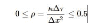

例如：

+ `M` = 2500
+ `N` = 25

则：

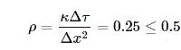

+ `M` = 1200
+ `N` = 25

则：

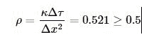

下面的代码计算在第二种情形下的网格点计算过程：

```py
ht = HeatEquation(1.,1.,1.)
scheme = ExplicitEulerScheme(1200,25, ht)
scheme.roll_back()
```

我们可以通过下图看到，在CFL条件无法满足的情况下，数值误差累计的结果（特别注意后面的锯齿）：

```py
tGrids, xGrids = scheme.mesh_grids()
fig= pylab.figure(figsize = (16,10))
ax = fig.add_subplot(1, 1, 1, projection = '3d')
cutoff = int(0.2 / scheme.dt) + 1
surface = ax.plot_surface(xGrids[:,:cutoff], tGrids[:,:cutoff], scheme.U[:,:cutoff], cmap=cm.coolwarm)
ax.set_xlabel("$x$", fontdict={"size":18})
ax.set_ylabel(r"$\tau$", fontdict={"size":18})
ax.set_zlabel(r"$U$", fontdict={"size":18})
ax.set_title(u"热传导方程 $u_\\tau = u_{xx}$, $\\rho = 0.521$" , fontproperties = font)
fig.colorbar(surface,shrink=0.75)

<matplotlib.colorbar.Colorbar instance at 0x10f51b48>
```

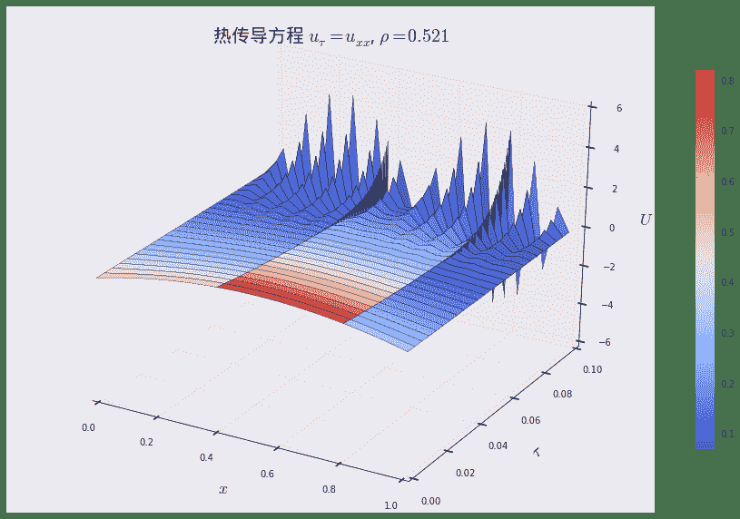

今天的日记到此为止，这个问题我们会在下一篇中进行讨论，引出无条件稳定格式：隐式差分格式（Implicit）。

