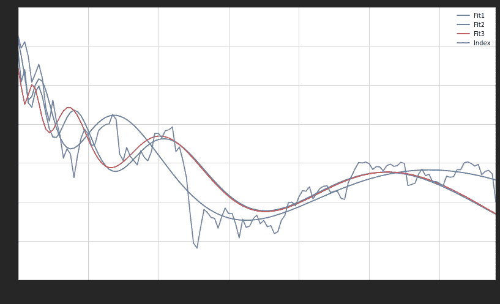

# 今天大盘熔断大跌，后市如何—— based on LPPL anti-bubble model

> 来源：https://uqer.io/community/share/568a65e0228e5b67159becfc

+ 今天指数两次熔断，沪深300大跌7%，很恐怖，我节前空仓，今天也就索性全部放逆回购了，这样后天才能赎回，也是为了防止明天万一想抄底剁手
+ 反正也是现成的算法调了调参数跑一跑，LPPL的anti-bubble model，感谢优矿平台
+ 今天大跌我想说一下我的想法，大跌原因不在熔断机制，而在于股价太贵了,没有足够的流动性支撑，熔断机制只是催化剂罢了。没有熔断，指数照样要冲不出3600，就想没有国家救市，指数照样能在2500点以上反弹一样（当然后期平台不会这么久）。

```py
import lib.relppltool as relppltool
from matplotlib import pyplot as plt
import datetime
import numpy as np
import pandas as pd
import seaborn as sns
sns.set_style('white')

limits = ([8.5, 8.6], [-0.25, -0.12], [-3, 3], [.15,.4], [0.05,0.1], [4,8], [0, 2*np.pi])
x = relppltool.Population(limits, 20, 0.3, 1.5, .05, 4)
for i in range (3):
	x.Fitness()
	x.Eliminate()
	x.Mate()
	x.Mutate()
	
x.Fitness()	
values = x.BestSolutions(3)
for xx in values:
	print xx.PrintIndividual()
```

```py
data = pd.DataFrame({'Date':values[0].getDataSeries()[0],'Index':values[0].getDataSeries()[1],'Fit1':values[0].getExpData(),'Fit2':values[1].getExpData(),'Fit3':values[2].getExpData()})
data = data.set_index('Date')
data.plot(figsize=(14,8))

<matplotlib.axes.AxesSubplot at 0x63dff50>
```



模型大家看看就好，权当参考。重点不在预测，而在资金管理。

