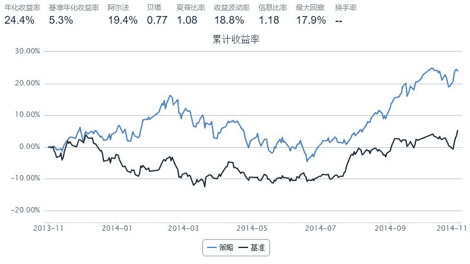

# 通联情绪指标策略

> 来源：https://uqer.io/community/share/548111daf9f06c8e7733670a

```py
start = pd.datetime(2013, 11, 1)
end   = pd.datetime(2014, 11, 1)
benchmark = 'HS300'
universe = read('3b_ticker.txt').split(',')
capital_base = 100000
csvs = ['3b_news.csv']

def initialize(account):
    add_history('hist1', 1)
    
def handle_data(account, data):
    for stock in universe:
        if (stock not in account.hist1) or ('emotion' not in account.hist1[stock].columns):
            continue
        
        sig = account.hist1[stock].iloc[0,:]['emotion']
        if sig > 0.2 and account.position.stkpos.get(stock, 0)==0:
            order(stock, 100)
        elif sig < 0 and account.position.stkpos.get(stock, 0)>0:
            order_to(stock, 0)
```



