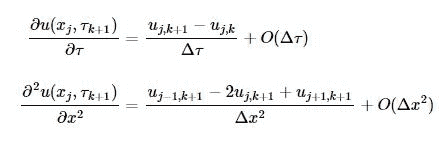
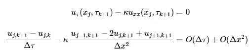
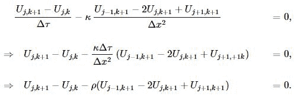
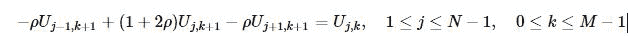
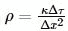
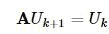
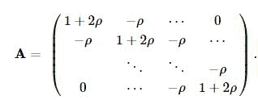
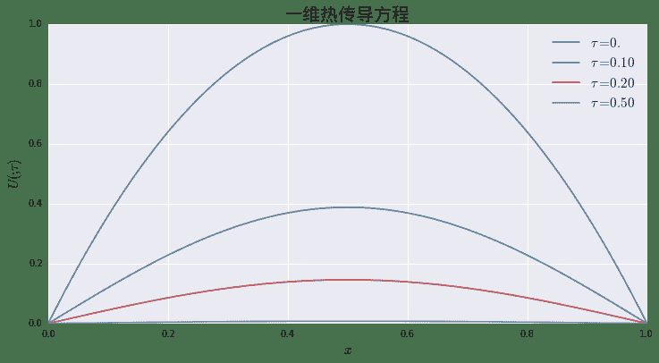
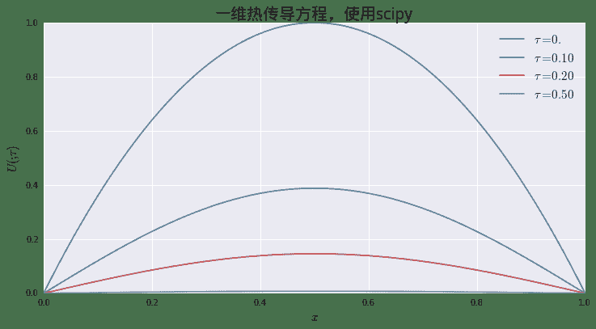

# 量化分析师的Python日记【第11天 Q Quant兵器谱之偏微分方程2】

> 来源：https://uqer.io/community/share/5534ad3ff9f06c8f33904689

> 这是量化分析师的偏微分方程系列的第二篇，在这一篇中我们将解决上一篇显式格式留下的稳定性问题。本篇将引入隐式差分算法，读者可以学到：
> 
> 1.  隐式差分格式描述
> 1.  三对角矩阵求解
> 1.  如何使用`scipy`加速算法实现
> 
> 在完成两天的基础学习之后，在下一天中，我们将把已经学到的知识运用到金融定价领域最重要的方程之一：Black - Shcoles - Merton 偏微分方差

```py
from matplotlib import pylab
import seaborn as sns
import numpy as np
np.set_printoptions(precision = 4)
font.set_size(20)

def initialCondition(x):
    return 4.0*(1.0 - x) * x
```

## 1. 隐式差分格式

像上一天一样，我们从差分格式的数学表述开始。隐式格式与显式格式的区别，在于我们时间方向选择的基准点。显式格式使用`k`，而隐式格式选择`k+1`:



剩下的推到过程我完全一样，我们看到无论隐式格式还是显式格式，它们的截断误差是一样的：



用离散值`Uj,k`替换`uj,k`，我们得到差分方程：



最后，到这里我们得到一个迭代方程组：



其中。

```py
N = 500  # x方向网格数
M = 500  # t方向网格数

T = 1.0
X = 1.0

xArray = np.linspace(0,X,N+1)
yArray = map(initialCondition, xArray)

starValues = yArray
U = np.zeros((N+1,M+1))
U[:,0] = starValues
```

```py
dx = X / N
dt = T / M
kappa = 1.0
rho = kappa * dt / dx / dx
```

### 1.1 矩阵求解(`TridiagonalSystem`)

虽然看上去形式只是变了一点，但是求解的问题有很大的变化。在每个时间点上，我们需要求解如下的一个线性方程组：



这里` A`为：



幸运的是，这个是个三对角矩阵，可以很简单的利用Gauss消去法求解。我们这里不会详细讨论算法的描述，细节都可以在下面的python类`TridiagonalSystem`中了解到：

```py
class TridiagonalSystem:
    def __init__(self, udiag, cdiag, ldiag):
        '''
        三对角矩阵：
        udiag -- 上对角线
        cdiag -- 对角线
        ldiag -- 下对角线
        '''
        assert len(udiag) == len(cdiag)
        assert len(cdiag) == len(ldiag)
        self.udiag = udiag
        self.cdiag = cdiag
        self.ldiag = ldiag
        self.length = len(self.cdiag)
        
    def solve(self, rhs):
        '''
        求解以下方程组
        A \ dot x = rhs
        '''
        assert len(rhs) == len(self.cdiag)
        udiag = self.udiag.copy()
        cdiag = self.cdiag.copy()
        ldiag = self.ldiag.copy()
        b = rhs.copy()
        
        # 消去下对角元
        for i in range(1, self.length):
            cdiag[i] -=  udiag[i-1] * ldiag[i] / cdiag[i-1]
            b[i] -= b[i-1] * ldiag[i] / cdiag[i-1]
            
        # 从最后一个方程开始求解
        x = np.zeros(self.length)
        x[self.length-1] = b[self.length - 1] / cdiag[self.length - 1]
        for i in range(self.length - 2, -1, -1):
            x[i] = (b[i] - udiag[i]*x[i+1]) / cdiag[i]
        return x
    
    def multiply(self, x):
        '''
        矩阵乘法：
        rhs = A \dot x
        '''
        assert len(x) == len(self.cdiag)
        rhs = np.zeros(self.length)       
        rhs[0] = x[0] * self.cdiag[0] + x[1] * self.udiag[0]
        for i in range(1, self.length - 1):
            rhs[i] =  x[i-1] * self.ldiag[i] + x[i] * self.cdiag[i] + x[i+1] * self.udiag[i]
        rhs[self.length - 1] = x[self.length - 2] * self.ldiag[self.length - 1] + x[self.length - 1] * self.cdiag[self.length - 1]
        return rhs
```

### 1.2 隐式格式求解

```py
for k in range(0, M):
    udiag = - np.ones(N-1) * rho
    ldiag =  - np.ones(N-1) * rho
    cdiag =  np.ones(N-1) * (1.0 + 2. * rho)
    
    mat = TridiagonalSystem(udiag, cdiag, ldiag)
    rhs = U[1:N,k]
    x = mat.solve(rhs)
    U[1:N, k+1] = x
    U[0][k+1] = 0.
    U[N][k+1] = 0.
```

```py
from lib.utilities import plotLines
plotLines([U[:,0], U[:, int(0.10/ dt)], U[:, int(0.20/ dt)], U[:, int(0.50/ dt)]], xArray, title = u'一维热传导方程', xlabel = '$x$', 
          ylabel = r'$U(\dot, \tau)$', legend = [r'$\tau = 0.$', r'$\tau = 0.10$', r'$\tau = 0.20$', r'$\tau = 0.50$'])
```



```py
from lib.utilities import plotSurface
tArray = np.linspace(0, 0.2, int(0.2 / dt) + 1)
tGrids, xGrids = np.meshgrid(tArray, xArray)

plotSurface(xGrids, tGrids, U[:,:int(0.2 / dt) + 1], title = u"热传导方程 $u_\\tau = u_{xx}$，隐式格式（$\\rho = 50$）", xlabel = "$x$", ylabel = r"$\tau$", zlabel = r"$U$")
```


## 2. 继续组装

像我们在显示格式那一节介绍的同样做法，我们把之前的代码整合起来，归集与一个完整的类`ImplicitEulerScheme`中：

```py
from lib.utilities import HeatEquation
```

上面的代码（使用`library`功能，关于该功能的具体介绍请见[帮助 — Library是干什么的](https://app.wmcloud.com/mercury/help/faq/#Library是干什么的))导入我们在上一期中已经定义过的类`HeatEquation`，避免代码重复。

```py
class ImplicitEulerScheme:    
    def __init__(self, M, N, equation):
        self.eq = equation
        self.dt = self.eq.T / M
        self.dx = self.eq.X / N
        self.U = np.zeros((N+1, M+1))
        self.xArray = np.linspace(0,self.eq.X,N+1)
        self.U[:,0] = map(self.eq.ic, self.xArray)
        self.rho = self.eq.kappa * self.dt / self.dx / self.dx
        self.M = M
        self.N = N
        
    def roll_back(self):
        for k in range(0, self.M):
            udiag = - np.ones(self.N-1) * self.rho
            ldiag =  - np.ones(self.N-1) * self.rho
            cdiag =  np.ones(self.N-1) * (1.0 + 2. * self.rho)
    
            mat = TridiagonalSystem(udiag, cdiag, ldiag)
            rhs = self.U[1:self.N,k]
            x = mat.solve(rhs)
            self.U[1:self.N, k+1] = x
            self.U[0][k+1] = self.eq.bcl(self.xArray[0])
            self.U[self.N][k+1] = self.eq.bcr(self.xArray[-1])
    
    def mesh_grids(self):
        tArray = np.linspace(0, self.eq.T, M+1)
        tGrids, xGrids = np.meshgrid(tArray, self.xArray)
        return tGrids, xGrids
```

然后我们可以使用下面的三行简单调用完成功能：

```py
ht = HeatEquation(1.,X, T)
scheme = ImplicitEulerScheme(M,N, ht)
scheme.roll_back()
scheme.U

array([[  0.0000e+00,   0.0000e+00,   0.0000e+00, ...,   0.0000e+00,
          0.0000e+00,   0.0000e+00],
       [  7.9840e-03,   7.2843e-03,   6.9266e-03, ...,   3.8398e-07,
          3.7655e-07,   3.6926e-07],
       [  1.5936e-02,   1.4567e-02,   1.3852e-02, ...,   7.6795e-07,
          7.5308e-07,   7.3851e-07],
       ..., 
       [  1.5936e-02,   1.4567e-02,   1.3852e-02, ...,   7.6795e-07,
          7.5308e-07,   7.3851e-07],
       [  7.9840e-03,   7.2843e-03,   6.9266e-03, ...,   3.8398e-07,
          3.7655e-07,   3.6926e-07],
       [  0.0000e+00,   0.0000e+00,   0.0000e+00, ...,   0.0000e+00,
          0.0000e+00,   0.0000e+00]])
```

## 3. 使用 `scipy`加速

软件工程行业里有句老话，叫做：“不要重复发明轮子！”。实际上，之前的代码里面，我们就造了自己的轮子：`TridiagonalSystem`。三对角矩阵作为最最常见的稀疏矩阵，关于它的线性方程组求解算法实际上早已为业界熟知，也已经有很多库内置了工业级别强度实现。这里我们取`scipy`作为例子，来展示使用外源库实现的好处：

+ 更加稳健的算法： 知名库算法由于使用者广泛，有更大的概率发现一些极端情形下的bug。库作者可以根据用户反馈，及时调整算法；
+ 更高的性能： 由于库的使用更为广泛，库作者有更大的动力去使用各种技术去提高算法的性能：例如使用更高效的语言实现，例如C。scipy中的情形就是一例。
+ 持续的维护： 库的受众范围广，社区的力量会推动库作者持续维护。

下面的代码展示，如何使用`scipy`中的`solve_banded`算法求解三对角矩阵：

```py
import scipy as sp
from scipy.linalg import solve_banded

A = np.zeros((3, 5))
A[0, :] = np.ones(5) * 1.   # 上对角线
A[1, :] = np.ones(5) * 3.   # 对角线
A[2, :] = np.ones(5) * (-1.) # 下对角线

b = [1.,2.,3.,4.,5.]
x = solve_banded ((1,1), A,b)
print 'x = A^-1b = ',x

x = A^-1b =  [ 0.1833  0.45    0.8333  0.95    1.9833]
```

我们使用上面的算法替代我们之前的`TridiagonalSystem`，

```py
import scipy as sp
from scipy.linalg import solve_banded 

for k in range(0, M):
    udiag = - np.ones(N-1) * rho
    ldiag =  - np.ones(N-1) * rho
    cdiag =  np.ones(N-1) * (1.0 + 2. * rho)
    mat = np.zeros((3,N-1))
    mat[0,:] = udiag
    mat[1,:] = cdiag
    mat[2,:] = ldiag
    rhs = U[1:N,k]
    x = solve_banded ((1,1), mat,rhs)
    U[1:N, k+1] = x
    U[0][k+1] = 0.
    U[N][k+1] = 0.
```

```py
plotLines([U[:,0], U[:, int(0.10/ dt)], U[:, int(0.20/ dt)], U[:, int(0.50/ dt)]], xArray, title = u'一维热传导方程，使用scipy', xlabel = '$x$', 
          ylabel = r'$U(\dot, \tau)$', legend = [r'$\tau = 0.$', r'$\tau = 0.10$', r'$\tau = 0.20$', r'$\tau = 0.50$'])
```




同样的我们定义一个新类`ImplicitEulerSchemeWithScipy`使用`scipy`的算法：

```py
class ImplicitEulerSchemeWithScipy:    
    def __init__(self, M, N, equation):
        self.eq = equation
        self.dt = self.eq.T / M
        self.dx = self.eq.X / N
        self.U = np.zeros((N+1, M+1))
        self.xArray = np.linspace(0,self.eq.X,N+1)
        self.U[:,0] = map(self.eq.ic, self.xArray)
        self.rho = self.eq.kappa * self.dt / self.dx / self.dx
        self.M = M
        self.N = N
        
    def roll_back(self):
        for k in range(0, self.M):
            udiag = - np.ones(self.N-1) * self.rho
            ldiag =  - np.ones(self.N-1) * self.rho
            cdiag =  np.ones(self.N-1) * (1.0 + 2. * self.rho)
    
            mat = np.zeros((3,self.N-1))
            mat[0,:] = udiag
            mat[1,:] = cdiag
            mat[2,:] = ldiag
            rhs = self.U[1:self.N,k]
            x = solve_banded((1,1), mat, rhs)
            self.U[1:self.N, k+1] = x
            self.U[0][k+1] = self.eq.bcl(self.xArray[0])
            self.U[self.N][k+1] = self.eq.bcr(self.xArray[-1])
    
    def mesh_grids(self):
        tArray = np.linspace(0, self.eq.T, M+1)
        tGrids, xGrids = np.meshgrid(tArray, self.xArray)
        return tGrids, xGrids
```

下面的代码，比较了两种做法的性能。可以看到仅仅简单的替代三对角矩阵算法，我们就获得了接近8倍的性能提升

```py
import time
startTime = time.time()
loop_round = 10

# 不使用scipy
for k in range(loop_round):
    ht = HeatEquation(1.,X, T)
    scheme = ImplicitEulerScheme(M,N, ht)
    scheme.roll_back()
endTime = time.time()
print '{0:<40}{1:.4f}'.format('执行时间(s) -- 不使用scipy.linalg: ', endTime - startTime)

# 使用scipy
startTime = time.time()
for k in range(loop_round):
    ht = HeatEquation(1.,X, T)
    scheme = ImplicitEulerSchemeWithScipy(M,N, ht)
    scheme.roll_back()
endTime = time.time()
print '{0:<40}{1:.4f}'.format('执行时间(s) -- 使用scipy.linalg: ', endTime - startTime)

执行时间(s) -- 不使用scipy.linalg: 12.1589
执行时间(s) -- 使用scipy.linalg:  1.6224
```

## 4. 尾声

到这里为止，我们已经结束了偏微分方差差分格式的基础学习。这是一个很大的学科，这两天也只能做到“管中窥豹”。但是有了以上的基础知识，读者已经有了足够的积累，可以处理一些金融工程中会实际遇到的方程。在下一天中，我们将把这两天学习到的知识运用到金融工程史上最重要的方程：Black - Scholes - Merton 偏微分方程。

