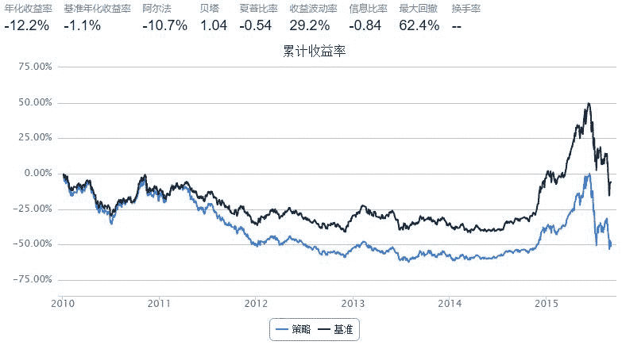

# 如何使用优矿之“新闻热点”？

> 来源：https://uqer.io/community/share/55fa68a0f9f06cb1199d44c6

本期讲解如何使用优矿的新闻热点相关API，以及一个“然并卵”的示例策略。

包括：

+ 股票新闻热点获取：`NewsHeatIndexGet`
+ 股票新闻情感获取：`NewsSentimentIndexGet`
+ 股票相关新闻获取：`NewsByTickersGet`

本篇中，我们只研究沪深300成分股。

```py
from quartz.api import set_universe
universe = set_universe("HS300")
```

## 1. 获取新闻热点

使用：`NewsHeatIndexGet`

```
Type:       function
Definition: DataAPI.NewsHeatIndexGet(exchangeCD='', ticker='', secShortName='', beginDate='', endDate='', secID='', field='', pandas='1')
Docstring:
包含证券相关的新闻热度指数数据，输入一个或多个证券交易代码、起止日期，获取该证券一段时间内的新闻热度指数(即证券当天关联新闻数量占当天新闻总量的百分比(%))。每天更新。（注：1、2014/1/1起新闻来源众多、指数统计有效，2013年及之前的网站来源不全、数据波动大，数据自2004/10/28始；2、新闻量的统计口径为经算法处理后证券关联到的所有常规新闻；3、数据按日更新。) 
```

关键的参数：

+ `secID:` 证券代码列表
+ `beginDate`：新闻搜索开始日期
+ `endDate`：新闻搜索结束日期

```py
data = DataAPI.NewsHeatIndexGet(secID=universe, beginDate="20150916", endDate="20150916")
data.sort('heatIndex', ascending=False).head()
```


| | secID | exchangeCD | exchangeName | ticker | secShortName | newsPublishDate | heatIndex | insertTime | updateTime |
| --- | --- | --- | --- | --- | --- | --- | --- | --- | --- |
| 125 |  600030.XSHG |  XSHG |  上海证券交易所 |  600030 |  中信证券 |  2015-09-16 |  4.726101 |  2015-09-16 01:10:03 |  2015-09-17 13:53:26 |
| 205 |  600837.XSHG |  XSHG |  上海证券交易所 |  600837 |  海通证券 |  2015-09-16 |  3.508772 |  2015-09-15 22:05:04 |  2015-09-17 13:53:26 |
| 251 |  601688.XSHG |  XSHG |  上海证券交易所 |  601688 |  华泰证券 |  2015-09-16 |  2.685285 |  2015-09-16 01:36:04 |  2015-09-17 13:53:26 |
| 241 |  601398.XSHG |  XSHG |  上海证券交易所 |  601398 |  工商银行 |  2015-09-16 |  2.542069 |  2015-09-15 22:30:08 |  2015-09-17 13:53:26 |
| 269 |  601939.XSHG |  XSHG |  上海证券交易所 |  601939 |  建设银行 |  2015-09-16 |  2.398854 |  2015-09-15 22:30:08 |  2015-09-17 13:53:26 |

获取的数据列表中，每一行就是对应的证券在某一天的新闻热度（heatIndex)。可以看到9月16日，中信证券（600030）荣登热度排行榜榜首！

## 2. 获取新闻情感

光知道新闻热度的话不够，我们还需要这道整体的新闻情感（正面or负面？）。

使用：`NewsSentimentIndexGet`

```
Type:       function
Definition: DataAPI.NewsSentimentIndexGet(exchangeCD='', ticker='', secShortName='', beginDate='', endDate='', secID='', field='', pandas='1')
Docstring:
包含证券相关的新闻情感指数数据，输入一个或多个证券交易代码、起止日期，获取该证券一段时间内的新闻情感指数(即当天证券关联新闻的情感均值)。（注：1、2014/1/1起新闻来源众多、指数统计有效，2013年及之前的网站来源不全、数据波动大，数据自2004/10/28始；2、新闻量的统计口径为经算法处理后证券关联到的所有常规新闻；3、数据按日更新。) 
```

关键的参数：

+ `secID`: 证券代码列表
+ `beginDate`：新闻搜索开始日期
+ `endDate`：新闻搜索结束日期

```py
data = DataAPI.NewsSentimentIndexGet(secID=universe, beginDate="20150916", endDate="20150916")
data.sort('sentimentIndex', ascending=True).head()
```


| | secID | exchangeCD | exchangeName | ticker | secShortName | newsPublishDate | sentimentIndex | insertTime | updateTime |
| --- | --- | --- | --- | --- | --- | --- | --- | --- | --- |
| 49  |  000831.XSHE |  XSHE |  深圳证券交易所 |  000831 |  五矿稀土 |  2015-09-16 | -0.294702 |  2015-09-16 09:20:07 |  2015-09-17 14:03:25 |
| 125 |  600030.XSHG |  XSHG |  上海证券交易所 |  600030 |  中信证券 |  2015-09-16 | -0.171486 |  2015-09-16 01:10:03 |  2015-09-17 14:03:25 |
| 171 |  600489.XSHG |  XSHG |  上海证券交易所 |  600489 |  中金黄金 |  2015-09-16 | -0.162101 |  2015-09-16 02:05:34 |  2015-09-17 14:03:25 |
| 231 |  601225.XSHG |  XSHG |  上海证券交易所 |  601225 |  陕西煤业 |  2015-09-16 | -0.162101 |  2015-09-16 02:05:34 |  2015-09-17 14:03:25 |
| 95  |  002653.XSHE |  XSHE |  深圳证券交易所 |  002653 |   海思科 |  2015-09-16 | -0.154720 |  2015-09-15 20:35:05 |  2015-09-17 14:03:25 |

获取的数据列表中，每一行就是对应的证券在某一天的新闻情感（`heatIndex`)，负数代表负面情感，正数代表正面情感。可以看到9月16日，中信证券（600030）在新闻情感指数榜上排名倒数第二！

## 3. 股票详细新闻获取

用户如果想更深度的剖析个别新闻对某只证券的影响，可以通过API获取详细的新闻分析列表：

使用：`NewsByTickersGet`

```
Type:       function
Definition: DataAPI.NewsByTickersGet(ticker='', secShortName='', secID='', exchangeCD='', beginDate='', endDate='', field='', pandas='1')
Docstring:
包含证券相关的新闻数据，同时可获取针对不同证券的新闻情感数据。输入证券代码或简称、查询的新闻发布起止时间，同时可输入证券交易所代码，获取相关新闻数据，如：新闻ID、新闻标题、发布来源、发布时间、入库时间等。(注：1、自2014/1/1起新闻来源众多、新闻量日均4万左右，2013年及之前的网站来源少、新闻数据量少；2、数据实时更新。)
```
 
关键的参数：

+ `secID`: 证券代码列表
+ `beginDate`：新闻搜索开始日期
+ `endDate`：新闻搜索结束日期

我们来试着获取2015年9月16日当天中信证券的相关新闻：

```py
data = DataAPI.NewsByTickersGet(secID='600030.XSHG', beginDate='20150916', endDate='20150916')
data.sort('relatedScore', ascending=False).head(10)
```


| | secID | exchangeCD | exchangeName | ticker | secShortName | newsID | newsTitle | relatedScore | sentiment | sentimentScore | newsPublishSite | newsPublishTime | newsInsertTime |
| --- | --- | --- | --- | --- | --- | --- | --- | --- | --- | --- | --- | --- | --- |
| 71  |  600030.XSHG |  XSHG |  上海证券交易所 |  600030 |  中信证券 |  14554253 |                       “股民好伴侣”南方理财金H详细操作指南 |  0.999999 | -1 | -0.028868 |  中国经济网 |  2015-09-16 09:27:00 |  2015-09-16 09:41:30 |
| 106 |  600030.XSHG |  XSHG |  上海证券交易所 |  600030 |  中信证券 |  14564116 |                    嘉实超短债债券：2015年第八次收益分配公告 |  0.999993 | -1 | -0.196649 |   证券之星 |  2015-09-16 13:16:23 |  2015-09-16 13:37:17 |
| 118 |  600030.XSHG |  XSHG |  上海证券交易所 |  600030 |  中信证券 |  14575307 |  银华交易型货币(ETF)：关于增加东兴证券、中航证券为基金申购赎回代理机构的公告 |  0.999950 | -1 | -0.402002 |   证券之星 |  2015-09-16 16:14:01 |  2015-09-16 16:57:18 |
| 31  |  600030.XSHG |  XSHG |  上海证券交易所 |  600030 |  中信证券 |  14539393 |                   中信证券总经理程博明被查 已有11名骨干被带走 |  0.999950 | -1 | -0.097207 |   新浪财经 |  2015-09-16 02:42:00 |  2015-09-16 03:19:25 |
| 19  |  600030.XSHG |  XSHG |  上海证券交易所 |  600030 |  中信证券 |  14537527 |     中信三家营业部“重出江湖” 7个交易日买入A股119.49亿元占比近17% |  0.999181 | -1 | -0.133462 |   新浪财经 |  2015-09-16 01:36:00 |  2015-09-16 01:40:36 |
| 33  |  600030.XSHG |  XSHG |  上海证券交易所 |  600030 |  中信证券 |  14539225 |                             中信证券危机应对:火上浇油 |  0.998778 | -1 | -0.253825 |    和讯网 |  2015-09-16 03:14:10 |  2015-09-16 03:16:14 |
| 40  |  600030.XSHG |  XSHG |  上海证券交易所 |  600030 |  中信证券 |  14551566 |                   中信证券事件再升级:总经理被查 遇前所未有危机 |  0.998508 | -1 | -0.225816 |   网易财经 |  2015-09-16 05:01:25 |  2015-09-16 08:58:45 |
| 61  |  600030.XSHG |  XSHG |  上海证券交易所 |  600030 |  中信证券 |  14548828 |                        中信证券事件再升级：总经理程博明被查 |  0.998508 | -1 | -0.221037 |  中国证券网 |  2015-09-16 08:08:43 |  2015-09-16 08:12:59 |
| 129 |  600030.XSHG |  XSHG |  上海证券交易所 |  600030 |  中信证券 |  14584031 |                      复盘中信证券：它曾是证券行业的新一代龙头 |  0.997775 | -1 | -0.008536 |    金融界 |  2015-09-16 21:44:48 |  2015-09-16 21:50:33 |
| 53  |  600030.XSHG |  XSHG |  上海证券交易所 |  600030 |  中信证券 |  14549075 |               “国家队主攻手”陷救市漩涡 中信证券总经理程博明被调查 |  0.997283 | -1 | -0.159776 |    新华网 |  2015-09-16 07:26:00 |  2015-09-16 08:16:56 |

## 4. 使用新闻数据编写简单策略

策略的指导想法是买入市场关为热点，并且新闻情感为正面的股票。

策略参数：

+ 开始日期：2010年1月1日
+ 结束日期：2015年9月1日
+ 选择域：沪深成分股（2010年1月1日采样）
+ 调仓周期：10个交易日
+ 买入方法：等权重买入
+ 规则：选取热度最高的100支股票，从中再选取情感最高并且为正的20支。

```py
from CAL.PyCAL import *

start = '2010-01-01'                       
end = '2015-09-01'                        
benchmark = 'HS300'                        
universe = set_universe('HS300', start)        
capital_base = 1000000                      
freq = 'd'                              
refresh_rate = 10                         

def initialize(account):                     
    pass

def handle_data(account):                    
    cal = Calendar('China.SSE')
    endDate = cal.advanceDate(account.current_date, '-1b', BizDayConvention.Preceding)
    beginDate = cal.advanceDate(endDate, '-10b', BizDayConvention.Preceding)
    
    # 获取当前参考期内股票热度
    data = DataAPI.NewsHeatIndexGet(secID=account.universe, beginDate=beginDate.strftime("%Y%m%d"), endDate=endDate.strftime("%Y%m%d"))
    
    # 只选取热度排名前100的股票
    sortedHeatIndex = data.groupby('secID')[['secID', 'heatIndex']].mean()
    choosenStocks = list(sortedHeatIndex.sort('heatIndex', ascending=False).index[:100].values)
    
    # 获取选取的50支股票的情感指数
    data = DataAPI.NewsSentimentIndexGet(secID=choosenStocks, beginDate=beginDate.strftime("%Y%m%d"), endDate=endDate.strftime("%Y%m%d"))
    
    # 只选取正面情感最高的20支股票
    data = data.groupby('secID')[['secID', 'sentimentIndex']].mean()
    sortedSentimentIndex = data.sort('sentimentIndex', ascending=False)
    sortedSentimentIndex = sortedSentimentIndex[sortedSentimentIndex['sentimentIndex'] > 0]
    choosenStocks = list(sortedSentimentIndex.index[:20].values)
    
    estimtedPortfolioValue = account.referencePortfolioValue
    
    # 卖出当前持仓
    for s in account.valid_secpos:
        order_to(s, 0)
        
    # 等比例买入选择股票
    for s in choosenStocks:
        order(s, int(estimtedPortfolioValue / len(choosenStocks) / account.referencePrice[s] / 100.)*100)
```



看来这么简单的想法确实是“然并卵”！

