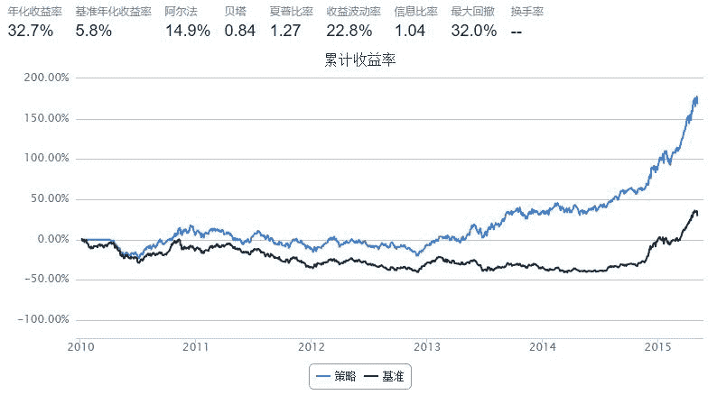
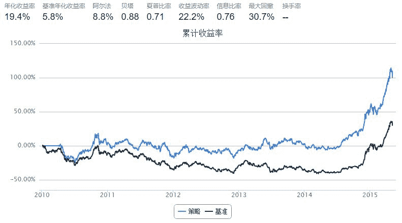

# 技术分析【3】—— 众星拱月，众口铄金?

> 来源：https://uqer.io/community/share/55498c0af9f06c1c3d68806e

很多股民都习惯于看新闻，根据新闻中对某只股票的评价（或好或坏），进行买卖操作。这里新闻对于股票的评价我们称之为新闻情感。本篇中，我们将做一个小实验，看看这样的操作手法是否合理。

## 1. 数据准备

在我们的量化实验室中，用户可以通过数据API: `NewsSentimentIndexGet` 获取某只股票对应的新闻情感。

```py
res = DataAPI.NewsSentimentIndexGet(secID = '600000.XSHG',field=['secID', 'newsPublishDate', 'sentimentIndex'])
res.tail()
```


| | secID | newsPublishDate | sentimentIndex |
| --- | --- |
| 26 |  600000.XSHG |  2015-05-02 | -0.008371 |
| 27 |  600000.XSHG |  2015-05-03 | -0.016820 |
| 28 |  600000.XSHG |  2015-05-04 | -0.013082 |
| 29 |  600000.XSHG |  2015-05-05 |  0.004557 |
| 30 |  600000.XSHG |  2015-05-06 | -0.026943 |

上面的API调用，获得了最近的浦发银行的每日新闻情感：

+ `secID` 证券代码
+ `newsPublishDate` 交易日
+ `sentimentIndex` 当时交易日的总体新闻情感指标，正的表示评价总体正面，负值表示评价总体负面

默认情况下，会获取最近30天的情感指标。

## 2. 操作手法

我们这里使用程序化的方法，执行如下的操作手法：

+ 获取上证50成分股的最近30日新闻情感
+ 将新闻情感按照 `secID` 分组，每组取平均；即获取每只股票最近30日情感均值
+ 取情感最正面的5只股票

```py
from quartz.api import set_universe
universe = set_universe('SH50')

res = DataAPI.NewsSentimentIndexGet(secID=universe, field=['secID', 'newsPublishDate', 'sentimentIndex'])
res = res.groupby('secID')
res.mean().sort('sentimentIndex', ascending=False).head(5)
```


| | sentimentIndex |
| --- | --- |
| secID |  |
| 600406.XSHG |  0.153961 |
| 600372.XSHG |  0.130670 |
| 600018.XSHG |  0.119349 |
| 600887.XSHG |  0.116333 |
| 600196.XSHG |  0.108185 |

## 3. 策略实现

+ 投资域 ：沪深300成分股
+ 业绩基准 ：沪深300指数
+ 调仓频率 ：60个交易日
+ 开仓信号 ：评价最正面的10%股票
+ 清仓信号 ：每个调仓日前一个工作日，清空当前仓位
+ 买入方式 ：等比例买入
+ 回测周期 ：2010年1月1日至2015年4月28日

```py
from CAL.PyCAL import Date

start = '2010-01-01'                       # 回测起始时间
end = '2015-05-05'                         # 回测结束时间
benchmark = 'HS300'                        # 策略参考标准
universe = set_universe('HS300')               # 证券池，支持股票和基金
capital_base = 1000000                      # 起始资金
longest_history = 0                        # handle_data 函数中可以使用的历史数据最长窗口长度
refresh_rate = 1                          # 调仓频率，即每 refresh_rate 个交易日执行一次 handle_data() 函数
longest_history = 1


def initialize(account):                   # 初始化虚拟账户状态
    account.isBuyPeriod = False
    account.dayCount = 0

def handle_data(account):                  # 每个交易日的买入卖出指令
    account.dayCount += 1 
    if account.isBuyPeriod:                # 每60个工作日（3个月）调仓
        hist = account.get_history(longest_history)
        endDate = Date.fromDateTime(account.current_date)
        startDate = endDate - 30
        res =  DataAPI.NewsSentimentIndexGet(secID=account.universe, field=['secID', 'newsPublishDate', 'sentimentIndex'], beginDate=startDate.strftime('%Y%m%d'),endDate=endDate.strftime('%Y%m%d'))
        res = res.groupby('secID')
        
        # top 10%
        top10 = res.mean().sort('sentimentIndex', ascending=False).head(int(0.1*len(res)))
        buyList = list(top10.index)
        print u"%s 买入 : %s" % (endDate, buyList)
        
        # 等权重买入
        if len(buyList) != 0:
            singleCash = account.cash / len(buyList)
            for stock in buyList:
                approximationAmount = int(singleCash / hist[stock]['closePrice'][-1]/100.0) * 100
                order(stock, approximationAmount)

        account.isBuyPeriod = False
        account.dayCount = 0
    elif account.dayCount == 59:          # 调仓日前一日清空当前仓位
        for stock in account.valid_secpos:
            order_to(stock,0)
        account.isBuyPeriod = True
```



```
2010-04-06 买入 : ['601888.XSHG', '000338.XSHE', '000401.XSHE', '000425.XSHE', '600880.XSHG', '601179.XSHG', '600066.XSHG', '601299.XSHG', '000983.XSHE', '601186.XSHG', '600010.XSHG', '601866.XSHG', '002146.XSHE', '000630.XSHE']
2010-07-05 买入 : ['601006.XSHG', '600660.XSHG', '600188.XSHG', '600498.XSHG', '600585.XSHG', '601168.XSHG', '000878.XSHE', '601766.XSHG', '600060.XSHG', '000630.XSHE', '000625.XSHE']
2010-09-30 买入 : ['600718.XSHG', '600703.XSHG', '000400.XSHE', '600583.XSHG', '002230.XSHE', '601766.XSHG', '601808.XSHG', '600406.XSHG', '600795.XSHG', '600875.XSHG', '600066.XSHG', '600196.XSHG', '000559.XSHE', '601018.XSHG']
2010-12-30 买入 : ['000883.XSHE', '600642.XSHG', '600998.XSHG', '600276.XSHG', '002008.XSHE', '600066.XSHG', '600880.XSHG', '002292.XSHE', '600100.XSHG', '600741.XSHG', '601766.XSHG', '300070.XSHE', '002146.XSHE', '600018.XSHG', '601299.XSHG', '000400.XSHE']
2011-04-01 买入 : ['600583.XSHG', '601179.XSHG', '000402.XSHE', '600058.XSHG', '600900.XSHG', '601299.XSHG', '000623.XSHE', '601766.XSHG', '600118.XSHG', '601117.XSHG', '601006.XSHG', '600038.XSHG', '600893.XSHG', '000559.XSHE', '000937.XSHE', '000876.XSHE']
2011-06-30 买入 : ['600252.XSHG', '600276.XSHG', '600066.XSHG', '601117.XSHG', '600079.XSHG', '600583.XSHG', '601808.XSHG', '000963.XSHE', '600535.XSHG', '600741.XSHG', '600068.XSHG', '600196.XSHG', '600688.XSHG', '600585.XSHG', '002353.XSHE', '601299.XSHG', '601933.XSHG']
2011-09-23 买入 : ['600079.XSHG', '600660.XSHG', '600276.XSHG', '000581.XSHE', '002375.XSHE', '002465.XSHE', '600066.XSHG', '002081.XSHE', '600170.XSHG', '600009.XSHG', '600267.XSHG', '600588.XSHG', '600893.XSHG', '600648.XSHG', '002400.XSHE', '600655.XSHG', '000869.XSHE', '000999.XSHE', '600741.XSHG', '600637.XSHG', '300017.XSHE', '000778.XSHE', '600196.XSHG', '601888.XSHG']
2011-12-23 买入 : ['600079.XSHG', '600863.XSHG', '000963.XSHE', '000581.XSHE', '600741.XSHG', '000400.XSHE', '600660.XSHG', '002475.XSHE', '600060.XSHG', '600271.XSHG', '002415.XSHE', '002081.XSHE', '600256.XSHG', '600009.XSHG', '002465.XSHE', '600166.XSHG', '000338.XSHE', '600068.XSHG', '600674.XSHG', '000630.XSHE', '600066.XSHG', '002422.XSHE', '000999.XSHE', '600340.XSHG']
2012-03-27 买入 : ['000338.XSHE', '002450.XSHE', '600893.XSHG', '601098.XSHG', '600741.XSHG', '601179.XSHG', '300015.XSHE', '002353.XSHE', '601299.XSHG', '600060.XSHG', '600348.XSHG', '002375.XSHE', '600066.XSHG', '600863.XSHG', '002470.XSHE', '600588.XSHG', '600655.XSHG', '000826.XSHE', '002065.XSHE', '600570.XSHG', '002230.XSHE', '300133.XSHE', '600880.XSHG', '000400.XSHE', '600157.XSHG']
2012-06-27 买入 : ['600660.XSHG', '600316.XSHG', '601333.XSHG', '002353.XSHE', '002400.XSHE', '600741.XSHG', '600372.XSHG', '300251.XSHE', '002470.XSHE', '600089.XSHG', '002038.XSHE', '002310.XSHE', '002603.XSHE', '601216.XSHG', '601669.XSHG', '601117.XSHG', '601766.XSHG', '601299.XSHG', '002252.XSHE', '000883.XSHE', '000027.XSHE', '600893.XSHG', '000963.XSHE', '600038.XSHG', '300133.XSHE']
2012-09-19 买入 : ['002465.XSHE', '002470.XSHE', '600660.XSHG', '600718.XSHG', '600583.XSHG', '600079.XSHG', '600633.XSHG', '000963.XSHE', '000338.XSHE', '000826.XSHE', '600570.XSHG', '600372.XSHG', '002146.XSHE', '600436.XSHG', '600867.XSHG', '600832.XSHG', '600498.XSHG', '601231.XSHG', '000400.XSHE', '300017.XSHE', '600271.XSHG', '002051.XSHE', '002450.XSHE', '600588.XSHG', '601158.XSHG', '002129.XSHE', '000792.XSHE']
2012-12-19 买入 : ['600170.XSHG', '300124.XSHE', '002475.XSHE', '600741.XSHG', '002292.XSHE', '600718.XSHG', '601766.XSHG', '002465.XSHE', '002241.XSHE', '002081.XSHE', '002400.XSHE', '600166.XSHG', '000826.XSHE', '600633.XSHG', '600373.XSHG', '601231.XSHG', '000725.XSHE', '000338.XSHE', '601299.XSHG', '600649.XSHG', '600535.XSHG', '601118.XSHG', '600547.XSHG', '600340.XSHG', '600637.XSHG', '002065.XSHE', '300133.XSHE']
2013-03-25 买入 : ['600880.XSHG', '601158.XSHG', '000963.XSHE', '600867.XSHG', '600316.XSHG', '600718.XSHG', '002294.XSHE', '600271.XSHG', '600372.XSHG', '601928.XSHG', '600340.XSHG', '002410.XSHE', '002292.XSHE', '601098.XSHG', '002465.XSHE', '002385.XSHE', '000598.XSHE', '600498.XSHG', '002146.XSHE', '002603.XSHE', '600373.XSHG', '600886.XSHG', '600633.XSHG', '600118.XSHG', '000917.XSHE', '600535.XSHG', '600038.XSHG']
2013-06-27 买入 : ['600741.XSHG', '600660.XSHG', '600900.XSHG', '600008.XSHG', '600018.XSHG', '002400.XSHE', '600066.XSHG', '601333.XSHG', '002292.XSHE', '000826.XSHE', '002465.XSHE', '600703.XSHG', '601299.XSHG', '000401.XSHE', '600583.XSHG', '600276.XSHG', '000917.XSHE', '600079.XSHG', '601098.XSHG', '002475.XSHE', '300124.XSHE', '600633.XSHG', '300015.XSHE', '600827.XSHG', '601800.XSHG', '600373.XSHG', '600637.XSHG']
2013-09-23 买入 : ['300015.XSHE', '000963.XSHE', '600660.XSHG', '601098.XSHG', '600741.XSHG', '600066.XSHG', '600886.XSHG', '600703.XSHG', '600373.XSHG', '002465.XSHE', '601231.XSHG', '601299.XSHG', '300133.XSHE', '601158.XSHG', '000623.XSHE', '600170.XSHG', '600009.XSHG', '002008.XSHE', '600827.XSHG', '600863.XSHG', '601928.XSHG', '600516.XSHG', '002051.XSHE', '000778.XSHE', '600406.XSHG', '300146.XSHE', '000826.XSHE', '300124.XSHE']
2013-12-23 买入 : ['600741.XSHG', '002400.XSHE', '300015.XSHE', '002292.XSHE', '601929.XSHG', '600660.XSHG', '600900.XSHG', '000156.XSHE', '601299.XSHG', '600886.XSHG', '000963.XSHE', '600066.XSHG', '600633.XSHG', '600018.XSHG', '600578.XSHG', '600498.XSHG', '000338.XSHE', '601098.XSHG', '600372.XSHG', '600583.XSHG', '002450.XSHE', '600703.XSHG', '600170.XSHG', '601179.XSHG', '600406.XSHG', '002465.XSHE', '600079.XSHG', '601766.XSHG']
2014-03-25 买入 : ['600900.XSHG', '601299.XSHG', '002292.XSHE', '600886.XSHG', '300133.XSHE', '002400.XSHE', '600741.XSHG', '002465.XSHE', '600497.XSHG', '000963.XSHE', '600018.XSHG', '300015.XSHE', '600633.XSHG', '601231.XSHG', '000338.XSHE', '600066.XSHG', '600585.XSHG', '600583.XSHG', '601928.XSHG', '600578.XSHG', '600703.XSHG', '600170.XSHG', '600498.XSHG', '002146.XSHE', '002241.XSHE', '601607.XSHG', '600372.XSHG', '601929.XSHG']
2014-06-23 买入 : ['600578.XSHG', '600741.XSHG', '600170.XSHG', '600660.XSHG', '601158.XSHG', '600886.XSHG', '002292.XSHE', '002146.XSHE', '600066.XSHG', '600703.XSHG', '600485.XSHG', '300015.XSHE', '002465.XSHE', '000598.XSHE', '600718.XSHG', '601231.XSHG', '601098.XSHG', '002400.XSHE', '600018.XSHG', '601179.XSHG', '600079.XSHG', '600498.XSHG', '600783.XSHG', '600089.XSHG', '000826.XSHE', '600497.XSHG', '600583.XSHG', '000400.XSHE']
2014-09-16 买入 : ['600741.XSHG', '300015.XSHE', '600578.XSHG', '002400.XSHE', '600886.XSHG', '600079.XSHG', '002465.XSHE', '600170.XSHG', '002292.XSHE', '600660.XSHG', '601158.XSHG', '600703.XSHG', '601299.XSHG', '600633.XSHG', '600718.XSHG', '000963.XSHE', '600066.XSHG', '601179.XSHG', '600900.XSHG', '601929.XSHG', '000598.XSHE', '601231.XSHG', '600585.XSHG', '002146.XSHE', '600089.XSHG', '002241.XSHE', '600583.XSHG', '601098.XSHG']
2014-12-16 买入 : ['600741.XSHG', '002400.XSHE', '601929.XSHG', '600578.XSHG', '600079.XSHG', '002292.XSHE', '600170.XSHG', '300015.XSHE', '601158.XSHG', '600718.XSHG', '600783.XSHG', '601098.XSHG', '600900.XSHG', '600583.XSHG', '600703.XSHG', '000963.XSHE', '601179.XSHG', '600018.XSHG', '600660.XSHG', '601800.XSHG', '600585.XSHG', '600886.XSHG', '600066.XSHG', '002146.XSHE', '000338.XSHE', '600497.XSHG', '002465.XSHE', '601607.XSHG']
2015-03-19 买入 : ['601098.XSHG', '600718.XSHG', '000400.XSHE', '600066.XSHG', '600900.XSHG', '600018.XSHG', '600886.XSHG', '000963.XSHE', '600089.XSHG', '600583.XSHG', '600373.XSHG', '002051.XSHE', '002292.XSHE', '002400.XSHE', '002465.XSHE', '600703.XSHG', '600316.XSHG', '600153.XSHG', '600118.XSHG', '300124.XSHE', '002450.XSHE', '600485.XSHG', '601158.XSHG', '600893.XSHG', '601929.XSHG', '600498.XSHG', '600276.XSHG', '000598.XSHE']
```

我们还可以试一下反向操作，选取评价最负面的10%

+ 投资域 ：沪深300成分股
+ 业绩基准 ：沪深300指数
+ 调仓频率 ：60个交易日
+ 开仓信号 ：评价最负面的10%股票
+ 清仓信号 ：每个调仓日前一个工作日，清空当前仓位
+ 买入方式 ：等比例买入
+ 回测周期 ：2010年1月1日至2015年4月28日

```py
from CAL.PyCAL import Date

start = '2010-01-01'                       # 回测起始时间
end = '2015-05-05'                         # 回测结束时间
benchmark = 'HS300'                        # 策略参考标准
universe = set_universe('HS300')               # 证券池，支持股票和基金
capital_base = 1000000                      # 起始资金
longest_history = 0                        # handle_data 函数中可以使用的历史数据最长窗口长度
refresh_rate = 1                          # 调仓频率，即每 refresh_rate 个交易日执行一次 handle_data() 函数
longest_history = 1


def initialize(account):                   # 初始化虚拟账户状态
    account.isBuyPeriod = False
    account.dayCount = 0

def handle_data(account):                  # 每个交易日的买入卖出指令
    account.dayCount += 1 
    if account.isBuyPeriod:                # 每60个工作日（3个月）调仓
        hist = account.get_history(longest_history)
        endDate = Date.fromDateTime(account.current_date)
        startDate = endDate - 30
        res =  DataAPI.NewsSentimentIndexGet(secID=account.universe, field=['secID', 'newsPublishDate', 'sentimentIndex'], beginDate=startDate.strftime('%Y%m%d'),endDate=endDate.strftime('%Y%m%d'))
        res = res.groupby('secID')
        
        # Bottom 10%
        top10 = res.mean().sort('sentimentIndex', ascending=True).head(int(0.1*len(res)))
        buyList = list(top10.index)
        print u"%s 买入 : %s" % (endDate, buyList)
        
        # 等权重买入
        if len(buyList) != 0:
            singleCash = account.cash / len(buyList)
            for stock in buyList:
                approximationAmount = int(singleCash / hist[stock]['closePrice'][-1]/100.0) * 100
                order(stock, approximationAmount)

        account.isBuyPeriod = False
        account.dayCount = 0
    elif account.dayCount == 59:          # 调仓日前一日清空当前仓位
        for stock in account.valid_secpos:
            order_to(stock,0)
        account.isBuyPeriod = True
```



```
2010-04-06 买入 : ['600143.XSHG', '600588.XSHG', '600900.XSHG', '300017.XSHE', '000825.XSHE', '600276.XSHG', '600839.XSHG', '000503.XSHE', '601898.XSHG', '600497.XSHG', '000878.XSHE', '601166.XSHG', '000876.XSHE', '600036.XSHG']
2010-07-05 买入 : ['600649.XSHG', '601333.XSHG', '000425.XSHE', '000423.XSHE', '002304.XSHE', '002310.XSHE', '000069.XSHE', '000793.XSHE', '601898.XSHG', '600029.XSHG', '300024.XSHE']
2010-09-30 买入 : ['600497.XSHG', '000960.XSHE', '002310.XSHE', '601899.XSHG', '600060.XSHG', '300017.XSHE', '601006.XSHG', '300027.XSHE', '002399.XSHE', '600118.XSHG', '000878.XSHE', '600519.XSHG', '600315.XSHG', '000776.XSHE']
2010-12-30 买入 : ['601006.XSHG', '600208.XSHG', '600497.XSHG', '600436.XSHG', '601899.XSHG', '000793.XSHE', '000783.XSHE', '600804.XSHG', '600583.XSHG', '600369.XSHG', '000858.XSHE', '601166.XSHG', '000538.XSHE', '600597.XSHG', '600011.XSHG', '600058.XSHG']
2011-04-01 买入 : ['601888.XSHG', '300058.XSHE', '601899.XSHG', '600886.XSHG', '600415.XSHG', '000060.XSHE', '000009.XSHE', '600674.XSHG', '002292.XSHE', '600663.XSHG', '600362.XSHG', '601998.XSHG', '601601.XSHG', '000686.XSHE', '000768.XSHE', '601939.XSHG']
2011-06-30 买入 : ['002385.XSHE', '000009.XSHE', '600085.XSHG', '300017.XSHE', '600485.XSHG', '300015.XSHE', '000858.XSHE', '600664.XSHG', '002500.XSHE', '601899.XSHG', '600497.XSHG', '000630.XSHE', '000895.XSHE', '300070.XSHE', '600036.XSHG', '600089.XSHG', '000778.XSHE']
2011-09-23 买入 : ['600415.XSHG', '600783.XSHG', '600832.XSHG', '002007.XSHE', '601179.XSHG', '002470.XSHE', '002399.XSHE', '601899.XSHG', '000009.XSHE', '601866.XSHG', '000792.XSHE', '601216.XSHG', '600153.XSHG', '600664.XSHG', '600867.XSHG', '002429.XSHE', '002008.XSHE', '601098.XSHG', '600108.XSHG', '601958.XSHG', '000629.XSHE', '601898.XSHG', '600436.XSHG', '600583.XSHG']
2011-12-23 买入 : ['002456.XSHE', '000793.XSHE', '600362.XSHG', '600583.XSHG', '600348.XSHG', '600588.XSHG', '000895.XSHE', '002252.XSHE', '000402.XSHE', '002399.XSHE', '002429.XSHE', '601866.XSHG', '600352.XSHG', '002603.XSHE', '600031.XSHG', '002385.XSHE', '601899.XSHG', '000970.XSHE', '000002.XSHE', '600369.XSHG', '000725.XSHE', '000060.XSHE', '000009.XSHE', '600649.XSHG']
2012-03-27 买入 : ['600832.XSHG', '601899.XSHG', '000009.XSHE', '600998.XSHG', '600315.XSHG', '000536.XSHE', '600664.XSHG', '002422.XSHE', '002399.XSHE', '002400.XSHE', '600485.XSHG', '000060.XSHE', '600029.XSHG', '002570.XSHE', '002603.XSHE', '000623.XSHE', '601699.XSHG', '000538.XSHE', '600221.XSHG', '000895.XSHE', '601818.XSHG', '600068.XSHG', '000002.XSHE', '600398.XSHG', '600153.XSHG']
2012-06-27 买入 : ['000793.XSHE', '600827.XSHG', '002416.XSHE', '002570.XSHE', '000858.XSHE', '000400.XSHE', '600348.XSHG', '601607.XSHG', '300015.XSHE', '000536.XSHE', '002385.XSHE', '600369.XSHG', '000009.XSHE', '000895.XSHE', '002594.XSHE', '002001.XSHE', '600880.XSHG', '603000.XSHG', '002007.XSHE', '600398.XSHG', '000983.XSHE', '000725.XSHE', '600015.XSHG', '300017.XSHE', '601231.XSHG']
2012-09-19 买入 : ['600516.XSHG', '600398.XSHG', '002399.XSHE', '000869.XSHE', '000060.XSHE', '000960.XSHE', '601258.XSHG', '601866.XSHG', '600809.XSHG', '300124.XSHE', '600369.XSHG', '002024.XSHE', '600315.XSHG', '002416.XSHE', '601888.XSHG', '002304.XSHE', '002410.XSHE', '002385.XSHE', '600029.XSHG', '600008.XSHG', '600518.XSHG', '000858.XSHE', '600519.XSHG', '603000.XSHG', '600115.XSHG', '600221.XSHG', '601933.XSHG']
2012-12-19 买入 : ['000869.XSHE', '000895.XSHE', '600369.XSHG', '603993.XSHG', '601258.XSHG', '300146.XSHE', '600352.XSHG', '000858.XSHE', '601333.XSHG', '600398.XSHG', '600519.XSHG', '600015.XSHG', '601888.XSHG', '600415.XSHG', '600031.XSHG', '600809.XSHG', '601555.XSHG', '000157.XSHE', '002304.XSHE', '002673.XSHE', '600029.XSHG', '603000.XSHG', '000728.XSHE', '000568.XSHE', '000060.XSHE', '600221.XSHG', '000960.XSHE']
2013-03-25 买入 : ['000623.XSHE', '000536.XSHE', '002375.XSHE', '600406.XSHG', '601699.XSHG', '600143.XSHG', '600015.XSHG', '002310.XSHE', '600832.XSHG', '000869.XSHE', '000858.XSHE', '002399.XSHE', '600549.XSHG', '600518.XSHG', '600348.XSHG', '002416.XSHE', '002051.XSHE', '000792.XSHE', '603000.XSHG', '600519.XSHG', '601258.XSHG', '601168.XSHG', '002653.XSHE', '000400.XSHE', '601898.XSHG', '601888.XSHG', '300124.XSHE']
2013-06-27 买入 : ['000839.XSHE', '002653.XSHE', '000629.XSHE', '601899.XSHG', '600031.XSHG', '002422.XSHE', '600085.XSHG', '000825.XSHE', '600395.XSHG', '603000.XSHG', '600998.XSHG', '600570.XSHG', '603993.XSHG', '000568.XSHE', '000858.XSHE', '300146.XSHE', '600362.XSHG', '600315.XSHG', '601398.XSHG', '000060.XSHE', '600369.XSHG', '600519.XSHG', '601600.XSHG', '601988.XSHG', '000157.XSHE', '600839.XSHG', '600348.XSHG']
2013-09-23 买入 : ['600873.XSHG', '600642.XSHG', '600348.XSHG', '002422.XSHE', '601818.XSHG', '600188.XSHG', '000960.XSHE', '002399.XSHE', '000878.XSHE', '000858.XSHE', '002153.XSHE', '600177.XSHG', '600519.XSHG', '600031.XSHG', '600029.XSHG', '601111.XSHG', '603000.XSHG', '600489.XSHG', '601898.XSHG', '000536.XSHE', '600398.XSHG', '603993.XSHG', '002304.XSHE', '600395.XSHG', '601601.XSHG', '000568.XSHE', '000983.XSHE', '600518.XSHG']
2013-12-23 买入 : ['600348.XSHG', '600664.XSHG', '600315.XSHG', '600489.XSHG', '002653.XSHE', '601899.XSHG', '000960.XSHE', '000709.XSHE', '000536.XSHE', '601600.XSHG', '000858.XSHE', '002422.XSHE', '601866.XSHG', '000629.XSHE', '603000.XSHG', '000825.XSHE', '600519.XSHG', '600518.XSHG', '601111.XSHG', '600188.XSHG', '600177.XSHG', '000983.XSHE', '601888.XSHG', '601618.XSHG', '600011.XSHG', '600383.XSHG', '601258.XSHG', '000878.XSHE']
2014-03-25 买入 : ['600348.XSHG', '000060.XSHE', '600664.XSHG', '000825.XSHE', '000536.XSHE', '000568.XSHE', '600489.XSHG', '603699.XSHG', '601225.XSHG', '601111.XSHG', '600362.XSHG', '601166.XSHG', '000983.XSHE', '000858.XSHE', '603000.XSHG', '002422.XSHE', '600115.XSHG', '600398.XSHG', '600029.XSHG', '601398.XSHG', '600036.XSHG', '601618.XSHG', '600177.XSHG', '601628.XSHG', '600188.XSHG', '603993.XSHG', '000709.XSHE', '601939.XSHG']
2014-06-23 买入 : ['600315.XSHG', '600489.XSHG', '601225.XSHG', '601899.XSHG', '603288.XSHG', '600108.XSHG', '600348.XSHG', '002422.XSHE', '600436.XSHG', '600664.XSHG', '601111.XSHG', '000629.XSHE', '002653.XSHE', '601628.XSHG', '601555.XSHG', '603000.XSHG', '000568.XSHE', '601601.XSHG', '000858.XSHE', '601600.XSHG', '000728.XSHE', '000825.XSHE', '600115.XSHG', '600383.XSHG', '002304.XSHE', '600188.XSHG', '601258.XSHG', '002153.XSHE']
2014-09-16 买入 : ['600348.XSHG', '601225.XSHG', '600489.XSHG', '600664.XSHG', '000825.XSHE', '002653.XSHE', '000536.XSHE', '000983.XSHE', '000060.XSHE', '603000.XSHG', '600362.XSHG', '601111.XSHG', '600518.XSHG', '000858.XSHE', '601898.XSHG', '600177.XSHG', '601899.XSHG', '600143.XSHG', '601600.XSHG', '600115.XSHG', '000568.XSHE', '600519.XSHG', '603288.XSHG', '600029.XSHG', '600315.XSHG', '601618.XSHG', '600383.XSHG', '000800.XSHE']
2014-12-16 买入 : ['600348.XSHG', '600664.XSHG', '600489.XSHG', '600315.XSHG', '000983.XSHE', '600518.XSHG', '000060.XSHE', '000536.XSHE', '600362.XSHG', '600873.XSHG', '600739.XSHG', '603000.XSHG', '601225.XSHG', '000825.XSHE', '000568.XSHE', '603993.XSHG', '601618.XSHG', '000709.XSHE', '601899.XSHG', '600519.XSHG', '000858.XSHE', '601168.XSHG', '601166.XSHG', '000869.XSHE', '600115.XSHG', '601111.XSHG', '601601.XSHG', '603288.XSHG']
2015-03-19 买入 : ['600348.XSHG', '000060.XSHE', '601225.XSHG', '601898.XSHG', '601088.XSHG', '000568.XSHE', '603000.XSHG', '002422.XSHE', '601899.XSHG', '603288.XSHG', '601166.XSHG', '601111.XSHG', '600315.XSHG', '600739.XSHG', '000709.XSHE', '600489.XSHG', '600519.XSHG', '600873.XSHG', '601699.XSHG', '600016.XSHG', '601398.XSHG', '601939.XSHG', '601009.XSHG', '000536.XSHE', '000895.XSHE', '601988.XSHG', '600015.XSHG', '600188.XSHG']
```

嗯？主动收益率还是正的。。。。看来这样的简单正面负面指标还不足以进行有效的区分。

