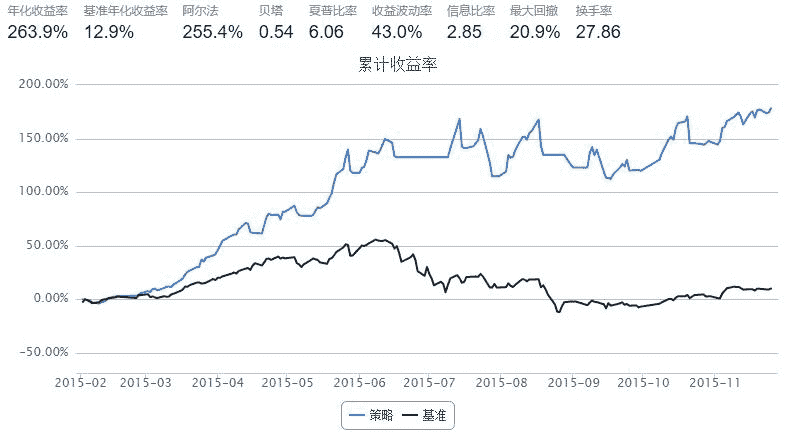

# 学习笔记：可模拟（小市值+便宜 的修改版）

> 来源：https://uqer.io/community/share/566e867d228e5b7b41cfaf01

```py
#小市值，低股价可模拟策略
import numpy as np
from heapq import nlargest, nsmallest
from CAL.PyCAL import *
import operator
start = '2015-01-01'
end  = '2015-11-25'
benchmark = 'HS300'							# 策略参考标准
#以沪深300、中证500、创业板的并集为股票池（中间存在一定交叉，因此需要去掉重复项）
universe = list(set(set_universe('HS300')+set_universe('ZZ500')+set_universe('CYB')))
capital_base = 10000
stk_num = 10      # 持仓股票数量
refresh_rate = 1

def initialize(account):
    pass

def handle_data(account):
    cal = Calendar('China.SSE')
    # ----------------- 清洗universe --------------------------------
    date = account.current_date #类型为datetime   Date.fromDateTime(datetime) 将datetime转为Date，反过来 Date.toDateTime()将Date转为datetime
    yesterday = cal.advanceDate(date, '-1B', BizDayConvention.Following) 
    yesterday = datetime(yesterday.year(), yesterday.month(), yesterday.dayOfMonth()).strftime('%Y%m%d')
    fivedays =  cal.advanceDate(date, '-5B', BizDayConvention.Following)
    fivedays = datetime(fivedays.year(), fivedays.month(), fivedays.dayOfMonth()).strftime('%Y%m%d')
    # 选出可用的300只市值最小的股票（如过用 universe = StockScreener(Factor('LCAP').nsmall(300))则不能进行模拟）
    # MktStockFactorsOneDayGet函数支持的股票池长度有限，所以分两次合成Dataframe
    LCAP = DataAPI.MktStockFactorsOneDayGet(tradeDate=yesterday,secID=account.universe[0:len(account.universe)/2],field=['LCAP','secID'])
    LCAP = LCAP.append(DataAPI.MktStockFactorsOneDayGet(tradeDate=yesterday,secID=account.universe[len(account.universe)/2:],field=['LCAP','secID']))
    LCAP = LCAP.sort_index(by = 'LCAP')
    #这里我们将股票池转移到自己定义的my_universe中，不能修改account.universe，因为一旦修改则会导致模拟无法正常进行
    my_universe =[i for i in LCAP['secID']][0:300]  
    # 去除ST股
    try:
        STlist = DataAPI.SecSTGet(secID=my_universe, beginDate=yesterday, endDate=yesterday, field=['secID']).tolist()
        my_universe = [s for s in my_universe if s not in STlist]
    except:
        pass
    # 去除流动性差的股票
    tv = account.get_attribute_history('turnoverValue', 20)
    mtv = {sec: sum(tvs)/20. for sec,tvs in tv.items()}
    my_universe = [s for s in my_universe if mtv.get(s, 0) >= 10000000]
    # 去除新上市或复牌的股票
    opn = account.get_attribute_history('openPrice', 1)
    my_universe = [s for s in my_universe if not (np.isnan(opn.get(s, 0)[0]) or opn.get(s, 0)[0] == 0)]
    # 去除弱势股票
    hist_prices = account.get_attribute_history('closePrice', 5)
    hist_returns = {sec: hist_prices[sec][-1]/hist_prices[sec][0] for sec in hist_prices.keys()}
    my_universe = [s for s in my_universe if hist_returns.get(s, 0) > 0.96]  
    #选出价格最小的stk_num*2只股票
    bucket = {}
    for stk in my_universe:
        bucket[stk] = account.referencePrice[stk]
    '''这里我们其实取了股价最低的 stk_num*2 只，原因在于：如果取stk_num只，
    那么一旦遇到涨停停牌等买不进的情况，就跪了；所以我们拿stk_num*2 数量的股票，
    但是却将仓位分成stk_num份，买进可以交易的前stk_num只股票'''
    buy_list = nsmallest(stk_num*2, bucket, key=bucket.get)

    # ----------------- 调仓逻辑 --------------------------------
    clo = account.get_attribute_history('closePrice', 5)
    target_increase1 = sum(clo[stk][-1] for stk in buy_list)/sum(clo[stk][-2] for stk in buy_list) 
    target_increase2 = sum(clo[stk][-2] for stk in buy_list)/sum(clo[stk][-3] for stk in buy_list) 
    target_increase5 = sum(clo[stk][-1] for stk in buy_list)/sum(clo[stk][0] for stk in buy_list) 
    dapan = DataAPI.MktIdxdGet(ticker=u"000300",beginDate=fivedays,endDate=yesterday,field=['closeIndex'],pandas="1")
    dapan_increase = dapan['closeIndex'][4] / dapan['closeIndex'][0]
    #止损逻辑，主要根据：最近两天的合计涨跌幅、上一天与五天前的合计涨跌幅、大盘的5天涨跌幅来作为限制条件
    #满足条件则买入股票
    if  dapan_increase >= 0.963 and target_increase1 >= 0.963 and target_increase2 >= 0.963 and target_increase5 >= 0.963:
    # 目前持仓中不在buy_list中的股票，清仓
        for stk in account.valid_secpos:
            if stk not in buy_list:
                order_to(stk, 0)

        money = account.referencePortfolioValue / stk_num
        for stk in buy_list:
            #不够一手最少买一手
            order_to(stk, max(int(money / account.referencePrice[stk] / 100),1) * 100) 
    #不满止损条件则清仓      
    else:
        for stk in account.valid_secpos:
            order_to(stk,0)
    return
```



本文主要是为了分享学习心得，希望能对和我一样的新人有所帮助。 写本文的动机主要是： 一、自己也是近期在优矿上开始模拟研究策略，觉得优矿提供的接口非常全面，并且注释详尽，让我这个新手对如何用python编写策略很快有了一个直观的认识（当然并不深入，但这已经非常好了），在量化这个本身就比较高门槛的领域，优矿能让新人有这种感觉和体验是十分难得和至关重要的，尤其在学习过程中，这是必不可少的一部分。 二、“为策略写代码注释是一个不错的学习方式”，这是一位朋友和我推荐的方法，这里也用自己的亲身体验和大家分享一下这个方法（大神请忽略我哈），确实对刚开是学习有很大帮助。

社区中有一篇“小市值+便宜就是Alpha”的策略，但是因为接口的原因不能模拟，刚好就以此为例：自己在给策略添加注释的同时，也将这个策略进行了一下修改，最终可以实现模拟运行，并可以考虑根据每天的交易信号实盘跟单。

本人是新人菜鸟，不足之处请大家多多见谅，多多批评指正，谢谢。

