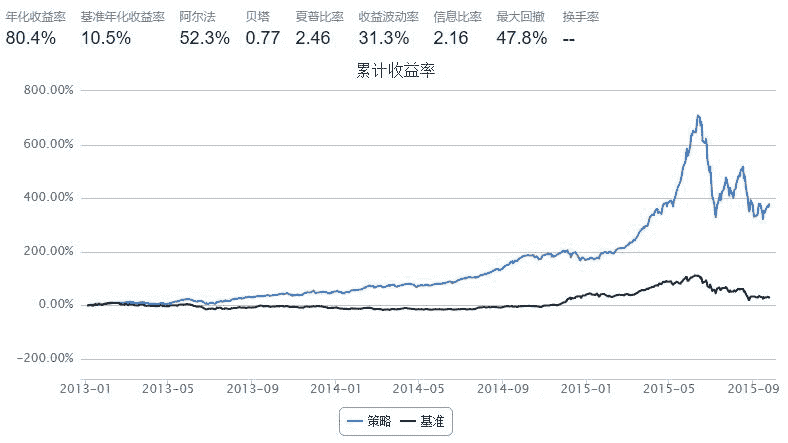
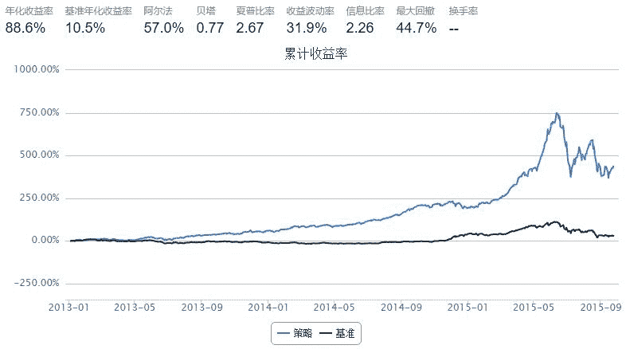
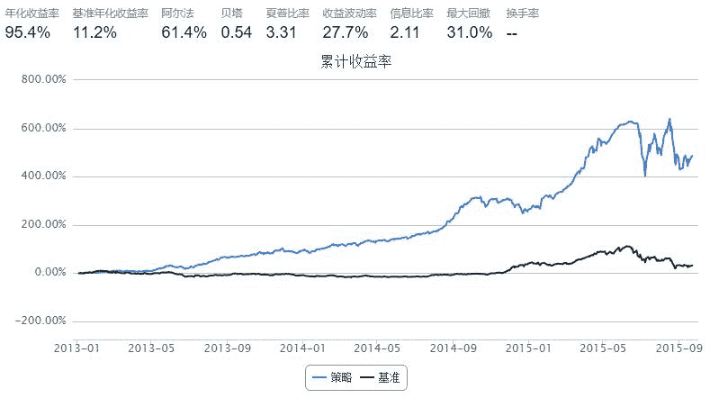
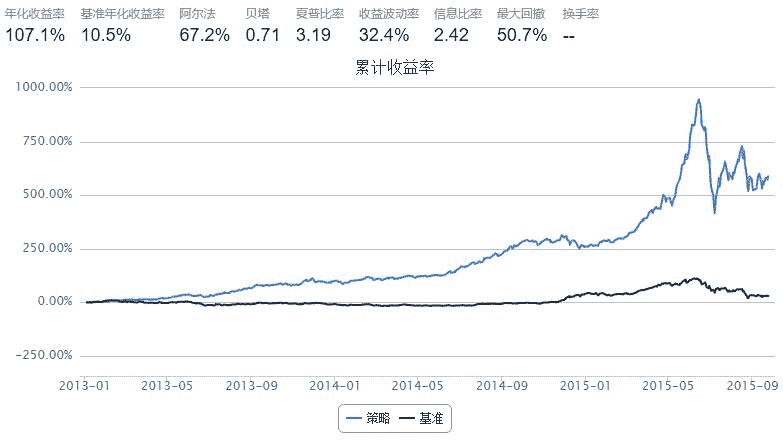

# 市值最小300指数

> 来源：https://uqer.io/community/share/5604fbe6f9f06c597665ef37

刷爆沪深300

策略名称： 市值最小３００指数

回测时间：２０１３－０１-０１ 到　２０１５－０９－２４

调仓期　：２０交易日

策略思想：找A股市场市值最小的300只股票，等权重构建最小３００指数

注意 ：

+ 内存不够请自行缩短回测时间或universe
+ 此贴有4个！！！

```py
import pandas as pd 
import numpy as np
from pandas import Series, DataFrame
start = '2013-01-01'                       # 回测起始时间
end = '2015-09-24'                         # 回测结束时间
benchmark = 'HS300'                        # 策略参考标准

universe0 = set_universe('A')               # 证券池，支持股票和基金
universe1 = set_universe('HS300')
universe2 = set_universe('ZZ500')
universe = list(set(universe0).difference(set(universe1+universe2)))   #最小市值股一定不在中证500和沪深300 pass

capital_base = 100000000                   # 起始资金
freq = 'd'                                 # 策略类型，'d'表示日间策略使用日线回测，'m'表示日内策略使用分钟线回测

refresh_rate = 20                          # 调仓频率，表示执行handle_data的时间间隔，若freq = 'd'时间间隔的单位为交易日，若freq = 'm'时间间隔为分钟

def initialize(account):                   # 初始化虚拟账户状态
    pass

def handle_data(account):                  # 每个交易日的买入卖出指令
    
    total_money = account.referencePortfolioValue     
    
    prices = account.referencePrice
    
    buylist = []
    
    marketValue = DataFrame()
    
    today = account.current_date.strftime('%Y%m%d')
    
    for s in range(len(account.universe)/40 + 1):       
        
        if s == len(account.universe)/40:
            temp_list = account.universe[s*40:]
        else :
            temp_list = account.universe[s*40:(s+1)*40]    
            
#MktEqudGet接口一次最多选50个

        try:  #排除最后一次temp_list为零的可能
            marketValue_temp = DataAPI.MktEqudGet(secID = temp_list,tradeDate= today, field=u"secID,marketValue",pandas="1")            
        except : 
            pass    
        marketValue = pd.concat([marketValue,marketValue_temp])
    
    marketValue = marketValue.sort('marketValue',ascending=True).drop_duplicates('secID')

    marketValue.set_index('secID',inplace=True)

    marketValue = marketValue.dropna()
    
    #排除新股发行日
    for s in list(marketValue.index) : 
                
        if not (np.isnan(prices[s]) or prices[s] == 0) : 
            
            buylist.append(s)
            
        if len(buylist) >= 300 :
            
            break

    sell_list = [x for x in account.valid_secpos if x not in buylist]

    for stk in sell_list:
        order_to(stk, 0)
        
   
        
    for stk in buylist:     

        order_to(stk, int(total_money/300/prices[stk]/100)*100)     
```



更改权重比例 ：加权流通市值倒数（越小越买） 买买买！

```py
import pandas as pd 
import numpy as np
from pandas import Series, DataFrame
start = '2013-01-01'                       # 回测起始时间
end = '2015-09-24'                         # 回测结束时间
benchmark = 'HS300'                        # 策略参考标准

universe0 = set_universe('A')               # 证券池，支持股票和基金
universe1 = set_universe('HS300')
universe2 = set_universe('ZZ500')
universe = list(set(universe0).difference(set(universe1+universe2)))

capital_base = 100000000                   # 起始资金
freq = 'd'                                 # 策略类型，'d'表示日间策略使用日线回测，'m'表示日内策略使用分钟线回测

refresh_rate = 20                          # 调仓频率，表示执行handle_data的时间间隔，若freq = 'd'时间间隔的单位为交易日，若freq = 'm'时间间隔为分钟

def initialize(account):                   # 初始化虚拟账户状态
    pass

def handle_data(account):                  # 每个交易日的买入卖出指令
    
    total_money = account.referencePortfolioValue     
    
    prices = account.referencePrice
    
    buylist = []
    
    marketValue = DataFrame()
    
    today = account.current_date.strftime('%Y%m%d')
    
    for s in range(len(account.universe)/40 + 1):       
        
        if s == len(account.universe)/40:
            temp_list = account.universe[s*40:]
        else :
            temp_list = account.universe[s*40:(s+1)*40]    
            
#MktEqudGet接口一次最多选50个

        try:  #排除最后一次temp_list为零的可能
            marketValue_temp = DataAPI.MktEqudGet(secID = temp_list,tradeDate= today, field=u"secID,marketValue,negMarketValue",pandas="1")            
        except : 
            pass    
        marketValue = pd.concat([marketValue,marketValue_temp])
    
    marketValue = marketValue.sort('marketValue',ascending=True).drop_duplicates('secID')

    marketValue.set_index('secID',inplace=True)

    marketValue = marketValue.dropna()
    
    #排除新股发行日
    for s in list(marketValue.index) : 
                
        if not (np.isnan(prices[s]) or prices[s] == 0) : 
            
            buylist.append(s)
            
        if len(buylist) >= 300 :
            
            break

    sell_list = [x for x in account.valid_secpos if x not in buylist]

    for stk in sell_list:
        order_to(stk, 0)
    
    #加权流通市值倒数购买  
    weight_list = []
    
    for stk in buylist:               
        weight_list.append(1.0/marketValue['negMarketValue'][stk])
        
    temp_sum = 0   
    for temp in weight_list:
            temp_sum += temp
            
    weight_list = [x/temp_sum for x in weight_list]   
                
    i = 0
    for stk in buylist:     
        order_to(stk, int(total_money*weight_list[i]/prices[stk]/100)*100)     
        i += 1
```



是不是在想賺钱分分钟了？　您有买３００只个股的毛爷爷吗，啊!　〇_〇- .
.

木有？我会告诉你买十只也很叼吗？？？

```py
import pandas as pd 
import numpy as np
from pandas import Series, DataFrame
start = '2013-01-01'                       # 回测起始时间
end = '2015-09-24'                         # 回测结束时间
benchmark = 'HS300'                        # 策略参考标准

universe0 = set_universe('A')               # 证券池，支持股票和基金
universe1 = set_universe('HS300')
universe2 = set_universe('ZZ500')
universe = list(set(universe0).difference(set(universe1+universe2)))

capital_base = 100000000                   # 起始资金
freq = 'd'                                 # 策略类型，'d'表示日间策略使用日线回测，'m'表示日内策略使用分钟线回测

refresh_rate = 20                          # 调仓频率，表示执行handle_data的时间间隔，若freq = 'd'时间间隔的单位为交易日，若freq = 'm'时间间隔为分钟

def initialize(account):                   # 初始化虚拟账户状态
    pass

def handle_data(account):                  # 每个交易日的买入卖出指令
    
    total_money = account.referencePortfolioValue     
    
    prices = account.referencePrice
    
    buylist = []
    
    marketValue = DataFrame()
    
    today = account.current_date.strftime('%Y%m%d')
    
    for s in range(len(account.universe)/40 + 1):       
        
        if s == len(account.universe)/40:
            temp_list = account.universe[s*40:]
        else :
            temp_list = account.universe[s*40:(s+1)*40]    
            
#MktEqudGet接口一次最多选50个

        try:  #排除最后一次temp_list为零的可能
            marketValue_temp = DataAPI.MktEqudGet(secID = temp_list,tradeDate= today, field=u"secID,marketValue",pandas="1")            
        except : 
            pass    
        marketValue = pd.concat([marketValue,marketValue_temp])
    
    marketValue = marketValue.sort('marketValue',ascending=True).drop_duplicates('secID')

    marketValue.set_index('secID',inplace=True)

    marketValue = marketValue.dropna()
    
    #排除新股发行日
    for s in list(marketValue.index) : 
                
        if not (np.isnan(prices[s]) or prices[s] == 0) : 
            
            buylist.append(s)
            
        if len(buylist) >= 10 :
            
            break

    sell_list = [x for x in account.valid_secpos if x not in buylist]

    for stk in sell_list:
        order_to(stk, 0)
        
    #只买最优十只
        
    for stk in buylist:     

        order_to(stk, int(total_money/10/prices[stk]/100)*100)     
```



我会告诉你有庄家（机构持股）的股票更容易飞　？？？
　
小注 ：此策略中`DataAPI.JY.EquInstShJYGet`(恒生聚源接口)暂不开放！！！活跃用户自行申请

```py
import pandas as pd 
import numpy as np
from pandas import Series, DataFrame
start = '2013-01-01'                       # 回测起始时间
end = '2015-09-24'                         # 回测结束时间
benchmark = 'HS300'                        # 策略参考标准

universe0 = set_universe('A')               # 证券池，支持股票和基金
universe1 = set_universe('HS300')
universe2 = set_universe('ZZ500')
universe = list(set(universe0).difference(set(universe1+universe2)))

capital_base = 100000000                   # 起始资金
freq = 'd'                                 # 策略类型，'d'表示日间策略使用日线回测，'m'表示日内策略使用分钟线回测

refresh_rate = 20                           # 调仓频率，表示执行handle_data的时间间隔，若freq = 'd'时间间隔的单位为交易日，若freq = 'm'时间间隔为分钟

def initialize(account):                   # 初始化虚拟账户状态
    pass

def handle_data(account):                  # 每个交易日的买入卖出指令
    
    total_money = account.referencePortfolioValue     
    
    prices = account.referencePrice
    
    buylist = []
    
    marketValue = DataFrame()
    
    today = account.current_date.strftime('%Y%m%d')
    
    for s in range(len(account.universe)/40 + 1):       
        
        if s == len(account.universe)/40:
            temp_list = account.universe[s*40:]
        else :
            temp_list = account.universe[s*40:(s+1)*40]    
            
#MktEqudGet接口一次最多选50个

        try:  #排除最后一次temp_list为零的可能
            marketValue_temp = DataAPI.MktEqudGet(secID = temp_list,tradeDate= today, field=u"secID,marketValue",pandas="1")            
        except : 
            pass    
        marketValue = pd.concat([marketValue,marketValue_temp])
    
    marketValue = marketValue.sort('marketValue',ascending=True).drop_duplicates('secID')

    marketValue.set_index('secID',inplace=True)

    marketValue = marketValue.dropna()
    
    # 机构持股  非第一天上市新股
    for s in list(marketValue.index) : 
                
        try :   
            # 处理巨源的数据接口没有此股
            temp =  DataAPI.JY.EquInstShJYGet ( secID = s , field = u"instNrfaPct" , pandas = "1" )

        except :                 
            print account.current_date.strftime('%Y-%m-%d'),' ',s,' ','DataAPI.JY.EquInstShJYGet get wrong'
            continue
        
            #有机构持股 > ３0%
        if temp['instNrfaPct'][0] > 30 and not (np.isnan(prices[s]) or prices[s] == 0) : 
            
            buylist.append(s)
            
        if len(buylist) >= 10 :
            
            break

    sell_list = [x for x in account.valid_secpos if x not in buylist]

    for stk in sell_list:
        order_to(stk, 0)
               
    for stk in buylist:     

        order_to(stk, int(total_money/10/prices[stk]/100)*100)         
```



呵呵，居然看完了，还不赶紧点赞克隆去賺钱！！！内存不够的还不赶紧签到　！！！

