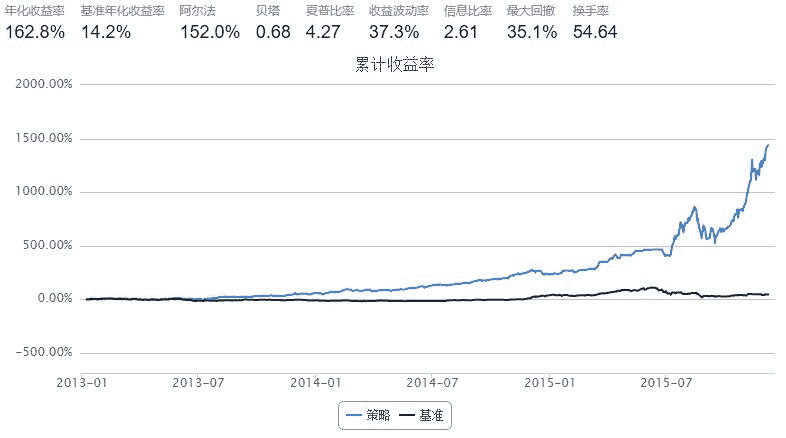

# 流通市值最小股票（新筛选器版）

> 来源：https://uqer.io/community/share/56ee3c99228e5b887fe50dc2

## 策略思路

总是持有流通市值最小的10只股票

```py
import numpy as np
from CAL.PyCAL import *

start = '2013-01-05'
end = '2015-12-07'
benchmark = 'HS300'
universe = StockScreener(Factor.LFLO.nsmall(20))    # LFLO 为流通市值对数，LCAP 为总市值对数
capital_base = 1000000
refresh_rate = 1
stk_num = 10    # 持仓股票数量

def initialize(account):
    pass

def handle_data(account): 
    open_price = account.get_attribute_history('openPrice', 1)    # 前一日开盘价
    close_price = account.referencePrice                   # 前一日收盘价
    
    #  获取回测当日的前一天日期
    dt = Date.fromDateTime(account.current_date)
    cal = Calendar('China.SSE')
    last_day = cal.advanceDate(dt,'-1B',BizDayConvention.Preceding)            #计算出倒数第一个交易日
    last_day_str = last_day.strftime("%Y%m%d")
    
    # 市值排序
    mkt_value = DataAPI.MktEqudGet(secID=account.universe,tradeDate=last_day_str,field="secID,negMarketValue",pandas="1")
    univ_sorted = mkt_value.sort('negMarketValue').secID
    
    buylist = {}
    for s in univ_sorted: 
        if not (np.isnan(close_price[s]) or close_price[s] == 0 or np.isnan(open_price[s]) or open_price[s] == 0):
            buylist[s] = 0
            
        if len(buylist) >= stk_num :     # 只持有stk_num数目的股票
            break
    
    for s in account.valid_secpos:
        if s not in buylist:
            order_to(s, 0)
            
    v = account.referencePortfolioValue / len(buylist) 
    for s in buylist:
        buylist[s] = v / close_price[s] - account.valid_secpos.get(s, 0)
    
    for s in sorted(buylist, key=buylist.get):
        order(s, buylist[s])
```



回测详情或者`bt`打印出来，都可以看到我们维护了一个总是持有10只最小流通市值股票的持仓；偶尔持仓股票数目会有11或者12只

```py
bt
```


| | tradeDate | cash | security_position | portfolio_value | benchmark_return | blotter |
| --- | --- | --- | --- | --- | --- | --- |
| 0 | 2013-01-08 | 3352.2479 | {u'300237.XSHE': {u'amount': 56400, u'cost': 1... | 1017415.8479 | -0.004200 | [Order(order_time: 2013-01-08 09:30, symbol: 0... |
| 1 | 2013-01-09 | 11778.5117 | {u'300237.XSHE': {u'amount': 56900, u'cost': 1... | 1028379.7117 | 0.000313 | [Order(order_time: 2013-01-09 09:30, symbol: 3... |
| 2 | 2013-01-10 | 3589.4794 | {u'300237.XSHE': {u'amount': 59000, u'cost': 1... | 1031625.0794 | 0.001758 | [Order(order_time: 2013-01-10 09:30, symbol: 3... |
| 3 | 2013-01-11 | 3536.7632 | {u'300237.XSHE': {u'amount': 59100, u'cost': 1... | 1033944.0632 | -0.018703 | [Order(order_time: 2013-01-11 09:30, symbol: 3... |
| 4 | 2013-01-14 | 220.7088 | {u'300280.XSHE': {u'amount': 12700, u'cost': 8... | 1071566.8088 | 0.038051 | [Order(order_time: 2013-01-14 09:30, symbol: 3... |
| 5 | 2013-01-15 | 2933.8669 | {u'300280.XSHE': {u'amount': 12800, u'cost': 8... | 1084159.1669 | 0.007033 | [Order(order_time: 2013-01-15 09:30, symbol: 3... |
| 6 | 2013-01-16 | 1784.7565 | {u'300280.XSHE': {u'amount': 12700, u'cost': 8... | 1072728.6565 | -0.007227 | [Order(order_time: 2013-01-16 09:30, symbol: 3... |
| 7 | 2013-01-17 | 66.0136 | {u'300280.XSHE': {u'amount': 12700, u'cost': 8... | 1058278.1136 | -0.009445 | [Order(order_time: 2013-01-17 09:30, symbol: 3... |
| 8 | 2013-01-18 | 80.2938 | {u'300237.XSHE': {u'amount': 58600, u'cost': 1... | 1068224.0938 | 0.016719 | [Order(order_time: 2013-01-18 09:30, symbol: 3... |
| 9 | 2013-01-21 | 3050.0950 | {u'300237.XSHE': {u'amount': 58600, u'cost': 1... | 1068048.8950 | 0.005957 | [Order(order_time: 2013-01-21 09:30, symbol: 3... |
| 10 | 2013-01-22 | 2609.2459 | {u'300237.XSHE': {u'amount': 61900, u'cost': 1... | 1036051.4459 | -0.005362 | [Order(order_time: 2013-01-22 09:30, symbol: 3... |
| 11 | 2013-01-23 | 2045.4473 | {u'300237.XSHE': {u'amount': 61000, u'cost': 1... | 1026266.2473 | 0.004066 | [Order(order_time: 2013-01-23 09:30, symbol: 3... |
| 12 | 2013-01-24 | 2926.7991 | {u'300237.XSHE': {u'amount': 60700, u'cost': 1... | 1000829.7991 | -0.009473 | [Order(order_time: 2013-01-24 09:30, symbol: 3... |
| 13 | 2013-01-25 | 328.4654 | {u'300237.XSHE': {u'amount': 60600, u'cost': 1... | 999702.1654 | -0.004290 | [Order(order_time: 2013-01-25 09:30, symbol: 3... |
| 14 | 2013-01-28 | 286.7192 | {u'300237.XSHE': {u'amount': 60500, u'cost': 1... | 1019742.9192 | 0.031182 | [Order(order_time: 2013-01-28 09:30, symbol: 3... |
| 15 | 2013-01-29 | 17.7471 | {u'300237.XSHE': {u'amount': 60700, u'cost': 1... | 1028465.7471 | 0.009050 | [Order(order_time: 2013-01-29 09:30, symbol: 3... |
| 16 | 2013-01-30 | 171.7371 | {u'300237.XSHE': {u'amount': 61100, u'cost': 1... | 1012637.1371 | 0.004802 | [Order(order_time: 2013-01-30 09:30, symbol: 3... |
| 17 | 2013-01-31 | 386.9216 | {u'300237.XSHE': {u'amount': 60700, u'cost': 1... | 996104.6216 | -0.000681 | [Order(order_time: 2013-01-31 09:30, symbol: 3... |
| 18 | 2013-02-01 | 668.2563 | {u'300237.XSHE': {u'amount': 60500, u'cost': 1... | 1016779.9563 | 0.021006 | [Order(order_time: 2013-02-01 09:30, symbol: 3... |
| 19 | 2013-02-04 | 2638.0595 | {u'300237.XSHE': {u'amount': 60500, u'cost': 1... | 1027883.2595 | 0.001713 | [Order(order_time: 2013-02-04 09:30, symbol: 3... |
| 20 | 2013-02-05 | 422.8302 | {u'300237.XSHE': {u'amount': 61100, u'cost': 1... | 1037631.5302 | 0.008606 | [Order(order_time: 2013-02-05 09:30, symbol: 3... |
| 21 | 2013-02-06 | 102645.2421 | {u'300237.XSHE': {u'amount': 61100, u'cost': 1... | 1036665.5421 | 0.001505 | [Order(order_time: 2013-02-06 09:30, symbol: 3... |
| 22 | 2013-02-07 | 350.1216 | {u'300237.XSHE': {u'amount': 61000, u'cost': 1... | 1040688.9216 | -0.005753 | [Order(order_time: 2013-02-07 09:30, symbol: 3... |
| 23 | 2013-02-08 | 66.3084 | {u'300237.XSHE': {u'amount': 61600, u'cost': 1... | 1052094.3084 | 0.004294 | [Order(order_time: 2013-02-08 09:30, symbol: 3... |
| 24 | 2013-02-18 | 356.0140 | {u'300237.XSHE': {u'amount': 60600, u'cost': 1... | 1059799.6140 | -0.012357 | [Order(order_time: 2013-02-18 09:30, symbol: 3... |
| 25 | 2013-02-19 | 347.5874 | {u'300237.XSHE': {u'amount': 60900, u'cost': 1... | 1043617.1874 | -0.018948 | [Order(order_time: 2013-02-19 09:30, symbol: 3... |
| 26 | 2013-02-20 | 1524.6353 | {u'300237.XSHE': {u'amount': 60900, u'cost': 1... | 1064335.0353 | 0.006341 | [Order(order_time: 2013-02-20 09:30, symbol: 3... |
| 27 | 2013-02-21 | 5.6970 | {u'300237.XSHE': {u'amount': 61100, u'cost': 1... | 1055551.1970 | -0.034074 | [Order(order_time: 2013-02-21 09:30, symbol: 3... |
| 28 | 2013-02-22 | 427.2956 | {u'300237.XSHE': {u'amount': 60600, u'cost': 1... | 1065969.2956 | -0.005340 | [Order(order_time: 2013-02-22 09:30, symbol: 3... |
| 29 | 2013-02-25 | 128.1500 | {u'300237.XSHE': {u'amount': 61100, u'cost': 1... | 1080711.1500 | 0.003220 | [Order(order_time: 2013-02-25 09:30, symbol: 3... |
| ... | ... | ... | ... | ... | ... | ... |
| 677 | 2015-10-27 | 2335.2216 | {u'300405.XSHE': {u'amount': 21700, u'cost': 3... | 9409754.2216 | 0.001008 | [Order(order_time: 2015-10-27 09:30, symbol: 3... |
| 678 | 2015-10-28 | 3639.3976 | {u'300405.XSHE': {u'amount': 21900, u'cost': 3... | 9225569.3976 | -0.018915 | [Order(order_time: 2015-10-28 09:30, symbol: 3... |
| 679 | 2015-10-29 | 2647.5406 | {u'300405.XSHE': {u'amount': 21900, u'cost': 3... | 9463491.5406 | 0.002379 | [Order(order_time: 2015-10-29 09:30, symbol: 3... |
| 680 | 2015-10-30 | 3303.6906 | {u'300405.XSHE': {u'amount': 21900, u'cost': 3... | 9688757.6906 | 0.000218 | [Order(order_time: 2015-10-30 09:30, symbol: 3... |
| 681 | 2015-11-02 | 11034.8026 | {u'300405.XSHE': {u'amount': 23100, u'cost': 3... | 9996076.8026 | -0.016445 | [Order(order_time: 2015-11-02 09:30, symbol: 3... |
| 682 | 2015-11-03 | 29889.7366 | {u'002735.XSHE': {u'amount': 26300, u'cost': 3... | 10474014.7366 | -0.003012 | [Order(order_time: 2015-11-03 09:30, symbol: 3... |
| 683 | 2015-11-04 | 3009.8936 | {u'002735.XSHE': {u'amount': 26700, u'cost': 3... | 10880432.8936 | 0.047048 | [Order(order_time: 2015-11-04 09:30, symbol: 3... |
| 684 | 2015-11-05 | 1079.4096 | {u'002735.XSHE': {u'amount': 26800, u'cost': 3... | 10870617.4096 | 0.021340 | [Order(order_time: 2015-11-05 09:30, symbol: 3... |
| 685 | 2015-11-06 | 104.6466 | {u'002735.XSHE': {u'amount': 27600, u'cost': 3... | 11390740.6466 | 0.023585 | [Order(order_time: 2015-11-06 09:30, symbol: 0... |
| 686 | 2015-11-09 | 8962.8616 | {u'002735.XSHE': {u'amount': 27500, u'cost': 3... | 12093281.8616 | 0.012385 | [Order(order_time: 2015-11-09 09:30, symbol: 3... |
| 687 | 2015-11-10 | 22992.6176 | {u'002735.XSHE': {u'amount': 27400, u'cost': 3... | 12110893.6176 | -0.001853 | [Order(order_time: 2015-11-10 09:30, symbol: 3... |
| 688 | 2015-11-11 | 1201562.4166 | {u'002735.XSHE': {u'amount': 28000, u'cost': 3... | 13030169.4166 | 0.000106 | [Order(order_time: 2015-11-11 09:30, symbol: 6... |
| 689 | 2015-11-12 | 113031.2706 | {u'002735.XSHE': {u'amount': 28200, u'cost': 3... | 14037309.2706 | -0.009996 | [Order(order_time: 2015-11-12 09:30, symbol: 3... |
| 690 | 2015-11-13 | 5102.3686 | {u'002735.XSHE': {u'amount': 29400, u'cost': 3... | 12922427.3686 | -0.012932 | [Order(order_time: 2015-11-13 09:30, symbol: 0... |
| 691 | 2015-11-16 | 21313.6426 | {u'002735.XSHE': {u'amount': 29100, u'cost': 3... | 13183437.6426 | 0.004774 | [Order(order_time: 2015-11-16 09:30, symbol: 0... |
| 692 | 2015-11-17 | 1401.0406 | {u'002735.XSHE': {u'amount': 29600, u'cost': 3... | 12937004.0406 | -0.001525 | [Order(order_time: 2015-11-17 09:30, symbol: 6... |
| 693 | 2015-11-18 | 173.1346 | {u'002735.XSHE': {u'amount': 29700, u'cost': 3... | 12168156.1346 | -0.011390 | [Order(order_time: 2015-11-18 09:30, symbol: 0... |
| 694 | 2015-11-19 | 2455.0746 | {u'002735.XSHE': {u'amount': 29400, u'cost': 3... | 12936911.0746 | 0.015984 | [Order(order_time: 2015-11-19 09:30, symbol: 0... |
| 695 | 2015-11-20 | 7478.6776 | {u'002735.XSHE': {u'amount': 29700, u'cost': 3... | 13013394.6776 | -0.000155 | [Order(order_time: 2015-11-20 09:30, symbol: 3... |
| 696 | 2015-11-23 | 3168.3376 | {u'002735.XSHE': {u'amount': 29700, u'cost': 3... | 12619590.3376 | -0.005577 | [Order(order_time: 2015-11-23 09:30, symbol: 3... |
| 697 | 2015-11-24 | 15418.3816 | {u'002735.XSHE': {u'amount': 29400, u'cost': 3... | 13665856.3816 | 0.000148 | [Order(order_time: 2015-11-24 09:30, symbol: 0... |
| 698 | 2015-11-25 | 70214.3646 | {u'002735.XSHE': {u'amount': 29400, u'cost': 3... | 13704250.3646 | 0.007384 | [Order(order_time: 2015-11-25 09:30, symbol: 6... |
| 699 | 2015-11-26 | 16885.0396 | {u'002735.XSHE': {u'amount': 29600, u'cost': 3... | 13902736.0396 | -0.005865 | [Order(order_time: 2015-11-26 09:30, symbol: 6... |
| 700 | 2015-11-27 | 47391.8976 | {u'002735.XSHE': {u'amount': 29100, u'cost': 3... | 13367121.8976 | -0.053848 | [Order(order_time: 2015-11-27 09:30, symbol: 0... |
| 701 | 2015-11-30 | 31493.4806 | {u'002735.XSHE': {u'amount': 30100, u'cost': 3... | 14149036.4806 | 0.002648 | [Order(order_time: 2015-11-30 09:30, symbol: 3... |
| 702 | 2015-12-01 | 2339.8786 | {u'002761.XSHE': {u'amount': 40700, u'cost': 3... | 13996263.8786 | 0.007089 | [Order(order_time: 2015-12-01 09:30, symbol: 6... |
| 703 | 2015-12-02 | 1396517.7026 | {u'002761.XSHE': {u'amount': 40200, u'cost': 3... | 13965267.7026 | 0.036267 | [Order(order_time: 2015-12-02 09:30, symbol: 0... |
| 704 | 2015-12-03 | 1439379.3926 | {u'002735.XSHE': {u'amount': 30900, u'cost': 3... | 14861814.3926 | 0.007347 | [Order(order_time: 2015-12-03 09:30, symbol: 0... |
| 705 | 2015-12-04 | 1479225.7226 | {u'002761.XSHE': {u'amount': 41600, u'cost': 3... | 15134121.7226 | -0.019125 | [Order(order_time: 2015-12-04 09:30, symbol: 3... |
| 706 | 2015-12-07 | 1552999.2546 | {u'002735.XSHE': {u'amount': 31600, u'cost': 3... | 15369296.2546 | 0.002723 | [Order(order_time: 2015-12-07 09:30, symbol: 0... |

```
707 rows × 6 columns
```

