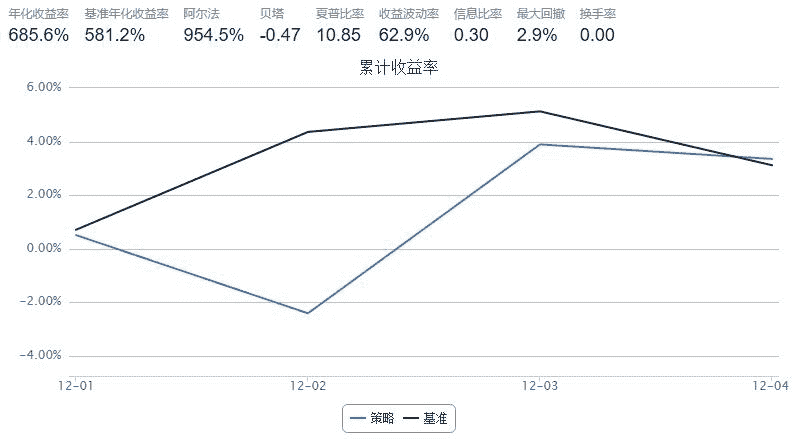

# 持有市值最小的10只股票

> 来源：https://uqer.io/community/share/5666456ef9f06c6c8a91b52d

策略是一直持有沪深当中流通市值最少的10只股票。分割线前部分是第一次买入10只市值最少的股票。 分割线后部分是每次换股票的策略。1.因为持仓中可能有停牌，所以希望能把停牌的股票先排除在外，形成new持仓，就是需要换的股票，假如这里还有8只。（这里buylist应该如何传递之前的10只信息？）2.获得现在市场上市值最小的8只股票成为target，取8只是因为极端的情况下就是我把自己持仓的全部都卖出了，换成新的8只。3.判断，卖出，如果旧有的持仓中股票不在新的target里面，证明持有的市值大于target里面的，就卖出，获得资金；买入，若此时卖出了3只，则剩余5只，那么用资金平均买入target里面市值最小的3只。形成新的8只，加上原来停牌的2只，则一共10只。 分割线后部分不知道如何写，希望指导，非常感谢。

```py
start = '2015-12-01'                                          
end = '2015-12-06'
benchmark = 'HS300'                        
universe = StockScreener(Factor.LFLO.nsmall(20))
capital_base = 100000                     
freq = 'd'                                 
refresh_rate = 1                           # 调仓频率，表示执行handle_data的时间间隔，若freq = 'd'时间间隔的单位为交易日，若freq = 'm'时间间隔为分钟
n=10
def initialize(account):                   # 初始化虚拟账户状态
    pass

def handle_data(account):                  # 每个交易日的买入卖出指令
    print "current_date = %s"%(account.current_date.strftime('%Y%m%d'))
    buy_list=[]
    holding_first=DataAPI.MktEqudGet(secID=account.universe,tradeDate=account.current_date,field="tradeDate,secID,negMarketValue,closePrice",pandas="1")#获得市场上市值最少的10只股票
    holding_first=holding_first.sort(columns='negMarketValue')[0:n] #选出第一次能交易的十只
    print holding_first
    for stk in holding_first.secID: 
        if len(buy_list)<10:
            order(stk,capital_base/n)
            buy_list.append(stk)
    print buy_list  # ——————————————————————————————分割线  
    new_holding=DataAPI.MktEqudGet(secID='buy_list',tradeDate=account.current_date,field="tradeDate,secID,negMarketValue,closePrice",pandas="1")#在下一个交易周期中获得，当前持仓中能交易的个股信息
    new_target=DataAPI.MktEqudGet(secID=account.universe,tradeDate=account.current_date,field="tradeDate,secID,negMarketValue,closePrice",pandas="1")#在下一个交易周期中获得，市场上市值最少的股票
    new_target=new_target.sort(columns='negMarketValue')[0:len(new_holidng.secID)] #按照市值排序，并且选择与持仓可交易股票数量相等的股票数
    for stock in newholding.secID:                #卖出需要换掉的股票,获得相应的资金留作买股票用(先卖出)
        if stock not in new_target.secID:
            order_to(stock,0)
            new_holding.remove(stock)
            today_cash = account_cash + account.valid_secpos[stock]
    for stock in new_target.secID:                 #买入需要更换的股票,买入的数目与换出的数目相同且市值由小到大（再买入）
        if stock not in new_holding.secID and #买入的股票数目直到与换出的数目相等为止
            order_to(stock,today_cash/len#买入的数目)  #貌似需要再添加一个变量
```




```
current_date = 20151201
     tradeDate        secID  negMarketValue  closePrice
15  2015-12-01  300466.XSHE       600200000       30.01
2   2015-12-01  002735.XSHE       929800000       46.49
17  2015-12-01  300483.XSHE       974175000       62.85
3   2015-12-01  002743.XSHE       977251400       32.21
14  2015-12-01  300464.XSHE       985959000       47.70
16  2015-12-01  300472.XSHE       988197600       59.28
13  2015-12-01  300461.XSHE       998798400       59.88
5   2015-12-01  002755.XSHE      1004984400       39.66
6   2015-12-01  002760.XSHE      1019700000       46.35
7   2015-12-01  002761.XSHE      1044600000       34.82
['300466.XSHE', '002735.XSHE', '300483.XSHE', '002743.XSHE', '300464.XSHE', '300472.XSHE', '300461.XSHE', '002755.XSHE', '002760.XSHE', '002761.XSHE']
current_date = 20151202
     tradeDate        secID  negMarketValue  closePrice
13  2015-12-02  300466.XSHE       660200000       33.01
2   2015-12-02  002735.XSHE       902000000       45.10
12  2015-12-02  300464.XSHE       939658200       45.46
3   2015-12-02  002743.XSHE       945091000       31.15
16  2015-12-02  300483.XSHE       947205000       61.11
4   2015-12-02  002755.XSHE       964440400       38.06
14  2015-12-02  300472.XSHE       997032700       59.81
1   2015-12-02  002734.XSHE       999050000       30.74
10  2015-12-02  300423.XSHE      1012220000       46.01
17  2015-12-02  603009.XSHG      1026528300       38.49
['300466.XSHE', '002735.XSHE', '300464.XSHE', '002743.XSHE', '300483.XSHE', '002755.XSHE', '300472.XSHE', '002734.XSHE', '300423.XSHE', '603009.XSHG']
current_date = 20151203
     tradeDate        secID  negMarketValue  closePrice
13  2015-12-03  300466.XSHE       726200000       36.31
1   2015-12-03  002735.XSHE       961200000       48.06
2   2015-12-03  002743.XSHE       979678600       32.29
4   2015-12-03  002755.XSHE      1010559200       39.88
12  2015-12-03  300464.XSHE      1020684600       49.38
0   2015-12-03  002734.XSHE      1031550000       31.74
15  2015-12-03  300483.XSHE      1041910000       67.22
5   2015-12-03  002761.XSHE      1070700000       35.69
8   2015-12-03  300391.XSHE      1071222750       20.73
16  2015-12-03  603009.XSHG      1082001900       40.57
['300466.XSHE', '002735.XSHE', '002743.XSHE', '002755.XSHE', '300464.XSHE', '002734.XSHE', '300483.XSHE', '002761.XSHE', '300391.XSHE', '603009.XSHG']
current_date = 20151204
     tradeDate        secID  negMarketValue  closePrice
12  2015-12-04  300466.XSHE       798800000       39.94
2   2015-12-04  002743.XSHE       994241800       32.77
3   2015-12-04  002755.XSHE      1028804000       40.60
0   2015-12-04  002734.XSHE      1031875000       31.75
11  2015-12-04  300464.XSHE      1051482900       50.87
14  2015-12-04  300483.XSHE      1059735000       68.37
15  2015-12-04  603009.XSHG      1064399700       39.91
1   2015-12-04  002735.XSHE      1070048000       47.77
16  2015-12-04  603022.XSHG      1088400000       54.42
10  2015-12-04  300423.XSHE      1095160000       49.78
['300466.XSHE', '002743.XSHE', '002755.XSHE', '002734.XSHE', '300464.XSHE', '300483.XSHE', '603009.XSHG', '002735.XSHE', '603022.XSHG', '300423.XSHE']
```

