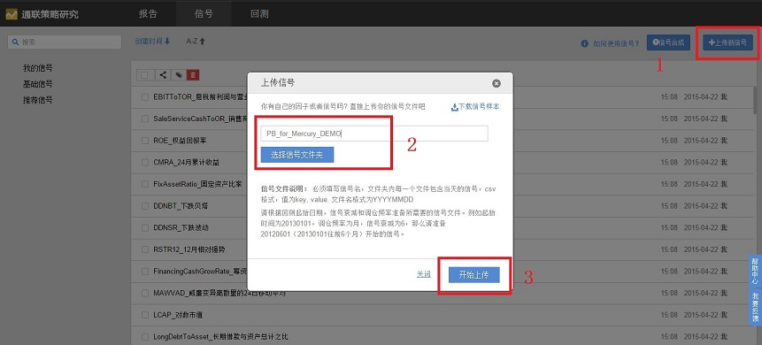
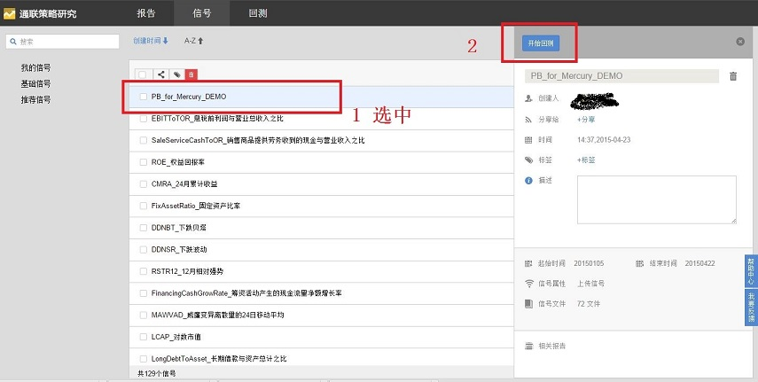
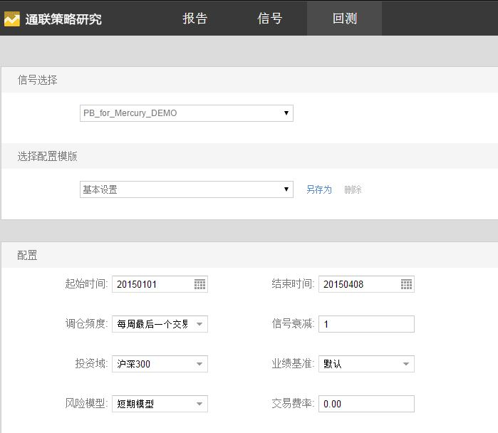
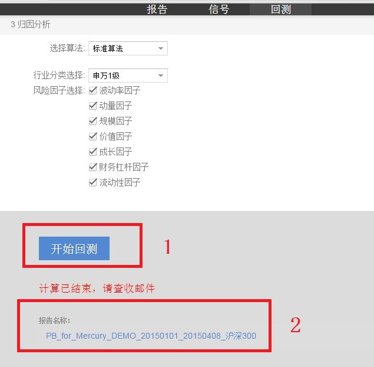
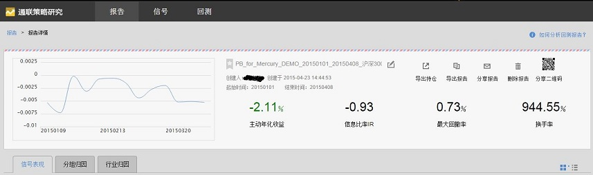
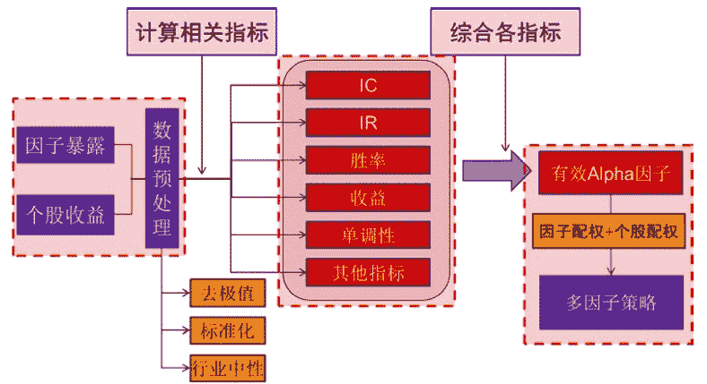

# 量化分析师的Python日记【第12天：量化入门进阶之葵花宝典：因子如何产生和回测】

> 来源：https://uqer.io/community/share/5538c7d4f9f06c3c92306684

## 0 预备知识

预备知识包括：数学，计算机，投资学

数学方面至少包括微积分，线性代数，优化理论，概率统计基础，线性回归等知识点。数学出生最佳，一般理工科都基本满足要求，即使有所欠缺，花点时间也就自学补上了

计算机主要有两点：一是会编程；二是会数据分析，相信在量化实验室看到截止今天日记的同学都已经满足了

投资学方面只要通过大学的《投资学》课程就好，像William Sharpe等3人合著的《投资学》，要是能够通过CFA那就最好，知识面更广

## 1 入门阶段

Barra USE3 handbook

Barra是量化投资技术提供商,是量化投资先驱。其经典的美国股票风险模型第3版（USE3）手册，详细介绍了股票市场多因子模型的理论框架和实证细节。手册共几十页，不太长，描述规范清晰，不陷入无意义的细节，非常适合于入门, 点此下载

## 2 系统学习阶段

系统学习1：Quantitative Equity Portfolio Management（QEPM）， Ludwig Chincarini 偏学术风格。

偏学术界的作者撰写的关于量化股票组合投资的系统教程。尤其是前几章概述部分写得非常精彩、易懂、准确。把该领域的各个方面高屋建瓴地串讲了一遍。后面部分的章节似乎略有些学术了，但也值得一读。由于其较高的可读性，适于初学者学习。

系统学习2：Active Portfolio Management（APM）， Grinold & Kahn 偏业界风格。

业界先驱所著，作者均曾任Barra公司的研究总监。本书深度相对较深，描述也偏实践，介绍了许多深刻的真知。并且书中很多论述精彩而透彻。该书被奉为量化组合投资业界圣经。不过该书有些章节撰写得深度不一，初学者容易感到阅读起来有点困难。所以推荐：首次阅读不必纠结看不懂的细节，只要不影响后续阅读就跳过具体细节；有一定基础后，建议经常反复阅读本书。

系统学习3：Quantitative Equity Portfolio Management（QEPM）， Qian & Hua & Sorensen APM的补充

业界人士所著。针对性地对APM没有展开讲的一些topic做了很好的深入探讨。建议在APM之后阅读。该书风格比较数学，不过对数学专业背景的人并不太难。撰写文字也比较流畅。

注：修行上述3本葵花宝典是否要割舍些什么？主要是与亲友坐在一起聊天喝茶的时光、一些睡觉的时间以及购书需要上千元钱（建议读英文原著）；好消息是，练成之后，不仅钱可以赚回来，空闲时间也会多起来。

## 3 实践阶段

券商卖方金工研究报告：多因子模型、选股策略、择时策略

系统学习上面的材料之后，你已经有了分辨能力，这是看数量众多的券商卖方金工研究报告，就可以庖丁解牛，分辨真伪，总能筛选出优质信息积累下来了。

值得总结的是数学、计算机、分析框架等工具都只是量化投资的形，优质投资想法才是灵魂。所以在修炼上述量化投资的基本功的同时，请不要忘记向有洞察力、有独立思考的其它派系的投资专家学习，无论他/她是价值投资、成长投资、涨停板敢死队、技术分析、主题投资、逆向投资、各类套利。将你自己想出的或者从别人那里习得的投资想法，用量化框架验证、改进、去伪存真，并最终上实盘创造价值。

最推荐的入行过程：学习上述材料的同时，在通联量化实验室利用海量数据编程实现，理论付诸实践！

## 4 实战操作示例

在关于`pandas`的前两篇介绍中，我们已经接触了不少关于`Series`和`DataFrame`的操作以及函数。本篇将以实际的例子来介绍`pandas`在处理实际金融数据时的应用。

因子选股是股票投资中最常用的一种分析手段，利用量化计算的因子从成百上千的股票中进行快速筛选，帮助投资者从海量的数据中快速确定符合要求的目标，以下我们以量化因子计算过程的实例来展示如何利用pandas处理数据。

首先，我们依然是导入需要的一些外部模块：

```py
import numpy as np
import pandas as pd
import datetime as dt
from pandas import Series, DataFrame, isnull
from datetime import timedelta, datetime
from CAL.PyCAL import *

pd.set_option('display.width', 200)
```

接着我们定义股票池和计算时所需要的时间区间参数。通常而言，计算某个因子是基于全A股的，这里作为示例，以HS300作为股票池。以计算市净率（PB）为例，我们取近一年的数据：

```py
universe = set_universe('HS300')

today = Date.todaysDate()
start_date = (today - Period('1Y')).toDateTime().strftime('%Y%m%d')
end_date = today.toDateTime().strftime('%Y%m%d')
print 'start_date'
print start_date
print 'end_date'
print end_date

start_date
20150714
end_date
20160714
```

市净率是每股市价(Price)和每股净资产(Book Value)的比值，计算时通常使用总市值和归属于母公司所有者权益合计之比得到。前者通过访问股票日行情数据可以获得，后者在资产负债表上能够查到。在量化实验室中提供了访问股票日行情和资产负债表的API，可以获得相应数据。需要注意的一点是在获取财务报表数据时，因为只能指定一种类型的财报（季报，半年报，年报），需要做一个循环查询，并将获取到的`DataFrame`数据按垂直方向拼接，这里使用了`concat`函数：

```py
market_capital = DataAPI.MktEqudGet(secID=universe, field=['secID', 'tradeDate', 'marketValue', 'negMarketValue'], beginDate=start_date, endDate=end_date, pandas='1')

equity = DataFrame()
for rpt_type in ['Q1', 'S1', 'Q3', 'A']:
    try:
        tmp = DataAPI.FdmtBSGet(secID=universe, field=['secID', 'endDate', 'publishDate', 'TEquityAttrP'], beginDate=start_date, publishDateEnd=end_date,  reportType=rpt_type)
    except:
        tmp = DataFrame()
    equity = pd.concat([equity, tmp], axis=0)

print 'Data of TEquityAttrP:'
print equity.head()
print 'Data of marketValue:'
print market_capital.head()

Data of TEquityAttrP:
         secID     endDate publishDate  TEquityAttrP
0  000001.XSHE  2016-03-31  2016-04-21  1.875690e+11
1  000002.XSHE  2016-03-31  2016-04-28  1.006367e+11
2  000009.XSHE  2016-03-31  2016-04-29  4.467273e+09
3  000039.XSHE  2016-03-31  2016-04-29  5.668081e+09
4  000060.XSHE  2016-03-31  2016-04-28  7.340159e+09
Data of marketValue:
         secID   tradeDate   marketValue  negMarketValue
0  000001.XSHE  2015-07-14  1.984613e+11    1.637222e+11
1  000001.XSHE  2015-07-15  1.943118e+11    1.602991e+11
2  000001.XSHE  2015-07-16  1.945980e+11    1.605351e+11
3  000001.XSHE  2015-07-17  1.977459e+11    1.631320e+11
4  000001.XSHE  2015-07-20  1.945980e+11    1.605351e+11
```

对于市值的数据，每个交易日均有提供，实际上我们多取了数据，我们只需要最新的市值数据即可。为此，我们将数据按股票代码和交易日进行排序，并按股票代码丢弃重复数据。以下代码表示按股票代码和交易日进行升序排序，并在丢弃重复值时，保留最后一个（默认是第一个）：

```py
market_capital = market_capital.sort(columns=['secID', 'tradeDate'], ascending=[True, True])
market_capital = market_capital.drop_duplicates(subset='secID', take_last=True)
```

并非所有的数据都是完美的，有时候也会出现数据的缺失。我们在计算时无法处理缺失的数据，需要丢弃。下面这一行代码使用了`isnull`函数检查数据中总市值的缺失值，返回的是一个等长的逻辑`Series`，若数据缺失则为`True`。为尽可能多利用数据，我们考虑在总市值缺失的情况下，若流通市值有数值，则使用流通市值替换总市值，仅在两者皆缺失的情况下丢弃数据（虽然多数情况下是流通市值缺失，有总市值的数据，这一处理方式在其它使用到流通市值计算的情形中可以参考）：

```py
market_capital['marketValue'][isnull(market_capital['marketValue'])] = market_capital['negMarketValue'][isnull(market_capital['marketValue'])]
```

以下代码使用`drop`函数舍去了流通市值这一列，使用`dropna`函数丢弃缺失值，并使用`rename`函数将列`marketValue`重命名为`numerator`：

```py
market_capital = market_capital.drop('negMarketValue', axis=1)
numerator = market_capital.dropna()
numerator.rename(columns={'marketValue': 'numerator'}, inplace=True)
```

我们可以看一下处理好的分子：

```py
print numerator

             secID   tradeDate     numerator
244    000001.XSHE  2016-07-13  1.543620e+11
489    000002.XSHE  2016-07-13  2.022373e+11
734    000009.XSHE  2016-07-13  2.257608e+10
49244  000027.XSHE  2016-07-13  2.755322e+10
979    000039.XSHE  2016-07-13  4.434777e+10
49489  000046.XSHE  2016-07-13  5.222182e+10
1224   000060.XSHE  2016-07-13  2.739233e+10
1469   000061.XSHE  2016-07-13  2.161932e+10
1714   000063.XSHE  2016-07-13  6.184518e+10
1959   000069.XSHE  2016-07-13  5.743977e+10
24744  000100.XSHE  2016-07-13  4.335857e+10
24989  000156.XSHE  2016-07-13  2.833737e+10
2204   000157.XSHE  2016-07-13  3.287913e+10
49734  000166.XSHE  2016-07-13  1.291645e+11
25234  000333.XSHE  2016-07-13  1.750697e+11
2449   000338.XSHE  2016-07-13  3.266872e+10
2694   000402.XSHE  2016-07-13  3.000886e+10
49979  000413.XSHE  2016-07-13  3.831165e+10
50224  000415.XSHE  2016-07-13  4.217844e+10
2939   000423.XSHE  2016-07-13  3.700454e+10
3184   000425.XSHE  2016-07-13  2.249481e+10
50469  000503.XSHE  2016-07-13  3.908079e+10
3429   000538.XSHE  2016-07-13  7.392896e+10
50714  000540.XSHE  2016-07-13  3.147026e+10
50959  000559.XSHE  2016-07-13  3.634171e+10
3674   000568.XSHE  2016-07-13  4.571343e+10
25479  000623.XSHE  2016-07-13  2.298707e+10
3919   000625.XSHE  2016-07-13  7.134216e+10
4164   000630.XSHE  2016-07-13  2.753465e+10
4409   000651.XSHE  2016-07-13  1.065987e+11
...            ...         ...           ...
45079  601669.XSHG  2016-07-13  8.307799e+10
45324  601688.XSHG  2016-07-13  1.519940e+11
71425  601718.XSHG  2016-07-13  3.189739e+10
71670  601727.XSHG  2016-07-13  1.034922e+11
45569  601766.XSHG  2016-07-13  2.573330e+11
71915  601788.XSHG  2016-07-13  7.094565e+10
45814  601800.XSHG  2016-07-13  1.788926e+11
23764  601808.XSHG  2016-07-13  6.083780e+10
46059  601818.XSHG  2016-07-13  1.750466e+11
24009  601857.XSHG  2016-07-13  1.356185e+12
46304  601866.XSHG  2016-07-13  4.977011e+10
72160  601872.XSHG  2016-07-13  2.771617e+10
46549  601888.XSHG  2016-07-13  4.459454e+10
46794  601898.XSHG  2016-07-13  7.623731e+10
47039  601899.XSHG  2016-07-13  8.466495e+10
47284  601901.XSHG  2016-07-13  6.478664e+10
72405  601919.XSHG  2016-07-13  5.527004e+10
47529  601928.XSHG  2016-07-13  2.842653e+10
47774  601933.XSHG  2016-07-13  3.644512e+10
48019  601939.XSHG  2016-07-13  1.265056e+12
48264  601958.XSHG  2016-07-13  2.913624e+10
72650  601985.XSHG  2016-07-13  1.092693e+11
24254  601988.XSHG  2016-07-13  9.832552e+11
48509  601989.XSHG  2016-07-13  1.327548e+11
72895  601991.XSHG  2016-07-13  5.430495e+10
48754  601992.XSHG  2016-07-13  4.399242e+10
24499  601998.XSHG  2016-07-13  2.788525e+11
73140  603000.XSHG  2016-07-13  2.080911e+10
73385  603885.XSHG  2016-07-13  3.755758e+10
48999  603993.XSHG  2016-07-13  7.734337e+10

[300 rows x 3 columns]
```

接下来处理分母数据。同样，为保留最新数据，对权益数据按股票代码升序，报表日期和发布日期按降序排列。随后丢弃缺失数据并按照股票代码去掉重复项，更改列名`TEquityAttrP`为`denominator`：

```py
equity = equity.sort(columns=['secID', 'endDate', 'publishDate'], ascending=[True, False, False])
equity = equity.dropna()
equity = equity.drop_duplicates(cols='secID')
denominator = equity
denominator.rename(columns={"TEquityAttrP": "denominator"}, inplace=True)
```

处理好的分母：


```py
print denominator

           secID     endDate publishDate   denominator
0    000001.XSHE  2016-03-31  2016-04-21  1.875690e+11
1    000002.XSHE  2016-03-31  2016-04-28  1.006367e+11
2    000009.XSHE  2016-03-31  2016-04-29  4.467273e+09
203  000027.XSHE  2016-03-31  2016-04-30  2.139399e+10
3    000039.XSHE  2016-03-31  2016-04-29  5.668081e+09
204  000046.XSHE  2016-03-31  2016-04-28  1.632725e+10
4    000060.XSHE  2016-03-31  2016-04-28  7.340159e+09
5    000061.XSHE  2016-03-31  2016-04-30  4.845586e+09
6    000063.XSHE  2016-03-31  2016-04-29  3.902424e+10
7    000069.XSHE  2016-03-31  2016-04-29  3.836175e+10
100  000100.XSHE  2016-03-31  2016-04-21  2.461872e+10
101  000156.XSHE  2016-03-31  2016-04-25  9.396250e+09
8    000157.XSHE  2016-03-31  2016-04-23  3.929794e+10
205  000166.XSHE  2016-03-31  2016-04-30  5.003656e+10
102  000333.XSHE  2016-03-31  2016-04-30  5.385758e+10
9    000338.XSHE  2016-03-31  2016-04-30  3.198088e+10
10   000402.XSHE  2016-03-31  2016-04-30  2.626535e+10
206  000413.XSHE  2016-03-31  2016-04-29  1.466822e+10
207  000415.XSHE  2016-03-31  2016-04-30  2.720240e+10
11   000423.XSHE  2016-03-31  2016-04-20  7.558454e+09
12   000425.XSHE  2016-03-31  2016-04-26  2.057239e+10
208  000503.XSHE  2016-03-31  2016-04-29  1.347180e+09
13   000538.XSHE  2016-03-31  2016-04-27  1.405493e+10
209  000540.XSHE  2016-03-31  2016-04-29  1.271475e+10
210  000559.XSHE  2016-03-31  2016-04-20  4.417438e+09
14   000568.XSHE  2016-03-31  2016-04-28  1.083373e+10
103  000623.XSHE  2016-03-31  2016-04-29  1.743589e+10
15   000625.XSHE  2016-03-31  2016-04-30  3.702576e+10
16   000630.XSHE  2016-03-31  2016-04-30  1.374468e+10
17   000651.XSHE  2016-03-31  2016-04-30  5.069274e+10
..           ...         ...         ...           ...
185  601669.XSHG  2016-03-31  2016-04-30  5.714574e+10
186  601688.XSHG  2016-03-31  2016-04-29  8.060570e+10
295  601718.XSHG  2016-03-31  2016-04-19  1.303635e+10
296  601727.XSHG  2016-03-31  2016-04-30  3.758142e+10
187  601766.XSHG  2016-03-31  2016-04-28  9.868600e+10
297  601788.XSHG  2016-03-31  2016-04-26  3.993967e+10
188  601800.XSHG  2016-03-31  2016-04-27  1.479940e+11
96   601808.XSHG  2016-03-31  2016-04-29  4.578060e+10
189  601818.XSHG  2016-03-31  2016-04-30  2.323020e+11
97   601857.XSHG  2016-03-31  2016-04-29  1.169389e+12
190  601866.XSHG  2016-03-31  2016-04-29  1.801931e+10
298  601872.XSHG  2016-03-31  2016-04-22  1.404631e+10
191  601888.XSHG  2016-03-31  2016-04-23  1.188385e+10
192  601898.XSHG  2016-03-31  2016-04-28  8.306575e+10
193  601899.XSHG  2016-03-31  2016-04-30  2.722604e+10
194  601901.XSHG  2016-03-31  2016-04-29  3.514534e+10
300  601919.XSHG  2016-03-31  2016-04-29  2.253836e+10
195  601928.XSHG  2016-03-31  2016-04-30  1.093871e+10
196  601933.XSHG  2016-03-31  2016-05-06  1.269974e+10
198  601939.XSHG  2016-03-31  2016-04-30  1.499405e+12
199  601958.XSHG  2016-03-31  2016-04-29  1.271524e+10
301  601985.XSHG  2016-03-31  2016-04-29  3.860421e+10
98   601988.XSHG  2016-03-31  2016-04-27  1.348157e+12
200  601989.XSHG  2016-03-31  2016-04-29  5.696661e+10
302  601991.XSHG  2016-03-31  2016-04-28  4.568534e+10
201  601992.XSHG  2016-03-31  2016-04-27  3.824465e+10
99   601998.XSHG  2016-03-31  2016-04-28  3.286200e+11
303  603000.XSHG  2016-03-31  2016-04-29  2.734087e+09
304  603885.XSHG  2016-03-31  2016-04-21  3.820480e+09
202  603993.XSHG  2016-03-31  2016-04-29  1.757461e+10

[300 rows x 4 columns]
```

分子分母处理好之后，我们将两个`DataFrame`使用`merge`函数合并，使用参数`how='inner'`保留在两者中均存在的股票。

```py
dat_info = numerator.merge(denominator, on='secID', how='inner')
```

作为比值，分母不可以为零，这里我们通过设置分母绝对值大于一个很小的数来过滤不符合要求的数据。随后直接通过`DataFrame['Column_name']`的复制添加一列PB：

```py
dat_info = dat_info[abs(dat_info['denominator']) >= 1e-8]
dat_info['PB'] = dat_info['numerator'] / dat_info['denominator']
```

```py
pb_signal = dat_info[['secID', 'PB']]
pb_signal = pb_signal.set_index('secID')['PB']
print pb_signal

secID
000001.XSHE     0.822961
000002.XSHE     2.009577
000009.XSHE     5.053661
000027.XSHE     1.287895
000039.XSHE     7.824125
000046.XSHE     3.198446
000060.XSHE     3.731845
000061.XSHE     4.461653
000063.XSHE     1.584789
000069.XSHE     1.497319
000100.XSHE     1.761203
000156.XSHE     3.015817
000157.XSHE     0.836663
000166.XSHE     2.581403
000333.XSHE     3.250605
000338.XSHE     1.021508
000402.XSHE     1.142527
000413.XSHE     2.611881
000415.XSHE     1.550541
000423.XSHE     4.895781
000425.XSHE     1.093446
000503.XSHE    29.009320
000538.XSHE     5.260001
000540.XSHE     2.475100
000559.XSHE     8.226875
000568.XSHE     4.219546
000623.XSHE     1.318376
000625.XSHE     1.926825
000630.XSHE     2.003295
000651.XSHE     2.102841
                 ...    
601669.XSHG     1.453791
601688.XSHG     1.885648
601718.XSHG     2.446804
601727.XSHG     2.753812
601766.XSHG     2.607594
601788.XSHG     1.776320
601800.XSHG     1.208783
601808.XSHG     1.328899
601818.XSHG     0.753530
601857.XSHG     1.159739
601866.XSHG     2.762044
601872.XSHG     1.973199
601888.XSHG     3.752535
601898.XSHG     0.917795
601899.XSHG     3.109705
601901.XSHG     1.843392
601919.XSHG     2.452265
601928.XSHG     2.598709
601933.XSHG     2.869754
601939.XSHG     0.843705
601958.XSHG     2.291442
601985.XSHG     2.830503
601988.XSHG     0.729333
601989.XSHG     2.330397
601991.XSHG     1.188674
601992.XSHG     1.150289
601998.XSHG     0.848556
603000.XSHG     7.610988
603885.XSHG     9.830593
603993.XSHG     4.400859
Name: PB, dtype: float64
```

好了接下来我们把以上PB因子计算过程变成一个函数，使得它可以计算回测开始时间到结束时间的PB值，这样我们可以在通联的多因子信号分析工具RDP中方便的测试

```py
def str2date(date_str):
    date_obj = dt.datetime(int(date_str[0:4]), int(date_str[4:6]), int(date_str[6:8]))
    return Date.fromDateTime(date_obj)

def signal_pb_calc(universe, current_date):
    today = str2date(current_date)
    start_date = (today - Period('1Y')).toDateTime().strftime('%Y%m%d')
    end_date = today.toDateTime().strftime('%Y%m%d')
    # dealing with the numerator
    market_capital = DataAPI.MktEqudGet(secID=universe, field=['secID', 'tradeDate', 'marketValue', 'negMarketValue', 'turnoverVol'], beginDate=start_date, endDate=end_date, pandas='1')
    market_capital = market_capital[market_capital['turnoverVol'] > 0]
    market_capital = market_capital.sort(columns=['secID', 'tradeDate'], ascending=[True, True])
    market_capital = market_capital.drop_duplicates(subset='secID', take_last=True)
    market_capital['marketValue'][isnull(market_capital['marketValue'])] = market_capital['negMarketValue'][isnull(market_capital['marketValue'])]
    market_capital = market_capital.drop('negMarketValue', axis=1)
    numerator = market_capital.dropna()
    numerator.rename(columns={'marketValue': 'numerator'}, inplace=True)
    # dealing with the denominator
    equity = DataFrame()
    for rpt_type in ['Q1', 'S1', 'Q3', 'A']:
        try:
            tmp = DataAPI.FdmtBSGet(secID=universe, field=['secID', 'endDate', 'publishDate', 'TEquityAttrP'], beginDate=start_date, publishDateEnd=end_date,  reportType=rpt_type)
        except:
            tmp = DataFrame()
        equity = pd.concat([equity, tmp], axis=0)

    equity = equity.sort(columns=['secID', 'endDate', 'publishDate'], ascending=[True, False, False])
    equity = equity.dropna()
    equity = equity.drop_duplicates(cols='secID')
    denominator = equity
    denominator.rename(columns={"TEquityAttrP": "denominator"}, inplace=True)
    # merge two dataframe and calculate price-to- book ratio
    dat_info = numerator.merge(denominator, on='secID', how='inner')
    dat_info = dat_info[abs(dat_info['denominator']) >= 1e-8]
    dat_info['PB'] = dat_info['numerator'] / dat_info['denominator']
    pb_signal = dat_info[['secID', 'PB']]
    pb_signal["secID"] = pb_signal["secID"].apply(lambda x:x[:6])
    return pb_signal
```

此代码完成的功能是：

+ 计算沪深300成分股在一段时间内的PB值作为信号
+ 把这些PB数据按照天存储为csv文件
+ 把csv文件打包成zip

可以将这些文件下载到本地，解压到一个文件夹（比如`PB_for_Mercury_DEMO`），然后上传到RDP（[通联策略研究](https://gw.wmcloud.com/rdp//#/signalMgr)）中当做信号使用。

```py
start = datetime(2015, 1, 1)
end = datetime(2015, 4, 23)

univ = set_universe('HS300')
cal = Calendar('China.SSE')

all_files = []
today = start
while((today - end).days < 0):
    today_CAL = Date.fromDateTime(today)
    if(cal.isBizDay(today_CAL)):
        today_str = today.strftime("%Y%m%d")
        print "Calculating PB values on " + today_str
        pb_value = signal_pb_calc(univ, today_str)
        file_name = today_str + '.csv'
        pb_value.to_csv(file_name, index=False, header=False)
        all_files.append(file_name)
    today = today + timedelta(days=1)
    
# exporting all *.csv files to PB.zip
zip_files("PB"+ "_" + start.strftime("%Y%m%d") + "_" + end.strftime("%Y%m%d"), all_files)

# delete all *.csv
delete_files(all_files)
```

第一步：解压点击‘上传新信号’，选择信号文件夹并为信号命名，然后，开始上传；



第二步：选中上传的新信号，点击 ‘开始回测’；



第三步：进行回测的各种配置；



第四步：开始回测，回测完成后，点击报告的链接，查看回测结果；



第五步：查看回测结果。



以上研究过程演示了单个因子的产生和快速回测的过程，后面会介绍多因子的策略框架



