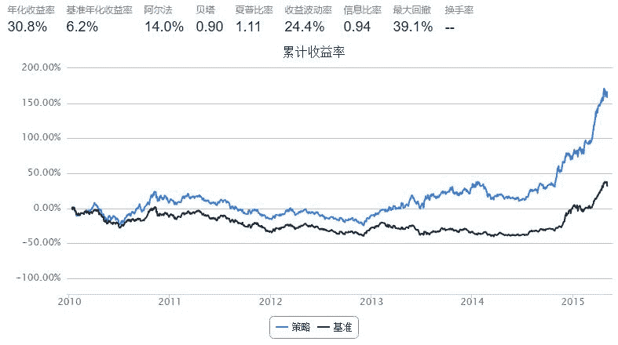
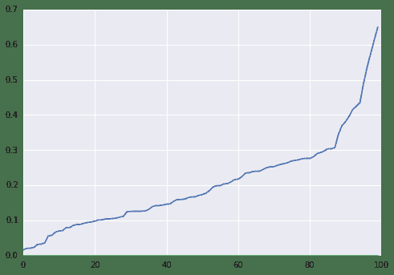

# 羊驼策略

## 策略实现

羊驼做为上古十大神兽之一, 选股祥瑞, 名号响亮, 本策略由一个羊驼类负责每周生成买入卖出信号, 验证羊驼是否名实相符.

+ 投资域 ：沪深300成分股
+ 业绩基准 ：沪深300指数
+ 调仓频率 ：5个交易日
+ 买入卖出信号 ：初始时任意买10只羊驼,每次调仓时,剔除收益最差的一只羊驼,再任意买一只羊驼.
+ 回测周期 ：2014年1月1日至2015年5月5日


```py
import numpy as np
import operator
from datetime import datetime

start = datetime(2010, 1, 1)
end   = datetime(2015, 5, 5)
benchmark = 'HS300'
universe  = set_universe('HS300')
capital_base = 100000
longest_history = 10
refresh_rate = 5

def initialize(account):
    account.stocks_num = 10

def handle_data(account):
    hist_prices = account.get_attribute_history('closePrice', 5)

    yangtuos = list(YangTuo(set(account.universe)-set(account.valid_secpos.keys()), account.stocks_num))
    cash = account.cash

    if account.stocks_num == 1:        
        hist_returns = {}
        for stock in account.valid_secpos:
            hist_returns[stock] = hist_prices[stock][-1]/hist_prices[stock][0]

        sorted_returns = sorted(hist_returns.items(), key=operator.itemgetter(1))
        sell_stock = sorted_returns[0][0]

        cash = account.cash + hist_prices[sell_stock][-1]*account.valid_secpos.get(sell_stock)
        order_to(sell_stock, 0)
    else:
        account.stocks_num = 1

    for stock in yangtuos:
        order(stock, cash/len(yangtuos)/hist_prices[stock][-1])


class YangTuo:
    def __init__(self, caoyuan=[], count=10):
        self.count = count
        self.i = 0
        self.caoyuan = list(caoyuan)

    def __iter__(self):
        return self

    def next(self):
        if self.i < self.count:
            self.i += 1
            return self.caoyuan.pop(np.random.randint(len(self.caoyuan)))
        else:
            raise StopIteration()        
```



也许你会说,这只是运气好,并不能说明羊驼的厉害啊!好,接下来我们运行100次,看看羊驼的威力.

```py
start = datetime(2010, 1, 1)
end   = datetime(2015, 5, 5)
benchmark = 'HS300'
universe  = set_universe('HS300')
capital_base = 100000

sim_params = quartz.sim_condition.env.SimulationParameters(start, end, benchmark, universe, capital_base)
idxmap_all, data_all = quartz.sim_condition.data_generator.get_daily_data(sim_params)
```

```py
import numpy as np
import operator

longest_history = 10
refresh_rate = 5

def initialize(account):
    account.stocks_num = 10

def handle_data(account):
    hist_prices = account.get_attribute_history('closePrice', 5)

    yangtuos = list(YangTuo(set(account.universe)-set(account.valid_secpos.keys()), account.stocks_num))
    cash = account.cash

    if account.stocks_num == 1:        
        hist_returns = {}
        for stock in account.valid_secpos:
            hist_returns[stock] = hist_prices[stock][-1]/hist_prices[stock][0]

        sorted_returns = sorted(hist_returns.items(), key=operator.itemgetter(1))
        sell_stock = sorted_returns[0][0]

        cash = account.cash + hist_prices[sell_stock][-1]*account.valid_secpos.get(sell_stock)
        order_to(sell_stock, 0)
    else:
        account.stocks_num = 1

    for stock in yangtuos:
        order(stock, cash/len(yangtuos)/hist_prices[stock][-1])


class YangTuo:
    def __init__(self, caoyuan=[], count=10):
        self.count = count
        self.i = 0
        self.caoyuan = list(caoyuan)

    def __iter__(self):
        return self

    def next(self):
        if self.i < self.count:
            self.i += 1
            return self.caoyuan.pop(np.random.randint(len(self.caoyuan)))
        else:
            raise StopIteration()        

strategy = quartz.sim_condition.strategy.TradingStrategy(initialize, handle_data)
perfs = []
for i in xrange(100):
    bt, acct = quartz.quick_backtest(sim_params, strategy, idxmap_all, data_all, refresh_rate = refresh_rate, longest_history=longest_history)
    perf = quartz.perf_parse(bt, acct)
    perfs.append(perf)
```

```py
from matplotlib import pylab
import seaborn
x = sorted([p['annualized_return']-p['benchmark_annualized_return'] for p in perfs])
pylab.plot(x)
pylab.plot([0]*len(x))

[<matplotlib.lines.Line2D at 0x7702a10>]
```



100%的胜率! 大家闭着眼睛,跟着羊驼买就行了!

接下来的工作:

由于指数并没有分红等概念, 直接拿HS300指数做benchmark, 对HS300并不公平. 所以接下来考虑把benchmark换成某只指数基金, 再做对比.


