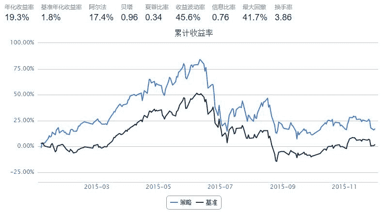

# 羊驼反转策略（修改版）

> 来源：https://uqer.io/community/share/566c0e3cf9f06c6c8a91ceec

```py
# 第一步：设置基本参数
start = '2015-01-01'                         # 回测起始时间
end   = '2015-12-01'                         # 回测结束时间
capital_base = 1000000                       # 起始资金
refresh_rate = 5                             # 调仓频率
benchmark = 'HS300'                          # 策略参考标准
freq = 'd'                                 # 策略类型，'d'表示日间策略使用日线回测

# 第二步：选择主题，设置股票池
universe = set_universe('HS300')                              # 股票池

import numpy as np
import pandas as pd

def initialize(account):                   # 初始化虚拟账户状态
    account.stocks_num=10
    

def handle_data(account):                  # 每个交易日的买入卖出指令
    if account.stocks_num==10:                           #第一天交易使用buylist
        account.stocks_num=1 
        keylist=[]
        data=DataAPI.MktStockFactorsOneDayGet(tradeDate=account.current_date,secID=account.universe,ticker=u"",field=['secID','REVS10'],pandas="1")    #获取start前一日股票池中十日收益
        keylist=data.dropna().sort(columns='REVS10',ascending=False).tail(10)['secID'].values.tolist()                   #将十日收益最差的十只股票组成list
        #hist_prices = account.get_attribute_history('closePrice', 1)      
        for i in keylist:
            order(i,100000/account.referencePrice[i])
    else:
        sellist=[]
        replacelist=[]
        keylist=[]
        for key in account.valid_secpos.keys():
            keylist.append(key)

        sell=DataAPI.MktStockFactorsOneDayGet(tradeDate=account.current_date,secID=keylist,ticker=u"",field=['secID','REVS10'],pandas="1") #获得十日账户中所有股票的收益
        sellist.append(sell.min()['secID'])                                                       #找出收益最差的股票加入sellist
        
        replace=DataAPI.MktStockFactorsOneDayGet(tradeDate=account.current_date,secID=universe,ticker=u"",field=['secID','REVS10'],pandas="1")   #获得股票池中十日以来
        replace=replace.set_index('secID').drop(keylist).dropna()
        replace=replace.sort(columns='REVS10',ascending=False).tail(1).reset_index()['secID'].values.tolist()     #获得收益最差的股票作为账户中新的代替股票

        keylist.remove(sellist[0])
        replacelist=replacelist+replace
        keylist.append(replacelist[0])
        #print keylist
        for stk in sellist:
            order_to(stk, 0)
        for stk in replacelist:
            order(stk,account.cash/account.referencePrice[stk])
        #print account.valid_secpos
```



