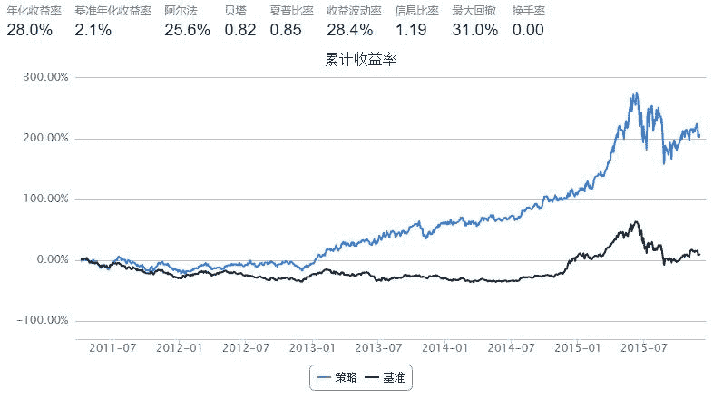

# 羊驼反转策略

> 来源：https://uqer.io/community/share/566982a4f9f06c6c8a91b7a2

```py
# 第一步：设置基本参数
start = '2011-04-01'                         # 回测起始时间
end   = '2015-12-01'                         # 回测结束时间
capital_base = 1000000                       # 起始资金
refresh_rate = 10                             # 调仓频率
benchmark = 'HS300'                          # 策略参考标准
freq = 'd'                                 # 策略类型，'d'表示日间策略使用日线回测

# 第二步：选择主题，设置股票池
universe = set_universe('HS300')                              # 股票池

import numpy as np
import pandas as pd


data=DataAPI.MktStockFactorsOneDayGet(tradeDate='20110331',secID=universe,ticker=u"",field=['secID','REVS10'],pandas="1")    #获取start前一日股票池中十日收益
buylist=data.dropna().sort(columns='REVS10',ascending=False).tail(10)['secID'].values.tolist()                   #将十日收益最差的十只股票组成list


def initialize(account):                   # 初始化虚拟账户状态
    account.stocks_num=10
    

def handle_data(account):                  # 每个交易日的买入卖出指令
    if account.stocks_num==10:                           #第一天交易使用buylist
        global buylist
        account.universe=buylist
        hist_prices = account.get_attribute_history('closePrice', 1)      
        for i in account.universe:
            order(i,100000/hist_prices[i][0])
    
    account.stocks_num=1                              #之后为非第一天交易策略
    
    sellist=[]
    replacelist=[]
    sell=DataAPI.MktStockFactorsOneDayGet(tradeDate=account.current_date,secID=account.universe,ticker=u"",field=['secID','REVS10'],pandas="1")      #获得十日以来账户中所有股票的收益
    sellist.append(sell.min()['secID'])                                                                           #找出收益最差的股票加入sellist
    
    replace=DataAPI.MktStockFactorsOneDayGet(tradeDate=account.current_date,secID=universe,ticker=u"",field=['secID','REVS10'],pandas="1")         #获得股票池中十日以来所有股票的收益
    replace=replace.set_index('secID').drop(buylist)
    replace=replace.dropna().sort(columns='REVS10',ascending=False).tail(1).reset_index()['secID'].values.tolist()                         #获得收益最差的股票作为账户中新的代替股票
    replacelist.append(replace)
    
    account.universe.remove(sell.min()['secID'])
    account.universe=account.universe+replacelist[0]
    
    hist_prices = account.get_attribute_history('closePrice', 1)                                                           #获取前一个交易日账户股票价格

    for stk in sellist:
        order_to(stk,0)
    for stk in account.universe:
        order(stk,account.cash/10/hist_prices[stk][0])
```



