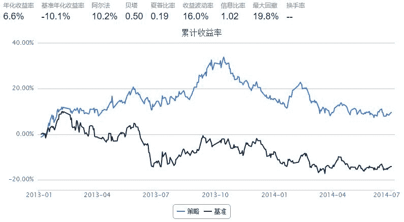

# 我的羊驼策略，选5只股无脑轮替

> 来源：https://uqer.io/community/share/561290f2f9f06c4ca72fb5ab

```py
from CAL.PyCAL import Date
from CAL.PyCAL import Calendar
from CAL.PyCAL import BizDayConvention
import numpy as np

start = '2013-01-01'                       # 回测起始时间
end = '2014-07-01'                         # 回测结束时间
benchmark = 'HS300'                        # 策略参考标准
universe = set_universe('HS300')    # 证券池，支持股票和基金
capital_base = 100000                      # 起始资金
freq = 'd'                                 # 策略类型，'d'表示日间策略使用日线回测，'m'表示日内策略使用分钟线回测
refresh_rate = 5                       # 调仓频率，表示执行handle_data的时间间隔，若freq = 'd'时间间隔的单位为交易日，若freq = 'm'时间间隔为分钟

#EGRO 5年收益增长率 
#GrossIncomeRatio 毛利率
#NetProfitGrowRate 净利润同比增长
#DEGM 毛利率增长，去年同期相比
#OperatingRevenueGrowRate 营业收入同比增长
#ROE 权益回报率
#DebtsAssetRatio 负债资产率
#EPS 每股收益

def initialize(account):                   # 初始化虚拟账户状态
    pass

def handle_data(account):                  # 每个交易日的买入卖出指令
    buylist=[]
    selist=[]
    
    dt = Date.fromDateTime(account.current_date) 
    cal = Calendar('China.SSE')
    lastTDay = cal.advanceDate(dt,'-1B',BizDayConvention.Preceding)
    last_date=lastTDay.strftime('%Y%m%d')
    getData=DataAPI.MktStockFactorsOneDayGet(tradeDate=last_date,secID=account.universe,field=['secID','NetProfitGrowRate'],pandas="1")
    getData.set_index('secID',inplace=True)
    getData=getData[getData.NetProfitGrowRate>=1.0].dropna()
    getData=getData.sort(columns='NetProfitGrowRate',ascending=False)
    getData=getData.head(20)
    getData['profitRatio']=np.nan
    
    try:
        for stock in list(getData.index):
            getData['profitRatio'][stock]=(account.get_symbol_history(stock,refresh_rate)['closePrice'][-1]/account.get_symbol_history(stock,refresh_rate)['closePrice'][0])
    except:
        print 'GET PROFITRATIO ERROR!!!'
    
    getData=getData.sort(columns='profitRatio',ascending=False)
    getData=getData.head(5)
    print "getData:",getData
    
    for stock in list(getData.index):
        buylist.append(stock)
    print "buylist:",buylist 
        
    for stock in account.valid_secpos:
        if(stock in buylist):
            pass
        else:
            order_to(stock,0)
    
    
    for stock in buylist:
        if(stock in account.valid_secpos):
            pass
        else:
            order(stock,account.cash/account.referencePrice[stock]/len(buylist))

            
    print "日期：",account.current_date,",持仓：",account.valid_secpos
```



```
GET PROFITRATIO ERROR!!!
getData:              NetProfitGrowRate  profitRatio
secID                                      
000883.XSHE            31.0717          NaN
000413.XSHE            10.4768          NaN
000046.XSHE             2.3237          NaN
600157.XSHG             2.1672          NaN
002450.XSHE             1.7749          NaN
buylist: ['000883.XSHE', '000413.XSHE', '000046.XSHE', '600157.XSHG', '002450.XSHE']
日期： 2013-01-04 00:00:00 ,持仓： {}
getData:              NetProfitGrowRate  profitRatio
secID                                      
002008.XSHE             1.1794     1.087628
300058.XSHE             1.2371     1.056438
600157.XSHG             2.1672     1.041454
000883.XSHE            31.0717     1.034817
002450.XSHE             1.7749     1.032616
buylist: ['002008.XSHE', '300058.XSHE', '600157.XSHG', '000883.XSHE', '002450.XSHE']
日期： 2013-01-11 00:00:00 ,持仓： {'600157.XSHG': 5822, '002450.XSHE': 1824.0, '000883.XSHE': 6011, '000046.XSHE': 3943, '000413.XSHE': 5056}
getData:              NetProfitGrowRate  profitRatio
secID                                      
600157.XSHG             2.1672     1.113170
002450.XSHE             1.7749     1.103866
002008.XSHE             1.1794     1.092182
300058.XSHE             1.2371     1.083742
600108.XSHG             1.1371     1.081443
buylist: ['600157.XSHG', '002450.XSHE', '002008.XSHE', '300058.XSHE', '600108.XSHG']
日期： 2013-01-18 00:00:00 ,持仓： {'600157.XSHG': 5822, '002450.XSHE': 1824.0, '000883.XSHE': 6011}
getData:              NetProfitGrowRate  profitRatio
secID                                      
600157.XSHG             2.1672     1.024451
300058.XSHE             1.2371     1.011067
600383.XSHG             1.0580     1.000000
600108.XSHG             1.1371     0.984742
002450.XSHE             1.7749     0.957582
buylist: ['600157.XSHG', '300058.XSHE', '600383.XSHG', '600108.XSHG', '002450.XSHE']
日期： 2013-01-25 00:00:00 ,持仓： {'002450.XSHE': 1824.0, '600108.XSHG': 1104, '600157.XSHG': 5822, '300058.XSHE': 1315, '002008.XSHE': 824}
getData:              NetProfitGrowRate  profitRatio
secID                                      
600157.XSHG             2.1672     1.112213
600011.XSHG             1.5759     1.078102
600383.XSHG             1.0580     1.075537
002008.XSHE             1.1794     1.037387
300058.XSHE             1.2371     1.028319
buylist: ['600157.XSHG', '600011.XSHG', '600383.XSHG', '002008.XSHE', '300058.XSHE']
日期： 2013-02-01 00:00:00 ,持仓： {'002450.XSHE': 1824.0, '600108.XSHG': 1104, '600157.XSHG': 5822, '300058.XSHE': 1315, '600383.XSHG': 1080}
getData:              NetProfitGrowRate  profitRatio
secID                                      
002008.XSHE             1.1794     1.099718
000046.XSHE             2.3237     1.076794
600383.XSHG             1.0580     1.069296
000413.XSHE            10.4768     1.015821
600011.XSHG             1.5759     1.004408
buylist: ['002008.XSHE', '000046.XSHE', '600383.XSHG', '000413.XSHE', '600011.XSHG']
日期： 2013-02-08 00:00:00 ,持仓： {'600157.XSHG': 5822, '002008.XSHE': 727, '300058.XSHE': 1315, '600011.XSHG': 1257, '600383.XSHG': 1080}
getData:              NetProfitGrowRate  profitRatio
secID                                      
300058.XSHE             1.2371     1.022028
600108.XSHG             1.1371     0.997116
002450.XSHE             1.7749     0.971011
000413.XSHE            10.4768     0.962690
002008.XSHE             1.1794     0.955920
buylist: ['300058.XSHE', '600108.XSHG', '002450.XSHE', '000413.XSHE', '002008.XSHE']
日期： 2013-02-22 00:00:00 ,持仓： {'002008.XSHE': 727, '000413.XSHE': 2549, '600011.XSHG': 1257, '600383.XSHG': 1080, '000046.XSHE': 2003}
getData:              NetProfitGrowRate  profitRatio
secID                                      
002008.XSHE             1.1794     1.050923
002450.XSHE             1.7749     1.050195
600383.XSHG             1.0580     1.047712
000046.XSHE             2.3237     1.032878
600011.XSHG             1.5759     1.023239
buylist: ['002008.XSHE', '002450.XSHE', '600383.XSHG', '000046.XSHE', '600011.XSHG']
日期： 2013-03-01 00:00:00 ,持仓： {'002450.XSHE': 1122, '600108.XSHG': 1941, '000413.XSHE': 2549, '300058.XSHE': 1855, '002008.XSHE': 727}
getData:              NetProfitGrowRate  profitRatio
secID                                      
600011.XSHG             1.5759     1.057045
000883.XSHE            31.0717     1.044418
002450.XSHE             1.7749     1.041435
000413.XSHE            10.4768     1.032852
002008.XSHE             1.1794     1.030952
buylist: ['600011.XSHG', '000883.XSHE', '002450.XSHE', '000413.XSHE', '002008.XSHE']
日期： 2013-03-08 00:00:00 ,持仓： {'002450.XSHE': 1122, '002008.XSHE': 727, '600383.XSHG': 1466, '600011.XSHG': 1769, '000046.XSHE': 2043}
getData:              NetProfitGrowRate  profitRatio
secID                                      
002456.XSHE            14.5041     1.082176
002450.XSHE             1.7749     1.055441
000883.XSHE            31.0717     1.009892
000413.XSHE            10.4768     0.966968
600011.XSHG             1.5759     0.958285
buylist: ['002456.XSHE', '002450.XSHE', '000883.XSHE', '000413.XSHE', '600011.XSHG']
日期： 2013-03-15 00:00:00 ,持仓： {'002450.XSHE': 1122, '002008.XSHE': 727, '000883.XSHE': 3341, '600011.XSHG': 1769, '000413.XSHE': 2801}
getData:              NetProfitGrowRate  profitRatio
secID                                      
002456.XSHE            14.5041     1.092847
600383.XSHG             1.0580     1.081583
002008.XSHE             1.1794     1.072461
000046.XSHE             2.3237     1.053841
600108.XSHG             1.1371     1.044520
buylist: ['002456.XSHE', '600383.XSHG', '002008.XSHE', '000046.XSHE', '600108.XSHG']
日期： 2013-03-22 00:00:00 ,持仓： {'002450.XSHE': 1122, '000883.XSHE': 3341, '600011.XSHG': 1769, '002456.XSHE': 697, '000413.XSHE': 2801}
getData:              NetProfitGrowRate  profitRatio
secID                                      
000895.XSHE             1.0951     1.100220
002456.XSHE            14.5041     1.010301
000413.XSHE            10.4768     0.996685
600383.XSHG             1.0580     0.987662
002450.XSHE             2.2432     0.977696
buylist: ['000895.XSHE', '002456.XSHE', '000413.XSHE', '600383.XSHG', '002450.XSHE']
日期： 2013-03-29 00:00:00 ,持仓： {'600108.XSHG': 1490, '002008.XSHE': 827, '000046.XSHE': 2286, '002456.XSHE': 697, '600383.XSHG': 1615}
getData:              NetProfitGrowRate  profitRatio
secID                                      
000046.XSHE             2.3237     1.040085
002456.XSHE            14.5041     1.020039
600108.XSHG             1.1371     1.017244
002008.XSHE             1.1794     1.016968
601991.XSHG             1.0666     1.006950
buylist: ['000046.XSHE', '002456.XSHE', '600108.XSHG', '002008.XSHE', '601991.XSHG']
日期： 2013-04-09 00:00:00 ,持仓： {'002450.XSHE': 837, '000895.XSHE': 471, '600383.XSHG': 1615, '002456.XSHE': 697, '000413.XSHE': 3024}
getData:              NetProfitGrowRate  profitRatio
secID                                      
000895.XSHE             1.0951     1.062802
000413.XSHE            10.4768     1.023791
601991.XSHG             1.0666     1.020423
002456.XSHE            14.5041     1.019788
000046.XSHE             2.3237     1.008401
buylist: ['000895.XSHE', '000413.XSHE', '601991.XSHG', '002456.XSHE', '000046.XSHE']
日期： 2013-04-16 00:00:00 ,持仓： {'600108.XSHG': 1630, '002008.XSHE': 821, '601991.XSHG': 2584, '000046.XSHE': 2391, '002456.XSHE': 697}
getData:              NetProfitGrowRate  profitRatio
secID                                      
002450.XSHE             2.2432     1.225398
002456.XSHE            14.5041     1.178291
600108.XSHG             2.9211     1.085501
000895.XSHE             1.0951     1.081940
000712.XSHE            21.2835     1.048451
buylist: ['002450.XSHE', '002456.XSHE', '600108.XSHG', '000895.XSHE', '000712.XSHE']
日期： 2013-04-23 00:00:00 ,持仓： {'000895.XSHE': 458, '601991.XSHG': 2584, '000046.XSHE': 2391, '002456.XSHE': 697, '000413.XSHE': 2722}
getData:              NetProfitGrowRate  profitRatio
secID                                      
300251.XSHE             1.0538     1.225936
601901.XSHG             1.6801     1.086260
000783.XSHE             1.8956     1.083919
000046.XSHE             2.3047     1.049812
000712.XSHE            21.2835     1.031657
buylist: ['300251.XSHE', '601901.XSHG', '000783.XSHE', '000046.XSHE', '000712.XSHE']
日期： 2013-05-03 00:00:00 ,持仓： {'002450.XSHE': 636, '600108.XSHG': 1598, '000895.XSHE': 458, '002456.XSHE': 697, '000712.XSHE': 1434}
getData:              NetProfitGrowRate  profitRatio
secID                                      
300251.XSHE             1.0538     1.119771
002673.XSHE             1.4960     1.059101
600011.XSHG             2.9428     1.047790
000413.XSHE             3.1256     1.047541
600316.XSHG             1.3699     1.046952
buylist: ['300251.XSHE', '002673.XSHE', '600011.XSHG', '000413.XSHE', '600316.XSHG']
日期： 2013-05-10 00:00:00 ,持仓： {'000712.XSHE': 1434, '300251.XSHE': 985, '000046.XSHE': 2278, '601901.XSHG': 1461, '000783.XSHE': 2336}
getData:              NetProfitGrowRate  profitRatio
secID                                      
600316.XSHG             1.3699     1.152960
600108.XSHG             2.4674     1.081311
002450.XSHE             2.2106     1.076391
000712.XSHE            21.2835     1.073935
002456.XSHE             9.8722     1.072468
buylist: ['600316.XSHG', '600108.XSHG', '002450.XSHE', '000712.XSHE', '002456.XSHE']
日期： 2013-05-17 00:00:00 ,持仓： {'002673.XSHE': 1604, '600316.XSHG': 704, '300251.XSHE': 985, '600011.XSHG': 1945, '000413.XSHE': 3086}
getData:              NetProfitGrowRate  profitRatio
secID                                      
002450.XSHE             2.2106     1.099246
600583.XSHG             1.3907     1.075360
300251.XSHE             1.0538     1.060257
000413.XSHE             3.1256     1.053806
000625.XSHE             4.4493     1.043534
buylist: ['002450.XSHE', '600583.XSHG', '300251.XSHE', '000413.XSHE', '000625.XSHE']
日期： 2013-05-24 00:00:00 ,持仓： {'002450.XSHE': 643, '600108.XSHG': 1574, '600316.XSHG': 704, '002456.XSHE': 405, '000712.XSHE': 1378}
getData:              NetProfitGrowRate  profitRatio
secID                                      
000712.XSHE            21.2835     1.166762
000046.XSHE             2.3047     1.123654
000413.XSHE             3.1256     1.075840
601901.XSHG             1.6801     1.056115
600316.XSHG             1.3699     1.052770
buylist: ['000712.XSHE', '000046.XSHE', '000413.XSHE', '601901.XSHG', '600316.XSHG']
日期： 2013-05-31 00:00:00 ,持仓： {'002450.XSHE': 643, '300251.XSHE': 923, '000625.XSHE': 1099, '600583.XSHG': 1550, '000413.XSHE': 2882}
getData:              NetProfitGrowRate  profitRatio
secID                                      
000046.XSHE             2.3047     1.039187
002456.XSHE             9.8722     1.019868
000413.XSHE             3.1256     1.014214
000712.XSHE            21.2835     1.011627
000539.XSHE             1.0140     1.005502
buylist: ['000046.XSHE', '002456.XSHE', '000413.XSHE', '000712.XSHE', '000539.XSHE']
日期： 2013-06-07 00:00:00 ,持仓： {'000712.XSHE': 1158, '600316.XSHG': 558, '000046.XSHE': 2108, '601901.XSHG': 1550, '000413.XSHE': 2882}
getData:              NetProfitGrowRate  profitRatio
secID                                      
300251.XSHE             1.0538     1.146265
000413.XSHE             3.1256     1.122355
601991.XSHG             1.0182     1.096403
002450.XSHE             2.2106     1.079312
000712.XSHE            21.2835     1.018607
buylist: ['300251.XSHE', '000413.XSHE', '601991.XSHG', '002450.XSHE', '000712.XSHE']
日期： 2013-06-19 00:00:00 ,持仓： {'000712.XSHE': 1158, '000539.XSHE': 2804, '000046.XSHE': 2108, '002456.XSHE': 481, '000413.XSHE': 2882}
getData:              NetProfitGrowRate  profitRatio
secID                                      
601991.XSHG             1.0182     0.993971
600011.XSHG             2.9428     0.961163
000625.XSHE             4.4493     0.949968
002450.XSHE             2.2106     0.938177
300251.XSHE             1.0538     0.930702
buylist: ['601991.XSHG', '600011.XSHG', '000625.XSHE', '002450.XSHE', '300251.XSHE']
日期： 2013-06-26 00:00:00 ,持仓： {'002450.XSHE': 633, '000712.XSHE': 1158, '601991.XSHG': 2463, '300251.XSHE': 827, '000413.XSHE': 2882}
getData:              NetProfitGrowRate  profitRatio
secID                                      
600108.XSHG             2.4674     1.115134
002456.XSHE             9.8722     1.111125
000712.XSHE            21.2835     1.094753
600886.XSHG             2.7866     1.082971
600011.XSHG             2.9428     1.066637
buylist: ['600108.XSHG', '002456.XSHE', '000712.XSHE', '600886.XSHG', '600011.XSHG']
日期： 2013-07-03 00:00:00 ,持仓： {'002450.XSHE': 633, '000625.XSHE': 1270, '601991.XSHG': 2463, '300251.XSHE': 827, '600011.XSHG': 2487}
getData:              NetProfitGrowRate  profitRatio
secID                                      
600011.XSHG             2.9428     1.045534
000625.XSHE             4.4493     1.035993
000046.XSHE             2.3047     1.032779
600795.XSHG             1.0106     0.995629
600886.XSHG             2.7866     0.994578
buylist: ['600011.XSHG', '000625.XSHE', '000046.XSHE', '600795.XSHG', '600886.XSHG']
日期： 2013-07-10 00:00:00 ,持仓： {'600108.XSHG': 1624, '000712.XSHE': 1215, '600011.XSHG': 2487, '002456.XSHE': 421, '600886.XSHG': 3186}
getData:              NetProfitGrowRate  profitRatio
secID                                      
600583.XSHG             1.3907     1.123528
601901.XSHG             1.6801     1.116944
002673.XSHE             1.4960     1.102686
600369.XSHG             1.5169     1.101620
002450.XSHE             2.2106     1.100006
buylist: ['600583.XSHG', '601901.XSHG', '002673.XSHE', '600369.XSHG', '002450.XSHE']
日期： 2013-07-17 00:00:00 ,持仓： {'600886.XSHG': 3186, '000625.XSHE': 1317, '600795.XSHG': 5623, '600011.XSHG': 2487, '000046.XSHE': 2541}
getData:              NetProfitGrowRate  profitRatio
secID                                      
000413.XSHE             3.1256     1.117993
002450.XSHE             2.2106     1.036790
000712.XSHE            21.2835     1.035480
600583.XSHG             1.3907     1.034635
600108.XSHG             2.4674     1.030835
buylist: ['000413.XSHE', '002450.XSHE', '000712.XSHE', '600583.XSHG', '600108.XSHG']
日期： 2013-07-24 00:00:00 ,持仓： {'002450.XSHE': 601, '002673.XSHE': 1755, '600369.XSHG': 2597, '600583.XSHG': 1511, '601901.XSHG': 1775}
getData:              NetProfitGrowRate  profitRatio
secID                                      
600011.XSHG             2.9428     1.040415
601991.XSHG             1.0182     1.030665
600369.XSHG             1.5169     1.003435
000413.XSHE             3.1256     1.001363
002673.XSHE             1.4960     0.988043
buylist: ['600011.XSHG', '601991.XSHG', '600369.XSHG', '000413.XSHE', '002673.XSHE']
日期： 2013-07-31 00:00:00 ,持仓： {'002450.XSHE': 601, '600108.XSHG': 1756, '600583.XSHG': 1511, '000712.XSHE': 1274, '000413.XSHE': 2480}
getData:              NetProfitGrowRate  profitRatio
secID                                      
000625.XSHE             4.4493     1.201249
000712.XSHE            21.2835     1.140688
600886.XSHG             2.7866     1.110534
600011.XSHG             3.1450     1.097059
600027.XSHG             2.9527     1.088622
buylist: ['000625.XSHE', '000712.XSHE', '600886.XSHG', '600011.XSHG', '600027.XSHG']
日期： 2013-08-07 00:00:00 ,持仓： {'601991.XSHG': 2276, '002673.XSHE': 1864, '600369.XSHG': 2787, '600011.XSHG': 2318, '000413.XSHE': 2480}
getData:              NetProfitGrowRate  profitRatio
secID                                      
600157.XSHG             2.3238     1.161850
600886.XSHG             2.7866     1.064370
601555.XSHG             1.3076     1.059994
600369.XSHG             1.5169     1.050995
600108.XSHG             2.4674     1.039207
buylist: ['600157.XSHG', '600886.XSHG', '601555.XSHG', '600369.XSHG', '600108.XSHG']
日期： 2013-08-14 00:00:00 ,持仓： {'600027.XSHG': 3865, '000712.XSHE': 1035, '000625.XSHE': 1120, '600011.XSHG': 2318, '600886.XSHG': 3080}
getData:              NetProfitGrowRate  profitRatio
secID                                      
000413.XSHE             3.1256     1.096319
600663.XSHG             1.4512     1.011244
000725.XSHE             1.5732     1.000000
002456.XSHE             9.8722     0.992576
600027.XSHG             2.9527     0.980969
buylist: ['000413.XSHE', '600663.XSHG', '000725.XSHE', '002456.XSHE', '600027.XSHG']
日期： 2013-08-21 00:00:00 ,持仓： {'600108.XSHG': 1660, '600157.XSHG': 4363, '600369.XSHG': 2671, '600886.XSHG': 3080, '601555.XSHG': 1635}
getData:              NetProfitGrowRate  profitRatio
secID                                      
600663.XSHG             1.4512     1.251894
300027.XSHE             1.2203     1.251205
300251.XSHE             1.0400     1.080901
600252.XSHG             1.1888     1.048242
000625.XSHE             4.4493     1.046591
buylist: ['600663.XSHG', '300027.XSHE', '300251.XSHE', '600252.XSHG', '000625.XSHE']
日期： 2013-08-28 00:00:00 ,持仓： {'600027.XSHG': 4114, '000725.XSHE': 5254, '600663.XSHG': 1021, '002456.XSHE': 501, '000413.XSHE': 1901}
getData:              NetProfitGrowRate  profitRatio
secID                                      
600648.XSHG             1.3325     1.331161
600108.XSHG             2.1869     1.234514
600663.XSHG             1.4512     1.162914
300027.XSHE             1.2203     1.082302
000625.XSHE             3.9408     1.055561
buylist: ['600648.XSHG', '600108.XSHG', '600663.XSHG', '300027.XSHE', '000625.XSHE']
日期： 2013-09-04 00:00:00 ,持仓： {'000625.XSHE': 1139, '300251.XSHE': 747, '600663.XSHG': 1021, '600252.XSHG': 2250, '300027.XSHE': 467}
getData:              NetProfitGrowRate  profitRatio
secID                                      
600648.XSHG             1.3325     1.464392
300027.XSHE             1.2203     1.132654
000503.XSHE             2.4690     1.097778
600663.XSHG             1.4512     1.078274
601555.XSHG             1.3076     1.073362
buylist: ['600648.XSHG', '300027.XSHE', '000503.XSHE', '600663.XSHG', '601555.XSHG']
日期： 2013-09-11 00:00:00 ,持仓： {'600108.XSHG': 1324, '000625.XSHE': 1139, '600663.XSHG': 1021, '300027.XSHE': 467}
getData:              NetProfitGrowRate  profitRatio
secID                                      
600648.XSHG             1.3325     1.395300
300251.XSHE             1.0400     1.215395
300027.XSHE             1.2203     1.177448
000413.XSHE             1.5996     1.096738
000503.XSHE             2.4690     1.028571
buylist: ['600648.XSHG', '300251.XSHE', '300027.XSHE', '000413.XSHE', '000503.XSHE']
日期： 2013-09-18 00:00:00 ,持仓： {'000503.XSHE': 690, '300027.XSHE': 467, '600663.XSHG': 1021, '601555.XSHG': 1685}
getData:              NetProfitGrowRate  profitRatio
secID                                      
600663.XSHG             1.4512     1.309473
600648.XSHG             1.3325     1.197671
300251.XSHE             1.0400     1.085617
600108.XSHG             2.1869     1.072006
000712.XSHE             1.9401     1.006185
buylist: ['600663.XSHG', '600648.XSHG', '300251.XSHE', '600108.XSHG', '000712.XSHE']
日期： 2013-09-27 00:00:00 ,持仓： {'600648.XSHG': 294, '000503.XSHE': 690, '300027.XSHE': 467, '300251.XSHE': 698, '000413.XSHE': 2201}
getData:              NetProfitGrowRate  profitRatio
secID                                      
600108.XSHG             2.1869     1.243266
000503.XSHE             2.4690     1.068320
600583.XSHG             1.1630     1.048205
000625.XSHE             3.9408     1.047890
600674.XSHG             1.8199     1.046938
buylist: ['600108.XSHG', '000503.XSHE', '600583.XSHG', '000625.XSHE', '600674.XSHG']
日期： 2013-10-11 00:00:00 ,持仓： {'600108.XSHG': 1302, '600648.XSHG': 294, '300251.XSHE': 698, '600663.XSHG': 439, '000712.XSHE': 1111}
getData:              NetProfitGrowRate  profitRatio
secID                                      
002456.XSHE             2.6541     1.189799
000503.XSHE             2.4690     1.133425
000712.XSHE             1.9401     1.042925
600027.XSHG             7.8319     1.029016
600011.XSHG             3.1450     1.029006
buylist: ['002456.XSHE', '000503.XSHE', '000712.XSHE', '600027.XSHG', '600011.XSHG']
日期： 2013-10-18 00:00:00 ,持仓： {'600108.XSHG': 1302, '000503.XSHE': 610, '000625.XSHE': 1227, '600583.XSHG': 1738, '600674.XSHG': 2257}
getData:              NetProfitGrowRate  profitRatio
secID                                      
000413.XSHE             1.5996     1.045447
600252.XSHG             1.3699     1.039856
002450.XSHE             1.1200     1.035005
600648.XSHG             1.3325     1.027141
600583.XSHG             1.1630     1.021851
buylist: ['000413.XSHE', '600252.XSHG', '002450.XSHE', '600648.XSHG', '600583.XSHG']
日期： 2013-10-25 00:00:00 ,持仓： {'600027.XSHG': 4383, '000503.XSHE': 610, '600011.XSHG': 2477, '002456.XSHE': 554, '000712.XSHE': 1206}
getData:              NetProfitGrowRate  profitRatio
secID                                      
600886.XSHG             2.6808     1.124354
300017.XSHE             1.5261     1.084772
600011.XSHG             1.6585     1.068460
600583.XSHG             1.3300     1.058399
600027.XSHG             5.8031     1.051499
buylist: ['600886.XSHG', '300017.XSHE', '600011.XSHG', '600583.XSHG', '600027.XSHG']
日期： 2013-11-01 00:00:00 ,持仓： {'002450.XSHE': 781, '600648.XSHG': 281, '600583.XSHG': 1667, '600252.XSHG': 2785, '000413.XSHE': 2018}
getData:              NetProfitGrowRate  profitRatio
secID                                      
600583.XSHG             1.3300     1.132449
002202.XSHE             4.3413     1.046205
000917.XSHE             1.5781     1.006599
600027.XSHG             5.8031     1.006038
000712.XSHE             1.7032     1.001928
buylist: ['600583.XSHG', '002202.XSHE', '000917.XSHE', '600027.XSHG', '000712.XSHE']
日期： 2013-11-08 00:00:00 ,持仓： {'600027.XSHG': 4345, '600886.XSHG': 3134, '300017.XSHE': 795, '600583.XSHG': 1667, '600011.XSHG': 2470}
getData:              NetProfitGrowRate  profitRatio
secID                                      
600352.XSHG             1.4342     1.051812
000917.XSHE             1.5781     1.040933
600252.XSHG             1.3699     1.038871
300017.XSHE             1.5261     1.022195
002202.XSHE             4.3413     1.020151
buylist: ['600352.XSHG', '000917.XSHE', '600252.XSHG', '300017.XSHE', '002202.XSHE']
日期： 2013-11-15 00:00:00 ,持仓： {'600027.XSHG': 4345, '002202.XSHE': 1490, '000917.XSHE': 782, '600583.XSHG': 1667, '000712.XSHE': 1136}
getData:              NetProfitGrowRate  profitRatio
secID                                      
600648.XSHG             1.8864     1.102044
601628.XSHG             1.9948     1.096096
600583.XSHG             1.3300     1.069177
600663.XSHG             1.6233     1.064922
600369.XSHG             1.4694     1.048993
buylist: ['600648.XSHG', '601628.XSHG', '600583.XSHG', '600663.XSHG', '600369.XSHG']
日期： 2013-11-22 00:00:00 ,持仓： {'000917.XSHE': 782, '002202.XSHE': 1490, '300017.XSHE': 762, '600252.XSHG': 2921, '600352.XSHG': 2187}
getData:              NetProfitGrowRate  profitRatio
secID                                      
600352.XSHG             1.4342     1.119820
601099.XSHG             2.3074     1.114664
300017.XSHE             1.5261     1.111971
000625.XSHE             2.8365     1.037890
600369.XSHG             1.4694     1.035814
buylist: ['600352.XSHG', '601099.XSHG', '300017.XSHE', '000625.XSHE', '600369.XSHG']
日期： 2013-11-29 00:00:00 ,持仓： {'600648.XSHG': 314, '601628.XSHG': 828, '600369.XSHG': 2632, '600583.XSHG': 1416, '600663.XSHG': 656}
getData:              NetProfitGrowRate  profitRatio
secID                                      
000712.XSHE             1.7032     1.151983
600369.XSHG             1.4694     1.084413
000625.XSHE             2.8365     1.078332
601628.XSHG             1.9948     1.041333
002202.XSHE             4.3413     1.039846
buylist: ['000712.XSHE', '600369.XSHG', '000625.XSHE', '601628.XSHG', '002202.XSHE']
日期： 2013-12-06 00:00:00 ,持仓： {'601099.XSHG': 3117, '600352.XSHG': 1859, '300017.XSHE': 705, '600369.XSHG': 2632, '000625.XSHE': 1045}
getData:              NetProfitGrowRate  profitRatio
secID                                      
300017.XSHE             1.5261     1.105913
601099.XSHG             2.3074     1.019100
600663.XSHG             1.6233     1.004301
600352.XSHG             1.4342     1.001420
600674.XSHG             1.8361     0.997585
buylist: ['300017.XSHE', '601099.XSHG', '600663.XSHG', '600352.XSHG', '600674.XSHG']
日期： 2013-12-13 00:00:00 ,持仓： {'002202.XSHE': 1431, '601628.XSHG': 754, '600369.XSHG': 2632, '000625.XSHE': 1045, '000712.XSHE': 1013}
getData:              NetProfitGrowRate  profitRatio
secID                                      
300017.XSHE             1.5261     1.108336
000009.XSHE             1.6400     1.017611
000686.XSHE            43.8777     0.989797
600674.XSHG             1.8361     0.982998
600648.XSHG             1.8864     0.974786
buylist: ['300017.XSHE', '000009.XSHE', '000686.XSHE', '600674.XSHG', '600648.XSHG']
日期： 2013-12-20 00:00:00 ,持仓： {'601099.XSHG': 3012, '600352.XSHG': 1849, '300017.XSHE': 689, '600663.XSHG': 636, '600674.XSHG': 2028}
getData:              NetProfitGrowRate  profitRatio
secID                                      
000046.XSHE             1.8622     1.062081
000917.XSHE             1.5781     1.052427
600352.XSHG             1.4342     1.022568
600252.XSHG             1.3699     1.022152
601628.XSHG             1.9948     1.020006
buylist: ['000046.XSHE', '000917.XSHE', '600352.XSHG', '600252.XSHG', '601628.XSHG']
日期： 2013-12-27 00:00:00 ,持仓： {'000009.XSHE': 1550, '600648.XSHG': 350, '000686.XSHE': 1535, '300017.XSHE': 689, '600674.XSHG': 2028}
getData:              NetProfitGrowRate  profitRatio
secID                                      
300017.XSHE             1.5261     1.064353
002202.XSHE             4.3413     1.056975
600252.XSHG             1.3699     1.055956
601099.XSHG             2.3074     1.038871
000686.XSHE            43.8777     1.018868
buylist: ['300017.XSHE', '002202.XSHE', '600252.XSHG', '601099.XSHG', '000686.XSHE']
日期： 2014-01-06 00:00:00 ,持仓： {'000917.XSHE': 715, '600352.XSHG': 1872, '601628.XSHG': 799, '000046.XSHE': 2584, '600252.XSHG': 2727}
getData:              NetProfitGrowRate  profitRatio
secID                                      
600583.XSHG             1.3300     1.132102
600648.XSHG             1.8864     1.067373
600663.XSHG             1.6233     1.048503
600886.XSHG             2.6808     1.033741
600011.XSHG             1.6585     1.018681
buylist: ['600583.XSHG', '600648.XSHG', '600663.XSHG', '600886.XSHG', '600011.XSHG']
日期： 2014-01-13 00:00:00 ,持仓： {'601099.XSHG': 2949, '002202.XSHE': 1390, '000686.XSHE': 1479, '300017.XSHE': 568, '600252.XSHG': 2727}
getData:              NetProfitGrowRate  profitRatio
secID                                      
601099.XSHG             2.3074     1.126824
002202.XSHE             4.3413     1.113215
000712.XSHE             1.7032     1.053295
600352.XSHG             1.4342     1.031516
601628.XSHG             1.9948     1.030327
buylist: ['601099.XSHG', '002202.XSHE', '000712.XSHE', '600352.XSHG', '601628.XSHG']
日期： 2014-01-20 00:00:00 ,持仓： {'600886.XSHG': 2992, '600648.XSHG': 359, '600583.XSHG': 1437, '600663.XSHG': 705, '600011.XSHG': 2573}
getData:              NetProfitGrowRate  profitRatio
secID                                      
300017.XSHE             1.5261     1.209802
601099.XSHG             2.3074     1.148589
002202.XSHE             4.3413     1.141289
000712.XSHE             1.7032     1.115776
600648.XSHG             1.8864     1.096859
buylist: ['300017.XSHE', '601099.XSHG', '002202.XSHE', '000712.XSHE', '600648.XSHG']
日期： 2014-01-27 00:00:00 ,持仓： {'601099.XSHG': 2640, '002202.XSHE': 1306, '601628.XSHG': 793, '000712.XSHE': 1016, '600352.XSHG': 1968}
getData:              NetProfitGrowRate  profitRatio
secID                                      
300017.XSHE             1.5261     1.170863
000712.XSHE             1.7032     1.146359
601099.XSHG             2.3074     1.086993
000917.XSHE             1.5781     1.066609
000686.XSHE            43.8777     1.049759
buylist: ['300017.XSHE', '000712.XSHE', '601099.XSHG', '000917.XSHE', '000686.XSHE']
日期： 2014-02-10 00:00:00 ,持仓： {'601099.XSHG': 2640, '600648.XSHG': 332, '300017.XSHE': 450, '000712.XSHE': 1016, '002202.XSHE': 1306}
getData:              NetProfitGrowRate  profitRatio
secID                                      
600352.XSHG             1.4342     1.073845
000009.XSHE             1.6400     1.041815
600663.XSHG             1.6233     1.039189
000046.XSHE             1.8622     1.031897
600252.XSHG             1.3699     1.023154
buylist: ['600352.XSHG', '000009.XSHE', '600663.XSHG', '000046.XSHE', '600252.XSHG']
日期： 2014-02-17 00:00:00 ,持仓： {'601099.XSHG': 2640, '000917.XSHE': 702, '000686.XSHE': 1389, '300017.XSHE': 450, '000712.XSHE': 1016}
getData:              NetProfitGrowRate  profitRatio
secID                                      
600674.XSHG             1.8361     1.024902
300017.XSHE             1.5261     1.012560
000046.XSHE             1.8622     1.006401
000009.XSHE             1.6400     1.000000
600886.XSHG             2.6808     1.000000
buylist: ['600674.XSHG', '300017.XSHE', '000046.XSHE', '000009.XSHE', '600886.XSHG']
日期： 2014-02-24 00:00:00 ,持仓： {'000009.XSHE': 1264, '600352.XSHG': 1792, '000046.XSHE': 2652, '600252.XSHG': 2601, '600663.XSHG': 632}
getData:              NetProfitGrowRate  profitRatio
secID                                      
000009.XSHE             1.6400     1.057629
600369.XSHG             1.4694     1.039398
000712.XSHE             1.7032     1.037474
600027.XSHG             5.8031     1.027129
000686.XSHE            43.8777     1.010130
buylist: ['000009.XSHE', '600369.XSHG', '000712.XSHE', '600027.XSHG', '000686.XSHE']
日期： 2014-03-03 00:00:00 ,持仓： {'000009.XSHE': 1264, '300017.XSHE': 410, '000046.XSHE': 2652, '600674.XSHG': 2260, '600886.XSHG': 3073}
getData:              NetProfitGrowRate  profitRatio
secID                                      
601099.XSHG             2.3074     1.114637
600352.XSHG             1.4342     1.074520
300017.XSHE             1.5261     1.069434
000712.XSHE             1.7032     1.047295
002202.XSHE             4.3413     1.024708
buylist: ['601099.XSHG', '600352.XSHG', '300017.XSHE', '000712.XSHE', '002202.XSHE']
日期： 2014-03-10 00:00:00 ,持仓： {'600027.XSHG': 4278, '000009.XSHE': 1264, '600369.XSHG': 2679, '000686.XSHE': 1580, '000712.XSHE': 761}
getData:              NetProfitGrowRate  profitRatio
secID                                      
000686.XSHE             2.1949     1.110835
000009.XSHE             1.6400     1.049752
600886.XSHG             2.6808     1.045168
600583.XSHG             1.3300     1.032905
600674.XSHG             1.8361     1.032297
buylist: ['000686.XSHE', '000009.XSHE', '600886.XSHG', '600583.XSHG', '600674.XSHG']
日期： 2014-03-17 00:00:00 ,持仓： {'601099.XSHG': 2167, '002202.XSHE': 1110, '300017.XSHE': 424, '000712.XSHE': 761, '600352.XSHG': 1650}
getData:              NetProfitGrowRate  profitRatio
secID                                      
002202.XSHE             4.3413     1.042749
000686.XSHE             2.1949     1.035724
600027.XSHG             5.8031     1.034172
300017.XSHE             1.2855     1.021615
601601.XSHG             1.2722     1.016992
buylist: ['002202.XSHE', '000686.XSHE', '600027.XSHG', '300017.XSHE', '601601.XSHG']
日期： 2014-03-24 00:00:00 ,持仓： {'000009.XSHE': 1248, '000686.XSHE': 1492, '600583.XSHG': 1487, '600674.XSHG': 2191, '600886.XSHG': 2851}
getData:              NetProfitGrowRate  profitRatio
secID                                      
000625.XSHE             2.8365     1.066057
600886.XSHG             2.6808     1.047739
600352.XSHG             1.4342     1.046220
600674.XSHG             1.8361     1.017640
600867.XSHG             2.0088     1.000000
buylist: ['000625.XSHE', '600886.XSHG', '600352.XSHG', '600674.XSHG', '600867.XSHG']
日期： 2014-03-31 00:00:00 ,持仓： {'600027.XSHG': 3955, '002202.XSHE': 1094, '000686.XSHE': 1492, '300017.XSHE': 369, '601601.XSHG': 730}
getData:              NetProfitGrowRate  profitRatio
secID                                      
000625.XSHE             2.8365     1.088728
600352.XSHG             1.4342     1.059077
000750.XSHE             1.0884     1.043022
600648.XSHG             1.8864     1.032962
002594.XSHE             2.6444     1.032853
buylist: ['000625.XSHE', '600352.XSHG', '000750.XSHE', '600648.XSHG', '002594.XSHE']
日期： 2014-04-08 00:00:00 ,持仓： {'600352.XSHG': 1466, '000625.XSHE': 1192, '600867.XSHG': 1049, '600886.XSHG': 2667, '600674.XSHG': 2073}
getData:              NetProfitGrowRate  profitRatio
secID                                      
000625.XSHE             2.8365     1.104711
000009.XSHE             1.6400     1.039688
601628.XSHG             1.2186     1.028232
600839.XSHG             1.7718     1.021942
600648.XSHG             1.8864     1.020342
buylist: ['000625.XSHE', '000009.XSHE', '601628.XSHG', '600839.XSHG', '600648.XSHG']
日期： 2014-04-15 00:00:00 ,持仓： {'600648.XSHG': 379, '000750.XSHE': 1054, '000625.XSHE': 1192, '002594.XSHE': 213, '600352.XSHG': 1466}
getData:              NetProfitGrowRate  profitRatio
secID                                      
300017.XSHE             1.2855     1.055075
000917.XSHE             1.5781     1.044945
601179.XSHG             2.3206     1.013215
002594.XSHE             2.6444     1.010078
600648.XSHG             1.8864     1.006202
buylist: ['300017.XSHE', '000917.XSHE', '601179.XSHG', '002594.XSHE', '600648.XSHG']
日期： 2014-04-22 00:00:00 ,持仓： {'000009.XSHE': 1191, '600648.XSHG': 379, '601628.XSHG': 788, '600839.XSHG': 2982, '000625.XSHE': 1192}
getData:              NetProfitGrowRate  profitRatio
secID                                      
002202.XSHE             1.3557     1.018616
300017.XSHE             1.6739     1.004767
600369.XSHG             1.4618     0.998828
600027.XSHG             1.9501     0.987302
000728.XSHE             1.4491     0.986435
buylist: ['002202.XSHE', '300017.XSHE', '600369.XSHG', '600027.XSHG', '000728.XSHE']
日期： 2014-04-29 00:00:00 ,持仓： {'000917.XSHE': 776, '600648.XSHG': 379, '300017.XSHE': 453, '601179.XSHG': 2964, '002594.XSHE': 227}
getData:              NetProfitGrowRate  profitRatio
secID                                      
300017.XSHE             1.6739     1.077084
300058.XSHE             1.0727     1.072137
600633.XSHG             1.1869     1.033699
600886.XSHG             1.2837     1.030234
600887.XSHG             1.1054     1.027954
buylist: ['300017.XSHE', '300058.XSHE', '600633.XSHG', '600886.XSHG', '600887.XSHG']
日期： 2014-05-08 00:00:00 ,持仓： {'600027.XSHG': 4050, '002202.XSHE': 1328, '300017.XSHE': 453, '600369.XSHG': 2660, '000728.XSHE': 1218}
getData:              NetProfitGrowRate  profitRatio
secID                                      
000728.XSHE             1.4491     1.083973
600867.XSHG             1.3611     1.066896
600352.XSHG             1.1168     1.051762
600633.XSHG             1.1869     1.046675
600111.XSHG             1.5238     1.033323
buylist: ['000728.XSHE', '600867.XSHG', '600352.XSHG', '600633.XSHG', '600111.XSHG']
日期： 2014-05-15 00:00:00 ,持仓： {'300017.XSHE': 453, '600633.XSHG': 862, '600886.XSHG': 2311, '600887.XSHG': 898, '300058.XSHE': 781}
getData:              NetProfitGrowRate  profitRatio
secID                                      
600886.XSHG             1.2837     1.056149
600649.XSHG             1.2412     1.037091
600027.XSHG             1.2327     1.025260
600674.XSHG             1.3748     1.024103
000725.XSHE             1.5186     1.014085
buylist: ['600886.XSHG', '600649.XSHG', '600027.XSHG', '600674.XSHG', '000725.XSHE']
日期： 2014-05-22 00:00:00 ,持仓： {'600352.XSHG': 1407, '600111.XSHG': 873, '600633.XSHG': 862, '600867.XSHG': 1113, '000728.XSHE': 1089}
getData:              NetProfitGrowRate  profitRatio
secID                                      
002594.XSHE             1.2435     1.133788
300017.XSHE             1.6739     1.121024
600867.XSHG             1.3611     1.091230
002202.XSHE             1.3557     1.079545
600633.XSHG             1.1869     1.068456
buylist: ['002594.XSHE', '300017.XSHE', '600867.XSHG', '002202.XSHE', '600633.XSHG']
日期： 2014-05-29 00:00:00 ,持仓： {'600027.XSHG': 3653, '600649.XSHG': 1697, '000725.XSHE': 5011, '600886.XSHG': 2329, '600674.XSHG': 1915}
getData:              NetProfitGrowRate  profitRatio
secID                                      
300027.XSHE             1.3626     1.133186
600886.XSHG             1.2837     1.034307
000712.XSHE             3.9370     1.029255
600839.XSHG             1.1077     1.026230
600867.XSHG             1.3611     1.024717
buylist: ['300027.XSHE', '600886.XSHG', '000712.XSHE', '600839.XSHG', '600867.XSHG']
日期： 2014-06-06 00:00:00 ,持仓： {'300017.XSHE': 412, '002202.XSHE': 1200, '600633.XSHG': 822, '600867.XSHG': 993, '002594.XSHE': 231}
getData:              NetProfitGrowRate  profitRatio
secID                                      
600633.XSHG             1.1869     1.056702
000712.XSHE             3.9370     1.052317
300027.XSHE             1.3626     1.046564
600886.XSHG             1.2837     1.035149
002202.XSHE             1.3557     1.022519
buylist: ['600633.XSHG', '000712.XSHE', '300027.XSHE', '600886.XSHG', '002202.XSHE']
日期： 2014-06-13 00:00:00 ,持仓： {'000712.XSHE': 819, '600839.XSHG': 3482, '600867.XSHG': 993, '600886.XSHG': 2231, '300027.XSHE': 452}
getData:              NetProfitGrowRate  profitRatio
secID                                      
000725.XSHE             1.5186     1.023041
600867.XSHG             1.3611     1.004021
600583.XSHG             1.6443     0.995563
000625.XSHE             1.6681     0.989348
600111.XSHG             1.5238     0.984946
buylist: ['000725.XSHE', '600867.XSHG', '600583.XSHG', '000625.XSHE', '600111.XSHG']
日期： 2014-06-20 00:00:00 ,持仓： {'002202.XSHE': 1156, '600633.XSHG': 752, '600886.XSHG': 2231, '000712.XSHE': 819, '300027.XSHE': 452}
getData:              NetProfitGrowRate  profitRatio
secID                                      
300017.XSHE             1.6739     1.094995
002594.XSHE             1.2435     1.062227
600886.XSHG             1.2837     1.034318
600867.XSHG             1.3611     1.027216
600111.XSHG             1.5238     1.022082
buylist: ['300017.XSHE', '002594.XSHE', '600886.XSHG', '600867.XSHG', '600111.XSHG']
日期： 2014-06-27 00:00:00 ,持仓： {'000625.XSHE': 907, '600111.XSHG': 858, '000725.XSHE': 4859, '600867.XSHG': 960, '600583.XSHG': 1550}
```

