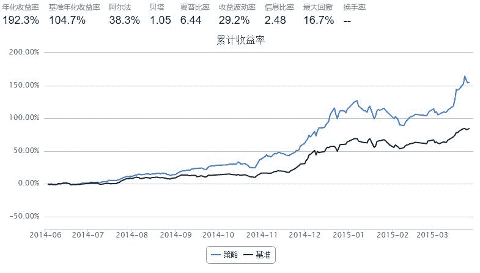

# 策略原理

策略基本思路是：买入低于X元的股票, 持有到1.25X元以上则卖出.

```py
start = datetime(2014, 6, 1)
end   = datetime(2015, 3, 27)
benchmark = 'HS300'							# 策略参考标准
universe = set_universe('HS300')
capital_base = 1000000


def initialize(account):
    account.buy_price_flag = 4
    account.sell_price_flag = account.buy_price_flag*1.25
      
def handle_data(account):
    signals = []
    acc_cash = account.cash
    
    for stock in account.universe:
     
        p = account.referencePrice[stock]
        if p < account.buy_price_flag:
            #满足买入条件，加入signals列表中
            signals.append(stock)
        elif p >= account.sell_price_flag and account.secpos.get(stock, 0) > 0:
            #将卖出股票所得现金加入到本次的可用现金
            acc_cash += account.referencePrice[stock]*account.secpos.get(stock,0)
            order_to(stock, 0)
            
    for stock in signals:
        # 平均买入signals列表中的股票
        amount = acc_cash/len(signals)/account.referencePrice[stock]
        order(stock, amount)
```



