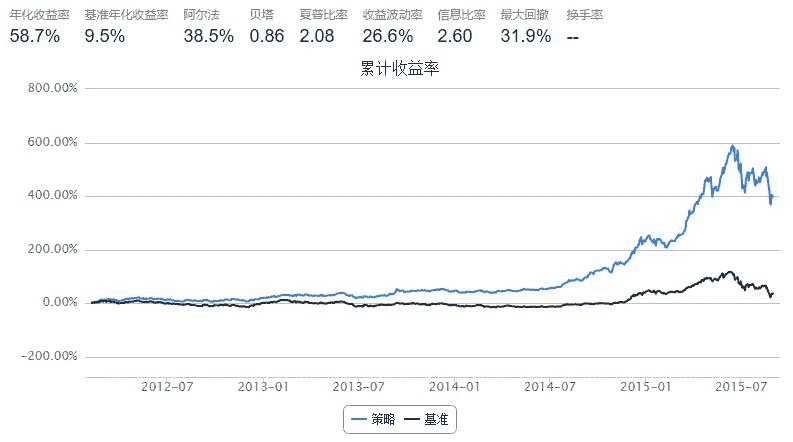

# 便宜就是 alpha

> 来源：https://uqer.io/community/share/5609169cf9f06c597565ef13

参考社区的策略，练手一个简单的调仓逻辑

## 策略思路

+ 一星期或者一个月一换仓
+ 每次换仓时，取股价最低的15只等权重买入

```py
import numpy as np
from heapq import nlargest, nsmallest
from CAL.PyCAL import *

start = datetime(2012, 1, 1)
end   = datetime(2015, 8, 31)
benchmark = 'HS300'							# 策略参考标准
universe = set_universe('ZZ500') + set_universe('HS300') 
capital_base = 1000000
stk_num = 15      # 持仓股票数量
refresh_rate = 5

def initialize(account):
    pass
    
def handle_data(account):
    cal = Calendar('China.SSE')
    
    # ----------------- 清洗universe --------------------------------
    date = account.current_date
    yesterday = cal.advanceDate(date, '-1B', BizDayConvention.Following)
    yesterday = datetime(yesterday.year(), yesterday.month(), yesterday.dayOfMonth()).strftime('%Y%m%d'),
    # 去除ST股
    try:
        STlist = DataAPI.SecSTGet(secID=account.universe, beginDate=yesterday, endDate=yesterday, field=['secID']).tolist()
        account.universe = [s for s in account.universe if s not in STlist]
    except:
        pass
    # 去除流动性差的股票
    tv = account.get_attribute_history('turnoverValue', 20)
    mtv = {sec: sum(tvs)/20. for sec,tvs in tv.items()}
    account.universe = [s for s in account.universe if mtv.get(s, 0) >= 10**7]
    # 去除新上市或复牌的股票
    opn = account.get_attribute_history('openPrice', 1)
    account.universe = [s for s in account.universe if not (np.isnan(opn.get(s, 0)[0]) or opn.get(s, 0)[0] == 0)]
    
    # ----------------- 调仓逻辑 --------------------------------
    bucket = {}
    for stk in account.universe:
        bucket[stk] = account.referencePrice[stk]
        
    # 以前面计算得到的turnover_delta对股票池中股票排序，并取前stk_num只，力图满足比赛要求
    # 注意：
    # 这里我们其实取了股价最低的 stk_num*2 只，原因在于：为了满足参赛要求，调仓时候我们必须
    # 达到一定仓位，如果取stk_num只，那么一旦遇到涨停停牌等买不进的情况，就跪了；所以我们拿
    # stk_num*2 数量的股票，但是却将仓位分成stk_num份，每份买进一只，这样有一只买不进，就
    # 买后面的，参赛调仓是不是保险了许多啊
    buy_list = nsmallest(stk_num*2, bucket, key=bucket.get)
    
    # 目前持仓中不在buy_list中的股票，清仓
    for stk, amount in account.valid_secpos.items():
        if stk not in buy_list:
            order_to(stk, 0)
            
    # buy_list中的股票，等权重买入
    position_per_stk = account.referencePortfolioValue/stk_num   # 将仓位分成stk_num份
    for stk in buy_list:
        if account.referencePrice[stk] > 0:
            amount = int(position_per_stk/account.referencePrice[stk]/100.0) * 100
            order_to(stk, amount)
    return
```



