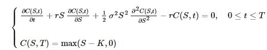
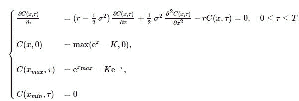
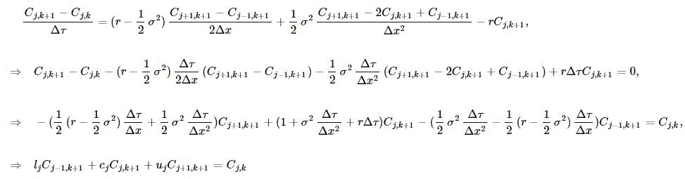
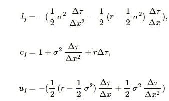
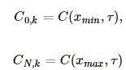
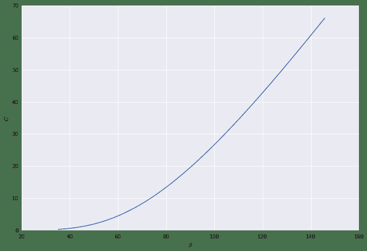
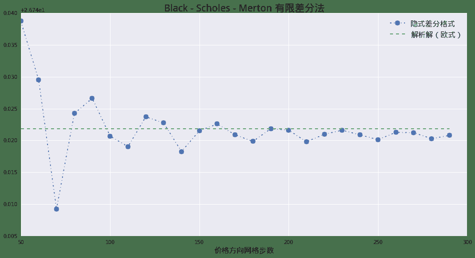

# 量化分析师的Python日记【第13天 Q Quant兵器谱之偏微分方程3】

> 来源：https://uqer.io/community/share/555dc9e8f9f06c6c7404f96e

> 欢迎来到 Black - Scholes — Merton 的世界！本篇中我们将使用在第11天学习到的知识应用到这个金融学的具体方程之上！

```py
import numpy as np
import math
import seaborn as sns
from matplotlib import pylab
font.set_size(15)
```

## 1. 问题的提出

BSM模型可以设置为如下的偏微分方差初值问题：



做变量替换`τ=T−t`，并且设置上下边界条件:



## 2. 算法

按照之前介绍的隐式差分格式的方法，用离散差分格式代替连续微分：



其中



以上即为差分方程组。

这里有些细节需要处理，就是左右边界条件，我们这里使用Dirichlet边界条件，则：



## 3.实现

```py
import scipy as sp
from scipy.linalg import solve_banded 
```

描述BSM方程结构的类：`BSMModel`

```py
class BSMModel:
    
    def __init__(self, s0, r, sigma):
        self.s0 = s0
        self.x0 = math.log(s0)
        self.r = r
        self.sigma = sigma

    def log_expectation(self, T):
        return self.x0 + (self.r - 0.5 * self.sigma * self.sigma) * T
    
    def expectation(self, T):
        return math.exp(self.log_expectation(T))
    
    def x_max(self, T):
        return self.log_expectation(T) + 4.0 * self.sigma * math.sqrt(T)
    
    def x_min(self, T):
        return self.log_expectation(T) - 4.0 * self.sigma * math.sqrt(T)
```

描述我们这里设计到的产品的类：`CallOption`

```py
class CallOption:
    
    def __init__(self, strike):
        self.k = strike
        
    def ic(self, spot):
        return max(spot - self.k, 0.0)
    
    def bcl(self, spot, tau, model):
        return 0.0
    
    def bcr(self, spot, tau, model):
        return spot - math.exp(-model.r*tau) * self.k
```

完整的隐式格式：`BSMScheme`

```py
class BSMScheme:
    def __init__(self, model, payoff, T, M, N):
        self.model = model
        self.T = T
        self.M = M
        self.N = N
        self.dt = self.T / self.M
        self.payoff = payoff
        self.x_min = model.x_min(self.T)
        self.x_max = model.x_max(self.T)
        self.dx = (self.x_max - self.x_min) / self.N
        self.C = np.zeros((self.N+1, self.M+1)) # 全部网格
        self.xArray = np.linspace(self.x_min, self.x_max, self.N+1)
        self.C[:,0] = map(self.payoff.ic, np.exp(self.xArray))
        
        sigma_square = self.model.sigma*self.model.sigma
        r = self.model.r
        
        self.l_j = -(0.5*sigma_square*self.dt/self.dx/self.dx - 0.5 * (r - 0.5 * sigma_square)*self.dt/self.dx)
        self.c_j = 1.0 + sigma_square*self.dt/self.dx/self.dx + r*self.dt
        self.u_j = -(0.5*sigma_square*self.dt/self.dx/self.dx + 0.5 * (r - 0.5 * sigma_square)*self.dt/self.dx)
        
    def roll_back(self):
        
        for k in range(0, self.M):
            udiag = np.ones(self.N-1) * self.u_j
            ldiag =  np.ones(self.N-1) * self.l_j
            cdiag =  np.ones(self.N-1) * self.c_j
            
            mat = np.zeros((3,self.N-1))
            mat[0,:] = udiag
            mat[1,:] = cdiag
            mat[2,:] = ldiag
            rhs = np.copy(self.C[1:self.N,k])
            
            # 应用左端边值条件
            v1 = self.payoff.bcl(math.exp(self.x_min), (k+1)*self.dt, self.model)
            rhs[0] -= self.l_j * v1
            
            # 应用右端边值条件
            v2 = self.payoff.bcr(math.exp(self.x_max), (k+1)*self.dt, self.model)
            rhs[-1] -= self.u_j * v2
            
            x = solve_banded((1,1), mat, rhs)
            self.C[1:self.N, k+1] = x
            self.C[0][k+1] = v1
            self.C[self.N][k+1] = v2
            
    def mesh_grids(self):
        tArray = np.linspace(0, self.T, self.M+1)
        tGrids, xGrids = np.meshgrid(tArray, self.xArray)
        return tGrids, xGrids
```

应用在一起：

```py
model = BSMModel(100.0, 0.05, 0.2)
payoff = CallOption(105.0)
scheme = BSMScheme(model, payoff, 5.0, 100, 300)
```

```py
scheme.roll_back()
```

```py
from matplotlib import pylab
pylab.figure(figsize=(12,8))
pylab.plot(np.exp(scheme.xArray)[50:170], scheme.C[50:170,-1])
pylab.xlabel('$S$')
pylab.ylabel('$C$')

<matplotlib.text.Text at 0x76ea7d0>
```



## 4. 收敛性测试

首先使用BSM模型的解析解获得精确解：

```py
analyticPrice = BSMPrice(1, 105., 100., 0.05, 0.0, 0.2, 5.)
analyticPrice
```


| price | delta | gamma | vega | rho | theta |
| --- | --- |
| 1 |  26.761844 |  0.749694 |  0.00711 |  71.10319 |  241.037549 | -3.832439 |

我们固定时间方向网格数为3000，分别计算不同S网格数情形下的结果：

```py
xSteps = range(50,300,10)
finiteResult = []
for xStep in xSteps:
    model = BSMModel(100.0, 0.05, 0.2)
    payoff = CallOption(105.0)
    scheme = BSMScheme(model, payoff, 5.0, 3000, xStep)
    scheme.roll_back()
    
    interp = CubicNaturalSpline(np.exp(scheme.xArray), scheme.C[:,-1])
    price = interp(100.0)
    finiteResult.append(price)
```

我们可以画下收敛图：

```py
anyRes = [analyticPrice['price'][1]] * len(xSteps)

pylab.figure(figsize = (16,8))
pylab.plot(xSteps, finiteResult, '-.', marker = 'o', markersize = 10)
pylab.plot(xSteps, anyRes, '--')
pylab.legend([u'隐式差分格式', u'解析解（欧式）'], prop = font)
pylab.xlabel(u'价格方向网格步数', fontproperties = font)
pylab.title(u'Black - Scholes - Merton 有限差分法', fontproperties = font, fontsize = 20)

<matplotlib.text.Text at 0x7857bd0>
```



