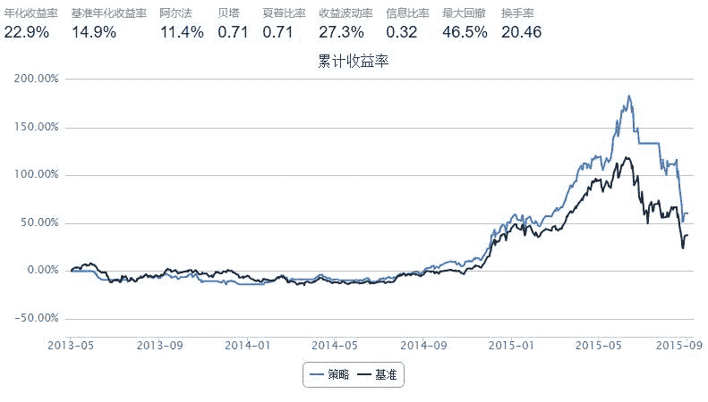

# 8.1 大小盘轮动 · 新手上路 -- 二八ETF择时轮动策略2.0

```py
start = '2013-05-01'                       # 回测起始时间
end = '2015-09-01'                         # 回测结束时间
benchmark = 'HS300'                        # 策略参考标准
universe = ['510300.XSHG','510500.XSHG']         # 证券池，支持股票和基金
HS300,SZ500=universe
capital_base = 100000                      # 起始资金
freq = 'd'                             # 策略类型，'d'表示日间策略使用日线回测
refresh_rate =1                          # 调仓频率，表示执行handle_data的时间间隔，由于freq = 'd'，时间间隔的单位为交易日
max_retracement = 0.01                     # 最大回撤比例

def initialize(account):                   # 初始化虚拟账户状态
    pass

def handle_data(account):                  # 每个交易日的买入卖出指令

    # 周末进行交换
    if  account.current_date.weekday() != 4 :
        return
    
    # 有停牌的话，今天就跳过。
    if len(account.universe) < 2: return
    
    hist = account.get_attribute_history('closePrice', 19)
    if  len(hist) < 2: 
        return
        

    # 如果HS300四周内涨幅大于SZ500
    if hist[HS300][-1]/hist[HS300][0] > hist[SZ500][-1]/hist[ SZ500][0]:
      # 且为正收益
      if hist[HS300][-1]/hist[HS300][0] > 1:
        if account.avail_secpos.has_key(SZ500): 
            order_pct_to(SZ500, 0)
        order_pct_to(HS300, 0.99)
        
      elif hist[HS300][-1]/hist[HS300][0] < 1- max_retracement:
        # 负收益，清盘
        if account.avail_secpos.has_key(SZ500): 
            order_pct_to(SZ500, 0)
        if account.avail_secpos.has_key(HS300):             
            order_pct_to(HS300, 0)
        
    

    # 如果HS300四周内涨幅小于SZ500
    elif hist[HS300][-1]/hist[HS300][0] < hist[SZ500][-1]/hist[ SZ500][0]:
     # 且为正收益
     if hist[SZ500][-1]/hist[SZ500][0] > 1: 
        if account.avail_secpos.has_key(HS300): 
            order_pct_to(HS300, 0)
        order_pct_to(SZ500, 0.99)
        
     elif hist[SZ500][-1]/hist[SZ500][0] < 1- max_retracement:
        # 负收益，清盘
        if account.avail_secpos.has_key(SZ500): 
            order_pct_to(SZ500, 0)
        if account.avail_secpos.has_key(HS300):             
            order_pct_to(HS300, 0)
```



